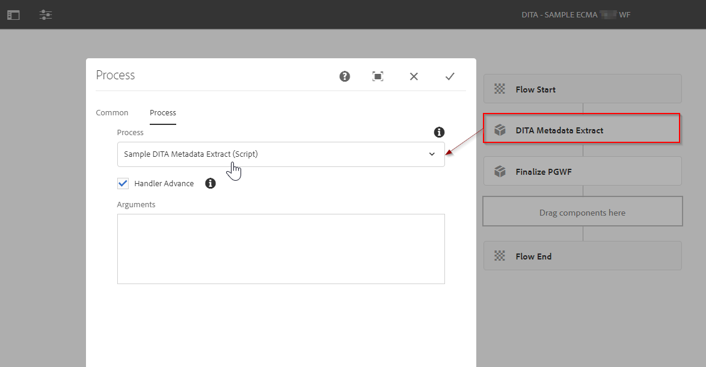
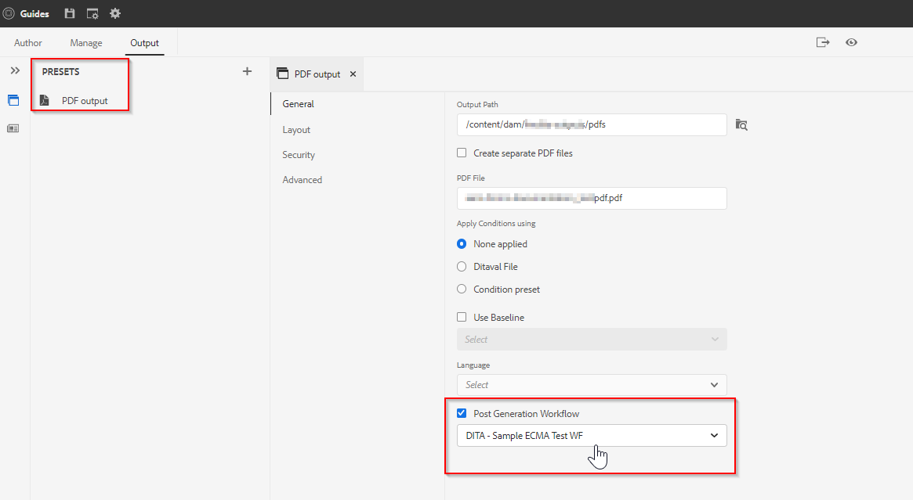

# AEM Guides 게시 - 사후 생성 워크플로

AEM Guides은 사후 출력 생성 워크플로우를 지정할 수 있는 유연성을 제공합니다. AEM Guides을 사용하여 생성되는 출력에서 일부 후처리 작업을 수행할 수 있습니다.
예를 들어 PDF 출력에 특정 속성을 설정하거나 출력이 생성되면 사용자 집합에 이메일을 보낼 수 있습니다.

## 사후 생성 워크플로우를 활용하는 단계는 무엇입니까

### 워크플로우 프로세스 만들기

생성된 출력에 대해 작업을 수행하는 Java 또는 ECMA 기반 워크플로우 프로세스를 만듭니다. 예를 들어, 소스에서 생성된 콘텐츠로 일부 메타데이터를 복사하거나 생성된 출력의 메타데이터를 조작합니다.
- ECMA 스크립트를 사용하여 이러한 프로세스를 만드는 예를 살펴보겠습니다(첨부된 패키지를 참조할 수 있음).
- Java 기반 워크플로 프로세스의 경우 [설치 및 구성 안내서](https://helpx.adobe.com/content/dam/help/en/xml-documentation-solution/4-2/Adobe-Experience-Manager-Guides_UUID_Installation-Configuration-Guide_EN.pdf#page=119)의 &quot;*사후 출력 생성 워크플로 사용자 지정*&quot; 섹션을 참조하십시오.

### 워크플로우 모델 만들기

이전 단계에서 만든 사용자 지정 워크플로우 프로세스를 사용하여 워크플로우 모델을 만들고 해당 프로세스 단계를 추가합니다.
- 워크플로우의 마지막 단계로 필수 프로세스 단계 &quot;*게시 생성 완료*&quot;을(를) 추가해야 합니다.

아래 표시된 샘플 워크플로우 모델을 참조하십시오.

### 맵에서 이 사후 생성 워크플로 사용

사후 생성 워크플로는 AEM Guides 게시 메커니즘 내의 모든 출력 사전 설정에 구성할 수 있는 속성입니다. 예:

선택한 모델이 이미 만들어져 있다고 가정합니다.

### 테스트

이제 이 사전 설정을 사용하여 게시를 실행하고 프로세스 단계 출력의 유효성을 검사할 수 있습니다

## 샘플

참고로 아래 패키지를 사용하여 패키지 관리자를 통해 설치하여 샘플 사후 생성 워크플로(*위의 스크린샷에 나와 있는*)를 테스트할 수 있습니다.

[샘플 ECMA 기반 사후 생성 워크플로 모델](../assets/workflows/sample-pgwf-ecma-test-wfmetadata.zip)
