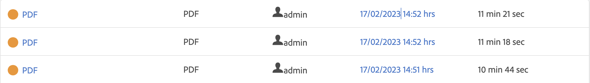

# 클라우드 게시 마이크로서비스 아키텍처 및 성능 분석

이 문서에서는 새로운 클라우드 게시 마이크로서비스의 아키텍처 및 성능 번호에 대한 통찰력을 공유합니다.

>[!NOTE]
>
> AEM Guides의 마이크로서비스 기반 게시는 PDF(기본 및 DITA-OT 기반 모두), HTML 5, JSON 및 사용자 지정 유형의 출력 사전 설정을 지원합니다.

## 클라우드의 기존 게시 워크플로 문제

DITA 게시는 주로 사용 가능한 시스템 메모리 및 CPU에 따라 리소스를 많이 사용하는 프로세스입니다. 게시자가 많은 주제가 있는 큰 맵을 게시하거나 여러 병렬 게시 요청이 트리거되는 경우 이러한 리소스에 대한 필요성이 더욱 증가합니다.

새 서비스를 사용하지 않는 경우 모든 게시가 AEM 클라우드 서버도 실행 중인 동일한 Kubernetes(k8) pod에서 발생합니다. 일반적인 k8 pod는 사용할 수 있는 메모리와 CPU의 양에 제한이 있습니다. AEM Guides 사용자가 대규모 또는 병렬 워크로드를 게시하는 경우 이 제한이 빠르게 위반될 수 있습니다. K8은 구성된 제한보다 더 많은 리소스를 사용하려고 하는 pod를 다시 시작합니다. 이는 AEM 클라우드 인스턴스 자체에 심각한 영향을 줄 수 있습니다.

이러한 리소스 제약은 클라우드에서 여러 개의 동시 및 대규모 게시 워크로드를 실행할 수 있는 전용 서비스를 제안하기 위한 주요 동기가 되었습니다.

## 새로운 아키텍처 소개

이 서비스는 App Builder, IO Eventing, IMS와 같은 Adobe의 첨단 클라우드 솔루션을 사용하여 서버리스 서비스를 만들고 있습니다. 이러한 서비스는 그 자체로 Kubernetes 및 Docker와 같이 널리 받아들여지는 업계 표준을 기반으로 합니다.

새 게시 마이크로서비스에 대한 각 요청은 한 번에 하나의 게시 요청만 실행되는 격리된 도커 컨테이너에서 실행됩니다. 새 게시 요청이 수신되는 경우 여러 개의 새 컨테이너가 자동으로 만들어집니다. 이 요청당 단일 컨테이너로 구성되므로 마이크로서비스는 보안 위험을 초래하지 않으면서 고객에게 최상의 성능을 제공할 수 있습니다. 이러한 컨테이너는 게시가 끝나면 삭제되므로 사용하지 않는 리소스를 확보할 수 있습니다.

이러한 모든 통신은 JWT 기반 인증 및 권한 부여를 사용하는 Adobe IMS에 의해 보호되며 HTTPS를 통해 실행됩니다.

>[!NOTE]
>
> 게시 프로세스는 종속성 목록 생성과 같은 AEM 서버 자체에서 요청의 일부 콘텐츠 종속 부분을 실행합니다. 그러나 DITA-OT 실행 또는 기본 엔진 실행과 같은 게시 프로세스의 가장 철저한 부분이 새 서비스로 오프로드되었습니다.

## 성능 분석

이 섹션에서는 마이크로서비스의 성능 번호를 소개합니다. 이전 클라우드 아키텍처가 동시 게시 또는 매우 큰 맵을 게시하는 데 문제가 있으므로 마이크로서비스의 성능을 AEM Guides 온프레미스 제품과 비교합니다.

온프레미스 방식으로 큰 맵을 게시하는 경우 Java 힙 매개 변수를 조정해야 할 수 있으며, 그렇지 않으면 메모리 부족 오류가 발생할 수 있습니다. 클라우드에서 마이크로 서비스는 이미 프로파일링되었으며 최적의 Java 힙 및 기타 구성이 바로 제공됩니다.

### 클라우드와 온프레미에서 하나의 게시 실행

* 클라우드

  새 서비스를 사용하여 클라우드에서 단일 게시를 실행하는 경우 게시는 단일 온프레미스 게시와 비교하여 시간이 조금 더 걸릴 수 있습니다. 이 약간의 상승 시간은 새로운 클라우드 아키텍처의 분산 특성 때문입니다.

  

* On-prem

  전체 게시가 AEM이 실행 중인 동일한 pod/시스템에서 수행되므로 단일 게시의 결과가 이전 클라우드 아키텍처 또는 온프레미에서 더 좋습니다.

  

### 클라우드와 온프레미에서 다중 게시 실행

* 클라우드

  새 게시 마이크로서비스가 이 시나리오에서 표시됩니다. 아래 이미지에서 볼 수 있듯이 여러 동시 게시 작업이 증가함에 따라 클라우드에서 게시 시간을 크게 늘리지 않고 게시할 수 있습니다.

  

* On-prem

  온프레미스 서버에서 동시 게시를 실행하면 성능이 크게 저하됩니다. 게시자가 더 많은 지도를 동시에 게시하는 경우 이러한 성능 감소는 더 심각합니다.

  

## 추가적인 이점

각 게시 요청의 일부는 마이크로서비스로 전송될 올바른 게시 콘텐츠를 가져오기 위해 AEM 인스턴스에서 실행해야 합니다. 새 클라우드 아키텍처는 이전 아키텍처의 경우처럼 AEM 워크플로 대신 AEM 작업을 사용합니다. 이 변경 사항을 사용하면 AEM Guides 관리자가 다른 AEM 작업 또는 워크플로우 구성에 영향을 주지 않고 클라우드 게시 큐 설정을 개별적으로 구성할 수 있습니다.

새 게시 마이크로서비스를 구성하는 방법에 대한 자세한 내용은 여기에서 확인할 수 있습니다. [Microservice 구성](configure-microservices.md)
