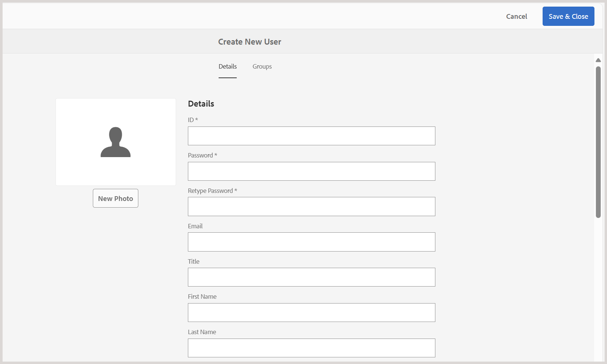

# 폴더 구조 설정에 대한 우수 사례

이 문서에서는 관리자가 Adobe Experience Manager Guides에서 폴더 구조를 설정하는 데 필요한 단계 및 모범 사례를 제공합니다. 잘 구성된 폴더 계층 구조를 통해 학습 및 교육 콘텐츠를 원활하게 작성, 게시 및 번역할 수 있습니다.

## 폴더 구조 설정

Experience Manager Guides의 다양한 작성, 게시 및 번역 기능에 액세스할 수 있도록 하려면 아래에 설명된 대로 올바른 계층에서 폴더를 설정해야 합니다.

**루트 수준 폴더 만들기**

먼저 조직의 루트 폴더를 만듭니다. 이는 모든 부서 수준 폴더 및 일반적으로 공유되는 에셋의 기본 역할을 합니다.

예: `/content/dam/ABC-Corp/`

이 루트 폴더 내에 전용 폴더를 만들어 여러 부서에서 사용할 자산을 관리합니다. 예를 들어 이미지, 비디오 등의 공유 리소스를 포함하도록 **Common** 폴더를 만듭니다.

**부서 수준 폴더 만들기**

HR, 재무, 법률 등 부서별로 별도의 폴더를 생성하여 자체 컨텐츠를 관리할 수 있습니다.

*캡션: 루트 폴더 내에서 HR 부서에 대해 만들어진 별도의 폴더 구조*

**부서 수준 폴더 설정에 대한 모범 사례**

- 부서 수준의 일반 자산에 대해 각 부서 아래에 전용 **일반** > **자산** 폴더를 만드십시오(필요한 경우).
- 번역을 위해 콘텐츠를 공유하려는 경우 언어별 폴더(예: en, de, fr)를 만듭니다. 소스 언어 폴더 외부의 콘텐츠는 번역 워크플로에 포함되지 않으므로 작성자는 소스 언어 폴더(예: en)에서만 콘텐츠를 만들거나 업데이트해야 합니다. 다른 언어 폴더는 자리 표시자로 비워 둘 수 있습니다. [콘텐츠 번역](../user-guide/translation.md)에 대해 자세히 알아보세요.
- 권한을 활용하여 특정 부서 또는 사용자의 액세스를 새로 만든 폴더 구조로 제한할 수 있습니다. 예를 들어 HR 부서 사용자만 지정된 폴더 내에서 콘텐츠를 생성하거나 수정할 수 있도록 권한을 할당합니다.

재무, 법률 등과 같은 다른 부서에 대해 동일한 구조를 반복합니다.

## 출력 폴더 구조 설정

`fm-ditaoutputs` 폴더는 학습 및 교육 콘텐츠에서 생성된 출력의 기본 저장소 위치 역할을 합니다. 이러한 출력에는 일반적으로 **alm** 폴더의 SCORM 패키지(ZIP 파일)와 **pdf** 폴더의 PDF가 포함됩니다.필요한 경우 **맵 콘솔**&#x200B;에서 사전 설정 수준에서 이 기본 출력 경로를 변경할 수 있습니다.

여러 부서에서 작업할 때 `fm-ditaoutputs` 폴더 구조 내에 부서별 폴더를 만들어 특정 부서 내의 사용자가 관련 출력 폴더에 액세스할 수 있도록 하는 것이 좋습니다.

## 사용자를 만들고 적절한 그룹에 할당

폴더 계층 구조가 설정되면 사용자 생성을 시작하고 그룹에 추가하여 Experience Manager Guides의 관련 기능에 액세스할 수 있습니다. Experience Manager Guides은 작성자, 검토자 및 게시자의 세 가지 기본 그룹을 제공합니다. 사용자가 연결된 그룹에 따라 특정 작업을 수행할 수 있습니다. 예를 들어 게시 작업은 게시자만 수행할 수 있고 작성자는 수행할 수 없습니다.

새 사용자를 만들고 그룹에 추가하려면 **도구** > **보안** > **사용자**(으)로 이동합니다.

사용자 관리 페이지에서 **만들기**&#x200B;를 선택하여 새 사용자를 만듭니다. 사용자 세부 정보를 추가하고 그룹에 할당합니다.

자세한 내용은 [사용자 관리 및 보안](../cs-install-guide/user-admin-sec.md)을 참조하세요.

## 각 사용자 그룹에 권한 할당

사용자가 적절한 그룹에 추가되면 그룹 수준에서 권한을 구성하여 저장소의 올바른 작성 및 출력 폴더에 액세스할 수 있도록 합니다.

권한을 할당하려면 **도구** > **보안** > **권한**(으)로 이동합니다.

이러한 권한은 사용자가 지정된 폴더 내에서만 콘텐츠를 만들거나 수정할 수 있도록 해줍니다.

자세한 내용은 [AEM의 사용 권한](https://experienceleague.adobe.com/en/docs/experience-manager-65/content/security/security#permissions-in-aem)을 참조하세요.
