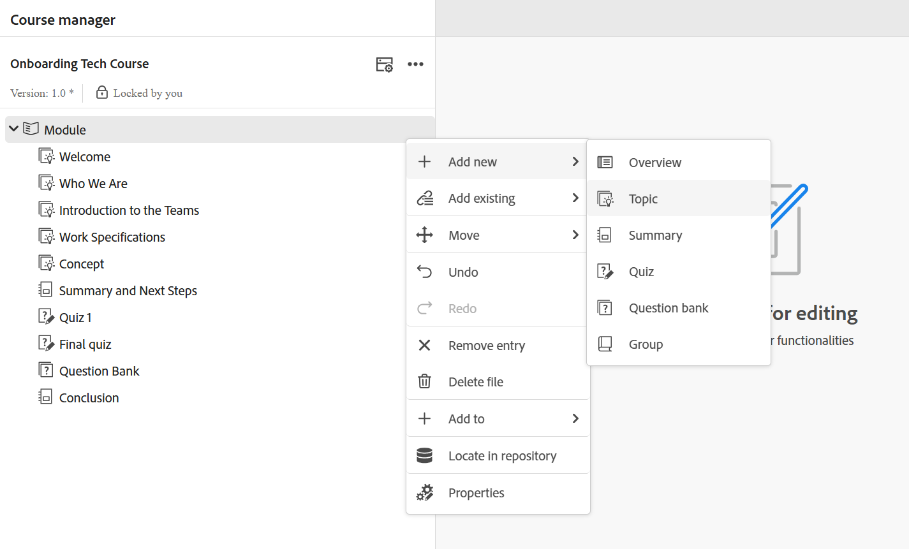

# 주제 만들기

단계별 프로세스를 살펴보기 전에 학습 주제를 만드는 방법을 시각화하는 데 도움이 되는 빠른 비디오 개요를 소개합니다.

>[!VIDEO](https://video.tv.adobe.com/v/3475211/learning-content-aem-guides)

**과정에 주제를 추가하는 단계**

과정에 주제를 추가하려면 다음 단계를 수행하십시오.

1. **과정 관리자**&#x200B;에서 과정을 열고 **옵션** 메뉴에서 **새로 추가**&#x200B;를 선택합니다.

   {width="650" align="left"}

1. **주제**&#x200B;를 선택하십시오.

   **새 학습 항목** 대화 상자가 표시됩니다.

   {width="350" align="left"}

1. 드롭다운 메뉴에서 원하는 템플릿을 선택합니다.

   {width="350" align="left"}

1. 주제에 적합한 제목을 입력합니다.
1. **만들기**&#x200B;를 선택합니다.

새로운 학습 주제가 과정 내에서 만들어지고 과정 관리자 패널에 표시됩니다.

>[!NOTE]
>
> 새 학습 주제를 만들면 버전 1.0이 자동으로 할당됩니다.
