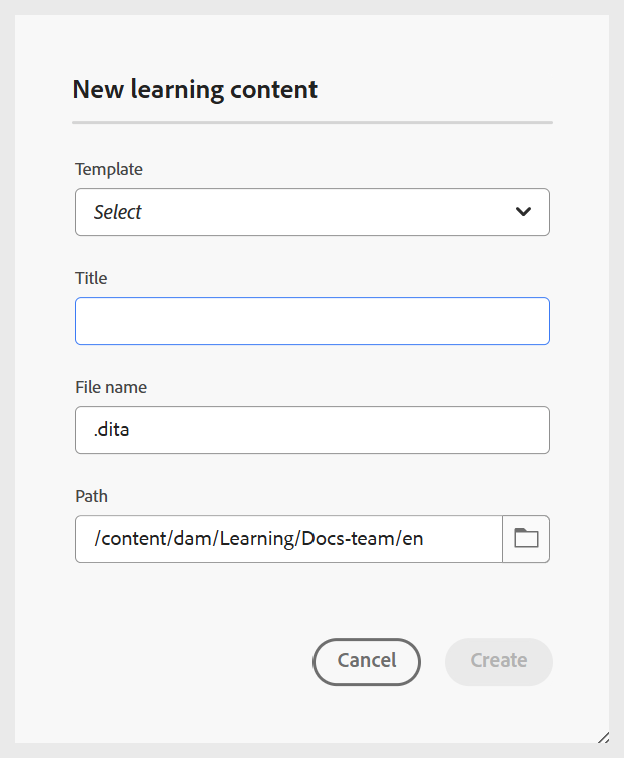

# 학습 콘텐츠 만들기

과정에 학습 콘텐츠를 추가하려면 다음 단계를 수행하십시오.

1. **과정 관리자**&#x200B;에서 과정을 열고 **옵션** 메뉴에서 **새로 추가**&#x200B;를 선택합니다.

   {width="650" align="left"}

1. **학습 콘텐츠**&#x200B;를 선택하십시오.
새 학습 콘텐츠 대화 상자가 표시됩니다.

   {width="350" align="left"}

1. 드롭다운 메뉴에서 원하는 템플릿을 선택합니다.

   {width="350" align="left"}

1. 학습 컨텐츠에 적합한 제목을 입력합니다.
1. **만들기**&#x200B;를 선택합니다.

학습 콘텐츠는 과정 내에서 만들어지고 과정 관리자 패널에 표시됩니다.

>[!NOTE]
>
> 새 학습 콘텐츠를 만들면 버전 1.0이 자동으로 할당됩니다.

