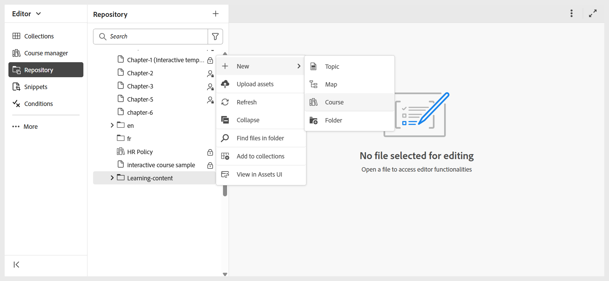
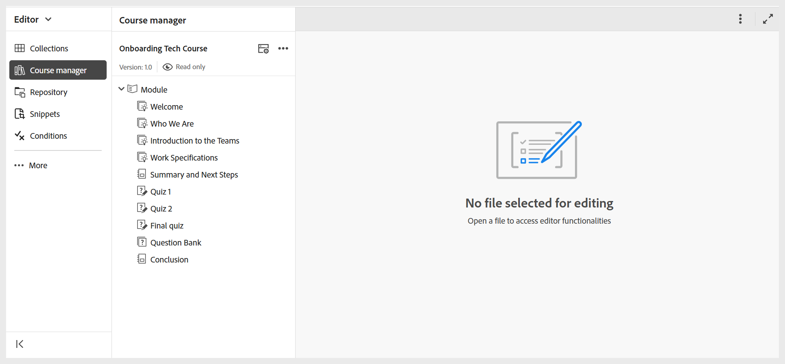

# 첫 번째 과정 만들기

Experience Manager Guides의 과정은 다양한 학습 목표에 맞도록 디자인될 수 있습니다. 정규 학습 과정에는 주제, 퀴즈, 요약이 포함될 수 있지만 주로 평가에 집중하는 과정을 만들 수도 있다. 예를 들어, 퀴즈만 포함된 과정이나 하나의 개요 주제와 함께 퀴즈를 설정하여 이해를 빠르게 확인할 수 있습니다. 평가 전 퀴즈, 본 과정 내용, 최종 퀴즈 등으로 구조화된 경로를 구축할 수도 있다. 이러한 옵션을 통해 학습자 진행 상황을 효과적으로 측정하면서 타겟팅된 학습 경험을 제공할 수 있습니다.

단계별 프로세스를 살펴보기 전에 첫 번째 과정을 만들고 여기에 구성 요소를 추가하는 방법을 보여 주는 짧은 연습 비디오입니다.

>[!VIDEO](https://video.tv.adobe.com/v/3469537/aem-guides-learning-content?quality=12&learn=on)

첫 번째 과정을 만들려면 다음 단계를 수행하십시오.

1. 과정을 만들 폴더로 이동한 다음 **옵션** 메뉴에서 **새로 만들기 > 과정**을 선택합니다.
   

   **새 과정 대화 상자**&#x200B;가 표시됩니다.
2. **새 과정 대화 상자**&#x200B;에서 다음 세부 정보를 제공합니다.
   - 과정의 기반이 되는 템플릿.

     >[!NOTE]
     >
     > 관리자가 구성한 강의 템플릿만 표시됩니다.

   - 강의 제목.
   - 과정의 파일 이름입니다. 강의 제목 을 기반으로 파일 이름이 자동으로 제안됩니다. 관리자가 UUID 설정을 기반으로 자동 파일 이름을 활성화한 경우 파일 이름 필드가 표시되지 않습니다.
   - 과정을 저장할 경로입니다. 기본적으로 저장소에서 현재 선택한 폴더의 경로가 경로 필드에 표시됩니다.
3. **만들기**를 선택합니다.
선택한 템플릿을 기반으로 지정된 경로에 과정이 만들어집니다. 또한 과정 관리자에서 편집을 위해 과정이 열립니다.

   
