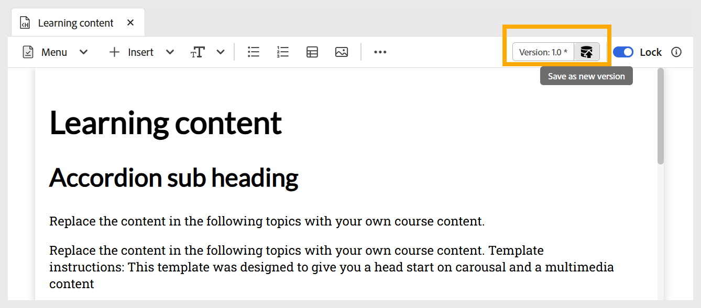

# 주제 편집

항목을 편집하려면 다음 단계를 수행하십시오.

1. 주제를 두 번 클릭하여 과정 관리자 패널에서 엽니다.
1. 아래와 같이 토글을 사용하여 주제를 **잠금**&#x200B;해야 합니다. 이를 통해 콘텐츠를 편집할 수 있으며 다른 사용자는 이 주제를 변경할 수 없습니다.

   {width="650" align="left"}

1. 주제에 콘텐츠를 추가하려면 다양한 [대화형 위젯](./lc-basic-blocks.md)과 함께 [텍스트, 멀티미디어 등의 기본 빌딩 블록을 추가](./lc-widgets.md)할 수 있습니다.
1. 작업을 저장하려면 **새 버전으로 저장**&#x200B;을 사용하여 새 버전을 만들거나 `Ctrl+S`을 눌러 기존 파일을 덮어쓰십시오.

   {width="650" align="left"}

1. 콘텐츠를 저장한 후 다른 사용자가 편집할 항목을 **잠금 해제**&#x200B;할 수 있습니다.
