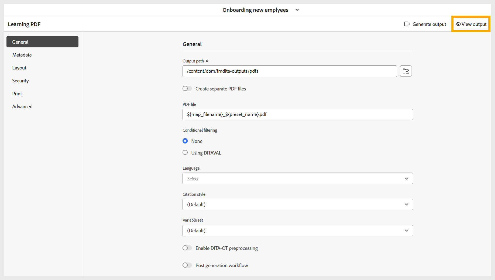

# PDF 생성

PDF을 생성하려면 다음 단계를 수행하십시오.

1. 환경 설정을 기반으로 PDF 출력에 대한 모든 필수 설정을 구성한 후 PDF 사전 설정 페이지의 도구 모음으로 이동합니다.
1. **출력 생성**&#x200B;을 선택하십시오.

   {width="650"}

1. 생성 프로세스가 완료되면 PDF이 생성되었음을 확인하는 성공 메시지가 나타납니다.

   {width="350"}

1. 성공 메시지와 도구 모음에서 **출력 보기**&#x200B;를 선택하여 PDF을 다운로드할 수 있습니다.

   {width="650"}
