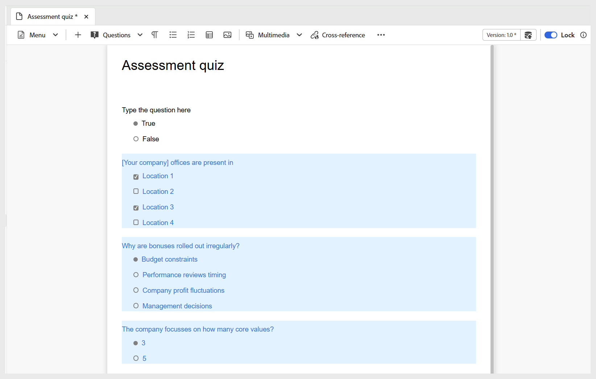

# 질문 은행에서 질문 삽입

퀴즈에 문제 은행의 질문을 삽입하려면 다음 단계를 수행하십시오.

1. 아래 표시된 대로 도구 모음의 **질문** 드롭다운 메뉴에서 **질문 은행에서 삽입** 옵션을 선택합니다.

   {width="350" align="left"}

   **HTML 문제 은행에서 삽입** 대화 상자가 표시됩니다.

1. 저장소에 저장된 문제 은행의 경로를 지정하고 아래와 같이 퀴즈에 삽입할 문제를 선택합니다. **모두 선택**&#x200B;을 사용하여 질문 은행의 모든 질문을 선택할 수도 있습니다.

   {width="650" align="left"}

1. 선택한 질문이 편집할 수 없음을 나타내는 파란색 강조 표시가 있는 퀴즈에 삽입됩니다. 그러나 이 변수는 게시된 출력에서 정상적으로 나타납니다.

   {width="650" align="left"}

1. 또한 토글을 사용하여 **무작위 질문 선택** 옵션을 활성화할 수 있습니다. 활성화되면 무작위로 선택할 질문의 수를 정의할 수 있습니다. 그런 다음 두 번째 스크린샷과 같이 퀴즈에 무작위 질문이 삽입되었음을 나타내는 자리 표시자가 표시됩니다. 출판 시, 시스템은 문제 은행에서 무작위 문항의 지정된 수를 자동으로 선택하여 삽입합니다.

   {width="650" align="left"}

   아래 그림과 같이 무작위 질문이 퀴즈에 추가됩니다.

   {width="650" align="left"}

빠른 비디오 개요가 필요하면 [질문 은행 사용](https://video.tv.adobe.com/v/3475212/learning-content-aem-guides)을 확인하세요.
