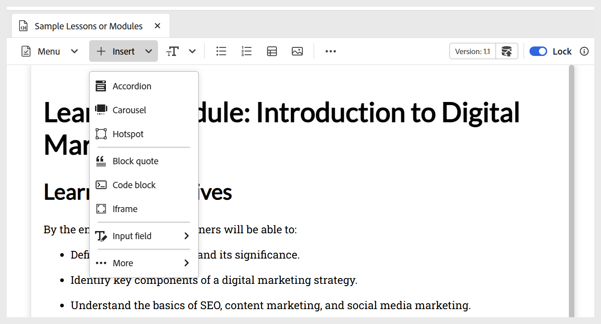
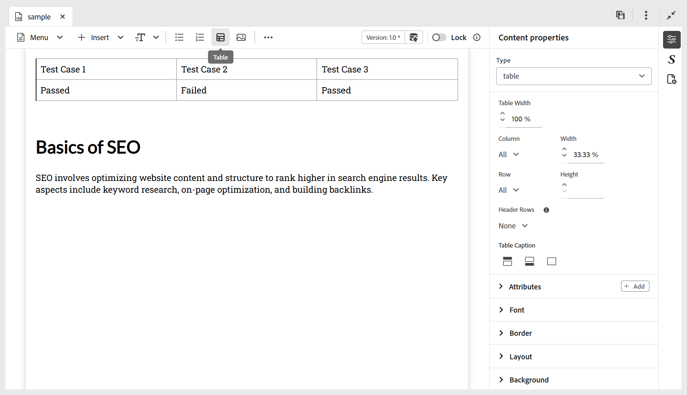

# 학습 콘텐츠에 기본 빌딩 블록 추가

아래 설명된 대로 학습 콘텐츠 도구 모음에서 사용할 수 있는 기본 편집 기능을 사용할 수 있습니다.

- **위젯**: 아래와 같이 **삽입** 메뉴를 사용하여 아코디언, 회전 메뉴, 핫스팟 등의 위젯을 학습 콘텐츠에 추가합니다. 대화형 위젯에 대한 자세한 내용은 [대화형 위젯 사용](./lc-widgets.md)을 참조하세요.

  {width="650" align="left"}

- **텍스트 구성 요소**: 콘텐츠에 제목/제목, 단락, 인라인 따옴표, 위 첨자, 아래 첨자 및 인용을 추가합니다.

  {width="650" align="left"}

- **무순서 목록**: 콘텐츠 내에 무순서 목록을 추가합니다.

  {width="650" align="left"}

- **정렬된 목록**: 콘텐츠 내에 번호가 매겨진 목록을 삽입합니다.

  {width="650" align="left"}

- **테이블**: 필요한 차원의 테이블을 콘텐츠에 삽입합니다. 아래와 같이 **콘텐츠 속성** 패널을 사용하여 다양한 테이블 속성을 추가로 관리할 수 있습니다.

  {width="650" align="left"}

- **이미지**: 대체 텍스트와 화면 설명을 포함하여 콘텐츠에 이미지를 삽입합니다. 이미지는 저장소에서 또는 외부 URL을 통해 추가할 수 있습니다. 또한 **콘텐츠 속성** 패널을 사용하여 이미지 속성을 수정할 수 있습니다.

  {width="650" align="left"}

- **멀티미디어**: 도구 모음의 **자세히** 메뉴에서 콘텐츠에 비디오와 오디오를 추가합니다. **콘텐츠 속성** 패널을 사용하여 속성을 사용자 지정할 수 있습니다.

  {width="650" align="left"}

- **기호**: 아래와 같이 목록에서 선택한 기호를 콘텐츠에 추가합니다. 도구 모음의 **자세히** 메뉴에서 사용할 수 있습니다.

  {width="350" align="left"}

- **하이퍼링크**: 콘텐츠의 필요한 위치에 하이퍼링크를 추가합니다. 도구 모음의 **자세히** 메뉴에서 사용할 수 있습니다. 아래 표시된 대로 파일 참조, 웹 URL 또는 이메일 링크일 수 있습니다.

  {width="650" align="left"}

