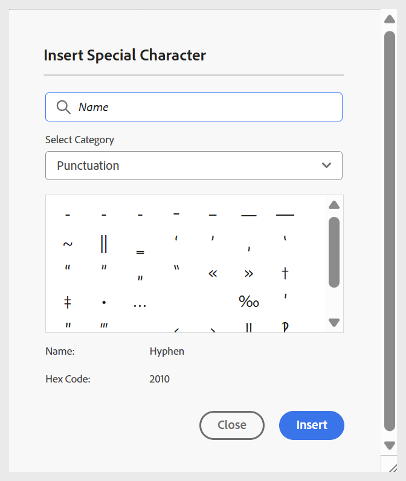

# 주제에 기본 빌딩 블록 추가

학습 주제를 만들고 기본 구성 요소를 추가하는 방법을 보다 명확하게 이해하기 위해, 다음 비디오에서는 사용 가능한 기능에 대한 간단한 개요를 제공합니다.

>[!VIDEO](https://video.tv.adobe.com/v/3469535/learning-content-aem-guides)

아래 설명된 대로 편집기 도구 모음에서 사용할 수 있는 기본 편집 기능을 사용할 수 있습니다.

- **삽입 옵션**: 아코디언, 회전 메뉴, 핫스팟, 탭, 플립카드, 클릭하여 표시와 같은 [대화형 위젯을 추가](./lc-widgets.md)하는 옵션과 Iframe, 블록 인용, 코드 블록 등과 같은 [구조적 요소](./lc-other-insert-options.md)를 추가하는 옵션을 제공합니다. 이 메뉴를 사용하여 학습 컨텐츠에 기능과 다양성을 추가하여 매력적인 구조를 만들 수 있습니다.

  {width="650" align="left"}

- **텍스트 구성 요소**: 콘텐츠에 제목, 단락, 인라인 인용, 위 첨자, 아래 첨자 및 인용을 추가합니다.

  >[!NOTE]
  >
  > 학습 컨텐츠에 제목 및 부제를 포함할 수도 있습니다. 콘텐츠에 추가하는 방법에 대한 자세한 내용은 [학습 콘텐츠에 제목 및 부제 추가](#add-title-and-subtitle-to-learning-content)를 참조하세요.

  {width="650" align="left"}

- **무순서 목록**: 콘텐츠 내에 무순서 목록을 추가합니다.

  {width="650" align="left"}

- **정렬된 목록**: 콘텐츠 내에 번호가 매겨진 목록을 삽입합니다.

  {width="650" align="left"}

- **테이블**: 필요한 차원의 테이블을 콘텐츠에 삽입합니다. 아래와 같이 **콘텐츠 속성** 패널을 사용하여 다양한 테이블 속성을 추가로 관리할 수 있습니다.

  {width="650" align="left"}

- **이미지**: 대체 텍스트와 화면 설명을 포함하여 콘텐츠에 이미지를 삽입합니다. 이미지는 저장소에서 또는 외부 URL을 통해 추가할 수 있습니다. 또한 **콘텐츠 속성** 패널을 사용하여 이미지 속성을 수정할 수 있습니다.

  {width="650" align="left"}

- **멀티미디어**: 콘텐츠에 비디오와 오디오를 추가합니다. **콘텐츠 속성** 패널을 사용하여 속성을 사용자 지정할 수 있습니다.

  {width="650" align="left"}

- **재사용 가능한 콘텐츠**: 재사용 가능성을 위해 에셋 또는 저장소의 기존 콘텐츠를 통합할 수 있습니다. 재사용 가능한 콘텐츠를 삽입하려면 다음 단계를 수행하십시오.

   1. 도구 모음에서 **재사용 가능한 콘텐츠**&#x200B;를 선택합니다.
**콘텐츠 재사용** 대화 상자가 열립니다.
   2. 원하는 주제를 탐색하고 선택하여 현재 강의에 해당 콘텐츠를 포함합니다.
   3. 추가할 콘텐츠의 ID를 선택합니다. 참조를 위해 미리보기가 함께 표시됩니다.

      {width="650" align="left"}

   4. **선택**&#x200B;을 선택하세요.

  콘텐츠가 삽입됩니다. 예를 들어 차량 구조에 대한 섹션은 재사용되고 과정의 주제에 추가되는 콘텐츠 조각입니다. 유형은 **참조**&#x200B;로 표시되며 **ID**&#x200B;은(는) **콘텐츠 속성** 패널에 반영됩니다.

  {width="650" align="left"}

- **기호**: 아래와 같이 목록에서 선택한 기호를 콘텐츠에 추가합니다.

  {width="350" align="left"}

- **하이퍼링크**: 콘텐츠의 필요한 위치에 하이퍼링크를 추가합니다. 아래 표시된 대로 파일 참조, 웹 URL 또는 이메일 링크일 수 있습니다.

  {width="650" align="left"}

또한 **메뉴** 드롭다운에서 편집 작업(잘라내기, 복사, 삭제), 찾기 및 바꾸기 및 버전 레이블에 액세스할 수 있습니다.

## 학습 콘텐츠에 제목 및 부제 추가

학습 컨텐츠에 제목과 부제를 포함하려면 다음 단계를 수행하십시오.

1. 맵 콘솔에서 학습 과정을 엽니다.
1. 제목 또는 부제를 추가할 주제, 퀴즈 또는 기타 강의 구성 요소를 엽니다.
1. [파일 속성] 패널로 이동하여 **제목 추가**&#x200B;를 선택합니다.

   
1. 메시지가 표시되면 기존 제목을 제목으로 사용할지 여부를 선택합니다.

   >[!NOTE]
   >
   > 기존 제목을 제목으로 사용하지 않으려면 먼저 편집기 도구 모음에서 텍스트 구성 요소를 사용하여 제목을 삽입한 다음 **제목 추가**&#x200B;를 선택하십시오. 이렇게 하면 샘플 **제목**&#x200B;이(가) 콘텐츠에 추가되며 필요에 따라 편집할 수 있습니다.

1. 파일 속성에서 **하위 제목 추가**&#x200B;를 선택합니다.
샘플 **부제목**&#x200B;이(가) 콘텐츠에 추가됩니다.

   

제목을 제거하려면 파일 속성에서 **제목 추가** 옵션의 선택을 취소하십시오. 제목을 제거하면 연결된 자막이 자동으로 제거됩니다.

