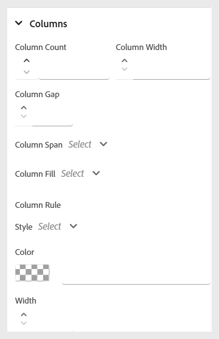

# 인라인 스타일 사용

인라인 스타일을 적용하여 강의 콘텐츠 내에서 직접 특정 텍스트의 모양을 맞춤화할 수 있습니다. 이렇게 하면 글꼴 크기, 색상, 정렬 등과 같은 서식을 빠르게 조정할 수 있습니다. **콘텐츠 속성** 패널을 사용하여 선택한 텍스트의 인라인 스타일을 수정할 수 있습니다.

다음은 사용 가능한 다양한 인라인 스타일에 대해 보여 주는 짧은 연습 비디오입니다.

>[!NOTE]
>
> 이러한 스타일 옵션은 관리자가 활성화한 경우에만 표시됩니다.

>[!VIDEO](https://video.tv.adobe.com/v/3469533/aem-guides-learning-content)

사용 가능한 인라인 스타일 옵션에 대한 설명은 다음과 같습니다.

- **글꼴:** 글꼴 모음, 글꼴 두께, 텍스트 장식, 글꼴 크기 등과 같은 다양한 옵션을 사용하여 텍스트 모양을 사용자 지정할 수 있습니다. 이러한 설정은 아래 예와 같이 콘텐츠의 스타일을 지정하는 데 도움이 됩니다.

  {width="350"}

- **테두리**: 테두리 측면, 너비, 스타일(단색, 파선, 점선 등), 색상과 같은 옵션을 사용하여 요소의 테두리를 정의하고 사용자 지정할 수 있습니다. 이러한 설정은 콘텐츠의 특정 섹션을 시각적으로 분리하거나 강조 표시하는 데 도움이 됩니다.

  {width="350"}

- **레이아웃**: 콘텐츠 내에서 요소의 위치와 간격을 제어하는 데 도움이 됩니다. 여백, 패딩, 정렬, 표시 유형 등의 속성을 조정할 수 있습니다. 콘텐츠 구조를 효과적으로 구성합니다.

  {width="350"}

- **배경**: 배경색, 이미지, 위치 및 반복 스타일과 같은 옵션을 설정하여 요소의 배경을 사용자 지정할 수 있습니다. 이러한 설정은 콘텐츠의 시각적 호소력과 명확성을 향상시키는 데 도움이 됩니다.

  {width="350"}

- **열**: 콘텐츠를 여러 열로 구성할 수 있습니다. 열 개수, 열 간격, 열 너비 등을 조정할 수 있습니다. 콘텐츠 내의 가독성과 레이아웃 구조를 개선합니다.

  {width="350"}
