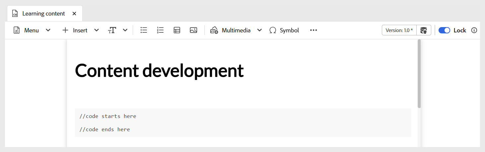
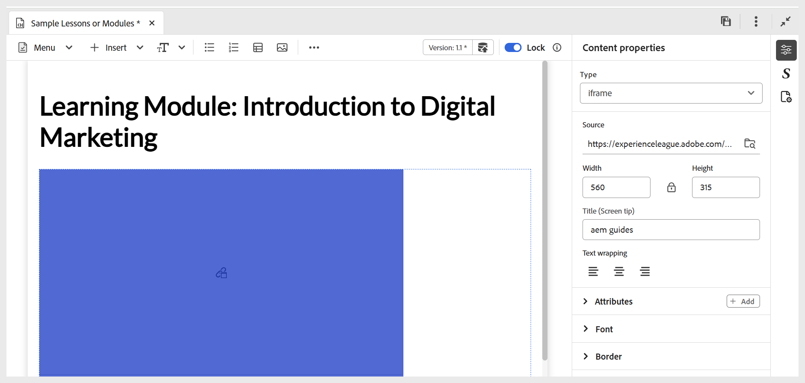
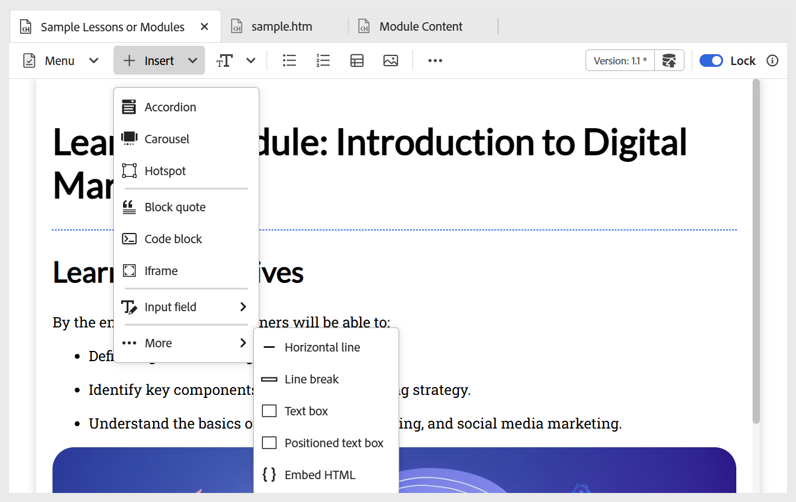

# 삽입 메뉴의 기타 옵션

편집기 도구 모음의 삽입 메뉴에서 사용할 수 있는 기타 옵션은 다음과 같습니다.

- **블록 따옴표:** 인용과 함께 블록 따옴표를 콘텐츠에 추가합니다.

  {width="650" align="left"}

- **코드 블록:** 콘텐츠에 코드 블록을 추가합니다.

  {width="650" align="left"}

- **Iframe:** 외부 웹 페이지나 대화형 리소스를 포함할 콘텐츠에 iframe을 삽입합니다. 소스 URL, 너비, 높이, 정렬 및 제목을 포함하여 **콘텐츠 속성** 패널을 사용하여 iframe 속성을 구성할 수 있습니다. 아래와 같이 **미리 보기** 모드로 전환하면 iframe에 추가된 콘텐츠를 볼 수 있습니다.

  **작성자** 보기:

  {width="650" align="left"}

  **미리 보기** 모드:

  {width="650" align="left"}

- **H5P:** 대화형 H5P 패키지를 학습 콘텐츠에 추가합니다. H5P 콘텐츠를 추가하려면 원하는 위치에 커서를 놓고 삽입 메뉴에서 **H5P**&#x200B;을(를) 선택합니다. H5P 삽입 대화 상자에서 학습 콘텐츠에 추가하려는 H5P 파일에 대한 참조를 제공합니다.

  

  시스템의 H5P 콘텐츠를 사용하려면 먼저 [에셋 업로드](../user-guide/authoring-upload-existing-files.md) 옵션을 사용하여 **DAM에 파일을 업로드**&#x200B;한 다음 저장소 보기/Assets의 일부로 만드십시오.

  

  완료되면 미리보기 모드에서 H5P 콘텐츠 및 게시된 출력을 검토합니다.

  >[!NOTE]
  >
  > Adobe Experience Manager Guides 내에서는 H5P 콘텐츠를 편집하거나 만들 수 없습니다. 업로드하기 전에 외부에서 H5P 패키지를 준비합니다.

- **MathML 수식:** 콘텐츠에 MathML 수식을 삽입합니다. MathML 방정식을 만들고 **삽입**&#x200B;을 선택하여 문서에 추가할 수 있습니다.

  {width="350" align="left"}

  방정식은 밝은 회색 배경과 함께 삽입됩니다. 언제든지 기존 방정식을 마우스 오른쪽 단추로 클릭하고 상황에 맞는 메뉴에서 **수식 편집**&#x200B;을 선택하여 방정식을 업데이트할 수 있습니다. Experience Manager Guides에서 MathML 방정식 유효성 검사에 대한 자세한 내용은 MathML 편집기에서 [방정식 유효성 검사](../user-guide/web-editor-other-features.md#validation-of-equations-in-the-mathml-editor)를 참조하십시오.

- **지식 확인:** 주제에 사용 가능한 형식(단일 수정, 다중 수정, True/False, 다음 항목과 일치 또는 문제 은행에서 삽입)의 질문을 추가하여 검토하고 채점 없이 이해를 확인할 수 있습니다. 이러한 질문은 표준 형식을 반영하며 점수를 제외하므로 자체 평가에 적합하고 나중에 퀴즈나 평가 전에 강의 내용이나 주제의 일부로 적합합니다.

  {width="650" align="left"}

  **콘텐츠 속성** 패널을 통해 정답 및 기타 필수 필드를 구성할 수 있습니다. 자세한 내용은 [질문 유형](./quiz-insert-questions.md)을 참조하세요. 아래와 같은 지식 확인 옵션을 사용하여 다양한 질문 유형을 추가할 수 있습니다.

  {width="650" align="left"}

- **입력 필드:** 단추와 함께 텍스트 입력 필드를 콘텐츠에 추가합니다. 이 조합을 사용하여 사용자 입력을 캡처하고 특정 작업을 트리거할 수 있습니다. 아래 표시된 대로 재생 버튼이 콘텐츠에 추가됩니다.

  {width="650" align="left"}

- **추가 옵션:** 가로줄, 줄 바꿈, 텍스트 상자, 배치된 텍스트 상자 및 포함된 HTML 삽입을 포함하여 학습 내용을 향상시킬 수 있는 추가 옵션이 있습니다.

  {width="650" align="left"}
