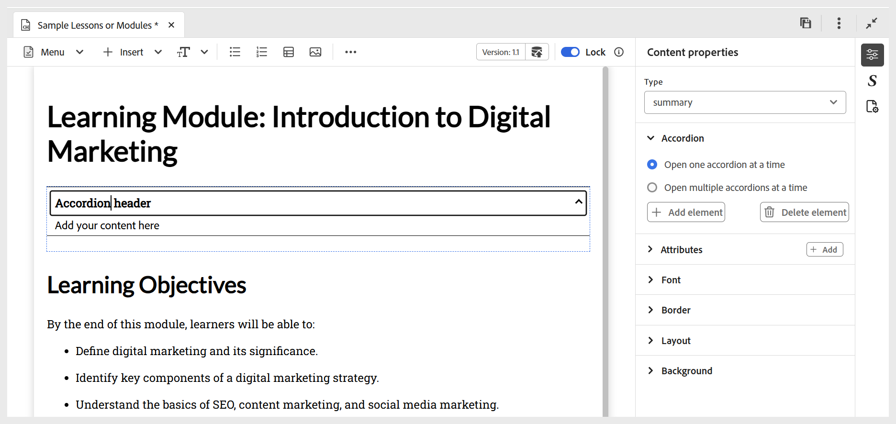

# 대화형 위젯 사용

여러 위젯을 추가하여 과정을 더 대화형으로 만들어 학습 콘텐츠를 향상시킬 수 있습니다. 다음은 사용 가능한 다양한 위젯에 대한 짧은 연습 비디오입니다.

>[!VIDEO](https://video.tv.adobe.com/v/3469531/learning-content-aem-guides)

사용자 경험을 향상시키고 컨텐츠 전달을 간소화하도록 설계된 사용 가능한 위젯은 다음과 같습니다.

- **아코디언:** 콘텐츠에 아코디언을 추가합니다. 아코디언 헤더와 본문 모두에 적합한 텍스트를 삽입할 수 있습니다. 해당 속성은 **콘텐츠 속성** 패널을 사용하여 관리할 수 있으며, 단일 또는 여러 아코디언을 동시에 열 수 있는 옵션과 요소를 추가하거나 제거하는 옵션을 포함합니다.

  {width="650" align="left"}

- **회전판:** 콘텐츠에 회전판을 추가합니다. 카드 제목과 본문에서 적절한 텍스트를 삽입할 수 있습니다. 요소의 추가 또는 제거 옵션을 포함하여 **콘텐츠 속성** 패널을 사용하여 해당 속성을 관리할 수 있습니다.

  {width="650" align="left"}

- **핫스팟:** 선택한 이미지에 핫스팟을 추가합니다. 먼저 이미지를 선택한 다음 **삽입 > 핫스팟**&#x200B;으로 이동합니다. 핫스팟 대화 상자가 열립니다. 이 대화 상자에서 다양한 핫스팟 크기 설정, 해당 링크 추가, 영역 앞 또는 뒤로 가져오기를 통한 레이어 조정과 같은 다양한 옵션을 구성할 수 있습니다.

  {width="650" align="left"}

- **블록 따옴표:** 인용과 함께 블록 따옴표를 콘텐츠에 추가합니다.

  {width="650" align="left"}

- **코드 블록:** 콘텐츠에 코드 블록을 추가합니다.

  {width="650" align="left"}

- **Iframe:** 콘텐츠에 iframe을 삽입하여 외부 웹 페이지 또는 대화형 리소스를 포함합니다. 소스 URL, 너비, 높이, 정렬 및 제목을 포함하여 **콘텐츠 속성** 패널을 사용하여 iframe 속성을 구성할 수 있습니다. 아래와 같이 **미리 보기** 모드로 전환하면 iframe에 추가된 콘텐츠를 볼 수 있습니다.

  **작성자** 보기:

  {width="650" align="left"}

  **미리 보기** 모드:

  {width="650" align="left"}

- **입력 필드:** 콘텐츠에 단추와 함께 텍스트 입력 필드를 추가합니다. 이 조합을 사용하여 사용자 입력을 캡처하고 특정 작업을 트리거할 수 있습니다. 아래 표시된 대로 재생 버튼이 콘텐츠에 추가됩니다.

  {width="650" align="left"}

- **추가 옵션:** 가로줄, 줄 바꿈, 텍스트 상자, 배치된 텍스트 상자 및 포함된 HTML 삽입을 포함하여 학습 내용을 향상시킬 수 있는 추가 옵션이 있습니다.

  {width="650" align="left"}
