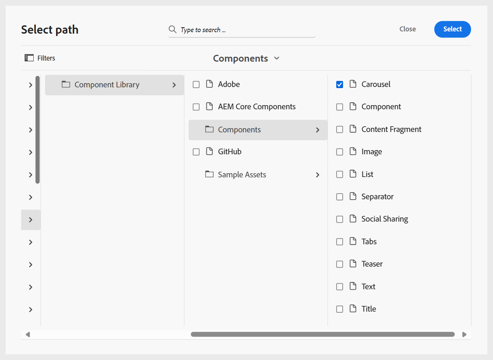

# 과정 관리

과정을 만들면 과정 관리자 패널에서 열립니다. 과정을 잠그고 과정 수준에서 필요한 모든 사항을 변경할 수 있습니다. 다음 섹션에서는 과정 편집에 사용할 수 있는 옵션에 대해 설명합니다.

## 새 콘텐츠 추가

과정에 새 콘텐츠를 추가하려면 다음 단계를 수행하십시오.

1. **옵션** 메뉴 > **새로 추가**&#x200B;를 선택합니다.

   
2. 만들려는 콘텐츠 유형을 선택합니다. 사용 가능한 옵션은 다음과 같습니다.
   - **개요**: 강의에서 다루는 내용에 대한 간략한 소개를 제공하는 강의의 첫 번째 주제입니다.
   - **주제**: 과정의 주요 자료는 특정 기술 또는 아이디어를 가르치는 단계, 예제 또는 설명과 같이 초점이 맞춰진 짧은 부분으로 구성됩니다. 자세한 내용은 [항목 만들기 및 사용자 지정](./create-content.md)을 참조하세요.
   - **요약**: 학습자가 방금 학습한 요점을 상기시키는 과정 챕터의 끝에 있는 빠른 리뷰입니다.
   - **퀴즈**: 누군가 배운 내용을 얼마나 잘 이해하는지 확인하는 데 사용되는 질문 세트입니다. 자세한 내용은 [퀴즈 만들기 및 관리](./create-quiz.md)를 참조하세요.
   - **질문 은행**: 퀴즈를 빠르고 일관되게 만드는 데 사용할 수 있는 재사용 가능한 질문 공유 풀입니다. 자세한 내용은 [질문 은행](./create-qb.md)을 참조하세요.
   - **그룹**: 학습 그룹을 사용하면 챕터, 주제 및 기타 모듈과 같은 관련 주제를 논리적 순서로 구성하여 교육 자료를 더 쉽게 관리하고 다시 사용할 수 있도록 명확한 계층 구조를 만들 수 있습니다.
3. **만들기**&#x200B;를 선택합니다.

선택한 콘텐츠가 만들어지고 과정에 추가됩니다. 비디오 개요가 필요하면 [과정에 새 콘텐츠 추가](https://video.tv.adobe.com/v/3469537/aem-guides-learning-content?quality=12&learn=on)를 확인하십시오.

## 기존 콘텐츠 추가

콘텐츠 저장소의 기존 콘텐츠를 강의에 추가할 수 있습니다. 기존 콘텐츠를 추가하려면 다음 단계를 수행하십시오.

1. **옵션** 메뉴 > **기존 항목 추가**&#x200B;를 선택합니다.
2. 만들려는 강의 컨텐츠 유형을 선택합니다.
3. **경로 선택** 대화 상자에서 콘텐츠 위치로 이동하여 원하는 학습 콘텐츠를 선택합니다.

   
4. **선택**&#x200B;을 선택하세요.

선택한 강의 컨텐츠가 저장소의 강의에 추가됩니다.

>[!NOTE]
>
>**기존 항목 추가**>**파일(리소스 전용 zip)** 옵션을 사용하여 압축 해제되고 최종 SCORM 출력의 폴더 구조에 통합되는 zip 파일을 포함할 수도 있습니다. 이를 통해 강의 게시 중 리소스 패키징을 간소화할 수 있습니다.

비디오 개요가 필요하면 [과정에 기존 콘텐츠 추가](https://video.tv.adobe.com/v/3469537/aem-guides-learning-content?quality=12&learn=on)를 확인하십시오.

## 콘텐츠 제거

특정 주제에 대한 **옵션** 메뉴를 선택한 다음 아래와 같이 **항목 제거**&#x200B;를 선택하여 강의에서 주제를 제거할 수 있습니다.

비디오 개요가 필요하면 [강의에서 콘텐트 제거](https://video.tv.adobe.com/v/3475210/learning-content-aem-guides)를 확인하십시오.

## 과정 버전 만들기

**옵션** 메뉴 > **버전 관리**&#x200B;를 선택하여 과정의 버전 관리를 제어할 수 있습니다.

과정의 버전 관리를 위한 다음과 같은 옵션을 사용할 수 있습니다.

- **새 버전으로 저장**: 새 버전 번호로 과정을 저장합니다.
- **버전 기록**: 현재 버전의 미리 보기를 표시하고 강의에 사용 가능한 다른 버전과 비교할 수 있습니다.
- **버전 레이블**: 자유 형식의 텍스트 형식으로 레이블을 지정하거나 미리 정의된 레이블 집합을 사용할 수 있습니다.

## 표시 설정: 표시

**표시** 옵션은 주제가 표시되는 방법을 결정합니다. 여러 항목을 선택할 때 확인란을 사용하거나, 계층 구조를 나타내기 위해 번호를 매기거나, 항목 제목이나 파일 이름을 표시하여 표시할 수 있습니다.

>[!NOTE]
>
> 이러한 보기 설정은 과정 관리자 내에서만 적용되며 게시된 출력에 영향을 주지 않습니다.

비디오 개요가 필요하면 [옵션 표시](https://video.tv.adobe.com/v/3475210/learning-content-aem-guides)를 확인하십시오.
