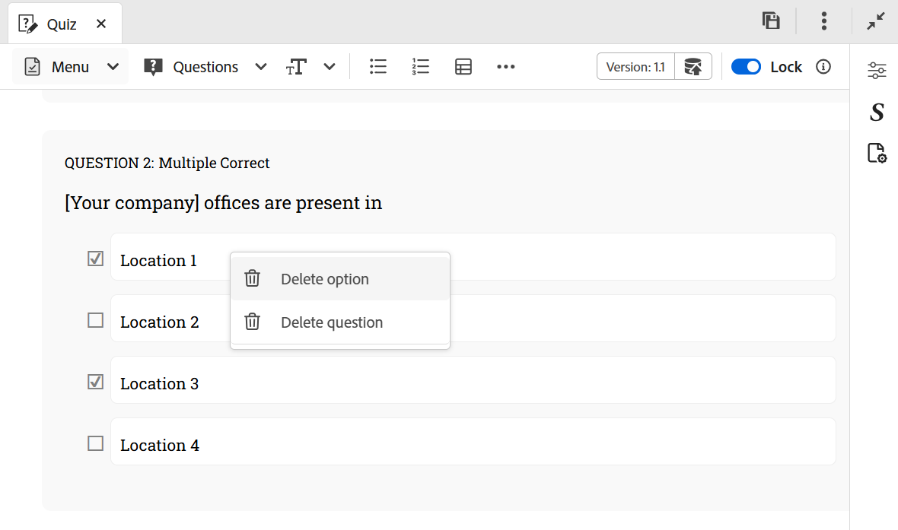

# 퀴즈에 질문 삽입

퀴즈에 질문을 삽입하려면 다음 단계를 수행하십시오.

1. 도구 모음의 **질문** 드롭다운 메뉴에서 원하는 질문 유형을 선택합니다. 요구 사항에 따라 True 또는 False, 단일 정답, 다중 정답, 아래 표시된 대로 다음 및 단답과 같은 네 가지 형식 중 하나를 사용하여 질문을 추가할 수 있습니다. 자세한 내용은 [질문 유형](#question-types)을 참조하세요.

   {width="650" align="left"}

   질문을 삽입할 때 커서가 질문 블록 위에 있으면 기본적으로 바로 뒤에 새 질문이 추가됩니다.

   기존의 두 질문 사이에 질문을 삽입하려면 먼저 [단락을 삽입](#insert-paragraph-within-the-quiz)한 다음 질문을 삽입합니다.

1. 선택한 형식으로 질문이 삽입됩니다. 그런 다음 요구 사항을 기반으로 질문을 편집할 수 있습니다.

1. 질문을 선택하고 **콘텐츠 속성** 패널을 사용하여 해당 속성을 구성할 수 있습니다.

   {width="650" align="left"}

1. 퀴즈에서 변경한 모든 사항을 저장합니다.

## 질문 속성

**콘텐츠 속성** 패널에서 다음 질문 속성을 사용하여 질문을 구성할 수 있습니다.

{width="350" align="left"}

- **옵션**: 질문에 대한 정답을 지정하십시오.
- **질문 ID**: 각 질문에 대한 질문 ID를 지정합니다. 질문 ID가 없으면 항상 추가하는 것이 좋습니다.
- **정답에 대한 점수**: 정답에 대해 부여할 점수를 지정합니다.
- **오답에 대한 벌점**: 오답에 대해 감점할 점수를 지정합니다.
- **질문 레이블**: 질문 레이블을 추가할 수 있습니다.
- **피드백**: 정답 또는 오답에 대한 피드백을 제공할 수 있도록 설정하십시오.
- **위치에 옵션 고정**: 질문에 대한 특정 옵션이 고정되면 SCORM 사전 설정 구성에서 **각 시도에 대한 답변 선택 무작위 지정**&#x200B;이 활성화되어 있더라도 옵션 목록의 지정된 위치에 고정 상태로 유지됩니다. 그렇지 않으면 사용 가능한 옵션이 재구성됩니다. 콘텐츠 속성 패널에서 원하는 질문 옵션 위로 마우스를 가져간 후 고정할 수 있습니다.

  {width="350" align="left"}

## 퀴즈에 단락 삽입

특정 질문이나 두 질문 사이의 공백에 커서를 놓으면 화면 오른쪽 모서리에 파란색 화살표가 표시되고 파란색 가로선이 표시됩니다. 파란색 화살표를 선택하면 퀴즈 작성 인터페이스 내에 단락을 삽입할 수 있습니다.

{width="650" align="left"}

- 질문 내에서 사용할 경우 질문 내에 이미지, 표, 텍스트 요소 등과 같은 요소를 추가할 수 있습니다.
- 질문 사이에 사용할 경우 위에서 언급한 대로 다른 질문을 삽입하거나 다른 작성 요소를 추가할 수 있습니다.

## 질문 또는 옵션 삭제

퀴즈에서 질문이나 특정 옵션을 삭제하려면 다음 단계를 수행하십시오.

1. 제거할 질문이나 옵션을 마우스 오른쪽 단추로 클릭합니다.
1. 컨텍스트 메뉴에서 **질문 삭제**(전체 질문을 제거하려면) 또는 **삭제 옵션**(선택한 옵션만 제거하려면)을 선택합니다.

{width="650" align="left"}

## 질문 유형

퀴즈에서는 다음 질문 유형이 지원됩니다.

- **단일 정답**: 하나의 정답만 맞는 여러 옵션이 있는 질문입니다.

  {width="650" align="left"}

- **True/False**: 학습자가 True 또는 False를 선택하는 문장 기반 질문입니다.

  {width="650" align="left"}

- **여러 개의 정답**: 두 개 이상의 정답이 정답일 수 있는 여러 옵션이 있는 질문입니다.

  {width="650" align="left"}

- **다음 항목과 일치**: 학습자가 두 목록의 항목을 일치시켜 올바른 쌍을 구성할 수 있도록 허용합니다. **콘텐츠 속성** 패널에서 새 옵션 집합을 추가할 수 있습니다. 복잡성을 높이기 위해 첫 번째 목록에서 옵션 하나를 제거하고 일치 열에 추가 일치를 포함할 수 있습니다. 이는 학습자에게 어떤 선택지가 직접적인 짝을 이루지 못하는지에 대해 비판적으로 생각하게 함으로써 난이도의 요소를 창출한다.

  {width="650" align="left"}

  게시된 출력에서 각 항목에 대한 드롭다운 메뉴와 함께 **다음 항목과 일치** 질문이 표시되어 사용 가능한 옵션에서 올바른 일치를 선택할 수 있습니다.

  {width="650" align="left"}

- **간단한 답변**: 학습자가 간단한 텍스트 입력을 사용하여 응답할 수 있습니다. 영숫자 답변을 수락하고 대/소문자를 구분하지 않고 응답을 일치시키며, 매우 긴 답변의 경우 가로 스크롤 막대를 제공합니다.

  {width="650" align="left"}
