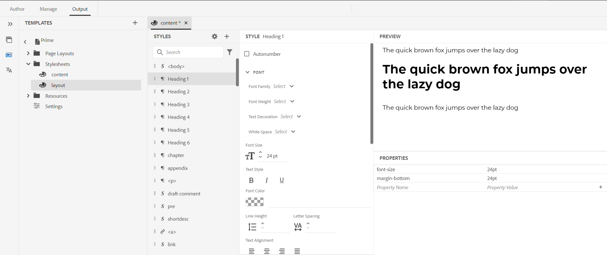

# PDF 템플릿의 구성 요소 {#components-pdf-template}

PDF 템플릿에는 페이지 레이아웃, 스타일시트, 리소스 및 설정의 네 가지 구성 요소가 있습니다. PDF 출력을 생성하는 동안 이러한 개별 구성 요소를 사용자 정의하고 템플릿을 출력 사전 설정과 연결하여 템플릿을 만들 수 있습니다. 다음 섹션에서는 이러한 구성 요소와 해당 사용자 정의 프로세스에 대해 자세히 설명합니다.

## 페이지 레이아웃 만들기 및 사용자 지정 {#create-customize-page-layout}

페이지 레이아웃 구성 요소의 설정을 사용하면 페이지의 머리글, 바닥글 및 컨텐츠 영역을 정의하여 페이지 구조를 디자인할 수 있습니다. WYSIWYG 페이지 레이아웃 편집기를 사용하면 앞면 및 뒷면 표지, 챕터, 표와 같은 PDF의 다양한 섹션에 대한 페이지 레이아웃을 만들 수 있습니다
목차(TOC), 색인, 빈 페이지, 프론트 매터 페이지, 백 매터 페이지, 그림 목록(LOF), 테이블 목록(LOT), 용어집 또는 사용자 지정 페이지에 대한 레이아웃 만들기 PDF 템플릿 설정에서 PDF 내에 서로 다른 섹션이 있는 페이지 레이아웃을 할당할 수 있으며 이는 PDF 출력을 생성하는 데 사용됩니다.

### 새 페이지 레이아웃 만들기 {#create-page-layout}

>[!NOTE]
>
>기본 제공되는 샘플 페이지 레이아웃이 있습니다. 이를 사용자 정의하거나 새 페이지 레이아웃을 만들 수 있습니다.

1. 웹 편집기에서 **출력** 탭으로 이동합니다.
1. 왼쪽 사이드바를 확장하고 **템플릿**&#x200B;을 클릭합니다.
1. 작업할 템플릿을 엽니다.

   >[!NOTE]
   >
   >이름을 두 번 클릭하거나 이름 옆에 있는 > 아이콘을 클릭하여 템플릿을 열 수 있습니다.

1. 새 페이지 레이아웃을 만들려면 다음 중 하나를 수행합니다.

   * **페이지 레이아웃** 위로 마우스를 가져간 후 (*옵션* 아이콘) **...**&#x200B;을(를) 클릭하고 **새 페이지 레이아웃**&#x200B;을(를) 선택하십시오.

   * **템플릿** 패널에서 **템플릿** 옆에 있는 **+** 아이콘을 클릭하고 상황에 맞는 메뉴에서 **페이지 레이아웃**&#x200B;을 선택합니다.

     **레이아웃 추가** 대화 상자가 열립니다.

     

1. 새 페이지 레이아웃의 이름을 지정합니다.
   >[!NOTE]
   >
   >페이지 레이아웃의 이름을 지정할 때 특수 문자를 사용하지 마십시오. 이름의 공백은 밑줄 &quot;_&quot;로 대체됩니다.

1. **완료**&#x200B;를 클릭합니다.

   새 레이아웃이 만들어지고 페이지 레이아웃에 추가됩니다.

### 페이지 레이아웃 복제 {#duplicate-page-layout}

1. 복제할 템플릿의 **템플릿** 섹션에서 **페이지 레이아웃**&#x200B;을 두 번 클릭하거나 **페이지 레이아웃** 앞에 있는 **>** 아이콘을 클릭합니다.

   템플릿 내의 페이지 레이아웃 목록을 표시합니다.

1. 복제할 페이지 레이아웃을 마우스로 가리킨 다음 (*옵션* 아이콘) **..**&#x200B;을(를) 클릭하고 컨텍스트 메뉴에서 **복제**&#x200B;를 선택합니다.

1. _레이아웃 복제_ 대화 상자에서 페이지 레이아웃의 이름을 입력합니다.

1. **완료**&#x200B;를 클릭합니다.
선택한 페이지 레이아웃의 복사본이 생성되어 페이지 레이아웃 아래에 추가됩니다.

### 페이지 레이아웃 사용자 지정 {#customize-page-layout}

1. 편집할 템플릿의 **템플릿** 섹션에서 **페이지 레이아웃**&#x200B;을 두 번 클릭하거나 **페이지 레이아웃** 앞에 있는 **>** 아이콘을 클릭합니다.

   템플릿 내의 페이지 레이아웃 목록을 표시합니다.
1. 페이지 레이아웃을 사용자 지정하려면 다음 중 하나를 수행합니다.
   * 페이지 레이아웃을 두 번 클릭합니다.
   * 페이지 레이아웃을 마우스로 가리킨 다음 (*옵션* 아이콘) **..**&#x200B;을(를) 클릭하고 상황에 맞는 메뉴에서 **편집**&#x200B;을(를) 선택합니다.

   맞춤화를 위한 페이지 레이아웃 편집기가 열립니다.
1. 원하는 대로 변경하고 나면 *모두 저장*(또는 `Crl+S`)을 클릭합니다.

   머리글, 바닥글, 페이지 번호, 제목 등과 같은 개별 레이아웃 요소를 정의하는 방법에 대한 자세한 내용은 [페이지 레이아웃 디자인](design-page-layout.md)을 참조하십시오.

## 스타일시트를 사용하여 PDF 사용자 정의 {#stylesheet-customization}

스타일시트 구성 요소의 설정을 사용하면 WYSIWYG 편집기를 사용하여 페이지 레이아웃 구성 요소 및 DITA 컨텐츠의 스타일을 지정하거나 CSS 파일을 직접 사용할 수 있습니다. 자신만의 스타일을 만들거나 기본 스타일 속성을 사용자 지정할 수 있습니다. WYSIWYG 편집기를 사용하면 페이지 레이아웃이나 DITA 콘텐츠의 스타일을 지정하는 데 필요한 대부분의 속성에 액세스할 수 있습니다. 고급 사용자 지정의 경우 Source 보기에서 직접 작업할 수 있습니다.

### 새 스타일시트 만들기 {#create-stylesheet}

CSS 파일이 컨텐츠와 레이아웃에 제공되면 새 스타일시트를 만들어 특정 스타일 유형에 여러 사용자 정의를 적용한 다음 대상 구성 요소에 적용할 수 있습니다. 기본적으로 샘플 CSS 파일은 제품 내에서 번들로 제공됩니다. 이러한 CSS 파일은 콘텐츠와 레이아웃에서 스타일 정보를 구성하는 데 도움이 됩니다. 이러한 스타일을 단일 CSS 파일이나 여러 파일에 병합하도록 선택할 수 있습니다.

기본적으로 새 페이지 레이아웃을 만들 때마다 `layout.css` 파일이 새 페이지 레이아웃에 포함됩니다. 페이지 레이아웃에 다른 CSS 파일의 스타일을 포함시키려면 원하는 CSS 파일을 새 페이지 레이아웃의 콘텐츠 편집 영역에 간단히 드래그 앤 드롭할 수 있습니다. CSS 파일이 페이지 레이아웃에 포함되었는지 확인하려면 Source 보기로 전환하면 `<head>` 요소에서 CSS 파일에 대한 링크를 찾을 수 있습니다.

스타일시트를 만들려면 아래 단계를 수행합니다.
1. **템플릿** 패널에서 다음 중 하나를 수행합니다.
   * **스타일시트** 탭 위로 마우스를 가져간 후 (*옵션* 아이콘) **..**&#x200B;을(를) 클릭하고 **새 스타일시트**&#x200B;를 선택합니다.
   * **템플릿** 옆에 있는 **+** 아이콘을 클릭하고 컨텍스트 메뉴에서 **스타일시트**&#x200B;를 선택합니다.

   스타일시트 추가 대화 상자가 열립니다.

   
1. 새 스타일시트의 이름을 지정합니다.
1. **완료**&#x200B;를 클릭합니다.

   새 스타일시트가 만들어지고 스타일시트 섹션 아래에 추가됩니다.

### 새 스타일 만들기 {#create-style}

기본적으로 템플릿과 함께 제공되는 CSS 파일에는 제목, 단락, 문자, 하이퍼링크, 이미지, 표, div, 페이지 및 기타 스타일의 스타일이 포함되어 있습니다. 기본 스타일 형식을 재정의하거나 새 스타일을 만들 수 있습니다.

템플릿의 페이지 레이아웃에서 사용할 새 스타일을 만들거나 DITA 요소에 사용자 정의 스타일을 적용할 수 있습니다. 이러한 사용자 지정 스타일을 DITA 요소에 적용하려면 해당 스타일의 클래스 이름이 DITA 요소의 이름 또는 `outputclass` 속성과 동일한지 확인해야 합니다.  예를 들어 DITA의 `
`은(는) CSS의 `.div {}` 또는 해당 `outputclass` 특성에 의해 제어됩니다. DITA에서 `
`을(를) 적용하면 CSS에서 `.div {}` 또는 `.my-div {}`이(가) 제어합니다.

새 스타일을 만들려면 아래 단계를 수행하십시오.
1. 왼쪽 사이드바를 확장하고 스타일을 만들 템플릿을 두 번 클릭합니다.
1. **스타일시트** 섹션을 확장합니다. 모든 스타일 옵션이 포함된 **스타일** 패널이 열립니다.
1. &#x200B;+ 아이콘을 선택하여 새 스타일을 추가합니다.

   **스타일 추가** 대화 상자가 열립니다.

   

1. **클래스** 이름을 지정하십시오. DITA 요소에 스타일을 적용하려면 스타일의 클래스 이름이 DITA 요소의 이름 또는 `outputclass` 속성과 동일한지 확인합니다.
1. **태그** 필드(선택 사항)에서 새 스타일을 만들 태그를 선택합니다.

1. **의사(Pseudo) 클래스**&#x200B;을(를) 선택하여 요소의 스타일을 지정하십시오. 의사(pseudo) 클래스는 요소의 특수 상태를 정의하는 데 도움이 됩니다. 예를 들어, 마우스를 요소 위로 가져갈 때 또는 요소 위로 집중할 때 의사(pseudo) 클래스를 사용하여 요소의 스타일을 지정합니다. 의사 클래스를 여러 개 선택할 수도 있습니다. 예를 들어 의사 클래스 `a::visited {color: blue;}`을(를) 사용하여 방문한 링크의 스타일을 지정할 수 있습니다.

1. 새 스타일에 대한 선택기를 추가합니다. **Selector** 필드를 사용하면 Class, Tag 및 Pseudo Class 조합 외에 사용자 지정 선택기를 추가할 수 있습니다. 예를들어 표 내의 모든 하이퍼링크에 대해 `table a.link` 스타일을 만들 수 있습니다.

   CSS 태그에 대한 자세한 내용은 [CSS 스타일 문법 참조](https://www.w3.org/TR/CSS21/syndata.html#characters)를 참조하십시오.

1. **완료**&#x200B;를 클릭합니다.

   새 스타일이 만들어지고 스타일 목록에 추가됩니다.

### 사전 정의된 스타일 또는 새 스타일 사용자 지정 {#customize-style}

기본 스타일을 사용하여 새 CSS 파일을 만들었거나 기존 CSS 파일의 스타일을 사용자 정의하려는 경우 스타일 편집기를 사용하여 이를 수행할 수 있습니다.

스타일을 사용자 지정하려면 아래 단계를 따르십시오.
1. **스타일시트**&#x200B;를 두 번 클릭하거나 **스타일시트** 앞에 있는 **>** 아이콘을 클릭합니다.

   기본(컨텐츠 및 레이아웃) 및 사용자 지정 CSS 파일이 표시됩니다.
1. 편집할 스타일시트를 엽니다.

   편집할 스타일시트를 열려면 다음 중 하나를 수행합니다.
   * 스타일시트 이름을 두 번 클릭합니다.
   * 스타일시트 이름 위로 마우스를 가져간 후 (옵션 아이콘) ...을 클릭하고 편집을 선택합니다.

   편집할 스타일시트가 열리고 스타일 패널에 스타일 목록이 표시됩니다.

   

1. 스타일을 사용자 지정하려면 스타일 편집기를 사용하여 보고 사용자 지정할 스타일을 선택합니다.

### 스타일 속성

가운데 패널에서 속성을 편집할 수 있지만 모든 값이 있는 스냅샷은 가져오기가 어려울 수 있습니다.  **속성** 창에서는 스타일의 모든 특성과 값을 빠르게 볼 수 있습니다.

가운데 패널에서 일반적으로 사용되는 속성을 편집할 수 있지만 CSS가 지원하는 모든 속성을 편집할 수는 없습니다. **속성** 창에서 CSS가 지원하는 모든 속성을 편집하고 미리 볼 수 있습니다. 속성을 편집하려면 소스 뷰로 전환할 필요가 없습니다.

스타일 편집기를 사용하여 [일반적인 콘텐츠 스타일을 사용하여 작업](stylesheet.md)하는 방법에 대해 자세히 알아보세요.

## 리소스 사용 {#work-with-resources}

템플릿을 디자인하는 데 사용되는 모든 에셋의 컨테이너입니다. 배경 이미지, 사용자 정의 글꼴, 로고 등의 에셋이 포함된 폴더로 생각할 수 있습니다. 템플릿에 에셋을 추가할 때마다 에셋 폴더에 업로드되거나 체크 인됩니다. 그런 다음 이러한 에셋을 사용하여 PDF 템플릿을 사용자 정의하거나 디자인할 수 있습니다.

Resources 폴더에 자산 파일을 추가하려면 아래 단계를 수행합니다.

1. Resources 폴더 탭 위로 마우스를 가져간 후 (옵션 아이콘) ...을 클릭하고 가져오기를 선택합니다.

   Assets 업로드 대화 상자가 열립니다.

   

   자산 파일을 업로드할 경로가 **자산 폴더 선택** 필드에 표시됩니다.
   >[!NOTE]
   >
   >에셋 업로드의 경로를 변경할 수 없습니다. 기본적으로 모든 자산은 `/content/dam/dita-templates/pdf/<PDF-template-name>` 폴더에 저장됩니다.

1. 로컬 컴퓨터에서 자산 파일을 찾아보려면 **파일 선택**&#x200B;을 클릭하십시오.

1. **업로드**&#x200B;를 클릭합니다.
선택한 파일을 가져와서 Resources 폴더 아래에 나열됩니다.

## 고급 PDF 설정 {#advanced-pdf-settings}

설정 섹션을 사용하여 PDF의 페이지 레이아웃에 대한 고급 설정을 구성하고 홀수 또는 짝수 페이지에서 PDF을 시작하고, 상호 참조에 대한 형식을 지정하며, 생성된 최종 PDF에서 인쇄 표시를 활성화합니다
템플릿을 사용합니다.

>[!NOTE]
>
> Experience Manager Guides 5.0/2025.02.0 릴리스부터 고급 PDF 설정의 **인쇄** 섹션이 **출력 사전 설정** 패널로 이동되었습니다. 인쇄 설정을 구성하려면 [PDF 출력 게시](../web-editor/native-pdf-web-editor.md#print)를 확인하십시오.

구성하려면 **템플릿** 패널에서 **설정**&#x200B;을 클릭하여 다음 옵션을 확인합니다.

### 일반

TOC 구조인 홀수 또는 짝수 페이지에서 챕터를 시작하기 위한 기본 구성 설정을 설정하고 TOC 항목에 대한 지시선 형식을 정의합니다. 다음 설정을 정의할 수 있습니다.

* **새 챕터를 시작합니다.**: 각 챕터가 최종 PDF에 게시되는 방법을 정의할 수 있습니다. **새 페이지**, **홀수 페이지**, **짝수 페이지** 또는 **현재 페이지** 옵션 중에서 선택할 수 있습니다. 홀수 페이지에서 새 챕터를 시작하도록 선택하면 홀수 페이지에서 끝나는 챕터 뒤에 빈 페이지가 삽입됩니다. 예를 들어 챕터가 페이지 번호 15에 종료되면 게시 프로세스는 새 챕터가 17번째 페이지에서 시작할 수 있도록 빈 16번째 페이지를 삽입합니다.  **현재 페이지** 옵션을 선택하면 모든 챕터가 페이지 나누기 없이 계속 게시됩니다. 예를 들어 챕터가 15페이지의 중간에 종료되면 다음 챕터도 15페이지 자체에서 시작됩니다.

* **새 페이지에서 각 주제 시작**: 챕터 내의 각 주제를 새 페이지에서 시작하려면 **새 페이지에서 각 주제 시작** 옵션을 선택하십시오. 페이지 간격 없이 주제를 계속 유지하려면 이 옵션을 선택 취소합니다.

* **목차 구조**: 목차의 계층 구조를 사용자 지정할 수 있습니다. 다음과 같은 추가 설정을 사용합니다.

   * **수준까지 제목 사용**: PDF의 목차 구조에 표시할 제목 수준 수를 조정할 수 있습니다.
   * **목차에서 첫 번째 수준의 페이지 번호를 표시하지 않음**: 중첩된 항목이나 자식 항목이 들어 있는 모든 챕터의 해당 페이지 번호를 숨기려면 이 옵션을 선택하십시오. 이 옵션을 선택하지 않고 출력이 만들어지는 다음 예를 생각해 보십시오.

  

  위의 예에서 고급 PDF 설정, 부록 및 법률은 첫 번째 수준 항목 제목 또는 챕터 제목입니다. 이러한 모든 머리글에는 페이지 번호가 지정됩니다.

  이제 이 옵션을 선택하고 출력을 생성하면 다음 TOC가 표시됩니다.

  

  여기서는 첫 번째 장 고급 PDF 설정에 중첩된 항목이나 하위 항목이 있으므로 페이지 번호가 지정되지 않은 것을 확인할 수 있습니다. 반면에 페이지 번호가 부록 및 법적 문서에 지정된 경우 하위 주제가 없는 독립 실행형 주제이기 때문입니다.

* **목차에 챕터 번호 표시 안 함** : 목차에 챕터 번호 없이 챕터 이름을 표시하려면 이 옵션을 선택합니다.   기본적으로 챕터 번호는 PDF 출력의 TOC에 표시됩니다.
* **지시선 형식**: 드롭다운을 사용하여 [점선], [단색] 또는 [공백] 지시선을 선택하여 제목 수준을 해당 페이지 번호에 연결합니다.
목차 구조 및 스타일 머리글 수준을 적용하려면 [장 목차 추가](design-page-layout.md#add-chapter-toc)를 참조하십시오.

  >[!NOTE]
  >
  >CSS 개발자인 경우 CSS 파일에서 직접 지시선 형식을 정의할 수도 있습니다.

* **표 연속 표식 사용**: 여러 페이지에 걸쳐 있는 긴 표의 표식을 정의하려면 이 옵션을 선택하십시오.
브레이크 전후에 표시할 텍스트를 정의할 수 있습니다. 예를 들어 5페이지에서 테이블이 중단되고 `<Continued on page %page-num%>`Text Before Break **에 대해**&#x200B;을(를) 정의합니다.  텍스트는 5페이지 하단에 &quot;6페이지에서 계속됨&quot;을 표시합니다.

  언어 변수를 사용하여 중단 전후의 연속 마커 텍스트를 정의합니다. 선택한 언어에 따라 현지화된 값이 PDF 출력에서 자동으로 선택됩니다. 예를 들어 `Continued on page %page-num%`은(는) 영어로, `Fortsetzung auf Seite %page-num%`은(는) 독일어로 게시할 수 있습니다.

  마우스로 가리키기 자세한 내용을 보기 위한 옵션 근처 .
* **용어집 용어를 용어집 페이지에 연결**: 콘텐츠에 하이퍼링크로 표시하고 용어집 페이지의 용어에 연결하려면 이 옵션을 선택하십시오. 이렇게 하면 독자가 용어집에 정의된 용어의 정의를 빠르게 볼 수 있습니다.

  용어집을 하이퍼링크로 변환하려면 다음을 수행해야 합니다.
   * DITA 맵의 **페이지 레이아웃 순서** 탭에서 **용어집**&#x200B;을(를) 사용하도록 설정합니다.
   * 책 맵의 뒷면 문제 페이지에 용어집을 추가합니다.

  용어집 페이지를 활성화하지 않으면 콘텐츠의 용어집 용어가 PDF 출력의 하이퍼링크로 변환되지 않습니다.
  <!--For more information on using table continuation markers, see Use table continuation markers.-->

### 페이지 레이아웃 {#page-layouts}

페이지 레이아웃 설정을 사용하면 문서의 특정 섹션에 사용할 페이지 레이아웃을 지정할 수 있습니다. 예를 들어 목차에 대한 레이아웃을 선택하려면 목차 필드 아래의 드롭다운 메뉴를 클릭하고 목차를 생성하기 위해 디자인한 레이아웃을 선택합니다.

북맵 설정이 페이지 레이아웃 설정보다 우선합니다.

페이지 레이아웃 섹션에서 다음 설정을 사용할 수 있습니다.

**기본 페이지 레이아웃**: PDF의 모든 페이지에 대한 기본 레이아웃 역할을 하는 페이지 레이아웃을 선택하십시오. 전용 페이지 레이아웃을 만들지 않은 섹션 또는 주제에 적용되는 기본 페이지 레이아웃입니다.

**다른 섹션에 대한 페이지 레이아웃**: 페이지 레이아웃을 PDF 출력의 다음 섹션과 매핑할 수 있습니다. 관련 섹션의 페이지 레이아웃을 디자인한 경우 드롭다운 목록에서 선택합니다. 특정 섹션에 대해 생성된 페이지 레이아웃이 없는 경우 기본 페이지 레이아웃이 적용됩니다.

* **챕터 및 항목**: 챕터 및 항목에 대한 페이지 레이아웃을 지정할 수 있습니다. 선택한 레이아웃이 모든 챕터 및 항목에 적용됩니다.

* **TOC**: 목차 페이지 레이아웃을 디자인한 경우 드롭다운 목록에서 **TOC**&#x200B;을(를) 선택하면 문서의 모든 목차 페이지에 목차 페이지 레이아웃이 적용됩니다.

* **그림 및 표 목록**: 그림 및 표의 페이지 레이아웃을 지정할 수도 있습니다. 선택한 레이아웃이 모든 그림 및 표에 적용됩니다.

* **인덱스**: 인덱스 페이지 레이아웃을 디자인한 경우 인덱스 옵션에 매핑합니다. 스타일시트를 사용하여 PDF 출력에서 다양한 인덱스 요소의 스타일을 지정할 수 있습니다. 인덱스 스타일 `.idx-header`, `.idx-footer`, `.idx-body`, `.idx-title`, `.idx-keyword-group`, `.idx-unit`, `.idx-keyword`, `.idx-name`, `.idx-link` 및 `.idx-child`을(를) 사용하여 인덱스 요소의 스타일을 사용자 지정합니다.

* **용어집**: 용어집 페이지 레이아웃이 있는 경우 용어집 옵션에 매핑합니다.

  PDF 출력의 용어집에 있는 용어는 항상 알파벳순으로 정렬됩니다.

  `sort-as` 태그를 추가하여 용어집 용어에 대한 정렬 키를 정의할 수도 있습니다. 그런 다음 Experience Manager Guides은 sort 키를 사용하여 용어집 용어 대신 용어집 용어를 정렬합니다. 정렬 키를 정의하지 않은 경우 정렬에 용어집 용어를 사용합니다. 예를 들어, 태그 `sort-as`을(를) `glossterm`에 추가하고 &quot;USB&quot;라는 용어(예: `A`)에 대해 해당 값을 `<glossterm>USB<sort-as>A</sort-as></glossterm>`(으)로 설정할 수 있습니다. 마찬가지로 `sort-as` 태그를 추가하고 &quot;Pen Drive&quot;라는 용어에 대해 값을 `B`(으)로 설정할 수 있습니다. 이 용어집 용어를 정렬할 때 용어집 용어 &quot;USB&quot;에 대한 정렬 키 `A`이(가) 용어집 용어 &quot;Pen Drive&quot;에 대한 정렬 키 `B` 앞에 나타납니다. 따라서 PDF 출력에서는 용어집 페이지의 &quot;펜 드라이브&quot; 앞에 &quot;USB&quot;가 표시됩니다.

  스타일시트를 사용하여 PDF 출력에서 다양한 용어집 요소의 스타일을 지정할 수 있습니다. 용어집 스타일 `.glo-header`, `.glo-footer`, `.glo-body`, `.glo-title`, `.glo-unit`, `.glo-link` 및 `.glo-term`을(를) 사용하여 용어집 요소의 스타일을 사용자 지정합니다.

  스타일 편집기를 사용하여 [일반적인 콘텐츠 스타일을 사용하여 작업](stylesheet.md)하는 방법에 대해 자세히 알아보세요.

* **앞 문제 페이지 및 뒤 문제 페이지**: 이 페이지 레이아웃은 책의 앞 또는 뒤 문제 페이지에 대한 스타일을 정의합니다. 전면 문제 레이아웃을 디자인한 경우 **전면 문제 페이지** 옵션에 매핑하십시오. 드롭다운에서 전면 문제 레이아웃을 선택하면 전면 문제에 있는 모든 주제에 전면 문제 레이아웃이 적용됩니다.

  배경 레이아웃을 디자인한 경우에는 **배경 페이지** 옵션에 매핑하십시오. 드롭다운에서 배경 문제 레이아웃을 선택하면 배경 문제 레이아웃이 배경 문제에 있는 모든 주제에 적용됩니다.

  **전면 문제 페이지**&#x200B;은(는) **TOC**, **그림 목록** 및 표 목록에 대한 대체 레이아웃으로도 사용됩니다.  마찬가지로 **뒷면 문제 페이지**&#x200B;도 **색인** 및 **용어집** 레이아웃에 대한 대체 레이아웃으로 사용됩니다. 이러한 항목에 대한 레이아웃을 선택하지 않은 경우 선택한 전면 또는 후면 문제 페이지 레이아웃이 적용됩니다.  전면 또는 후면 문제 페이지 레이아웃을 선택하지 않은 경우 기본 페이지 레이아웃이 적용됩니다.

* **빈 페이지에 대한 페이지 레이아웃**:    빈 페이지에 대한 페이지 레이아웃을 지정할 수도 있습니다. 선택한 레이아웃이 모든 빈 페이지에 적용됩니다. 예를 들어 모든 빈 페이지에 대해 빈 페이지 레이아웃을 디자인한 경우 드롭다운 목록에서 **빈**&#x200B;을(를) 선택하면 문서의 모든 빈 페이지에 빈 페이지 레이아웃이 표시됩니다.

* **표지 및 뒷면**: 표지 레이아웃을 디자인한 경우 **표지** 옵션에 매핑합니다. 마찬가지로, 백 페이지 레이아웃이 있는 경우 **백 페이지** 옵션에 매핑합니다. 표지 또는 뒷면 페이지 레이아웃이 만들어지지 않은 경우 기본 페이지 레이아웃이 적용됩니다.

페이지 레이아웃에 대한 자세한 내용은 [페이지 레이아웃 디자인](design-page-layout.md)을 참조하세요.

### 페이지 레이아웃 순서 {#page-order}

PDF에서 다음 섹션을 표시하거나 숨길 수 있으며 최종 PDF 출력에 표시될 순서를 정렬할 수 있습니다.

* 목차
* 챕터 및 주제
* 숫자 목록
* 테이블 목록
* 색인
* 용어 설명
* 인용

  

  PDF 출력에서 특정 섹션을 표시하지 않으려면 전환 스위치를 끄고 이를 숨길 수 있습니다.

  PDF에서 이러한 서로 다른 섹션이 생성되는 순서를 정의할 수도 있습니다. 이러한 섹션의 기본 순서를 변경하려면 점선 막대를 선택하여 원하는 위치에 섹션을 드래그 앤 드롭합니다.

  >[!NOTE]
  >
  > 순서 및 포함 설정은 DITA 맵에만 적용됩니다. 북맵의 경우 이 설정을 적용할 수 없습니다. 북맵의 페이지는 북맵의 섹션 순서에 따라 표시됩니다.

.
**챕터 및 항목** 레이아웃은 항상 기본적으로 활성화되어 있습니다. 전환할 수 없습니다.

**페이지 병합**

기본적으로 모든 섹션은 새 페이지에서 시작됩니다. **병합** 드롭다운에서 **이전 페이지** 또는 **다음 페이지** 옵션을 선택하여 섹션을 이전 또는 다음 페이지와 병합합니다. 이렇게 하면 PDF 출력에서 선택한 페이지와 함께 섹션이 게시됩니다. 이 경우 사이에 페이지 나누기가 없습니다.

>[!NOTE]
>
> 이 설정은 해당 구성 요소가 아닌 섹션에만 적용됩니다.  예를 들어 **챕터 및 주제**&#x200B;에 대해 **이전 페이지** 옵션을 선택하면 **챕터 및 주제** 섹션이 이전 페이지와 병합됩니다. **일반** 설정에 따라 다양한 챕터 및 주제가 게시됩니다. 예를 들어, **설정에서 새 챕터를 시작**&#x200B;하고 **홀수 페이지**&#x200B;를 선택하면 홀수 페이지에서 끝나는 챕터 뒤에 빈 페이지가 삽입됩니다.

섹션을 이전 페이지나 다음 페이지에 병합하면 콘텐츠가 병합되고 콘텐츠가 병합되는 대상 섹션의 스타일이 적용됩니다.

예를 들어 **TOC** 및 **챕터 및 주제**&#x200B;를 활성화하고 **TOC**&#x200B;에 대해 **다음 페이지**&#x200B;를 선택하면 **TOC**&#x200B;이(가) **챕터 및 주제**&#x200B;인 다음 섹션과 병합됩니다. **챕터 및 항목** 섹션의 스타일이 두 섹션의 병합된 콘텐츠에 적용됩니다.

병합 옵션은 연속적으로 작동하므로 여러 연속 섹션에 대해 **다음 페이지**&#x200B;을(를) 선택한 경우 이 속성이 설정되지 않은 첫 번째 섹션(다음 방향)과 모두 병합됩니다. 예를 들어 **TOC**, **챕터 및 주제**, **그림 목록**, **색인**&#x200B;을 사용하도록 설정합니다. **인덱스**&#x200B;에 대해 **목차**, **챕터 및 주제**, **그림 목록**, **없음**&#x200B;에 대해 **다음 페이지**&#x200B;를 설정하면 모두 **인덱스**&#x200B;와 병합됩니다.

**정적 페이지**

다양한 페이지 레이아웃을 통해 다양한 섹션의 출력을 디자인할 수 있습니다. 이러한 섹션은 출력을 게시하는 동안 DITA 맵에서 생성됩니다.
사용자 지정 페이지 레이아웃을 만들고 PDF 출력에서 정적 페이지로 게시할 수도 있습니다. 이렇게 하면 메모 또는 빈 페이지와 같은 정적 콘텐츠를 추가하는 데 도움이 됩니다.

사용자 지정 페이지 레이아웃을 추가하려면 다음 단계를 수행하십시오.

1. 새 페이지 레이아웃을 추가하려면 **추가** 을(를) 선택하십시오. 페이지 레이아웃 추가 패널이 열립니다.
2. 목록에서 페이지 레이아웃을 선택하고 추가를 클릭합니다. 새 페이지 레이아웃이 페이지 레이아웃 목록에 추가됩니다.

다음 작업도 수행할 수 있습니다.

* 점선이 있는 막대를 선택하여 원하는 위치에 페이지 레이아웃을 끌어서 놓습니다.

* 레이아웃을 제거하려면 **레이아웃 제거** 를 선택하십시오.

* 정적 페이지를 이전 페이지 또는 다음 페이지와 병합할 수도 있습니다.

* 사용자 지정 레이아웃을 여러 번 추가하고 순서를 지정할 수도 있습니다. 이렇게 하면 정적 콘텐츠를 적절하게 게시하는 데 도움이 됩니다.

  예를 들어 사용자 지정 레이아웃을 사용하여 PDF 출력 내에 정적 경고를 여러 번 게시할 수 있습니다.

### 페이지 구성

PDF 문서의 페이지는 일반적으로 DITA 맵 또는 북맵 파일에 구성된 콘텐츠에 따라 게시됩니다. 하지만 PDF 문서에서 페이지 순서를 변경할 수도 있습니다. 예를 들어 여러 페이지로 된 문서를 소책자로 인쇄할 수 있습니다. 시트를 대조하고 접고 스테이플할 때 페이지 순서가 올바른 한 권의 책이 됩니다.  그러면 책처럼 출판된 책자를 읽을 수 있다.

**조직 페이지** 섹션에서 다음 설정을 사용할 수 있습니다.

#### 페이지 순서

PDF 문서의 페이지 순서를 결정하는 페이지 순서를 선택합니다. 드롭다운에서 다음 옵션을 선택할 수 있습니다.

* **기본값**: 원본 파일에 따른 페이지의 기본 순서입니다.
* **홀수 페이지 첫 번째**: 모든 홀수 페이지가 모든 짝수 페이지 앞에 이동됩니다.
* **짝수 페이지 먼저**: 모든 짝수 페이지가 모든 홀수 페이지보다 먼저 이동됩니다.
* **Reverse**: 페이지 순서가 반대입니다.
* **소책자**: 모든 페이지의 순서는 소책자 순서입니다.
* **오른쪽에서 왼쪽 소책자**: 모든 페이지가 오른쪽에서 왼쪽 소책자 순서로 되어 있습니다.
* **사용자 지정**: 미리 정의된 순서 대신 사용자 지정 페이지 순서를 정의합니다.
   * &quot;a..b&quot; — a에서 b로의 모든 연속 페이지.
   * &quot;a,b,c&quot; — 새 페이지 순서 a, b, c.
   * &quot;a*b&quot; — 페이지 a가 b번 반복됩니다.
   * &quot;-a&quot; — 음수 페이지 번호는 마지막 페이지에서 시작하여 뒤로 계산되며 다른 사용자 지정 주문과 결합할 수 있습니다.
   * &quot;X&quot; — 문서의 모든 페이지입니다. &quot;1..-1&quot;.

따라서 예를 들어 &quot;2,3,5*2,7..10,-1,-2&quot;와 같은 사용자 지정 순서를 지정할 수 있습니다.
지정된 페이지 순서에 따라 PDF에 총 25페이지가 있다고 가정할 때 원본 문서에서 다음과 같은 페이지 번호가 표시됩니다. 2, 3, 5, 5, 7, 8, 9, 10, 25, 24.

#### 시트당 두 개 이상의 페이지 구성

한 용지에 여러 페이지를 게시하려면 이 옵션을 선택합니다.  그런 다음 행 및 열 수를 선택하고 단일 시트에 그리드처럼 페이지를 게시합니다. 예를 들어 페이지를 2행과 4열의 그리드로 게시할 수 있습니다.

대상 시트 크기와 시트를 게시할 방향을 정의합니다. 시트의 여백 및 패딩 속성을 지정할 수도 있습니다.

### 상호 참조 {#cross-references}

**상호 참조** 탭을 사용하여 상호 참조가 PDF에 게시되는 방법을 정의합니다. 주제 제목, 표, 그림 등에 대한 상호 참조의 서식을 지정할 수 있습니다.

>[!NOTE]
>
> 상호 참조를 삽입하는 동안 링크 텍스트를 정의한 경우 기본 PDF 템플릿에 정의된 상호 참조 형식보다 우선합니다.

변수를 사용하여 상호 참조를 정의할 수도 있습니다.  변수를 사용하는 경우 속성에서 해당 값이 선택됩니다. 단일 또는 변수 조합을 사용하여 상호 참조를 정의할 수 있습니다. 문자열과 변수를 조합하여 사용할 수도 있습니다.

예를 들어 `View details on {chapter}`을(를) 사용할 수 있습니다. 챕터 이름이 &quot;일반 설정&quot;이면 출력에서 상호 참조는 &quot;일반 설정에 대한 세부 사항 보기&quot;입니다.

AEM Guides은 다음과 같은 기본 변수를 제공합니다.

* {title}: 주제 제목에 대한 상호 참조를 만듭니다. 예를 들어 2페이지의 유용한 링크 를 참조하십시오.
* {page} 페이지 번호에 상호 참조를 추가합니다. 예를 들어 1페이지의 를 참조하십시오.
* {description}: 설명 텍스트에 상호 참조를 추가합니다. 예를 들어 AEM Guides의 세부 사항을 참조하십시오.
* {chapter}: 챕터 번호에 상호 참조를 추가합니다. 예를 들어 1장의 을 참조하십시오.
* {bookmarkText}: 책갈피가 지정된 텍스트에 대한 상호 참조를 만듭니다. 예를 들어 5페이지의 stop_words 를 참조하십시오.
* {captionText}: 주제 내의 그림 또는 표의 캡션에 대한 상호 참조를 만듭니다. 예를 들어 2페이지의 공기 흐름 을 참조하십시오.
* {figure}: 그림 번호에 상호 참조를 추가합니다. 그림용으로 정의한 자동 번호 스타일에서 숫자 번호를 선택합니다.  예를 들어 &quot;페이지 {figure}의 {page} 보기&quot;를 사용할 수 있습니다. 출력의 상호 참조에는 자동 생성된 그림 번호와 페이지 번호 &quot;5페이지의 그림 1 참조&quot;가 포함되어 있습니다.
* {table}: 테이블 번호에 상호 참조를 추가합니다. 캡션에 대해 정의한 자동 번호 스타일에서 테이블 번호를 선택합니다. 예를 들어 &quot;페이지 {table}의 {page} 보기&quot;를 사용할 수 있습니다. 출력의 상호 참조에는 자동 생성된 테이블 번호와 해당 페이지 번호 &quot;5페이지의 테이블 1 참조&quot;가 포함됩니다.

  >[!NOTE]
  >
  >캡션 및 그림 태그의 자동 번호 스타일을 만들 수 있습니다.

#### 기본 상호 참조 형식

텍스트 필드를 비워 두고 상호 참조를 삽입하는 동안 링크 텍스트를 정의하지 않은 경우 Experience Manager Guides은 각 상호 참조에 대해 다음 변수를 추가합니다.

* **제목**: `{title}`
* **설명**: `{description}`
* **단락**: `{bookmarkText}`
* **책갈피**: `{bookmarkText}`
* **그림**: `{captionText}`
* **테이블**: `{captionText}`

상호 참조의 우선 순위는 다음과 같습니다.
* 상호 참조에 추가된 링크 텍스트
* 네이티브 PDF 템플릿에 정의된 상호 참조 형식
* 기본 상호 참조 형식

#### 상호 참조의 언어 변수

언어 변수를 사용하여 현지화된 상호 참조를 정의할 수도 있습니다. 선택한 언어에 따라 현지화된 값이 PDF 출력에서 자동으로 선택됩니다.

예를 들어 언어 변수 &quot;reference-label&quot;을 추가하고 영어 및 독일어로 값을 정의할 수 있습니다.

* 영어 - &quot;{page} 페이지에서 보기&quot;
* 독일어 - &quot;Einzelheiten finden Sie auf der Seite {page}&quot;

단락 섹션에 `${lng:<variable name>}`을(를) 추가하면 출력의 단락에 있는 상호 참조에 지역화된 텍스트와 페이지 번호가 포함됩니다.\
예를 들어 다음 스크린샷은 상호 참조된 &quot;View on page 1&quot;(영어) 및 &quot;Einzelheiten finden Sie auf der Seite 1&quot;(독일어)을 보여 줍니다.

*영어로 게시할 때 단락 내의 상호 참조입니다.*

*독일어로 게시할 때 단락 내의 상호 참조입니다.*

<!--For more information, see *Format cross-references*.-->
