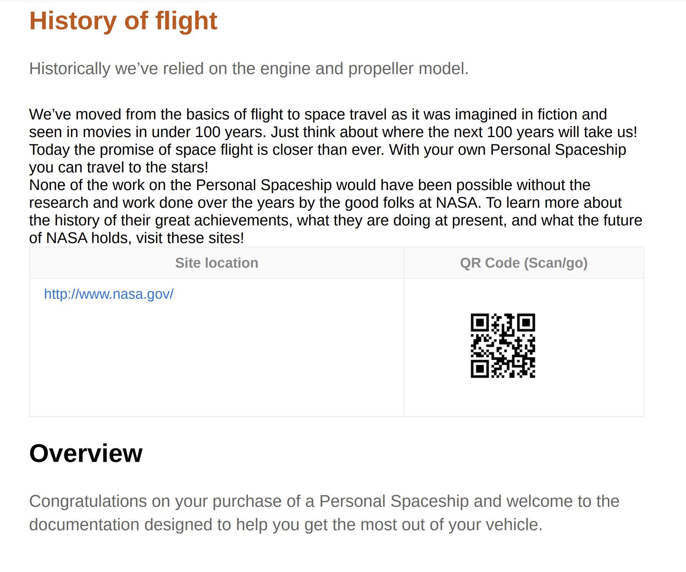
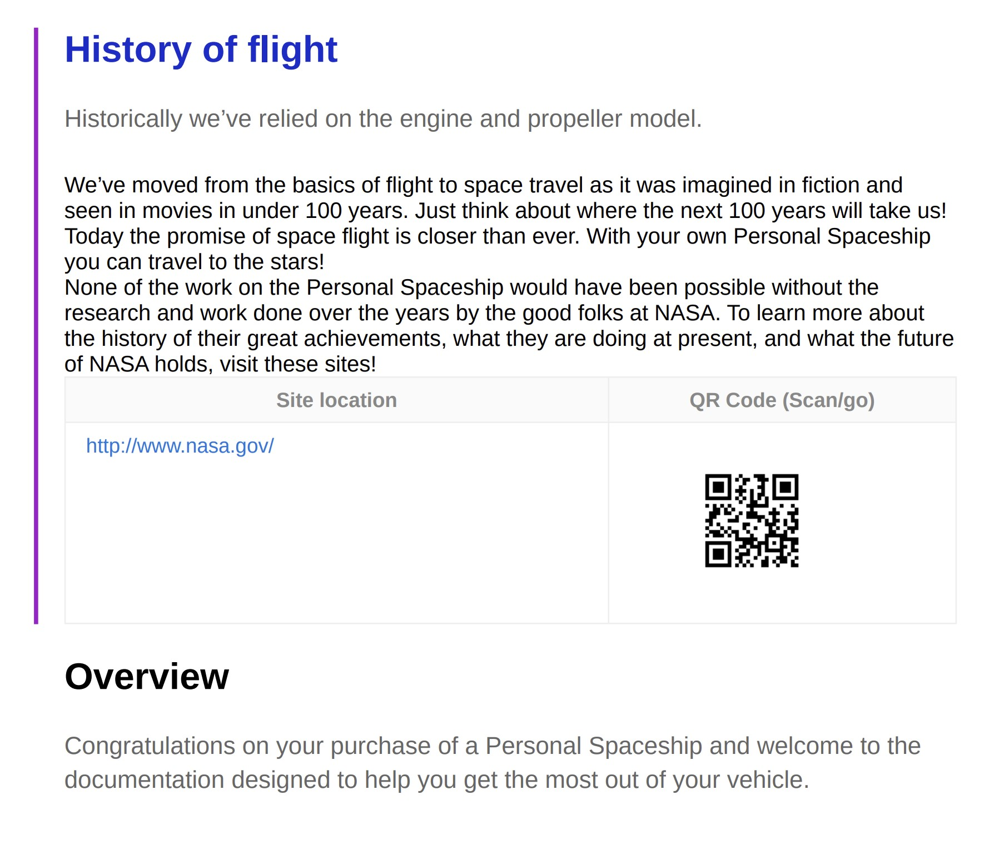

# 목차 항목 및 주제 콘텐츠에 사용자 지정 스타일 적용

지원되는 맵 요소(예: `<topicref>` 및 `<topichead>`)에서 `outputclass` 특성을 사용하여 TOC 항목, TOPICHEADS 또는 개별 항목에 사용자 지정 스타일을 적용할 수 있습니다. 전체 주제에 사용자 지정 서식을 적용하려면 CSS에서 `outputclass` 특성의 스타일 정의를 확장합니다.

## `<topicref>`을(를) 통해 참조된 주제 스타일 지정

`<topicref>` 요소에 `outputclass`을(를) 적용하여 생성된 PDF에서 목차 항목, 주제 제목 또는 전체 주제 컨텐츠의 스타일을 지정할 수 있습니다.

예를 들어 검토해야 하는 주제를 식별하려면 DITA 맵의 해당 `<topicref>` 요소에 outputclass 특성을 추가하고 CSS의 관련 스타일을 정의합니다.

다음 예제에서는 *비행 기록* 주제에 값이 `new-topic`인 `outputclass` 특성이 할당되었습니다.


`new-topic` 클래스를 사용하여 다음에 대한 스타일을 정의할 수 있습니다.

* 목차 또는 미니 목차의 기본 항목
* 기본 콘텐츠의 주제 제목입니다.
* 제목을 포함한 주제의 전체 콘텐츠

다음 CSS 정의는 목차 항목 및 주제 제목의 텍스트 색상을 변경합니다.

```css
.new-topic {
  color:#CC5309
}
```

이 정의는 목차의 텍스트 색상과 주제 제목을 제어합니다. 다음 PDF 출력은 목차 항목에 적용된 다양한 색상을 보여줍니다.


주제 제목도 동일한 색상을 사용하여 스타일링됩니다.



목차 항목과 주제 제목이 다른 스타일을 갖도록 하려면 아래에 표시된 대로 별도로 정의할 수 있습니다.

```css
...
/*for styling TOC entry */
.new-topic {
  color:#CC3509
}

/* for styling topic's title */
.new-topic.title {
  color:#092ACC
}
...
```

전체 주제 내용에 스타일을 적용하려면 클래스 이름에 `-content` 접미사를 추가합니다. 다음 예제에서는 주제 콘텐츠에 변경 막대를 추가합니다.

```css
...
/* for styling the topic's content */
.new-topic-content {
  -ro-change-bar-color:#A609CC;
}
...
```

위의 스타일 특성을 사용하면 아래와 같이 *비행 기록* 항목 왼쪽에 변경 막대가 추가됩니다.



## `topichead`개 요소에 스타일 적용

`<topichead>` 요소의 `outputclass` 특성을 사용하여 목차 항목 및 `topichead`에 대해 생성된 머리글에 다른 스타일을 적용할 수 있습니다.

예를 들어 DITA 맵에서 다음 `topichead`을(를) 정의하는 경우

```xml
<topichead navtitle="Getting Started" outputclass="new-topichead">
    ...
</topichead>
```

`new-topichead` 클래스는 TOC의 topichead 항목 및 topichead에 대해 생성된 머리글에 적용됩니다.

머리글에 다른 스타일을 적용하려면 `<topicref>`에서 목차 항목 및 주제 제목에 대해 별도의 스타일을 지원하는 방법과 유사하게 머리글에 대해 별도의 클래스를 정의합니다.

```css
...
/* Style for the topichead TOC entry */
.new-topichead {
  color: #CC5309;
}

/* Style for the topichead heading */
.new-topichead.title {
  color: #092ACC;
}...
```

topichead와 연결된 콘텐츠의 스타일을 지정하려면 클래스 이름에 `- content` 접미사를 추가합니다.

```css
.new-topichead-content {
    border-left: 2px solid #cccccc;
    padding-left: 8px;
}
```


## 목차에서 빈 행 제거

주제에 대한 제목을 정의하지 않은 경우 이러한 주제에 대한 목차에 빈 행이 나타납니다.

TOC 및 미니 TOC에서 빈 행을 제거하려면 `layout.css`에 다음 스타일을 추가하십시오.

```css
.toc-body a:empty,
.chaptoc-body a:empty {
    display: none;
} 
```

