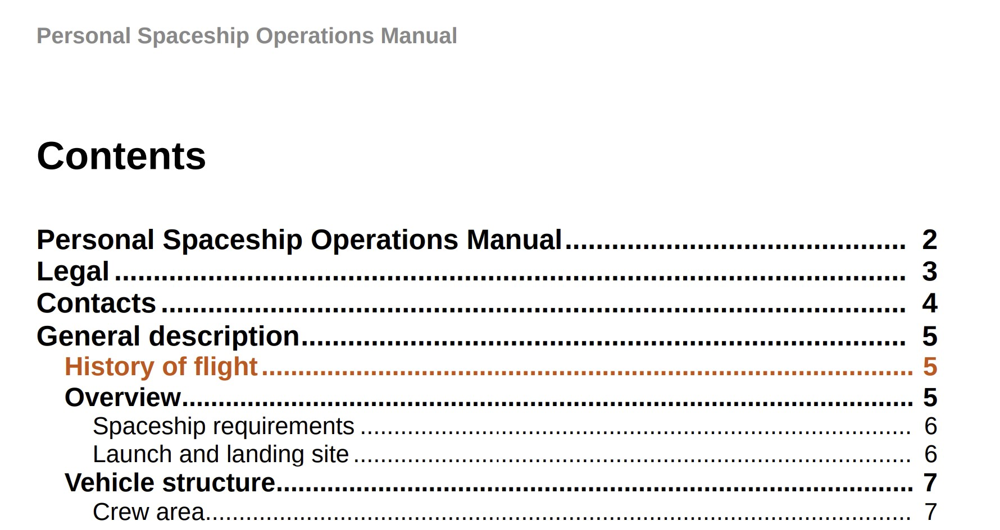

# 목차 항목 및 주제 콘텐츠에 사용자 지정 스타일 적용

경우에 따라 목차 항목 또는 특정 주제에 사용자 지정 스타일을 적용할 수 있습니다. `outputclass` 특성을 DITA 맵의 `<topicref>` 요소와 연결하면 이를 수행할 수 있습니다. 또한 전체 주제에 사용자 지정 형식을 적용하려는 경우 CSS에서 속성의 스타일 정의를 확장하여 적용할 수도 있습니다.

검토를 위해 보낼 새 주제의 예를 살펴보겠습니다. 업데이트된 주제를 쉽게 식별하려면 DITA 맵의 `<topicref>` 요소에 `outputclass` 특성을 추가한 다음 CSS에서 해당 요소에 대한 사용자 지정 스타일을 정의해야 합니다.

다음 예제에서는 *비행 기록* 주제에 값이 `new-topic`인 `outputclass` 특성이 할당되었습니다.


CSS에서 `new-topic`의 클래스 정의를 사용하면 다음 항목의 스타일을 정의할 수 있습니다.
* 목차 또는 미니 목차의 기본 항목
* 기본 콘텐츠의 주제 제목입니다.
* 제목을 포함한 주제의 전체 콘텐츠

이러한 각 시나리오를 CSS에서 정의하는 방법을 살펴보겠습니다. `new-topic` 클래스의 다음 CSS 정의에서 텍스트 색상이 변경되었습니다.

```css
…
.new-topic {
  color: #CC5309
}
…
```

이 정의는 목차의 텍스트 색상과 주제 제목을 제어합니다. 다음 PDF 출력은 목차 항목에 적용된 다양한 색상을 보여줍니다.



주제 제목도 동일한 색상을 사용하여 스타일링됩니다.


목차 항목과 주제 제목이 다른 스타일을 갖도록 하려면 아래에 표시된 대로 별도로 정의할 수 있습니다.

```css
...
/*for styling TOC entry */
.new-topic {
  color: #CC3509
}

/* for styling topic's title */
.new-topic.title {
  color: #092ACC
}
...
```

마지막으로 주제 내의 전체 내용에 스타일을 적용할 수도 있습니다. 이를 위해 클래스 이름에 접미사 &quot;`-content`&quot;을(를) 추가해야 합니다. 다음 예제에서는 주제의 전체 콘텐츠에 변경 표시줄이 추가되었습니다.

```css
...
/* for styling the topic's content */
.new-topic-content {
  -ro-change-bar-color: #A609CC;
}
...
```

위의 스타일 특성을 사용하면 아래와 같이 *비행 기록* 항목 왼쪽에 변경 막대가 추가됩니다.


