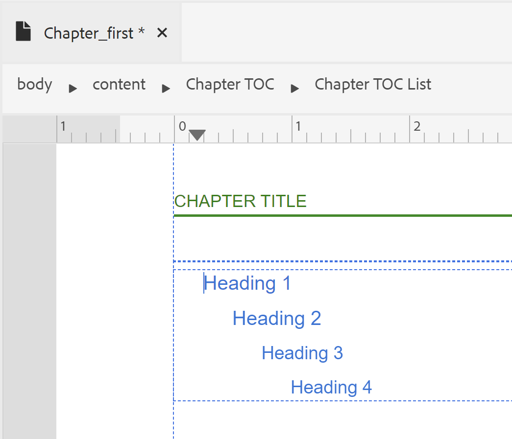

# 페이지 레이아웃 디자인 {#design-page-layout}

PDF 문서를 만들 때 다양한 유형의 정보를 제공하는 다양한 섹션이 있습니다. 예를 들어 PDF 문서는 회사의 로고, 책 제목 또는 버전 정보가 있는 표지나 표지에서 시작됩니다. 그런 다음 장, 부록 또는 용어집 페이지가 있습니다. PDF 문서의 각 섹션은 서로 다르게 보이며 페이지 레이아웃을 만들고 사용자 지정하여 이를 수행합니다.

페이지 레이아웃을 디자인할 때 페이지를 구성하는 다양한 요소를 정의할 수 있습니다. 예를 들어 페이지의 페이지 크기, 여백, 머리글과 바닥글, 방향 및 기타 페이지 사양을 정의할 수 있습니다. 기본 PDF 게시 기능을 사용하면 [페이지 미디어 표준](https://www.w3.org/TR/css-page-3/)에 따라 페이지를 디자인할 수 있습니다. 페이징된 미디어 표준에 적용되는 대부분의 설정은 기본 PDF 게시 기능의 사용자 인터페이스를 사용하여 쉽게 사용자 지정할 수 있습니다. 다른 고급 수준의 서식 지정의 경우 Source 보기를 사용하여 고유한 CSS 코드를 작성할 수 있습니다.

페이지 레이아웃을 디자인한 후에는 이러한 레이아웃을 PDF 페이지 레이아웃 설정에서 해당 섹션과 연결해야 합니다. 맞춤화를 위한 페이지 레이아웃을 만들고 여는 방법에 대한 자세한 내용은 [페이지 레이아웃 만들기 및 사용자 지정](components-pdf-template.md#create-customize-page-layout) 섹션을 참조하십시오.

## 페이지 레이아웃 유형 {#types-of-page-layout}

PDF 문서에는 일반적으로 다음 섹션이 포함되어 있습니다.

* 표지 페이지
* 목차
* 수치 상승도
* 테이블 리프트
* 챕터 또는 주제 페이지
* 용어 설명
* 색인
* 백 페이지

이러한 섹션에는 정보를 특정 형식으로 표시하기 위해 해당 페이지 레이아웃이 필요합니다. 또한 홀수 또는 짝수 페이지에서 새 챕터를 시작하는 데 사용할 필러로 사용되는 빈 페이지가 있을 수 있습니다. 이 경우 기본 페이지 레이아웃을 사용하거나 빈 페이지에 대한 페이지 레이아웃을 만들 수 있습니다. 자세한 내용은 [새 페이지 레이아웃 만들기](components-pdf-template.md#create-page-layout)를 참조하십시오.

**템플릿>설정** 섹션 아래의 페이지 레이아웃 설정을 사용하면 PDF의 다양한 섹션에 사용할 페이지 레이아웃을 정의할 수 있습니다. 각 페이지 레이아웃에는 서로 다른 첫 번째, 오른쪽 또는 왼쪽 페이지 변형이 더 있을 수 있습니다.

### 첫 번째, 오른쪽 또는 왼쪽 페이지 레이아웃 변형 만들기 {#page-layout-variants}

서로 다른 첫 페이지, 오른쪽 또는 왼쪽 페이지 레이아웃 변형을 가짐으로써 PDF 템플릿의 서로 다른 페이지 레이아웃을 추가로 사용자 정의할 수 있습니다. 페이지 레이아웃 디자이너를 사용하여 이러한 페이지를 다르게 디자인할 수 있습니다.

>[!NOTE]
>
>책의 한 구역에 대해 단일 페이지 레이아웃을 만들려면 첫 페이지, 오른쪽 페이지 또는 왼쪽 페이지 레이아웃을 만들 필요가 없습니다.

페이지 레이아웃을 만들 때는 다음 사항을 고려하십시오.

>[!NOTE]
>
>다음 사항은 챕터 페이지 레이아웃을 예로 든 것입니다. 그러나 이러한 점은 다른 페이지 레이아웃에도 유효합니다.

* 한 챕터 내의 모든 페이지에 대해 단일 페이지 레이아웃을 사용하려면 변형 없이 단일 챕터 페이지 레이아웃만 만듭니다.

* 책의 챕터에 대한 첫 번째 페이지의 모양과 느낌을 다르게 하려면 챕터에 대한 첫 번째 페이지 레이아웃 변형을 만들어야 합니다.

* 책의 모든 왼쪽 및 오른쪽 페이지에 대해 다른 모양과 느낌을 만들려면 챕터 페이지 레이아웃에 대한 왼쪽 및 오른쪽 변형을 만들어야 합니다.

* 챕터를 홀수 또는 짝수 페이지에서 시작하도록 하려면 빈 페이지에 대한 페이지 레이아웃을 만들도록 선택할 수 있습니다. 이 페이지 레이아웃은 두 챕터 사이의 간격을 채워 원하는 홀수 또는 짝수 페이지에서 챕터가 시작되도록 하는 데 사용됩니다.

  >[!NOTE]
  >
  >별도의 빈 페이지 레이아웃을 만들지 않으면 기본 페이지 레이아웃이 사용됩니다. 페이지 레이아웃을 만들려면 [새 페이지 레이아웃 만들기](components-pdf-template.md#create-page-layout)를 참조하십시오.

다음 예는 페이지 레이아웃의 변형을 만드는 프로세스를 안내합니다.

1. &quot;새 페이지 레이아웃 만들기&quot; 절차 아래에 제공된 단계를 사용하여 &quot;챕터&quot; 페이지 레이아웃을 만듭니다.

   빈 챕터 페이지 레이아웃이 만들어지고 페이지 레이아웃 아래에 추가됩니다.

   기본적으로 페이지 레이아웃을 만들 때는 편집할 수도 있도록 열립니다. 다음 스크린샷에는 빈(기본) 페이지 레이아웃이 표시됩니다.

   

   템플릿의 머리글, 바닥글 및 컨텐츠 영역은 기본적으로 작성됩니다. 페이지 속성, 콘텐츠 속성 및 사용자 인터페이스에 지정된 다양한 도구(이미지, 필드 삽입 등)를 사용하여 이러한 영역을 쉽게 사용자 지정할 수 있습니다.

   >[!NOTE]
   >
   >고급 구성의 경우 Source 보기를 사용하고 사용자 지정 HTML 및 CSS 코드를 추가할 수 있습니다.

1. 마우스를 **챕터** 레이아웃 위로 가져간 다음 **옵션**&#x200B;을 클릭하여 컨텍스트 메뉴를 표시합니다.

1. **레이아웃 변형 추가** 위로 클릭하거나 마우스를 가져간 후 만들려는 페이지 레이아웃(첫 번째, 왼쪽 또는 오른쪽)을 선택합니다.

선택한 페이지 레이아웃은 기본 챕터 레이아웃의 복사본을 사용하여 만들어집니다. 즉, 기본 챕터 페이지 레이아웃을 변경한 경우 페이지 레이아웃을 만들 때 변형 페이지 레이아웃에서도 동일한 변경 내용이 복제됩니다.

## 페이지 레이아웃의 페이지 속성 작업 {#page-props-page-layout}

페이지 레이아웃을 디자인하는 동안 다양한 페이지 속성을 제어해야 합니다. 기본 PDF 게시 기능은 페이지 속성 패널 아래에 있는 모든 주요 페이지 속성을 캡슐화합니다. 페이지 속성 패널은 다음 섹션 아래의 다양한 속성에 대한 액세스를 제공합니다.

>[!NOTE]
>
>페이지 속성 패널은 속성을 캡슐화하고 [페이지 미디어 표준](https://www.w3.org/TR/css-page-3/)에 정의된 규칙을 따릅니다.

* **페이지 크기** : 페이지 레이아웃에 사용할 페이지 크기를 지정합니다. 페이지 크기 드롭다운 목록에서 15개 이상의 페이지 크기 중에서 선택할 수 있습니다. 사용자 지정 페이지 크기를 사용하여 페이지 레이아웃을 만들 수도 있습니다. 자세한 내용은 [페이지 크기 설정](#set-page-size)을 참조하십시오.

* **방향** : 페이지 레이아웃에 사용할 페이지 방향을 지정합니다. 세로 또는 가로 페이지 방향 중에서 선택할 수 있습니다. 페이지 레이아웃에서 다른 페이지 변형에 다른 방향을 적용하도록 선택할 수 있습니다. 예를 들어 콘텐츠에 넓은 테이블이나 큰 이미지가 포함된 경우 가로 페이지 레이아웃을 만들고 해당 레이아웃을 넓은 테이블이나 이미지에 적용할 수 있습니다.

* **회전 보기** : 회전 후 원래 위쪽 면이 표시되는 면 또는 방향을 지정합니다. 시계 방향 90도, 반시계 방향 90도 또는 반시계 방향 180도 중에서 선택할 수 있습니다. 이 기능은 출력에서 세로 및 가로 레이아웃을 조합하여 사용하려는 경우에 매우 유용합니다. 예를 들어 세로 를 일반 페이지 레이아웃으로 사용하고 가로 페이지 레이아웃을 설정하여 넓은 테이블을 렌더링할 수 있습니다. 이 경우 테이블 내용을 시계 방향으로 90도로 표시하도록 설정할 수 있습니다. 이 방식으로 페이지가 가로로 방향이 지정되며, 콘텐츠가 90도 회전되어 보기에서 연속성을 유지합니다. 이 과정의 뒷부분에서 예를 들어 보겠습니다.

* **페이지 번호 매기기**: 기본적으로 페이지 번호 매기기는 PDF에서 연속적입니다. 예를 들어 100페이지의 PDF에는 1부터 100까지의 연속적인 페이지 번호가 있을 수 있습니다. 다른 모든 섹션의 특정 번호에서 번호 매기기를 다시 시작하거나 섹션의 첫 번째 발생 횟수를 다시 시작할 수도 있습니다.
   * **다음에서 다시 시작** : 이 페이지 레이아웃에 대한 번호 매기기를 시작할 페이지 번호를 지정합니다. 예를 들어 모든 챕터에 대해 다시 시작하도록 페이지 번호를 설정할 수 있습니다. 이 경우 챕터 페이지 레이아웃의 첫 번째 페이지 레이아웃 변형에서 속성에서 다시 시작을 1로 설정해야 합니다. 기본적으로 페이지 번호 매기기는 이전 페이지에서 계속됩니다.

   * **처음 발생 횟수에만 적용**: 섹션의 처음 발생 횟수에 대해서만 특정 번호부터 시작할 수도 있습니다. 예를 들어 첫 번째 챕터를 1에서 시작하여 다른 챕터의 페이지 번호를 계속할 수 있습니다.

* **레이아웃** : 위쪽, 아래쪽, 왼쪽 및 오른쪽의 패딩과 함께 페이지 여백을 지정합니다. 다음 그림에서는 컨텐츠를 중심으로 여백, 패딩 및 테두리를 렌더링하는 방법을 설명합니다. 페이지 상단과 하단의 여백에는 머리글과 바닥글이 포함됩니다.

  

* **배경** : 이미지 또는 색상을 페이지 레이아웃의 배경으로 포함합니다. 이미지의 경우 반복 및 위치 속성과 함께 이미지의 높이 및 너비를 지정할 수 있습니다.

* **각주** : 출력에 각주를 표시할 속성을 지정합니다. 테두리 스타일과 함께 여백 및 패딩 속성을 지정하도록 선택할 수 있습니다.

### 페이지 크기 설정 {#set-page-size}

페이지 레이아웃에서 가장 먼저 정의해야 하는 것은 페이지 크기입니다. 페이지 속성에는 페이지 레이아웃에 선택할 수 있는 15페이지 이상의 크기가 있습니다. 다음 단계를 수행하여 사용자 지정 페이지 크기를 만들 수도 있습니다.

1. 편집에 필요한 페이지 레이아웃을 엽니다.

   >[!NOTE]
   >
   >사용자 지정 또는 편집을 위한 페이지 레이아웃을 열려면 [페이지 레이아웃 사용자 지정](components-pdf-template.md#customize-page-layout) 섹션을 참조하십시오.

1. 오른쪽 패널에서 **페이지 속성**&#x200B;을 클릭합니다.
1. **페이지 크기** 드롭다운 목록에서 **사용자 지정**&#x200B;을 선택합니다.

   [페이지 너비] 및 [페이지 높이] 필드가 표시됩니다.

1. **페이지 너비** 및 **페이지 높이** 필드에 원하는 페이지 차원을 입력합니다.

   >[!NOTE]
   >
   >가장 일반적으로 사용되는 단위는 px(픽셀), pt(포인트), rem, em, %(백분율) 및 in(인치)입니다.

### 페이지 방향 및 보기 회전 사용 {#page-orientation-rotation}

세로 및 가로 페이지 방향과 보기 회전 속성의 조합이 사용되는 예를 살펴보겠습니다. 이 예제에서는 기본 세로 방향으로 PDF을 만들지만, 테이블은 시계 방향으로 90도 보기에서 콘텐츠가 있는 가로 방향으로 렌더링됩니다. 최종 출력은 다음과 유사합니다.


상기 출력에서, 연락처 리스트 정보는 또한 90도 회전된 컨텐츠와 함께 가로 모드로 제시된다. 나머지 콘텐츠는 일반 세로 모드로 표시됩니다.

이러한 종류의 출력을 달성하려면 다음과 같은 주요 작업을 수행해야 합니다.

1. 가로 방향으로 페이지 레이아웃을 만듭니다.

1. 콘텐츠를 90도로 렌더링하도록 **회전 보기** 속성을 변경합니다.

1. 새 페이지 레이아웃을 사용할 사용자 지정 스타일을 만듭니다.

1. 가로 페이지 레이아웃에서 렌더링할 테이블의 outputclass 정의에 스타일을 추가합니다.

위의 작업을 수행하려면 다음 단계를 수행하십시오.

1. 가로 방향으로 페이지 레이아웃을 만듭니다.
   1. &quot;새 페이지 레이아웃 만들기&quot; 절차 아래에 제공된 단계를 사용하여 &quot;가로&quot; 페이지 레이아웃을 만듭니다.

   1. 오른쪽 패널에서 **페이지 속성**&#x200B;을 클릭합니다.

      
   1. **방향**&#x200B;을 **가로**(으)로 변경합니다.

1. [회전 보기] 속성을 변경하여 콘텐츠를 시계 방향으로 90° 렌더링합니다.

   1. 회전 보기 드롭다운 목록에서 **시계 방향으로 90°**&#x200B;을(를) 선택합니다.
   

   1. 업데이트된 페이지 레이아웃 속성을 저장하려면 **모두 저장**&#x200B;을 클릭합니다.

1. 새 페이지 레이아웃을 사용할 사용자 지정 스타일을 만듭니다.
   1. 왼쪽 사이드바를 확장하고 스타일을 만들 템플릿을 두 번 클릭합니다.

   1. 스타일시트 섹션을 확장합니다.

   1. 레이아웃 스타일시트에 마우스를 가져다 대고 (_옵션_ 아이콘)...을 클릭하고 편집을 선택합니다.

      편집을 위해 레이아웃 스타일시트가 열립니다.

   1. **다른 스타일**&#x200B;을 마우스 오른쪽 단추로 클릭하고 **새 스타일**을 선택하세요.
      

   1. 스타일 추가 팝업에서 **classname**&#x200B;에 **landscape-style**을(를) 입력합니다.
      

   1. **완료**&#x200B;를 클릭합니다.

      다른 스타일 목록의 끝에 이름이 `.landscape-style`인 새 스타일이 만들어지고 추가됩니다.

   1. `.landscape-style` 스타일을 두 번 클릭하여 편집할 수 있도록 엽니다.

   1. **페이지 매김** 속성을 확장합니다.

   1. **페이지 레이아웃** 속성에 `Landscape`을(를) 입력하십시오.

      

   1. 업데이트된 스타일 속성을 저장하려면 **모두 저장**&#x200B;을 클릭하세요.

1. 가로 페이지 레이아웃에서 렌더링할 테이블의 `outputclass` 정의에 스타일을 추가합니다.
   1. DITA 파일 편집기에서 새 페이지 레이아웃을 적용할 파일을 엽니다.

   1. 가로 모드로 렌더링할 `<table>` 요소를 찾습니다.

   1. 이동 경로에서 테이블 요소를 클릭하여 테이블을 선택합니다.

      

   1. 오른쪽 패널에서 를 클릭하고 [컨텐츠 속성] 패널을 엽니다.

   1. 콘텐츠 속성 패널에서 **landscape-style**&#x200B;을(를) 속성 값으로 사용하는 새 **outputclass** 속성을 추가합니다.

      

1. 업데이트된 파일을 저장하려면 **모두 저장**&#x200B;을 클릭하세요.
1. PDF 출력을 생성합니다.

최종 PDF에는 예제 시작에 표시된 대로 테이블 컨텐츠가 가로 모드로 렌더링됩니다.

### 배경 이미지 추가 {#add-bg-image}

요구 사항에 따라 챕터(PDF) 출력의 모든 첫 페이지에 표시되는 배경 이미지를 추가할 수 있습니다. 페이지 속성 아래의 배경 속성을 사용하면 배경 이미지를 쉽게 추가할 수 있습니다. 페이지 간에 이 이미지를 복제하고 페이지의 위쪽, 아래쪽 또는 가운데 영역 아무 곳에나 이미지를 배치할 수 있습니다.

예를 들어 컨텐츠 영역의 가운데 부분에 배경 이미지를 삽입하려면 다음 단계를 수행합니다.

1. 편집에 필요한 페이지 레이아웃을 엽니다.

   >[!NOTE]
   >
   >사용자 지정 또는 편집을 위한 페이지 레이아웃을 열려면 [페이지 레이아웃 사용자 지정](components-pdf-template.md#customize-page-layout) 섹션을 참조하십시오.

1. 컨텐츠 영역의 아무 곳이나 클릭합니다.

1. 오른쪽 패널에서 **페이지 속성**&#x200B;을 클릭합니다.

1. **배경** 섹션을 확장합니다.

1. **이미지 경로** 위치 필드에서 찾아보기 단추를 클릭합니다.

1. 배경 이미지로 사용할 이미지를 찾아 선택합니다.

   이미지가 삽입되고 복제되어 전체 페이지가 표시됩니다.

1. 높이 및 너비 속성을 조정하여 이미지 크기를 변경합니다.

   >[!NOTE]
   >
   >가로 세로 비율을 유지하기 위해 이미지 크기가 자동으로 조정되므로 높이 또는 너비 속성 중 하나를 입력할 수 있습니다.

1. 다른 속성을 설정하여 배경 이미지를 표시할 방식을 조정합니다.

   * **백그라운드 반복** : 배경을 반복할지 여부를 지정합니다.

   * **배경 위치** : 페이지에서 배경 이미지의 위치를 지정하십시오.

다음 스크린샷은 배경 이미지를 _반복 안 함_(으)로 설정하고 배경 위치 속성을 _가운데_(으)로 설정합니다.


## 페이지 머리글과 바닥글을 사용하여 작업 {#work-header-footer}

페이지 레이아웃의 머리글이나 바닥글에 정보를 포함하면 해당 페이지 레이아웃을 사용하는 모든 페이지에서 정보가 반복됩니다. 일반적으로 머리글 영역은 장 또는 항목 제목에 사용되며 바닥글 영역은 페이지 번호를 표시하는 데 사용됩니다.

새 페이지 레이아웃을 만들 때 기본적으로 머리글 및 바닥글 영역이 만들어집니다. 페이지 레이아웃의 머리글 및 바닥글 영역에서 다양한 사용자 지정을 수행할 수 있습니다. 예를 들어 이미지(로고 등), 변수(동적 정보 포함) 또는 정적 콘텐츠를 삽입할 수 있습니다.

### 머리글 및 바닥글 여백 및 줄 변경 {#header-footer-margins}

기본적으로 머리글 및 바닥글 여백은 1인치로 설정됩니다. [페이지 속성] 패널에서 [여백] 설정을 변경하여 이 기본값을 변경할 수 있습니다. 머리글 및 바닥글 크기를 변경하려면 다음 단계를 수행하십시오.

1. 편집에 필요한 페이지 레이아웃을 엽니다.

   >[!NOTE]
   >
   >사용자 지정 또는 편집을 위한 페이지 레이아웃을 열려면 [페이지 레이아웃 사용자 지정](components-pdf-template.md#customize-page-layout) 섹션을 참조하십시오.

1. 오른쪽 패널에서 **페이지 속성**&#x200B;을 클릭합니다.
1. **레이아웃** 섹션을 확장합니다.
1. **Margin** 속성 옆에 있는 잠금 아이콘을 클릭합니다.
1. 머리글 크기를 변경하려면 위쪽 여백 필드에 원하는 값을 입력합니다.

   >[!NOTE]
   >
   >가장 일반적으로 사용되는 단위는 px(픽셀), pt(포인트), rem, em, %(백분율) 및 in(인치)입니다.

1. 바닥글 크기를 변경하려면 아래쪽 여백 필드에 원하는 값을 입력합니다.

머리글 및 바닥글 영역에 여러 줄이 포함되도록 디자인할 수 있습니다. 이렇게 하려면 HTML 요소 삽입 ( )을 사용하여 \&lt;p\> 태그를 추가합니다.머리글 또는 바닥글 영역의 ) 아이콘입니다.

| _개발자 코너_:  |
|---|

CSS 및 HTML 코드로 직접 작업하려면 다음 코드 조각에 표시된 대로 여백 값을 변경할 수 있습니다.

```css
…

<meta name="page-style" content="size:A4 portrait;margin-top:3cm;margin-right:30pt;margin-bottom:1in;margin-left:90px;" />

…
```

>[!NOTE]
>
>위의 예에서 다른 단위를 사용하여 여백 값을 지정합니다.

### 머리글 및 바닥글 제거 {#remove-header-footer}

위쪽 및 아래쪽 여백에 머리글 및 바닥글 오버레이가 있습니다. 즉, 페이지 레이아웃에 머리글과 바닥글을 포함하려면 위쪽 여백과 아래쪽 여백에 필요한 공간을 예약해야 합니다.

페이지 레이아웃에 머리글과 바닥글을 사용하지 않으려면 다음 두 가지 방법으로 수행할 수 있습니다.

* 위쪽 여백과 아래쪽 여백을 유지하려면 머리글 및 바닥글 영역을 비워 둡니다.
* 매거진의 앞면 및 뒷면 덮개 디자인과 같이 위쪽 및 아래쪽 여백을 유지하지 않으려면 위쪽 및 아래쪽 여백 속성을 0으로 설정하여 여백을 제거할 수 있습니다. 이렇게 하면 머리글과 바닥글에 사용할 공간이 없습니다.

### 헤더에 이미지 또는 로고 추가 {#add-image-header}

요구 사항에 따라 페이지 레이아웃의 헤더 영역(또는 다른 부분)에 표시되는 이미지를 추가할 수 있습니다. 페이지 레이아웃에 이미지를 추가하는 방법에는 두 가지가 있습니다.

* 템플릿 리소스의 이미지를 사용합니다.
* 페이지 레이아웃 편집기에서 \&lt;이미지 추가\> 도구를 사용합니다.

>[!NOTE]
>
>리소스 폴더를 사용하여 이미지 또는 글꼴과 같은 모든 템플릿 에셋을 관리하는 것이 좋습니다.

회사의 로고 같은 이미지를 헤더 영역에 삽입하려면 다음 단계를 수행하십시오.

1. 편집에 필요한 페이지 레이아웃을 엽니다.

>[!NOTE]
>
>사용자 지정 또는 편집을 위한 페이지 레이아웃을 열려면 [페이지 레이아웃 사용자 지정](components-pdf-template.md#customize-page-layout) 섹션을 참조하십시오.

1. Edit Header ( 를 클릭합니다.) 아이콘을 클릭하여 머리글 영역에 커서를 놓습니다.

   또는 헤더 영역 내부를 클릭합니다.

1. 이미지를 추가하려면 다음 방법 중 하나를 선택합니다.
1. **비활성 이미지**&#x200B;를 클릭합니다() 아이콘입니다. **경로 선택** 팝업에서 이미지 위치를 찾은 다음 **선택**&#x200B;을 클릭하여 헤더 영역에 삽입합니다.
1. Resources 폴더의 이미지를 헤더 영역으로 끌어서 놓습니다.

다음 스크린샷은 헤더 영역에 추가된 샘플 이미지를 보여 줍니다.


이미지가 삽입되면 해당 속성을 수정하여 원하는 모양과 느낌을 제공할 수 있습니다. 이미지 또는 페이지 레이아웃의 다른 요소의 모양을 변경하는 가장 쉬운 방법은 [컨텐츠 속성] 패널을 사용합니다. UI를 통해 사용자 지정할 수 있는 다양한 속성에 대해서는 [콘텐츠 속성 패널 작업](#work-with-content-props)을 참조하십시오.

### 필드 및 메타데이터 추가 {#add-fields-metadata}

필드는 사전 정의된 정보를 삽입하려는 경우 매우 유용합니다. 예를 들어 게시할 때 실제 챕터의 제목으로 대체되는 챕터의 헤더 영역에 챕터 제목 필드를 포함할 수 있습니다.

페이지 레이아웃에 삽입할 수 있는 필드에는 다음과 같은 카테고리가 있습니다.

* 메타데이터
* 주제 제목
* 챕터 제목
* 맵 제목
* 페이지 번호
* 챕터 번호
* 총 페이지 수
* 날짜
* 시간


이러한 필드 카테고리들 각각은 필드 정보가 삽입될 수 있는 상이한 변형들을 포함한다. 예를 들어 날짜 필드에는 `YYYY-MM-DD`, `MM/DD/YY`, `MM/DD/YYYY` 등의 다양한 변형이 있을 수 있습니다. 마찬가지로 페이지 번호에는 _아랍어_, _Devanagari_, _히브리어_ 등과 같이 로마자, 십진수 또는 로케일별 형식의 변형이 있을 수 있습니다.


사전 정의된 필드 외에도 메타데이터 정보를 페이지 레이아웃에 변수 또는 필드로 추가할 수도 있습니다. 이 메타데이터는 원본 DITA **맵 콘텐츠**, **주제 콘텐츠**&#x200B;에 저장하거나 DITA **맵 파일 속성**, **주제 파일 속성**&#x200B;에서 선택할 수 있습니다.

다음 옵션에서 메타데이터를 선택할 수 있습니다.

* **맵 콘텐츠**&#x200B;에 DITA 맵의 `<topicmeta>` 요소에 정의한 메타데이터가 포함되어 있습니다.
* **맵 파일 속성**&#x200B;에는 DITA 맵의 **속성** 페이지에서 액세스할 수 있는 메타데이터가 포함되어 있습니다.
* **주제 콘텐츠**&#x200B;에 저작권, 작성자 및 기타 세부 정보 등 DITA 주제의 `<prolog>` 요소에 정의된 메타데이터가 포함되어 있습니다. 개별 `<prolog>` 요소를 가져오려면 간단한 XPath 식(예: 작성자 이름에 대한 //작성자)을 사용할 수 있습니다. 특성 메타데이터의 경우 XPath에 `@` 기호를 포함합니다(예: 수정된 날짜에 대해 //critdates/revised/@modified).
* **주제 파일 속성**&#x200B;에 메타데이터가 포함되어 있으며, 이 메타데이터는 주제의 **속성** 페이지에서 액세스할 수 있습니다.


**맵 파일 속성**&#x200B;과 **주제 파일 속성**&#x200B;의 메타데이터를 하나의 문서로 결합할 수 있습니다. 예를 들어 표지에 맵 제목이 있고 다른 페이지의 헤더에 주제 제목이 있는 PDF을 게시할 수 있습니다. 이렇게 하려면 **맵 파일 속성**&#x200B;에서 표지 레이아웃에 맵 제목 메타데이터를 추가할 수 있습니다. 그런 다음 **주제 파일 속성**&#x200B;의 주제 제목 메타데이터를 장 및 주제 페이지 레이아웃의 헤더에 추가합니다.

한 항목이 페이지에서 끝나고 다른 항목은 동일한 페이지에서 시작하는 경우 첫 번째 항목의 메타데이터가 선택됩니다. 사용자 지정 속성을 추가한 다음 페이지 레이아웃에서 필드로 삽입할 수도 있습니다.


>[!NOTE]
>
> 메타데이터 필드는 선택한 에셋 또는 맵에 따라 **시작** 드롭다운에 표시됩니다.


<!--For more information, see [Add fields and metadata](design-page-layout.md#add-fields-and-metadata).-->

다음 예제에서는 페이지 레이아웃의 바닥글 영역에 페이지 번호와 챕터 제목을 삽입합니다.

1. 편집에 필요한 페이지 레이아웃을 엽니다.

   >[!NOTE]
   >
   >사용자 지정 또는 편집을 위한 페이지 레이아웃을 열려면 [페이지 레이아웃 사용자 지정](components-pdf-template.md#customize-page-layout) 섹션을 참조하십시오.

1. **바닥글 편집**() 아이콘을 클릭하여 커서를 바닥글 영역에 놓습니다.

   또는 바닥글 영역 안쪽을 클릭합니다.

1. **HTML 요소 삽입**&#x200B;을 클릭하여 단락 요소를 삽입합니다() 아이콘을 클릭하고 요소 목록에서 단락을 선택합니다.

1. **필드 삽입**() 아이콘을 클릭합니다.

   필드 팝업이 나타납니다.

1. 필드 목록에서 **페이지 번호** 범주를 선택하고 형식 목록에서 **기본(1)** 페이지 번호 형식을 선택한 다음 **삽입**&#x200B;을 클릭합니다.

   

   >[!NOTE]
   >
   >기본 형식을 제외한 모든 필드의 형식을 편집할 수도 있습니다. 이렇게 하려면 편집할 형식 옆에 있는 [편집] 아이콘을 클릭하고 변경한 다음 [확인]을 클릭합니다. 자세한 내용은 [필드 및 메타데이터 추가](#add-fields-metadata)를 참조하십시오.

   기본 페이지 번호 필드는 페이지 레이아웃의 바닥글 영역에 삽입됩니다.

   

   상단 이동 경로에는 정보가 저장된 요소가 나열됩니다.

1. 페이지 번호 필드 뒤에 공백을 입력하고 **필드 삽입** 아이콘을 클릭합니다.

1. 필드 목록에서 **챕터 제목** 범주를 선택하고 형식 목록에서 **챕터 제목** 형식을 선택한 다음 **삽입**&#x200B;을 클릭합니다.

   게시할 때 챕터 제목으로 채워진 _챕터 제목_ 필드가 바닥글 영역에 삽입됩니다. 이때 페이지 번호와 챕터 제목 필드는 공백으로 구분됩니다.

   

1. 챕터 제목을 마우스 오른쪽 단추로 맞추려면 다음 단계를 수행하십시오.

   1. 이동 경로의 필드 요소를 클릭하여 챕터 제목 필드를 선택합니다.

   1. 오른쪽 패널에서 **콘텐츠 속성**() 아이콘입니다.

   1. **Layout** 속성 섹션을 확장하고 **Float** 속성 값을 **right**(으)로 설정합니다.
      

      챕터 제목 필드는 페이지 바닥글의 오른쪽으로 정렬됩니다.
      


| _개발자 코너_:  |
|---|

CSS 및 HTML 코드를 직접 사용하는 것을 좋아하는 경우 페이지 레이아웃의 Source 보기로 이동하여 코드를 변경하면 됩니다. 다음 코드 조각은 코드를 통해 수행한 동일한 바닥글 설정을 보여 줍니다.

```css
…
<p>

<span data-field="page-number" data-format="default">1</span>

<span data-field="chapter-title" data-format="default" style="float: right">Chapter Title</span>

</p>
…
```

## 콘텐츠 영역을 사용하여 작업 {#content-area}

컨텐츠 영역은 컨텐츠 공간의 측면에서 가장 큰 영역이다. 콘텐츠 영역은 주제 콘텐츠로 채워집니다. 특수한 경우 콘텐츠 영역에 표준 접시 콘텐츠를 추가할 수 있습니다. 이 콘텐츠는 페이지 레이아웃의 지정된 위치에 게시됩니다. 예를 들어 목차, 용어집 및 색인의 머리글은 최종 출력에 &quot;있는 그대로&quot;로 게시되는 상용구 콘텐츠로 추가할 수 있습니다. 다른 예는 챕터 TOC이며, 일반적으로 모든 챕터의 첫 페이지에 추가됩니다.

콘텐츠 영역에서 가장 일반적으로 사용되는 사용자 지정 항목 중 하나는 다중 열 레이아웃입니다. 강력한 페이지 레이아웃 디자이너를 사용하면 다른 페이지의 콘텐츠를 단일 열에 유지하면서 여러 열에 렌더링할 특정 페이지를 사용자 지정할 수 있습니다.

다음 섹션에서는 콘텐츠 영역을 사용자 지정하는 다양한 시나리오를 다룹니다.

### 챕터 목차 추가 {#add-chapter-toc}

장 목차는 독자가 장에 있는 내용을 알 수 있도록 빠른 참조 역할을 합니다. 일반적으로 챕터 TOC는 챕터의 맨 앞에 추가됩니다. 따라서 챕터 목차를 사용하려면 기본 챕터 페이지 레이아웃이나 챕터의 첫 번째 페이지 레이아웃 변형에 있는 콘텐츠 영역에 목차를 추가할 수 있습니다.

다음 예제에서는 챕터의 첫 번째 페이지 레이아웃에 챕터 TOC를 삽입합니다.

>[!NOTE]
>
>이 절차에서는 챕터 페이지 레이아웃에 대한 첫 번째 페이지 변형을 만들었다고 가정합니다. 페이지 변형을 만드는 방법에 대한 지침은 [첫 번째, 오른쪽 또는 왼쪽 페이지 레이아웃 변형 만들기](#page-layout-variants)를 참조하십시오.

1. 편집에 필요한 페이지 레이아웃을 엽니다.

   >[!NOTE]
   >
   >사용자 지정 또는 편집을 위한 페이지 레이아웃을 열려면 [페이지 레이아웃 사용자 지정](components-pdf-template.md#customize-a-page-layout) 섹션을 참조하십시오.

1. 커서를 페이지 레이아웃의 컨텐트 영역에 놓습니다.

1. 챕터 목차() 아이콘입니다.

   기본 챕터 목차가 콘텐츠 영역에 삽입됩니다.

   

   >[!NOTE]
   >
   >기본 챕터 TOC에는 머리글 1부터 4까지 포함되어 있습니다. 여기서 제목 1은 챕터 제목 그 자체입니다. 따라서 목차에서 다시 챕터 제목을 지정하거나 목차에서 원하는 머리글 수준을 높이고 싶을 수 있습니다. 속성을 변경하여 목차를 사용자 지정할 수 있습니다.

1. 목차 제목 수준을 사용자 지정하려면 콘텐츠 속성 패널을 엽니다.

   예를 들어 제목 2에서 시작하려는 경우 첫 번째 드롭다운 목록을 2에서 시작하도록 변경합니다.

   

   마찬가지로 레벨 5까지 머리글을 표시하려면 두 번째 드롭다운 목록을 5로 변경합니다. 업데이트된 TOC는 다음과 같이 표시됩니다.

   

   >[!NOTE]
   >
   >마지막으로 게시된 PDF은 챕터의 콘텐츠를 기반으로 하는 목차 항목만 표시합니다. 챕터에 수준 5 제목이 없는 경우 최종 출력에 표시되지 않습니다.

스타일시트를 사용하여 기본 TOC의 모양과 느낌을 사용자 지정할 수 있습니다. `chaptoc-level-#`(예: `chaptoc-level-1`, `chaptoc-level-2` 등)으로 시작하는 스타일을 사용하여 장 목차 <!--For more details on the stylesheet elements used in the TOC and how to customize them, see _Customize default chapter TOC_-->의 스타일을 사용자 지정합니다.

>[!IMPORTANT]
>
>현재 스타일시트에서 스타일을 업데이트하는 경우 스타일시트가 콘텐츠 미리보기에 반영되지 않을 수 있습니다. 그러나 업데이트된 스타일로 출력이 렌더링됩니다.

### 다중 열 페이지 레이아웃 작업 {#multi-column-layout}

여러 열로 구성된 페이지 레이아웃은 책에서 잡지 또는 색인을 발행할 때 매우 일반적입니다. 기본 PDF 게시 기능을 사용하면 문서를 여러 열로 쉽게 분할할 수 있습니다. 다른 페이지 레이아웃을 사용하면 다른 섹션은 단일 열(또는 일반) 레이아웃으로 유지하면서 특정 섹션만 여러 열로 분할하도록 선택할 수 있습니다.

여러 열을 사용하여 페이지 레이아웃을 만들려면 다음 단계를 수행하십시오.

1. 편집에 필요한 페이지 레이아웃을 엽니다.

   >[!NOTE]
   >
   >사용자 지정 또는 편집을 위한 페이지 레이아웃을 열려면 [페이지 레이아웃 사용자 지정](components-pdf-template.md#customize-a-page-layout) 섹션을 참조하십시오.

1. 머리글 및 바닥글 영역을 제외한 컨텐츠에 다중 열 레이아웃이 적용되면 이동 경로에서 컨텐츠 요소를 선택해야 합니다.

   콘텐츠 이동 경로를 선택하면 콘텐츠 속성 패널에 여러 열에 대한 속성이 표시됩니다.

   

1. 다중 열 속성을 사용하여 다중 열 페이지 레이아웃을 사용자 지정합니다.

   * **열 개수:** 페이지를 나눌 열 수를 지정합니다. 위쪽 및 아래쪽 화살표 아이콘을 사용하거나 숫자를 입력하여 열의 수를 설정합니다.

   * **열 너비:** 다중 열 레이아웃에서 열의 너비를 지정합니다. 기본적으로 크기는 픽셀(px)로 설정되어 있으며 pt, rem, em, % 또는 단위로 지정할 수도 있습니다.

     >[!NOTE]
     >
     >크기를 지정하지 않으면 주어진 페이지에 맞게 열이 균일하게 나누어집니다. 대부분의 경우 이 값을 지정할 필요가 없습니다.

   * **열 간격** : 개별 열 사이의 간격을 지정합니다.

   * **열 범위** : 페이지 레이아웃의 요소가 여러 열에 걸쳐 표시되도록 하려면 이 속성을 사용해야 합니다. 스타일시트를 사용하여 원하는 요소의 스타일을 수정하면 됩니다. <!--for more information see _Section explaining style customization_-->.

   페이지 레이아웃에서 모든 챕터 페이지 레이아웃의 첫 페이지에 특정 텍스트를 표시하려면 이 텍스트를 챕터 페이지 레이아웃의 첫 번째 페이지 변형에 추가할 수 있습니다.

   다음 예제에서 보듯이 머리글 텍스트의 [열 범위] 속성은 모두 로 설정됩니다. 이렇게 하면 문서가 여러 열로 구성된 경우에도 제목이 여러 열로 확장됩니다.

   

   >[!IMPORTANT]
   >
   >outputclass 속성을 사용하여 모든 DITA 요소에 Span Column 속성을 적용할 수 있습니다.

   * **열 채우기** : 콘텐츠가 열을 채우는 방법을 지정합니다. 기본적으로 [균형]으로 설정되어 각 열을 동일한 양의 컨텐츠로 채웁니다.

   * **열 규칙** : 열 사이에 줄을 삽입하려면 이 속성을 사용하여 줄 또는 지배 스타일을 정의합니다. [스타일], [색상] 및 [폭] 값을 지정하여 열 사이에 선을 추가합니다.

## 컨텐츠 속성 패널을 사용하여 작업 {#work-with-content-props}

[컨텐츠 속성] 패널을 사용하면 페이지 레이아웃에 있는 요소의 모양과 느낌을 쉽게 업데이트할 수 있습니다. [컨텐츠 속성] 패널 아래의 속성은 다음 섹션으로 나뉩니다.

* **글꼴** : 텍스트 관련 속성이 들어 있습니다. 글꼴 패밀리, 두께, 크기, 텍스트 장식(밑줄, 윗줄, 줄바꿈), 텍스트 스타일(굵게, 기울임꼴 등), 텍스트 정렬(왼쪽, 오른쪽, 가운데 또는 양쪽 맞춤), 공백 처리(미리 정의된 형식, 줄 바꿈 안 함, 공백 구분 등), 줄 높이, 문자 간격 및 텍스트 들여쓰기를 설정할 수 있습니다.

* **테두리** : 페이지 레이아웃에서 요소에 테두리를 추가하고 서식을 지정하는 속성이 있습니다. 테두리 사이드(모두, 위쪽, 아래쪽, 오른쪽 또는 왼쪽), 테두리 스타일(실선, 파선, 점선 또는 그 이상), 테두리 색상, 너비 및 반경이 구부러진 테두리를 갖도록 설정할 수 있습니다. 다음 예제에서는 곡선 테두리가 페이지의 헤더 영역에 추가되었습니다.

  

* **레이아웃** : 페이지 레이아웃에서 요소의 레이아웃을 구성하는 속성을 포함합니다. 높이, 너비, 여백 및 패딩(위쪽, 아래쪽, 왼쪽 또는 오른쪽), 가로 또는 세로 정렬, 부동(왼쪽, 오른쪽 또는 없음), 지우기(왼쪽, 오른쪽, 둘 다 또는 없음), 요소의 위치(절대, 고정, 상대 또는 이상), 표시(블록, 내용, 고정 또는 이상), Z 색인, 투명도, 변형(회전 또는 크기 조절) 및 원점 변형(X 및 Y 오프셋)을 설정할 수 있습니다.

* **배경** : 배경 이미지 또는 색 음영을 포함하는 속성이 있습니다. 이미지 크기(높이 또는 폭 설정), 배경 반복(반복, 반복 안 함, 라운드 이상) 및 배경 위치(왼쪽 위, 오른쪽 가운데, 가운데 아래 이상)를 설정할 수 있습니다.
* **여러 열** : 페이지 또는 특정 요소(예: 챕터 목차)에 대한 여러 열 속성을 구성하는 속성이 포함되어 있습니다. 속성 및 속성 사용 방법에 대한 자세한 내용은 [다중 열 페이지 레이아웃으로 작업](#multi-column-layout)을 참조하십시오.
