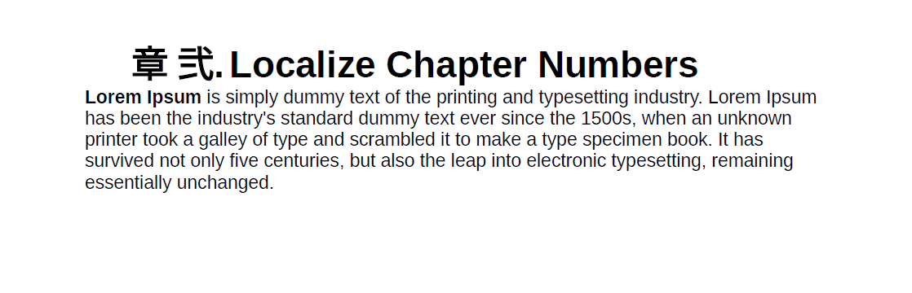

# 언어 변수 지원

AEM Guides은 언어 변수를 사용하는 기능을 제공합니다. 언어 변수를 사용하여 PDF 출력에서 지역화된 문자열을 정의하거나 출력 템플릿에서 정적 텍스트를 지역화할 수 있습니다. CSS 스타일을 사용하여 CSS에서 오는 문자열을 현지화할 수 있습니다.

## PDF 출력에서 언어 변수 사용

언어 변수를 사용하여 Note, Caution 및 Warning과 같은 기본 제공 레이블이나 PDF 출력의 정적 텍스트의 지역화된 버전을 정의할 수 있습니다. 변수 이름은 모든 언어에 대해 동일하지만 다양한 언어에 대해 다른 값을 가질 수 있습니다. 이러한 변수의 값을 하나 이상의 언어로 업데이트할 수 있으며 현지화된 값은 PDF 출력에서 자동으로 선택됩니다.

예를 들어 다음과 같이 PDF 출력에 `Note` 레이블을 표시할 수 있습니다.

- 영어: 참고

- 프랑스어: Remarque

- 독일어: Hinweis


*영어, 프랑스어 및 독일어 샘플 노트입니다.*

>[!NOTE]
>
> 변수에 대한 값이 특정 언어로 정의되지 않은 경우 AEM Guides은 UI(애플리케이션의 사용자 인터페이스) 언어에서 문자열을 대체 메커니즘으로 선택합니다.
>
> UI의 언어로 값을 정의하지 않은 경우 영어(`en_us`)를 찾거나 영어(`en`) 값을 선택하여 PDF 출력에 표시합니다.

## 언어 변수 유형

AEM Guides에서는 응용 프로그램 변수와 사용자 변수, 이렇게 두 가지 유형의 변수를 지원합니다.

### 애플리케이션 변수

AEM Guides은 사전 정의되거나 즉시 사용 가능한 애플리케이션 변수 세트를 제공합니다. 사전 정의된 이러한 변수를 사용하여 AEM Guides 관련 문서에 대한 정보를 추가할 수 있습니다. 예를 들어 `chapter-number` 변수는 페이지에 포함된 경우 페이지가 속한 챕터 번호를 표시합니다. `author-label` 변수에 문서 작성자의 이름이 표시됩니다.

>[!NOTE]
>
> 응용 프로그램 변수의 값을 재정의할 수 있습니다.


### 사용자 변수

새 언어 변수를 만들 수도 있습니다. 예를 들어 문서에 대한 게시자 레이블에 대해 사용자 변수 Publisher를 만들 수 있습니다.

>[!NOTE]
>
>  사용자 변수를 만들고 응용 프로그램 변수를 편집하려면 관리 권한이 있어야 합니다.


*선택한 언어의 언어 변수를 추가하고 봅니다.*

## 새 언어 변수 추가

1. 웹 편집기에서 출력 탭으로 이동합니다.
1. **언어 변수** 선택 왼쪽 패널의 .
1. **편집**&#x200B;을 선택하여 **언어 변수** 창을 엽니다. 선택한 언어에 있는 응용 프로그램 및 사용자 변수는 알파벳 순서로 나열됩니다. 선택한 언어에 따라 값이 표시됩니다. 예를 들어 프랑스어를 선택하면 &quot;Tip&quot;이 &quot;Conseil&quot;로 표시됩니다.
1. **언어** 드롭다운에서 변수를 편집할 언어를 선택합니다.

   >[!NOTE]
   >
   > 원하는 언어가 표시되지 않으면 **언어 변수 설정**&#x200B;에서 원하는 언어를 사용하도록 설정하십시오. 설정 선택  **언어 변수 설정** 대화 상자를 엽니다.

1. **Name** 열에 변수 이름을 입력하고 **Value** 열에 해당 값을 입력합니다.

   >[!NOTE]
   >
   >모든 HTML 콘텐츠를 변수 값으로 사용하여 특정 서식으로 변수 값을 표시할 수 있습니다. 예를들어 변수 값에 `<b>` 태그를 추가하여 게시자를 굵게 표시할 수 있습니다.

1. **언어 변수 추가** 선택 : 선택한 언어에 새 언어 변수를 추가합니다. 한 언어에 변수를 추가하면 모든 언어에 자동으로 추가됩니다. 기존 변수와 이름이 같은 변수는 만들 수 없습니다. 오류가 표시됩니다.

>[!NOTE]
>
> **언어 변수 추가**&#x200B;를 선택하지 않으면 변수가 만들어지지 않고 목록에 추가됩니다

## 언어 변수 내보내기 및 가져오기

Experience Manager Guides에서는 선택한 언어에 있는 언어 변수를 내보내고 가져올 수 있습니다. 정의된 값과 함께 모든 언어 변수를 쉽게 내보낼 수 있습니다. 여기에는 애플리케이션 변수와 사용자 변수가 모두 포함됩니다. 내보낸 파일을 사용하여 값을 원하는 대로 변경하거나 다른 언어로 현지화하십시오.

언어 변수가 포함된 XML 파일을 가져올 수도 있습니다. Experience Manager Guides은 응용 프로그램 변수와 사용자 변수를 모두 포함하여 이미 정의된 언어 변수만 가져옵니다. 아직 정의되지 않은 변수는 가져오지 않습니다.

### 언어 변수 내보내기

언어의 언어 변수를 내보내려면 드롭다운에서 언어를 선택하고 **내보내기**&#x200B;를 선택합니다. .
`language_variable_<ln>` 형식의 XML 파일을 만듭니다. 여기서 `<ln>`은(는) 선택한 언어의 코드입니다. 예를들어, 영어는 `language_variable_en.xml`이고 프랑스어는 `language_variable_fr.xml`입니다.

>[!NOTE]
> 
>언어 변수에 저장되지 않은 변경 사항이 있으면 내보낼 수 없습니다. 변경 내용을 저장하여 활성화된 **내보내기**&#x200B;를 봅니다.  아이콘.

### 언어 변수 가져오기

언어 변수를 가져오려면 다음을 수행하십시오.

1. 드롭다운에서 언어를 선택하고 **가져오기**&#x200B;를 선택합니다 
2. 언어 변수가 포함된 XML을 찾아 선택합니다. 예: language_variable_en.xml.
다음 형식으로 XML 파일을 가져올 수 있습니다.

```
<?xml version="1.0" encoding="UTF-8"?>
<variables>    
<variable id="note-important">Important: </variable>    
<variable id="note-caution">Avertir: </variable>    
<variable id="image-with-text">Text and image &lt;img src=&quot;/content/dam/assets/images/image_with_text.png&quot; /&gt; </variable> 
</variables> 
```

파일을 가져오면 ID가 동일한 변수를 가져옵니다. 선택한 언어의 변수 값은 XML 파일의 변수 값으로 업데이트됩니다.  업데이트된 변수 수에 대한 메시지가 표시됩니다.

>[!NOTE]
> 
><ul><li>파일이 XML 파일이 아니거나 파일에 언어 변수와 매핑되지 않는 잘못된 형식이 포함되어 있으면 XML 파일에 문제가 있다는 오류가 표시됩니다. 
&gt;<li>파일에 동일한 ID를 가진 변수가 없으면 가져온 파일에 일치하는 언어 변수가 없다는 경고가 표시됩니다.

### 언어 변수 옵션

변수에 대한 **옵션** 메뉴를 보려면 변수 위로 마우스를 가져갑니다.


*언어 변수를 삭제, 미리 보거나 복제하려면&#x200B;**옵션**메뉴를 사용합니다.*

응용 프로그램 변수와 사용자 변수를 모두 미리 볼 수 있습니다. 변수 값이 출력에 표시되는 방식을 보려면 선택한 변수의 **옵션** 메뉴에서 **미리 보기**를 선택하십시오.
사용자 변수를 **삭제** 또는 **복제**&#x200B;하도록 선택할 수도 있습니다. 한 언어에서 변수를 삭제하면 모든 언어에서 자동으로 삭제됩니다.

### 응용 프로그램 변수 편집 또는 되돌리기

응용 프로그램 변수의 값을 편집할 수도 있습니다. 나중에 응용 프로그램 변수를 원래 값으로 되돌릴 수 있습니다. **변수 되돌리기** 값이 변경된 응용 프로그램 변수에 대해 이(가) 나타납니다.

## 출력 템플릿에서 언어 변수 사용

현지화된 문서에 언어 변수를 추가해야 합니다. 현지화된 문서의 여러 페이지에 표시되는 페이지 레이아웃 내에 이러한 언어 변수를 삽입할 수 있습니다. 예를 들어 페이지 레이아웃의 머리글 영역(또는 바닥글이나 본문 같은 다른 부분)에 나타나는 `author-name`에 대한 언어 변수를 추가할 수 있습니다.


*프랑스어용으로 생성된 PDF 출력에서 지역화된 작성자 및 브랜드 이름입니다.*

헤더 영역에 `copyright-label`과(와) 같은 언어 변수를 삽입하려면 다음 단계를 수행하십시오.

1. 편집에 필요한 페이지 레이아웃을 엽니다.

   >[!NOTE]
   >
   > 사용자 지정 또는 편집을 위한 페이지 레이아웃을 열기 위한 [페이지 레이아웃 사용자 지정](../native-pdf/components-pdf-template.md#customize-a-page-layout-customize-page-layout) 섹션을 봅니다.

1. 변수를 삽입하도록 활성화하려면 헤더를 선택합니다.
1. **변수 삽입** 선택  도구 모음의 .
1. **변수 삽입** 팝업에서 삽입할 언어 변수의 이름을 선택하고 **삽입**&#x200B;을 클릭하여 헤더 영역에 삽입합니다.

   >[!NOTE]
   >
   > 텍스트 상자에 검색 문자열을 입력할 수도 있습니다. 주어진 문자열을 포함하는 변수 이름은 필터링되고 목록에 표시됩니다.
   > 선택한 언어 변수가 헤더 영역에 삽입됩니다.


*헤더 영역에 `copyright-label`이(가) 추가되었습니다.*

### 언어 변수에 콘텐츠 스타일 적용

언어 변수에 지정하는 값 외에 HTML 태그를 사용하여 특정 서식으로 변수 값을 표시할 수도 있습니다. 예를 들어 `publisher-label`의 값을 굵게 표시할 수 있습니다.

- <span> 태그를 사용하여 값의 스타일을 지정할 수도 있습니다. 예를 들어 페이지 번호 언어 변수를 사용하여 영어의 로마 숫자 형식으로 페이지 번호를 표시하고 다른 언어의 형식을 지정할 수 있습니다.

  영어 값:
  `<span data-field="page-number" data-format="upper-roman">1</span>`

  타밀에 대한 값:
  `<span data-field="page-number" data-format="tamil">1</span>`

마찬가지로 언어 변수를 추가하고 페이지 레이아웃의 필드 삽입 기능에 나열된 다른 필드의 서식을 지정할 수 있습니다. 필드 추가에 대한 자세한 내용은 [필드 및 메타데이터 추가](../native-pdf/design-page-layout.md#add-fields-metadata)를 참조하세요.

- 값에 현지화된 이미지를 추가할 수도 있습니다. 예를 들어 장 번호 언어로 이미지 아이콘을 추가하고 PDF 출력에 아이콘의 현지화된 이미지를 가져올 수 있습니다.

  영어의 경우 이미지에 대한 변수 값은 ``과(와) 같을 수 있으며 독일어의 경우 ``일 수 있습니다. 그래서 언어에 따라 이미지를 포착합니다.

## CSS 스타일을 사용하여 문자열 현지화

CSS 스타일을 사용하여 장, 섹션, 그림, 표 등 일련 번호에 사용된 문자열을 현지화할 수도 있습니다. 이러한 문자열은 CSS 파일에서 가져오므로 언어 변수를 사용하여 현지화할 수 없습니다. 이러한 문자열을 현지화하려면 현지화할 각 언어의 CSS 스타일을 만들 수 있습니다.
예를 들어 다음 CSS를 사용하여 챕터 접두어와 해당 숫자 형식을 다양한 언어로 표시할 수 있습니다.
예를 들어 다음 CSS를 사용하여 독일어로 챕터를 Hoofdstuk로 표시하고 소수점 형식으로 챕터 번호를 표시할 수 있습니다. 일본어의 경우 일본어 숫자 형식을 사용하여 목차에 챕터 번호를 표시할 수 있습니다.

```
// for English
h1:before {
  counter-increment: h11;
  content: "Chapter " counter(h11, decimal)".";
}

// for German
:root:lang(de) h1:before {
  content: "Hoofdstuk " counter(h11, decimal)".";
}

// for Japanese
:root:lang(ja) h1:before {
  content: "章 " counter(h11, japanese-formal)".";
}
```

다음 스크린샷은 독일어 및 일본어 PDF 출력으로 현지화된 문자열을 표시합니다.





### 접두어 서식 지정

CSS 스타일을 사용하여 접두사의 서식을 지정할 수도 있습니다. 예를 들어, 다양한 언어의 PDF 출력에서 빨간색으로 표시되도록 `Note` 레이블의 서식을 지정할 수 있습니다.

```
.note .prefix-content 
{
color: red;
} 
```
