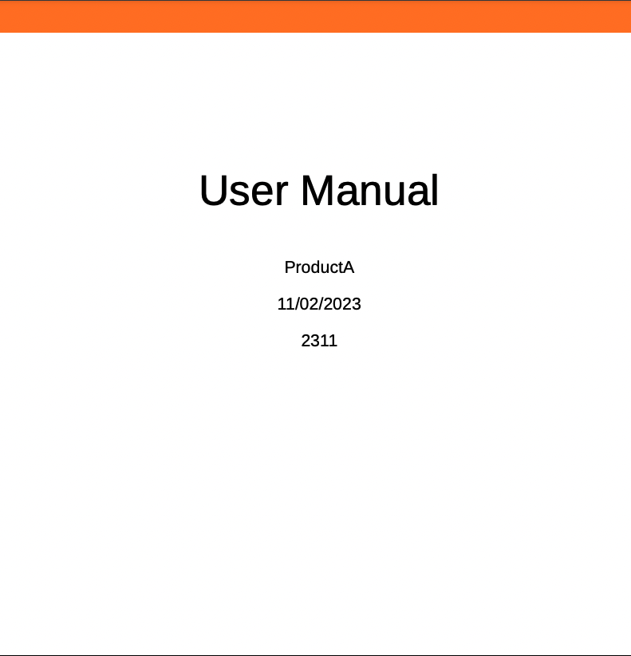

# PDF 출력의 변수

변수는 재사용 가능한 정보 역할을 하는 데이터의 이름-값 쌍입니다. 이렇게 하면 콘텐츠를 휴대하고 쉽게 업데이트할 수 있습니다. 변수나 해당 값을 수정하면 해당 변수나 값의 모든 항목이 업데이트됩니다.

## 새 변수 만들기

변수를 만들려면 다음 단계를 수행하십시오.

{width="800" align="left"}

*변수를 만들고 값을 정의합니다.*

1. 에디터에서 왼쪽 패널로 이동하여 변수를 선택합니다 **** . 이 옵션은 자세히 섹션에서 사용할 수 있습니다.
1. 편집 선택 **** : **변수** 편집기를 엽니다.
변수는 알파벳순으로 나열됩니다.
1. **Name** 열에 변수 이름을 입력하고 **Value** 열에 해당 값을 입력합니다.
   >[!TIP]
   >
   >모든 HTML 콘텐츠를 변수 값으로 사용하여 변수 값을 특정 형식으로 표시할 수 있습니다. 예를 들어 변수 값에 태그을 추가하여 `<b>` Experience Manager 값을 Guides **에서 굵게 표시할**&#x200B;수 있습니다. 저장소 내의 이미지를 값으로 추가할 수도 있습니다.

1. 변수 추가를 선택합니다 **.** 하여 새 변수를 추가합니다. 기존 변수와 이름이 같은 변수는 만들 수 없습니다. 오류가 표시됩니다.

   >[!NOTE]
   >
   >**변수 추가**&#x200B;를 선택하지 않은 경우 에서 변수가 만들어지지 않고 목록에 추가됩니다.

이러한 방식으로 기본값을 사용하여 변수를 만들 수 있습니다. 예:
* 제품 이름: Experience Manager Guides
* 버전 번호: 2300
* 릴리스 날짜: 2023/01/01

### 변수 편집

다음 두 가지 방법으로 변수를 편집할 수 있습니다.

**왼쪽의 변수 패널에서**

1. **변수** 패널에서 변수를 선택합니다.
1. 변수 위로 마우스를 가져가 **옵션** 메뉴를 확인한 다음 **편집** 옵션을 선택하십시오.
1. **변수 편집** 대화 상자에서 선택한 변수의 기본값을 편집할 수 있습니다.
1. **완료**&#x200B;를 선택합니다.

**변수 편집기에서**

1. **변수** 선택 왼쪽 패널의 .
1. **편집** 선택 : **변수** 편집기를 엽니다.

1. **변수** 편집기에서 선택한 변수의 값을 편집할 수 있습니다.

**변수** 편집기에서 변경한 내용을 저장해야 왼쪽의 **변수** 패널에서 볼 수 있습니다.

>[!NOTE]
>
> 변수 값을 편집하면 Adobe Experience Manager Guides은 적용 가능한 모든 참조를 동시에 업데이트합니다.

### 변수 검색 및 미리 보기

변수 값을 검색하고 미리 볼 수 있습니다. **변수** 패널의 검색 상자에 문자열을 입력하십시오. 변수 이름과 해당 값을 기준으로 모두 검색합니다.
다음 두 가지 방법으로 변수를 미리 볼 수 있습니다.

변수 미리보기에는 기본값이 표시됩니다. 예를 들어 ProductName 변수의 기본값을 &quot;Adobe Experience Manager Guides&quot;로 정의한 경우 이 값이 미리보기에 표시됩니다.

**왼쪽의 변수 패널에서**

1. **변수** 패널에서 변수를 선택합니다.
1. 변수 위로 마우스를 가져가 **옵션** 메뉴를 확인한 다음 **미리 보기** 옵션을 선택하십시오.

   변수 패널에서 {width="550" align="left"}

*변수의 기본값을 미리 봅니다.*

**변수 편집기에서**

1. **옵션** 메뉴를 보려면 목록의 변수 위로 마우스를 가져갑니다.
1. **미리 보기**&#x200B;를 선택합니다.

### 변수 복제

변수를 복제하고 요구 사항에 따라 값을 수정할 수 있습니다.

1. **옵션** 메뉴를 보려면 목록의 변수 위로 마우스를 가져갑니다.
1. **복제**&#x200B;를 선택합니다.

변수의 기본 이름은 `<selected variable name>`입니다(&quot;sample&quot; 등). 필요에 따라 이름을 변경할 수 있습니다.

### 변수 삭제

다음 두 가지 방법으로 변수를 삭제할 수 있습니다.

**왼쪽의 변수 패널에서**

1. **변수** 패널에서 변수를 선택합니다.
1. 변수 위로 마우스를 가져가 **옵션** 메뉴를 확인한 다음 **삭제** 옵션을 선택하십시오.

**변수 편집기에서**

1. 목록에서 변수 위로 마우스를 가져가면 [옵션]**메뉴가**&#x200B;표시됩니다.
1. [삭제&#x200B;**] 옵션을 선택합니다**.

변수는 모든 변수 세트에서 삭제됩니다.

## 출력 사전 설정에 대한 변수 세트

Adobe Experience Manager Guides에서는 변수 대체 값을 할당할 수 있는 변수 세트도 지원합니다. 예를 들어, 한 회사는 A와 B 두 가지 상품을 판매할 수 있다. 각각 다른 사양을 가지고 있습니다. 이러한 사양에는 제품 이름, 버전 번호 및 릴리스 날짜가 포함될 수 있습니다. 브랜딩 방식에는 다른 차이점이 있을 수 있습니다. 변수 세트를 사용하여 변수에 대해 다른 값 세트를 정의합니다. 출력을 생성할 때 적절한 변수 집합을 선택하고 필요한 출력을 생성합니다.

### 변수 집합 구성

변수를 추가하기 전에 변수 집합을 구성해야 합니다.

1. **설정** 선택  **변수 집합 구성** 대화 상자를 엽니다.
   {width="550" align="left"}
1. **이름** 열에 변수 집합 이름을 입력하십시오.
1. **변수 추가** 선택 하여 새 변수 집합을 추가합니다. 변수 세트는 알파벳순으로 나열됩니다.
1. **삭제**&#x200B;를 선택하여 변수 집합을 제거할 수 있습니다.

### 변수 집합 작업

모든 변수 집합은 동일한 변수를 가지지만 다른 값을 가질 수 있습니다.

특정 변수 세트의 값을 보고, 편집하고, 미리 볼 수 있습니다. **변수 집합** 드롭다운에서 변수 집합을 선택하십시오. 선택한 변수 세트에 따라 값이 표시됩니다.
특정 변수 세트의 변수 값을 편집하면 기본값이 무시되고 선택한 변수 세트의 값이 변경됩니다.
예를 들어 변수 집합에 대해 *Adobe-set1* 및 *Adobe-set2* 값을 설정할 수 있습니다.

**변수 집합 1**: *Adobe-set1*

* 제품 이름: 제품 A
* 버전 번호: 2311
* 릴리스 날짜: 2023/11/02

**변수 집합 2**: *Adobe-set2*

* 제품 이름: 제품 B
* 버전 번호: 2310
* 릴리스 날짜: 2023/09/07

모든 새 변수는 모든 변수 세트에 추가됩니다. 변수를 삭제하거나 복제하면 모든 변수 세트에 대해 업데이트됩니다.

변수 세트의 값을 미리 볼 수도 있습니다.
예를 들어 변수 집합 *Adobe-Set1*&#x200B;의 경우 ProductName 변수의 값을 &quot;ProductA&quot;로 정의한 다음 변수 편집기의 미리 보기에서 이 값을 표시합니다.

변수 편집기에서 {width="550" align="left"}

*선택한 변수 집합에서 정의한 값을 미리 봅니다.*

### 변수 값 재설정

값을 편집한 경우 변수를 기본값으로 재설정할 수도 있습니다.
재설정 값이 변경된 변수에 대해 이(가) 나타납니다.
예를 들어 ProductName 변수의 값을 기본값 Experience Manager Guides로 재설정할 수 있습니다.

## 기본 PDF 템플릿에서 변수 사용

제품 문서의 출력을 생성하는 동안 변수를 추가하여 휴대하고 쉽게 업데이트할 수 있습니다. 문서의 여러 페이지에 표시되는 페이지 레이아웃 내에 이러한 변수를 삽입할 수 있습니다. 예를 들어 페이지 레이아웃의 머리글 영역(또는 바닥글이나 본문 같은 다른 부분)에 나타나는 변수 ProductName을 추가할 수 있습니다.

헤더 영역에 ProductName과 같은 변수를 삽입하려면 다음 단계를 수행하십시오.
1. 편집에 필요한 페이지 레이아웃을 엽니다.

   >[!NOTE]
   >
   > 사용자 지정 또는 편집을 위한 페이지 레이아웃을 열기 위한 [페이지 레이아웃 사용자 지정](../native-pdf/components-pdf-template.md#customize-a-page-layout-customize-page-layout) 섹션을 봅니다.

1. 변수를 삽입하도록 활성화하려면 헤더를 선택합니다.

1. 다음 두 가지 방법으로 변수를 삽입할 수 있습니다.

   **왼쪽의 변수 패널에서**

   * **변수** 패널에서 변수를 드래그하여 헤더 영역에 놓습니다.

   **도구 모음에서**

   1. **변수/필드 삽입** 선택 
   1. **변수** 대화 상자에서 헤더 영역에 삽입할 변수의 이름을 선택합니다.
   1. 텍스트 상자에 검색 문자열을 입력할 수도 있습니다. 주어진 문자열을 포함하는 변수 이름은 필터링되고 목록에 표시됩니다. 선택한 변수가 헤더 영역에 삽입됩니다. 변수의 기본값을 볼 수 있습니다.
   1. 변수 바꾸려면 변수 값을 두 번 클릭하고 [변수] 대화 상자에서 다른 변수 **** 선택합니다. 변수 값이 바뀝니다.

## 변수가 있는 PDF 출력 생성

다양한 변수의 값을 사용하여 PDF 출력을 생성할 수 있습니다. 레이아웃을 생성하기 전에 출력 사전 설정의 **변수 집합** 드롭다운 목록에서 변수 집합을 선택하여 해당 값을 선택하십시오.

{width="550" align="left"}

*PDF 출력을 생성하는 데 사용할 출력 사전 설정의 드롭다운에서 변수 집합을 선택합니다.*

>[!NOTE]
>
> 드롭다운에서 (기본값)을 선택하여 모든 변수의 기본값을 게시 할 수도 있습니다.

선택한 변수 세트에 따라 변수 세트에 정의된 변수 값에 해당하는 출력이 표시됩니다. 예를 들어, 변수 세트 *Adobe Systems-set1*&#x200B;을 선택하면 출력값에 이 세트에 정의된 변수의 값이 표시됩니다.

*페이지 레이아웃에서 변수를 사용하여 PDF 출력을 생성합니다.*

필요할 때마다 변수 세트의 값을 빠르게 업데이트하고 출력을 재생성할 수도 있습니다. 예를 들어 버전에 대한 세부 정보를 업데이트해야 하는 경우 VersionNumber 변수에서 버전 값을 업데이트하고 출력을 재생성할 수 있습니다.
