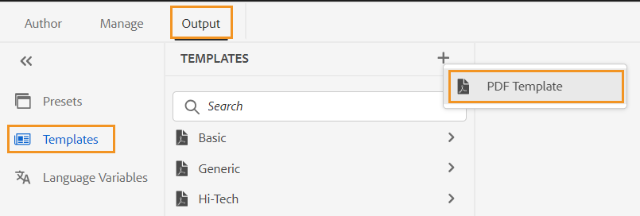

# PDF 템플릿 {#PDF-template}

템플릿을 사용하면 콘텐츠 레이아웃 및 구조의 일관성을 유지할 수 있습니다. 템플릿이 사전 정의되어 있으므로 모든 새 프로젝트 또는 업데이트에 대해 발생하는 서식 지정 문제에 대한 재작업을 방지할 수 있습니다. 템플릿을 사용하면 PDF 레이아웃을 디자인하고, 콘텐츠를 스타일링하고, 다양한 설정을 적용하여 페이지를 사용자 정의할 수 있습니다.

## 팩토리 및 사용자 지정 PDF 템플릿

일부 샘플 팩토리 템플릿이 즉시 제공됩니다. 이 템플릿을 기본 템플릿으로 사용하여 개발자는 조직 요구 사항에 따라 맞춤형 템플릿을 만들 수 있습니다.

## 새 PDF 템플릿 만들기 {#create-pdf-template}

특정 페이지 레이아웃으로 사용자 지정 PDF 템플릿을 만들고 스타일 시트를 사용하여 페이지 레이아웃 구성 요소(예: 목차, 색인, 용어집) 또는 DITA 구성 요소(예: 제목, 단락, 목록)에 대한 서식을 정의할 수 있습니다.

새 PDF 템플릿을 만들려면 다음 단계를 수행하십시오.

1. 웹 편집기에서 **출력** 탭.
1. 선택 **템플릿**  왼쪽 패널에서

   

1. 다음에서 **템플릿** 창에서 **+** 아이콘 옆에 있음 **템플릿** 및 선택 **PDF 템플릿**.
1. 다음에서 **새 PDF 템플릿** 대화 상자에서 사용자 지정 템플릿을 만들기 위한 기반으로 사용할 팩토리 템플릿을 선택합니다. 검색 상자를 사용하여 템플릿을 검색할 수도 있습니다.
1. 템플릿의 제목을 지정합니다.

   >[!NOTE]
   >
   >  템플릿을 만들고 복제하는 동안 템플릿에 대한 썸네일을 미리 볼 수도 있습니다. 다음을 사용하여 썸네일 편집 또는 삭제 [**속성**](#properties-option) 다음에서 **옵션** 템플릿을 만든 후의 메뉴입니다.

1. **만들기**&#x200B;를 클릭합니다.

   새 템플릿이에 만들어지고 추가됩니다. **템플릿** 패널.

## PDF 템플릿 복제 {#duplicate-pdf-template}

기존 템플릿과 동일한 페이지 레이아웃 및 서식을 사용하여 새 템플릿을 만들려면 복사본을 만들 수 있습니다. 템플릿이 복제되면 필요에 따라 해당 구성 요소를 추가로 사용자 정의할 수 있습니다.

기존 PDF 템플릿을 복제하려면 아래 단계를 따르십시오.

1. 웹 편집기에서 **출력** 탭.
1. 선택 **템플릿**  왼쪽 패널에서 이렇게 하면 **템플릿** 창.
1. 복제할 템플릿 위로 마우스를 가져간 후 **...** *옵션* 아이콘 및 선택 **복제** 컨텍스트 메뉴 아래의 제품에서 사용할 수 있습니다.

   이렇게 하면 **중복 PDF 템플릿** 대화 상자.

   

   *복제할 템플릿을 선택하고 썸네일을 미리 본 다음&#x200B;**중복 PDF 템플릿**대화 상자.*

1. 템플릿의 제목을 지정합니다.

   다음 **제목** 필드는 소스 템플릿과 동일한 제목의 사본으로 미리 채워집니다. 동일한 제목의 템플릿이 있는 경우 오류 메시지가 표시됩니다.

1. 기본 제목을 지정하려면 미리 채워진 제목을 제거하고 제목을 지정합니다.
1. 클릭 **복제**.

   중복 템플릿이 만들어지고 아래에 추가됩니다. **템플릿**.

## 템플릿에 대한 기타 작업

템플릿에서 다음 작업을 수행할 수도 있습니다. **옵션** 메뉴:

### 삭제

삭제 옵션을 선택하여 선택한 템플릿을 삭제합니다. 그런 다음 확인 프롬프트에서 예 를 선택합니다.
사전 설정이 **템플릿**.

### 속성{#properties-option}

템플릿의 속성을 보고 편집하려면 이 옵션을 선택합니다. 템플릿에 대한 기존 썸네일을 미리 볼 수 있습니다. 썸네일을 편집하거나 삭제할 수도 있습니다. 템플릿의 제목과 설명을 변경할 수도 있습니다.

### 에셋 UI에서 보기

자산 UI에서 템플릿을 보려면 이 옵션을 선택합니다. 템플릿의 루트 위치를 열면 템플릿의 모든 리소스를 볼 수 있습니다.

사용자 지정 템플릿을 만든 후에는 PDF 출력 사전 설정의 페이지 레이아웃에서 해당 템플릿을 선택할 수 있습니다.

방법 알아보기 [PDF 출력 게시](https://experienceleague.adobe.com/docs/experience-manager-guides-learn/tutorials/user-guide/output-gen/web-editor/native-pdf-web-editor.html?lang=en).

>[!NOTE]
>
>폴더에 폴더 프로필이 구성되어 있으면 폴더 프로필에 구성된 PDF 템플릿만 표시됩니다.

설정에 따라 관리자가 템플릿을 구성할 수 있습니다.

+++ 클라우드 서비스

전역 및 폴더 수준 프로필 설정에 대한 자세한 내용은 [템플릿 구성](../cs-install-guide/conf-folder-level.md#id1889D0IL0Y4) Cloud Service 섹션에 자세히 설명되어 있습니다.

+++

+++ On-premise Software

전역 및 폴더 수준 프로필 설정에 대한 자세한 내용은 [작성 템플릿 구성](../install-guide/conf-folder-level.md#create-custom-authoring-template-id1917d0eg0hj) 섹션에 자세히 설명되어 있습니다.

+++

## PDF 템플릿 사용자 지정 {#customize-pdf-template}

템플릿 구성 요소를 수정하고 스타일시트를 사용하여 스타일 형식을 적용하여 템플릿을 사용자 정의할 수 있습니다.

PDF 템플릿을 사용자 정의하려면 다음 단계를 수행하십시오.

1. 웹 편집기에서 **출력** 탭.
1. 왼쪽 사이드바를 확장하고 을 선택합니다. **템플릿**.

   이렇게 하면 **템플릿** 패널.

1. 템플릿의 구성 요소를 보려면 다음 중 하나를 수행하십시오.

   * 템플릿 옆에 있는 > 아이콘을 선택하거나 템플릿 이름을 두 번 클릭합니다.
   * 템플릿 위로 마우스를 가져간 다음 ... (**옵션** 아이콘) 및 선택 **편집** 컨텍스트 메뉴 아래의 제품에서 사용할 수 있습니다.

   기본적으로 **설정** 템플릿 편집기의 패널.

   

   >[!NOTE]
   >
   >  관리자는 다음 경로에서 최신 템플릿을 다운로드하고 기존 템플릿을 교체할 수 있습니다.
   >
   > `/libs/fmdita/pdf`

   사용자 정의할 수 있는 다양한 템플릿 구성 요소는 다음 섹션 아래에 분류됩니다.

   * 페이지 레이아웃: 일반적인 PDF은 앞 표지 또는 제목 페이지, 목차, 챕터, 색인, 인용 등 다양한 페이지를 포함합니다. 페이지 레이아웃 섹션에서 PDF을 구성하는 다양한 페이지의 디자인을 디자인할 수 있습니다. 자세한 내용은 [페이지 레이아웃](../native-pdf/components-pdf-template.md#page-layouts).

     모양새 외에도 페이지의 머리글, 바닥글 및 컨텐츠 영역과 같은 페이지 요소의 배열을 정의할 수도 있습니다. 페이지 레이아웃 사용자 지정에 대한 자세한 내용은 [페이지 레이아웃 만들기 및 사용자 지정](components-pdf-template.md#create-customize-page-layout).

   * 스타일시트: 스타일시트 섹션의 설정을 사용하여 목차, 색인, 용어집, 인용 등과 같은 페이지 레이아웃 구성 요소의 모양과 느낌을 사용자 지정할 수 있습니다. 제목, 단락, 목록 등과 같은 DITA 컨텐트의 스타일을 사용자 지정할 수도 있습니다. 스타일시트 사용에 대한 자세한 내용은 [스타일시트를 사용하여 PDF 사용자 정의](components-pdf-template.md#stylesheet-customization).
   * 리소스: PDF 템플릿을 사용자 정의하거나 디자인하는 데 필요한 에셋 파일을 저장합니다. 로고, 사용자 지정 글꼴, 배경 이미지 등과 같은 에셋은 리소스에 저장됩니다.
저장소의 다른 위치에 있는 리소스를 사용할 수도 있습니다. 각 템플릿에 대해 중복 리소스를 만들 필요가 없으며, 이러한 리소스를 공유 폴더에 보관하고 모든 기본 PDF 템플릿에서 사용할 수 있습니다.

     리소스 활용에 대한 자세한 내용은 [리소스 사용](components-pdf-template.md#work-with-resources).

   * 설정: 템플릿을 사용하여 PDF을 생성하기 위한 출력 설정을 구성합니다. 이 섹션에서는 PDF의 다양한 페이지에 대한 템플릿 매핑, 챕터 시작 페이지, 인쇄 마커, 인용 등을 정의할 수 있습니다.

   또한 최종 PDF 출력에 표시되어야 하는 순서를 정렬할 수 있습니다.
설정 적용에 대한 자세한 내용은 [고급 PDF 설정](components-pdf-template.md#advanced-pdf-settings).

1. 템플릿 구성 요소를 사용자 정의하려면 템플릿 구성 요소를 두 번 클릭하거나 그 앞에 있는 > 아이콘을 선택합니다.

   예를 들어 를 두 번 클릭합니다 *페이지 레이아웃* 또는 *>* 다음 앞에 아이콘 *페이지 레이아웃* 을 클릭하여 사용 가능한 페이지 레이아웃을 확인합니다.

   >[!NOTE]
   >
   >를 사용하여 템플릿에 대한 썸네일과 설명을 업데이트할 수도 있습니다. [**속성**](#properties-option) 다음에서 **옵션** 메뉴 아래의 제품에서 사용할 수 있습니다.

1. 원하는 대로 변경하고 나면 다음을 선택합니다. *모두 저장* (또는 `Ctrl+S`).
