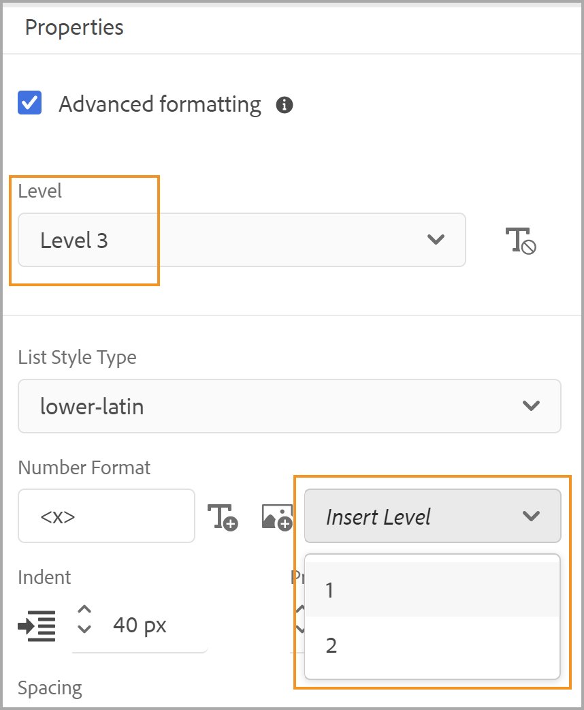

# 일반적인 콘텐츠 스타일 사용 {#work-with-common-styles}

스타일시트에는 PDF 출력에 사용되는 요소의 스타일 정의가 포함되어 있습니다. 샘플 스타일시트로 작업하거나 새 스타일시트를 만들도록 선택할 수 있습니다. 대부분의 경우 OOTB 샘플 스타일시트의 복사본을 만들면 빠르게 시작할 수 있습니다.

스타일 편집기는 사용자 인터페이스 뒤에 있는 CSS 코드의 모든 복잡성을 숨기는 WYSIWYG 편집기입니다. 스타일 편집기를 사용하면 원하는 요소의 스타일을 쉽고 빠르게 사용자 지정할 수 있습니다. 스타일은 다음 헤드로 분류됩니다.

* 제목 스타일
* 단락 스타일
* 문자 스타일
* 하이퍼링크 스타일
* 이미지 스타일
* 목록 스타일
* 표 스타일
* Div 스타일
* 페이지 스타일
* 기타 스타일

구조화된 DITA 컨텐트로 작업할 때 대부분의 DITA 요소에 대한 스타일 매핑이 기본 스타일시트에 배치됩니다. 표준 DITA 요소로 작업하는 경우 스타일 정의를 직접 변경하여 모양과 느낌을 변경할 수 있습니다. 이러한 스타일 정의는 기타 스타일 카테고리에서 사용할 수 있습니다. 자세한 내용은 이 항목의 뒷부분에서 [다른 스타일을 사용하여 작업](#other-styles)을 참조하세요.

다음 단원에서는 가장 일반적으로 사용되는 스타일 설정을 예제 형식으로 다룹니다.

>[!NOTE]
>
>다음 예에서는 제품과 함께 제공된 샘플 스타일시트로 작업한다고 가정합니다.

## 제목 스타일 작업 {#heading-styles}

제목 스타일은 콘텐츠에 사용되는 제목에 대한 모든 기본 스타일을 캡슐화합니다. OOTB 주제/장 및 부록의 제목 제목에 대한 6가지 기본 제목 스타일과 제목 스타일을 얻을 수 있습니다. 구조화된 문서에서 H1은 주제 또는 챕터의 제목을 나타내고 H2부터 H6까지는 주제/챕터 내의 하위 주제 또는 섹션에 사용됩니다. 이 머리글 계층 구조는 해당 머리글이 발견될 때마다 콘텐츠에 자동으로 적용됩니다.

>[!NOTE]
>
>자신만의 사용자 지정 제목 스타일을 만들 수 있으며 이러한 스타일은 outputclass를 사용하여 콘텐츠에 사용할 수 있습니다. 자세한 내용은 [페이지 방향 및 보기 회전 사용](design-page-layout.md#page-orientation-rotation)의 4단계 예제를 참조하십시오.

### 사용자 정의 챕터 수준 머리글 만들기 {#create-chapter-level-heading}

책(또는 북맵)에서는 챕터를 사용하여 작업합니다. 기본 제목 스타일은 사용자 지정 없이 챕터 수준 제목에 적용되는 방식으로 디자인됩니다. 그러나 컨텐츠에 대해 특수 머리글을 만들려면 해당 머리글을 만들어야 합니다. 예를 들어, 기본 `h1.chapter` 머리글이 챕터의 제목에 적용됩니다. 챕터 제목을 다른 스타일로 표시하려면 `h1.chapter` 스타일을 사용자 지정해야 합니다. 마찬가지로 챕터의 하위 머리글에 대한 사용자 지정 스타일을 만들 수 있습니다. 예를 들어 챕터의 모든 2<sup>nd</sup> 및 3<sup>rd</sup> 수준 머리글에 대해 사용자 지정 스타일을 만들려면 `h2.chatper` 및 `h3.chatper`(으)로 새 스타일을 만들어야 합니다.

기본 PDF 게시 기능에는 가장 일반적인 스타일에 대한 기본 스타일 정의가 포함되어 있으므로, 실수로 스타일을 삭제하더라도 기본 스타일이 콘텐츠에 적용됩니다. 예를 들어 스타일시트에 h2 스타일에 대한 스타일 정의가 없는 경우 기본 PDF 게시 기능은 h2 컨텐츠에 일부 기본 스타일을 적용합니다.

이 예제에서는 두 번째 수준의 챕터 제목 스타일을 만듭니다.

1. 편집에 필요한 스타일시트를 엽니다.
   >[!NOTE]
   >
   >사용자 지정 또는 편집할 스타일시트를 열려면 [미리 정의된 스타일이나 새 스타일 사용자 지정](components-pdf-template.md#customize-style) 섹션을 참조하십시오.

1. **스타일** 목록에서 **제목 스타일**&#x200B;을 확장합니다.
1. **제목 스타일** 스타일을 마우스 오른쪽 단추로 클릭하고 **새 스타일**&#x200B;을 선택합니다.
1. *스타일 추가* 대화 상자에서 **태그** 이름을 `h2`(으)로 유지하고 `chapter`클래스&#x200B;**이름 필드에**&#x200B;을(를) 입력합니다.
1. **완료**&#x200B;를 클릭합니다.

제목 스타일 목록 아래에 이름이 `h2.chapter`인 새 제목 스타일이 만들어지고 추가됩니다.

스타일을 만든 후에는 스타일 편집기를 사용하여 스타일에 필요한 속성을 사용자 정의할 수 있습니다.

### 자동 번호 머리글 만들기 {#auto-number-heading}

가장 일반적으로 사용되는 출력 스타일 중 하나는 자동 번호 머리글입니다. 이 제목은 장 번호, 주제 및 하위 주제 번호를 나타냅니다. 자동 번호 제목은 항목 내의 항목 목록에 자동 번호가 지정되는 목록 스타일과 다릅니다.

이 예제에서는 레벨 1부터 레벨 3까지의 머리글을 사용자 정의하여 다른 형식의 자동 번호를 사용합니다.

1. 편집에 필요한 스타일시트를 엽니다.

   >[!NOTE]
   >
   >사용자 지정 또는 편집할 스타일시트를 열려면 [미리 정의된 스타일이나 새 스타일 사용자 지정](components-pdf-template.md#customize-style) 섹션을 참조하십시오.

1. **스타일** 목록에서 **제목 스타일**&#x200B;을 확장합니다.

1. 목록에서 **h1** 스타일을 선택하십시오.
h1 스타일에 대한 속성은 해당 미리 보기와 함께 [속성] 패널에 표시됩니다.

   >[!NOTE]
   >
   >[미리 보기] 패널에서는 요소에 적용하는 모든 스타일 업데이트를 실시간으로 볼 수 있습니다.

1. **일련 번호** 속성을 선택하십시오.

   자동 번호 목록에 적용할 수 있는 스타일은 Autonumber 속성 아래에 표시됩니다.

1. 다음 속성을 설정합니다.
   * **스타일**: 로케일별 또는 일반 번호 매기기 스타일의 넓은 범위에서 선택하십시오. 아랍어-인도어, 데바나가리, 그루지야어, 십진수, 로어-Alpha 등의 스타일을 선택할 수 있습니다. 현재 예제에서는 `upper-alpha`을(를) 선택합니다.

   * **형식**: 기본 형식이 `<x>`(으)로 설정되어 있습니다. 여기서 `x` 값은 Style 속성에서 선택한 번호 매기기 스타일로 대체됩니다. 예를 들어 `decimal` (1) 스타일을 선택한 경우 `x` 값은 `h1` 스타일의 모든 인스턴스에 대해 자동으로 증가하며 2, 3 등으로 이동합니다. 필드에 사용자 정의 텍스트를 추가하여 제목 스타일의 서식을 지정할 수도 있습니다. 예를 들어, 모든 h1 머리글에 `Chapter`이라는 접두어가 붙도록 하려면 이 필드를 `Chapter <x>`(으)로 설정해야 합니다.

   * **문자 삽입**: 형식에 특수 문자를 추가하려면 문자 삽입() 아이콘입니다. 스타일 형식에 추가할 문자를 선택하고 [삽입]을 클릭합니다. 범주 선택 드롭다운 목록에서 선택할 수 있는 다양한 유형의 특수 문자가 있습니다. 예를 들어, [구두점] 범주에서 오른쪽을 가리키는 [큰각 큰따옴표]를 선택합니다.

     


   * **번호 매기기 시작 위치**: 특정 번호에서 번호 매기기를 시작하려면 해당 값을 입력하십시오. 이 예제에서는 기본값을 1로 유지합니다.

   * **들여쓰기**: 머리글을 들여쓰려면 들여쓰기 값을 설정해야 합니다. 이 예제에서는 0픽셀로 설정합니다.

     >[!NOTE]
     >
     >픽셀(픽셀), pt(포인트), rem, em, %(백분율) 또는 인치(인치) 단위로 값을 입력할 수 있습니다.

   * **접두사 너비**: 자동 번호 형식이 사용하는 영역입니다. 선택한 스타일 형식을 쉽게 수용할 수 있는 크기로 자동 설정됩니다. 크기를 늘리려면 기본값을 바꿀 수 있습니다.

     이 값을 수동으로 설정할 때 너비에 영향을 줄 다른 속성을 변경해 보십시오. 예를 들어 글꼴 크기, 접두사(Chapter) 또는 접미사(:)가 있는 형식, *시작 번호 매기기 시작* 속성에서 최대값을 설정하고 다양한 글꼴 속성을 설정하여 최적의 크기를 만들 수 있습니다.

     이 예제에서는 기본값을 유지합니다.

   * **간격**: 가로 및 세로 간격을 지정합니다. 이 예제에서는 기본값을 유지합니다.

     위의 사용자 지정을 사용하여 스타일이 아래와 같이 사용자 지정됩니다.

     

   * **서식 적용**: 일련 번호 범주 아래의 속성을 사용하면 번호 매기기 스타일을 정의하는 데 도움이 됩니다. 번호 매기기 스타일 또는 제목 형식의 내용에 추가 사용자 지정을 적용하려면 이 필드에서 번호 매기기 또는 단락을 선택할 수 있습니다. [번호 매기기]를 선택하면 글꼴, 테두리, 레이아웃 및 기타 범주에 대한 모든 변경 내용이 머리글의 번호 매기기 스타일만 적용됩니다. 그러나 [단락]을 선택하면 번호 매기기 스타일이 아니라 제목 콘텐츠에 변경 내용이 적용됩니다.

   다음 설정을 사용하여 다음 스크린샷에 표시된 출력을 생성합니다.

   | **제목 스타일** | **속성** | **값** | **추가 의견** |
   | :- | :- | :- | :- |
   | h1 | 스타일 | 소수점 | 이러한 속성은 일련 번호 범주 아래에 있습니다. |
   |  | 포맷 | `Capter <x>:` |  |
   |  | 접두사 폭 | 160픽셀 |  |
   |  | 글꼴 > 텍스트 정렬 | 왼쪽 | [서식 적용 대상]이 [번호 매기기]로 설정되어 있는지 확인하십시오 |
   | h2 | 스타일 | 소수점 | 이러한 속성은 일련 번호 범주 아래에 있습니다. |
   |  | 포맷 | `Section <x>:` |  |
   |  | 접두사 폭 | 125픽셀 |  |
   |  | 글꼴 > 텍스트 정렬 | 왼쪽 | [서식 적용 대상]이 [번호 매기기]로 설정되어 있는지 확인하십시오 |
   | h3 | 스타일 | 소수점 | 이러한 속성은 일련 번호 범주 아래에 있습니다. |
   |  | 레벨 삽입 | 2 |  |
   |  | 포맷 | `Section <2>.<x>:` |  |
   |  | 접두사 폭 | 125픽셀 |  |
   |  | 글꼴 > 텍스트 정렬 | 왼쪽 | [서식 적용 대상]이 [번호 매기기]로 설정되어 있는지 확인하십시오 |

   

## 단락 스타일 작업 {#paragraph-style}

단락 스타일을 만들어 전체 단락에 특수 서식을 적용할 수 있습니다. 그러나 의사(pseudo) 클래스를 사용하면 텍스트의 특정 부분에만 스타일을 적용할 수 있습니다. 다음 예제에서는 단락 스타일을 만들어 단락 시작표시문자 스타일을 사용합니다.

### 단락 시작표시문자 스타일 만들기 {#drop-cap-style}

단락 시작표시문자(또는 드롭된 대문자) 스타일은 매거진 및 문학 문서에서 사용할 수 있으며, 문단 또는 섹션의 첫 번째 문자에는 일부 특수 스타일이 지정됩니다. 기본 PDF 게시 기능을 사용하여 동일한 효과를 얻을 수 있습니다.

다음 예제에서는 단락 시작표시문자 스타일을 만듭니다.

1. 편집에 필요한 스타일시트를 엽니다.

   >[!NOTE]
   >
   >사용자 지정 또는 편집할 스타일시트를 열려면 [미리 정의된 스타일이나 새 스타일 사용자 지정](components-pdf-template.md#customize-style) 섹션을 참조하십시오.

1. **스타일** 목록에서 **단락 스타일**&#x200B;을 확장합니다.

1. **단락 스타일**&#x200B;을 마우스 오른쪽 단추로 클릭하고 **새 스타일**&#x200B;을 선택합니다.

1. *스타일 추가* 대화 상자에서 **Tag** 이름을 p로 유지하고 **의사(Pseudo)** **클래스** 필드에서 `::first-letter`을(를) 선택합니다.

1. **완료**&#x200B;를 클릭합니다.

   이름이 `::first-letter`인 새 단락 스타일이 만들어지고 **단락 스타일** 목록에 추가됩니다.

1. p 스타일 아래에서 `::first-letter`을(를) 선택하고 다음 속성을 설정합니다.

   * **글꼴**: 단락의 첫 번째 글자에 대해 원하는 글꼴을 설정합니다. 이 예제에서는 [글꼴 모음]을 [필기선], [글꼴 두께]를 500, [글꼴 크기]를 30pt로 설정하고 글꼴 색상을 선택합니다.

   * **레이아웃**: 단락 시작표시문자 스타일을 기준으로 텍스트의 세로 정렬을 설정합니다. 이 예제에서는 [세로 정렬]을 [아래쪽]으로 설정합니다.

`p` 태그가 DITA의 `<p>` 요소와 매핑되므로 outputclass 특성을 사용하여 이 스타일을 명시적으로 추가할 필요가 없습니다. 콘텐츠에 `<p>` 요소가 사용되는 곳이면 드롭 캡 스타일이 자동으로 적용됩니다. 다음 스크린샷에서는 장 제목, 짧은 설명 및 정의 목록 요소의 형식이 단락 시작표시문자 스타일로 지정되지 않았습니다. 단락 스타일만 단락 시작표시문자 스타일로 서식이 지정됩니다.


## 문자 스타일 사용 {#char-style}

문자 스타일을 사용하여 콘텐츠 내의 문자 또는 단어 서식을 지정할 스타일을 만들 수 있습니다. 예를 들어 인라인 코드 또는 파일 이름에 대한 문자 스타일을 만들거나 선택한 콘텐츠에 여러 스타일 형식을 사용하는 스타일을 만들 수 있습니다.

### 인라인 문자 스타일 만들기 {#inline-char-style}

단락에서 인라인 문자나 단어의 서식을 지정하는 것은 매우 일반적인 스타일입니다. 인라인 스타일을 만드는 프로세스에는 두 가지 작업이 포함됩니다. 먼저 스타일시트에 새 스타일을 만들고 `outputclass` 특성을 사용하여 콘텐츠에 스타일을 적용합니다.

다음 예제에서는 인라인 문자 스타일을 만듭니다.

1. 편집에 필요한 스타일시트를 엽니다.

   >[!NOTE]
   >
   >사용자 지정 또는 편집할 스타일시트를 열려면 [미리 정의된 스타일이나 새 스타일 사용자 지정](components-pdf-template.md#customize-style) 섹션을 참조하십시오.

1. **스타일** 목록에서 **문자 스타일**&#x200B;을 확장합니다.

1. **문자 스타일**&#x200B;을 마우스 오른쪽 단추로 클릭하고 **새 스타일**&#x200B;을 선택합니다.

1. 스타일 추가 대화 상자에서 **Tag** 이름을 span으로 유지하고 `BoldItalic`클래스&#x200B;**이름 필드에**&#x200B;을(를) 입력합니다.

   

1. **완료**&#x200B;를 클릭합니다.

   코드라는 새 문자 스타일이 만들어지고 [문자 스타일] 목록 아래에 추가됩니다.

1. `span.BoldItalic`문자 스타일&#x200B;**목록에서**&#x200B;을(를) 선택하고 다음 속성을 설정합니다.

   * **글꼴**: 이 섹션에서 모든 글꼴 관련 속성을 사용자 지정할 수 있습니다. 기본적으로 제품과 함께 번들로 제공되는 일부 글꼴이 있습니다. 문자 스타일에 대해 원하는 글꼴을 선택할 수 있습니다. 예를 들어 Font Family를 *Serif,*(으)로 설정하고 Font Style 속성에서 *Bold* 및 *Italic*&#x200B;을(를) 선택합니다. 글꼴 두께(굵게, 밝게 등), 텍스트 장식(밑줄, 윗줄 등), 글꼴 크기, 글꼴 색상, 텍스트 정렬 등과 같은 다른 글꼴 속성을 사용자 지정할 수도 있습니다.

     >[!NOTE]
     >
     >템플릿의 리소스 섹션에 저장되어 있는 템플릿에 글꼴을 추가할 수도 있습니다. 글꼴 추가 및 리소스 사용에 대한 자세한 내용은 [리소스 작업](components-pdf-template.md#work-with-resources)을 참조하세요.

   * **레이아웃**: 높이 및 너비, 여백, 패딩, 맞춤 등과 같은 레이아웃 관련 속성을 설정할 수 있습니다.

   * **배경**: 배경 속성을 사용하면 특정 스타일의 배경색 서식을 지정할 수 있습니다. 모든 스타일에 대해 배경색이나 이미지를 정의할 수 있습니다.

인라인 문자 스타일을 만든 후에는 콘텐츠에 해당 스타일을 적용해야 합니다. 인라인 코드 스타일을 적용하려면 소스 보기로 이동하여 원하는 콘텐츠에 `outputclass` 특성을 추가하십시오.

`outputclass="BoldItalic"`

다음 예제에서는 실행 중인 텍스트의 여러 위치에 굵은 기울임꼴 형식을 적용하는 것을 보여 줍니다.


## 목록 스타일 사용자 지정 {#custom-list-style}

목록 스타일에는 순서가 지정된 목록과 순서가 지정되지 않은 목록에 대한 기본 스타일 설정이 포함됩니다. 설명서 요구 사항에 맞게 이러한 목록 스타일을 쉽게 사용자 지정할 수 있습니다.

다음 예제에서는 번호 매기기 또는 순차 목록 스타일을 사용자 지정합니다.

1. 편집에 필요한 스타일시트를 엽니다.

   >[!NOTE]
   >
   >사용자 지정 또는 편집할 스타일시트를 열려면 [미리 정의된 스타일이나 새 스타일 사용자 지정](components-pdf-template.md#customize-style) 섹션을 참조하십시오.

1. **스타일** 목록에서 **목록 스타일**&#x200B;을 확장합니다.

1. 목록에서 **ol** 스타일을 선택하십시오.

   이전 스타일의 속성은 해당 미리 보기와 함께 [속성] 패널에 표시됩니다.

   

1. **고급 서식** 옵션을 선택하십시오.

   확인 메시지가 표시됩니다.

1. **확인** 메시지에서 *예*&#x200B;를 클릭하여 **고급 서식** 속성을 엽니다.

   기본적으로 다음 속성을 사용할 수 있습니다.

   * **수준**: 기본적으로 6개 수준의 번호 매기기 목록이 있습니다. 이 드롭다운에서 선택한 레벨은 선택한 레벨 및 모든 후속 레벨의 스타일 변경 사항을 제어합니다. 예를 들어 레벨 4를 선택하면 적용하는 모든 스타일 변경 사항이 레벨 4, 5 및 6에 설정됩니다.

   * **목록 스타일 형식**: 선택할 수 있는 목록 번호 매기기 스타일이 여러 개 있습니다. 목록에는 번호 매기기 목록을 만드는 데 사용되는 로케일별 및 일반 번호 매기기 스타일이 포함되어 있습니다. 목록 스타일 유형 중 일부는 아랍어, 캄보디아어, 데바나가리, 에티오피아, 한글, 히브리어, 일본어, 한국어, 중국어 간체, 우르두어 등입니다.

   또한 다음 고급 서식 속성을 사용하여 작업할 수 있습니다.

   * **숫자 형식**: 기본 형식이 `<x>`(으)로 설정되어 있습니다. 여기서 `x` 값은 List Style Type 속성에서 선택한 번호 매기기 스타일로 대체됩니다. 예를 들어 `decimal` (1) 스타일을 선택한 경우 `x` 값은 목록 요소의 모든 인스턴스에 대해 자동으로 증가하며 2, 3 등으로 이동합니다. 필드에 사용자 정의 텍스트를 추가하여 목록 스타일의 서식을 지정할 수도 있습니다. 예를 들어 모든 첫 번째 수준 목록 스타일에 접미사 &quot;`)`&quot;을(를) 포함하려면 첫 번째 수준 목록 스타일에 대해 이 필드를 &quot;`<x>)`&quot;(으)로 설정해야 합니다.

   * **문자 삽입**: 숫자 형식으로 특수 문자를 추가하려면 문자 삽입() 아이콘입니다. 스타일 형식에 추가할 문자를 선택하고 [삽입]을 클릭합니다. 범주 선택 드롭다운 목록에서 선택할 수 있는 다양한 유형의 특수 문자가 있습니다.

   * **수준 삽입**: 이전 수준의 숫자를 숫자 형식에 포함할 수 있습니다. 예를 들어 5번째 수준의 숫자 형식을 6번째 수준의 숫자 형식에 포함하려면 [레벨 삽입] 드롭다운 목록에서 5를 선택합니다. 레벨 삽입 드롭다운에는 다음 레벨이 아니라 이전 레벨의 수만 표시됩니다. 예를 들어 레벨 3에 있는 동안 레벨 삽입 목록에는 레벨 1과 2만 표시됩니다.

     

     필요에 따라 목록 값을 표시하도록 숫자 형식을 변경할 수도 있습니다. 예를 들어 수준 3에 대해 중첩된 번호 매기기 스타일을 사용하는 경우 &quot;`<2>.<x>))`&quot;(으)로 서식을 지정할 수 있습니다. 목록 번호 2, 마침표, 목록 번호 3, 대괄호 2개가 차례로 표시됩니다(`2.3))`).

   * **들여쓰기**: 목록을 들여쓰려면 들여쓰기 값을 설정해야 합니다. 들여쓰기의 모든 변경 사항은 [미리보기] 패널에서 검토하고 조정할 수 있습니다.

     >[!NOTE]
     >
     >픽셀(픽셀), pt(포인트), rem, em, %(백분율) 또는 인치(인치) 단위로 값을 입력할 수 있습니다.

   * **접두사 너비**: 숫자 형식이 사용하는 영역입니다. 선택한 형식을 쉽게 수용할 수 있는 크기로 자동 설정됩니다. 크기를 늘리려면 기본값을 바꿀 수 있습니다.

     이 값을 수동으로 설정할 때 너비에 영향을 줄 다른 속성을 변경해 보십시오. 예를 들어 글꼴 크기, 접두어나 접미어가 있는 형식 및 다양한 글꼴 속성을 최적의 크기로 변경합니다.

   * **간격**: 목록 번호 형식과 내용 사이의 가로 간격을 지정합니다. 세로 간격은 두 목록 항목 사이의 간격을 제어합니다.

     다음 스크린샷은 각 수준에 대한 맞춤화된 주문 목록을 보여 줍니다.

     

## 표 스타일 작업 {#table-styles}

스타일시트를 사용하여 *n*&#x200B;개의 테이블 스타일을 디자인할 수 있습니다. 표 스타일을 사용하여 전체 표, 특정 행 또는 열의 모양을 디자인할 수 있습니다. 셀 수준 스타일을 제어하면 매우 프레젠테이션 가능한 스타일을 만들 수 있습니다.

다음 예제에서는 표 스타일을 만드는 방법과 사용자 지정할 수 있는 다양한 표 스타일 옵션을 보여 줍니다.

1. 편집에 필요한 스타일시트를 엽니다.

   >[!NOTE]
   >
   >사용자 지정 또는 편집할 스타일시트를 열려면 [미리 정의된 스타일이나 새 스타일 사용자 지정](components-pdf-template.md#customize-style) 섹션을 참조하십시오.

1. **스타일** 목록에서 **표 스타일**&#x200B;을 마우스 오른쪽 단추로 클릭하고 **새 스타일**&#x200B;을 선택하세요.

1. *스타일 추가* 대화 상자에서 **태그** 이름을 `table`(으)로 유지하고 `double-border`클래스&#x200B;**이름 필드에**&#x200B;을(를) 입력합니다.

1. **완료**&#x200B;를 클릭합니다.

   이름이 `table.double-border`인 새 테이블 스타일이 만들어지고 [테이블 스타일] 목록에 추가됩니다.

1. `table.double-border`표 스타일&#x200B;**목록에서**&#x200B;을(를) 선택하고 다음 속성을 설정합니다.

   * **서식 적용 대상**: 전체 표, 홀수/짝수 행 또는 열, 첫 번째/마지막 행 또는 열에 스타일 서식을 적용하도록 선택할 수 있습니다.

     >[!NOTE]
     >
     >**서식 적용 대상**&#x200B;이 **전체 테이블**(으)로 설정된 경우 **일반** 섹션에서 다음 설정을 사용할 수 있습니다.

   * **텍스트 줄바꿈**: 표 주위에 텍스트를 줄 바꿈하는 방법을 선택하십시오. 이 기능은 테이블이 다른 블록 수준 요소 내에 있고 테이블을 블록 요소의 다른 콘텐츠와 함께 렌더링해야 할 때 유용합니다. 줄바꿈 옵션은 *left* 또는 *right* 정렬되거나 *none*&#x200B;입니다.

   * **테두리 축소**: 표 테두리의 모양을 선택하십시오. 접기를 선택하면 표 셀 사이에 단일 테두리 선만 그려집니다. 그러나 개별 스타일의 경우, 추가 패딩과 함께 각 셀 주위에 테두리가 표시됩니다.

     

   * **테두리 간격**: 이 설정은 [테두리 축소]가 [별도]로 설정된 경우에만 사용할 수 있습니다. 이 설정을 사용하여 셀 테두리 사이의 세로 및 가로 간격을 지정할 수 있습니다.

     

     >[!NOTE]
     >
     >**서식 적용 대상**&#x200B;이 **전체 테이블**(으)로 설정된 경우 **셀** 섹션에서 다음 설정을 사용할 수 있습니다.

   * **패딩**: 표 셀 사이에 패딩을 지정합니다. 위쪽, 아래쪽, 왼쪽 및 오른쪽에 대해 서로 다른 패딩 값을 지정할 수 있습니다.

   * **수직 정렬**: 셀 내용에 대한 수직 정렬을 지정합니다. 사용 가능한 옵션은 [위쪽], [중간] 및 [아래쪽]입니다.

   * **테두리 측면, 스타일, 색, 너비, 반경:** 테두리 관련 속성을 지정합니다. [왼쪽] 또는 [오른쪽]과 같은 특정 측면에만 테두리를 갖도록 선택할 수 있습니다. 테두리 스타일에는 단색, 파선, 이중선 등과 같이 사용할 수 있는 테두리 스타일이 나열됩니다. 색상 팔레트를 사용하여 테두리 색상을 지정합니다. 테두리 너비를 px, pt, rem, em, % 및 단위로 지정할 수 있습니다. 반지름(Radius)은 원형 코너를 만드는 커브를 정의합니다.

   글꼴, 테두리, 레이아웃, 페이지 매김 및 배경 아래의 다른 속성은 이 항목의 다른 예제에서 설명합니다. **서식 적용** 속성에서 선택한 내용에 따라 전체 테이블이나 선택한 행 또는 열에 이러한 값을 적용할 수 있습니다.

   다른 방식으로 형식이 지정된 다른 행이 있는 샘플 표의 미리 보기는 아래에 표시됩니다.

   

## 다른 스타일을 사용하여 작업 {#other-styles}

구조화된(DITA) 컨텐트로 작업하는 경우 거의 모든 DITA 요소에 기본 스타일시트에 스타일 매핑이 있습니다. 예를 들어 `<shortdesc>` 요소의 스타일은 **기타 스타일** > **.shortdesc** 스타일 정의에 정의되어 있습니다. 이러한 스타일은 쉽게 사용자 지정할 수 있으며 구조화된 컨텐츠에서 생성된 PDF 출력에 자동으로 적용됩니다. 즉, 다른 사용자 지정 스타일과 달리 이러한 스타일의 콘텐츠에 `outputclass` 특성을 추가할 필요가 없습니다.

기본적으로 사용할 수 없거나 사용자 지정 요소가 있는 요소에 대해 스타일 정의를 만들려는 경우 스타일시트에서 쉽게 만들 수 있습니다. 구조화된 요소의 이름과 동일한 이름으로 스타일을 만드는 것이 유일한 방법입니다.

다음 예제에서는 새 창의 제목(`wintitle`) 스타일을 만듭니다.

1. 편집에 필요한 스타일시트를 엽니다.

   >[!NOTE]
   >
   >사용자 지정 또는 편집할 스타일시트를 열려면 [미리 정의된 스타일이나 새 스타일 사용자 지정](components-pdf-template.md#customize-style) 섹션을 참조하십시오.

1. **스타일** 목록에서 **기타 스타일**&#x200B;을 확장합니다.

1. **다른 스타일**&#x200B;을 마우스 오른쪽 단추로 클릭하고 **새 스타일**&#x200B;을 선택하세요.

1. *스타일 추가* 대화 상자에서 **Tag** 이름을 *blank*(으)로 유지하고 `wintitle`클래스&#x200B;**이름 필드에**&#x200B;을(를) 입력하십시오.

   `wintitle`은(는) 인식된 DITA 요소 이름이므로 스타일 정의는 자동으로 소스의 `<wintitle>` 요소에 매핑됩니다.

1. **완료**&#x200B;를 클릭합니다.

   이름이 `.wintitle`인 새 스타일이 만들어지고 **다른 스타일** 목록에 추가됩니다.

1. **기타 스타일** 목록에서 .wintitle을 선택하고 필요에 따라 속성을 설정하십시오.

다음 스크린샷에는 &quot;기본 컨트롤&quot; 텍스트에 적용되는 wintitle 스타일이 표시됩니다.


## 단일 페이지 레이아웃에 대해 고유한 스타일 정의

기본 PDF 출력을 게시하는 동안 모든 스타일이 최종 PDF에서 병합되므로 CSS 내의 각 템플릿에 고유한 스타일을 지정해야 합니다.
고유한 CSS 스타일 이름을 사용하여 특정 글꼴과 스타일을 PDF의 다양한 섹션에 적용합니다. 예를 들어 다음 CSS를 사용하여 표지에 대해 원하는 글꼴을 정의할 수 있습니다.

```css
...
[data-page-layout="Front"] * { 
    font-size: 18pt; 
}  
...
```


나머지 문서에서는 `content.css` 또는 `layout.css`의 본문 태그에 지정한 기본 글꼴을 사용합니다. 이렇게 하면 스타일이 병합되지 않고 각 구역이 의도한 디자인을 유지할 수 있습니다. 다른 글꼴 크기를 원하는 경우 특정 스타일을 만듭니다.

예를 들어 다음 스타일을 정의하여 전면 표지 단락에 글꼴 크기 18과 후면 표지 단락에 글꼴 크기 11pt를 정의할 수 있습니다.

```css
[data-page-layout="Front"] p { //For all paragraphs inside Front page
  font-size: 18pt; 
} 
  
[data-page-layout="Back"] p { //For all paragraphs inside Back page
  font-size: 11pt; 
}
```

>[!NOTE]
>
> 앞의 예제에서 &quot;Front&quot; 및 &quot;Back&quot;은 템플릿에서 사용할 수 있는 레이아웃 파일의 샘플 이름입니다.


## 접두사 및 접미사 콘텐츠에 대한 사용자 지정 CSS 스타일 정의

사용자 지정 CSS 스타일을 정의하는 경우 기본 PDF 출력을 생성하는 동안 이 스타일을 먼저 고려합니다.
다음 기본 CSS 스타일은 접두사와 접미사 콘텐츠를 모두 숨깁니다.

```css
...
.prefix-content, .suffix-content{
    display: none;
} 
...
```

`<note>` 요소 내에서 이러한 접두사를 허용하려면 `content.css`에 다음 CSS를 포함하십시오.

```css
...
.prefix-content{
    display: inline !important;
}
...
```

`<note>` 요소는 해당 형식 특성에 해당하는 클래스 prefix-content를 사용하여 추가 `<span>`을(를) 생성합니다. 이 CSS 규칙은 유형 특성이 있는 `.prefix-content` 요소 내의 `<note>` 클래스를 대상으로 하므로 필요에 따라 접두사 콘텐츠를 스타일링하거나 조작할 수 있습니다.

