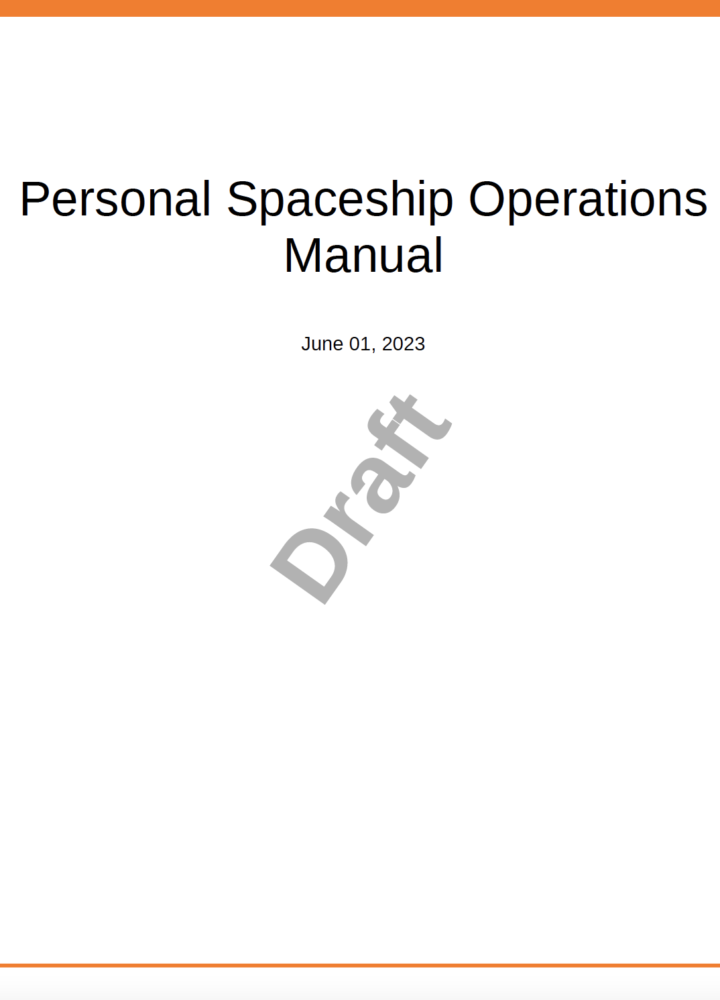

# JavaScript를 사용하여 콘텐츠 또는 스타일 작업

기본 PDF 게시 기능을 사용하면 최종 PDF이 생성되기 전에 JavaScript를 실행하여 콘텐츠에 적용된 콘텐츠 또는 스타일을 조작할 수 있습니다. 이 기능을 사용하면 최종 출력 생성 방법을 완벽하게 제어할 수 있습니다. 예를 들어 다른 PDF에 있는 PDF 출력에 법적 고지 사항 정보를 추가할 수 있습니다. JavaScript를 사용하면 기본 콘텐츠에 대한 PDF이 만들어지고 최종 PDF이 생성되기 전에 법적 고지 사항을 추가할 수 있습니다.\
JavaScript 실행을 지원하기 위해 기본 PDF 게시 기능은 다음과 같은 콜백 함수를 제공합니다.

* `window.pdfLayout.onBeforeCreateTOC(callback)`: 이 콜백 함수는 TOC가 생성되기 전에 실행됩니다.
* `window.pdfLayout.onBeforePagination(callback)`: 이 콜백 함수는 TOC가 생성된 후, PDF에 페이지 나누기가 추가되기 전에 실행됩니다.
* `window.pdfLayout.onAfterPagination(callback)`: 이 콜백 함수는 PDF에 TOC 및 페이지 나누기가 추가된 후에 실행됩니다.

>[!NOTE]
>
>내부적으로 이러한 콜아웃 함수에 대한 실행 시퀀스가 유지됩니다. 먼저 onBeforeCreateTOC를 실행한 후 onBeforePagination을 실행하고 마지막으로 onAfterPagination을 실행합니다.

수행하려는 컨텐츠 또는 스타일 수정 유형에 따라 사용할 콜백 함수를 선택할 수 있습니다. 예를 들어 컨텐츠를 추가하려면 목차가 생성되기 전에 컨텐츠를 추가하는 것이 좋습니다. 마찬가지로, 일부 스타일 업데이트를 수행하려는 경우 페이지 매김 전이나 후에 업데이트를 수행할 수 있습니다.

다음 예제에서는 도형 제목의 위치가 이미지 위쪽에서 이미지 아래쪽으로 변경됩니다. 이를 위해서는 사전 설정에서 JavaScript 실행 옵션을 활성화해야 합니다. 이렇게 하려면 다음 단계를 수행하십시오.

1. 편집할 사전 설정을 엽니다.
1. 로 이동 **고급** 탭.
1. 다음 항목 선택 **JavaScript 활성화** 옵션을 선택합니다.
1. 사전 설정을 저장하고 닫습니다.

그런 다음 다음 다음 코드를 사용하여 JavaScript 파일을 만들고 템플릿의 Resources 폴더에 저장합니다.

```css
...
/*
* DITA only allows the figure title to be placed above images 
* This JavaScript code is used to move the figure title below the image
* */
window.addEventListener('DOMContentLoaded', function () {
    window.pdfLayout.onBeforeCreateTOC(function() {
        var titleNodes = document.querySelectorAll('.fig > .title')
        for (var i = 0; i < titleNodes.length; i++) {
            var titleNode = titleNodes[i]
            var figNode = titleNode.parentNode
            var imageNode = figNode.querySelector('.image')
            if(imageNode && imageNode.parentNode !== figNode) {
              imageNode = imageNode.parentNode
            }
            if (figNode && imageNode && imageNode.parentNode === figNode) {
                figNode.insertBefore(imageNode, titleNode)
            }
        }
    })
});
...
```

>[!NOTE]
>
>다음 `window.addEventListener('DOMContentLoaded', function ()` 콜백 함수를 사용하려면 먼저 함수를 호출해야 합니다.

그런 다음 PDF 출력을 생성하는 데 사용되는 템플릿 파일에서 이 스크립트를 호출해야 합니다. 이 예제에서는 TOC 템플릿에 추가합니다. 다음을 확인합니다. `<script>` 태그가 사전 정의된 내에 추가됩니다 `<div>` 태그 내 `<body>` 태그에 가깝게 배치하십시오. 에 추가하는 경우 `<head>` 태그 또는 `<body>` 태그를 지정하면 스크립트가 실행되지 않습니다.


이 코드를 사용하여 출력이 생성되면 템플릿에 이미지 아래의 그림 제목이 표시됩니다.


## 초안 문서의 PDF 출력에 워터마크 추가 {#watermark-draft-document}

JavaScript를 사용하여 조건부 워터마크를 추가할 수도 있습니다. 이러한 워터마크는 정의된 조건이 충족되면 문서에 추가됩니다.\
예를 들어 다음 코드를 사용하여 JavaScript 파일을 만들어 아직 승인되지 않은 문서의 PDF 출력에 대한 워터마크를 만들 수 있습니다. &#39;승인됨&#39; 문서 상태의 문서에 대한 PDF을 생성하는 경우에는 이 워터마크가 표시되지 않습니다.

```css
...
/*
* This file can be used to add a watermark to the PDF output
* */

window.addEventListener('DOMContentLoaded', function () {
    var watermark = 'Draft'
    var metaTag = document.getElementsByTagName('meta')
    css = "@page {\n  @left-middle {\n    content: \"".concat(watermark, "\";\n    z-index: 100;\n    font-family: sans-serif;\n    font-size: 80pt;\n    font-weight: bold;\n    color: gray(0, 0.3);\n    text-align: center;\n    transform: rotate(-54.7deg);\n    position: absolute;\n    left: 0;\n    top: 0;\n    width: 100%;\n    height: 100%;\n  }\n}")
    head = document.head || document.getElementsByTagName('head')[0], style = document.createElement('style');
    style.appendChild(document.createTextNode(css));
    window.pdfLayout.onBeforePagination(function () {
        for (let i = 0; i < metaTag.length; i++) {
            if (metaTag[i].getAttribute('name') === 'docstate' && metaTag[i].getAttribute('value') !== 'Approved') {
                head.appendChild(style);
            }
        }
    })
});
...
```

이 코드를 사용하여 생성된 PDF 출력은 워터마크를 표시합니다 *초안* 문서의 표지에서:


