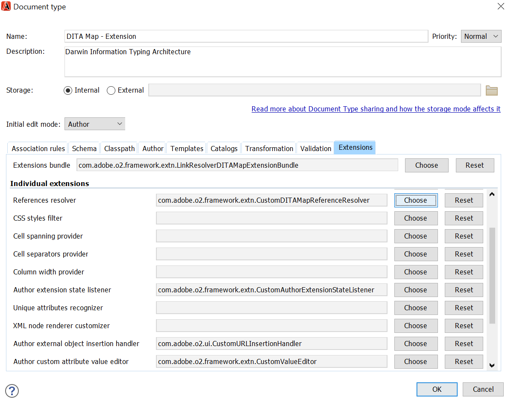
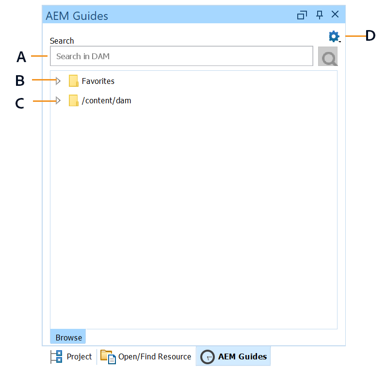

# Adobe Experience Manager Guides용 산소 플러그인 {#id1645H6010Q5}

Adobe Experience Manager Guides용 산소 플러그인 \(나중에 안내서에서 AEM Guides용 산소 플러그인이라고 함)을 사용하면 Oxygen XML 작성자를 Adobe Experience Manager \(AEM\) 저장소와 연결하여 콘텐츠를 작성 및 관리할 수 있습니다. 플러그인을 사용하여 파일을 검색 및 열고, 파일을 체크 아웃하고, 체크 인하고, AEM 저장소에 폴더 및 파일을 업로드할 수 있습니다. 데스크탑 애플리케이션의 AEM Guides 패널에서 원하는 폴더 \(AEM 저장소에서\)를 즐겨찾기 폴더 목록에 표시하여 빠르게 액세스할 수 있습니다. 또한 AEM 웹 인터페이스에서 패키지를 설치하고 AEM 웹 인터페이스에서 직접 Oxygen XML Author에서 DITA 파일을 열 수 있습니다.

## 다운로드 및 설치 {#id1826M0L0PUI}

AEM Guides용 산소 플러그인은 Adobe 소프트웨어 배포 포털을 통해 사용할 수 있습니다. Experience Manager 탭에서 &quot;산소&quot;를 검색한 다음 [Adobe 소프트웨어 배포 포털](https://experience.adobe.com/#/downloads/content/software-distribution/en/general.html)에서 플러그인 설치 관리자를 다운로드합니다.

>[!NOTE]
>
>특정 Adobe Experience Manager Guides의 릴리스 정보에서 Oxygen Connector 버전 호환성을 확인합니다.

설치 관리자가 있으면 Oxygen XML Author가 설치된 로컬 컴퓨터에 설치합니다. 설치 프로세스를 시작하기 전에 시스템이 AEM Guides용 산소 플러그인을 설치하기 위한 기술 요구 사항을 충족하는지 확인해야 합니다.

### 기술 요구 사항

- Oxygen XML Author 버전 26.1

- Adobe Experience Manager Guides 버전 4.6 이상

- Adobe Experience Manager 버전 6.5(서비스 팩 21, 20 및 19 포함)

- Oxygen XML Author 버전 26.1에서 지원하는 운영 체제

- Java 개발 키트
   - Oracle SE 8 JRE 1.8

### Windows에 플러그인 설치

>[!IMPORTANT]
>
>시스템에 이전 버전의 플러그인이 설치되어 있는 경우 설치 프로세스를 시작하기 전에 해당 플러그인을 제거해야 합니다. 제거 지침은 [패키지를 사용하여 작업하는 방법](https://helpx.adobe.com/experience-manager/6-4/sites/administering/using/package-manager.html) 문서의 **패키지 제거** 섹션을 참조하십시오.

Oxygen XML 작성자가 설치된 시스템에서 다음 단계를 수행합니다.

1. 설치 관리자의 `.exe` 파일을 시작합니다.

   설치 마법사의 시작 화면이 나타납니다.

1. **다음**&#x200B;을 클릭하고 Oxygen XML 작성자의 .exe 파일을 사용할 수 있는 위치를 찾습니다.

1. 파일을 선택하고 **열기**&#x200B;를 클릭합니다.

   선택한 파일의 위치가 설치 마법사에 추가됩니다.

1. **다음**&#x200B;을 클릭합니다.

1. **설치**&#x200B;를 클릭합니다.

1. 설치 마법사를 닫으려면 **마침**&#x200B;을 클릭하십시오.
1. Oxygen XML 작성자를 시작합니다.

   AEM Guides 패널이 Oxygen XML 작성자에 표시됩니다.

   {width="800" align="left"}

   >[!NOTE]
   >
   >AEM Guides 패널이 표시되지 않는 경우 문제 해결 섹션에서 해결 방법을 참조하십시오—[AEM Guides 패널 누락](#id192BH200ZAX).


### Mac에 플러그인 설치

>[!IMPORTANT]
>
>시스템에 이전 버전의 플러그인이 설치되어 있는 경우 설치 프로세스를 시작하기 전에 해당 플러그인을 제거해야 합니다. [패키지를 사용하여 작업하는 방법](https://helpx.adobe.com/experience-manager/6-4/sites/administering/using/package-manager.html) 문서 제거 지침의 **패키지 제거** 섹션을 참조하십시오.

Oxygen XML 작성자가 설치된 시스템에서 다음 단계를 수행합니다.

1. 시스템에서 플러그인의 .dmg 파일을 찾습니다.

1. .dmg 파일을 두 번 클릭하여 파일 내용을 엽니다.

   .dmg 파일에는 aem-connector-x.x 폴더와 aem-connector-x.x-setup 파일이 포함되어 있습니다.

   >[!NOTE]
   >
   >파일 이름의 x.x는 플러그인의 버전 번호입니다.

1. Oxygen XML Author의 plugins 폴더에서 aem-connector-x.x 폴더를 복사합니다.
1. aem-connector-x.x-setup 파일을 두 번 클릭하여 설치 관리자를 실행합니다.

1. Oxygen XML 작성자를 시작합니다.

   AEM Guides 패널이 Oxygen XML 작성자에 표시됩니다.

    {width="800" align="left"}

   >[!NOTE]
   >
   >AEM Guides 패널이 표시되지 않는 경우 문제 해결 섹션에서 해결 방법을 참조하십시오—[AEM Guides 패널 누락](#id192BH200ZAX).


### AEM 웹 인터페이스에서 문서 편집 기능을 활성화하는 패키지 설치 {#id182CE0Q0TY4}

작성자는 AEM 웹 인터페이스에서 직접 Oxygen XML Author의 DITA 맵 또는 주제를 열고 편집할 수 있습니다. AEM 웹 인터페이스에서 이 기능을 활성화하려면 AEM 관리자가 AEM 작성 인스턴스에 패키지를 설치해야 합니다.

AEM 관리자는 다음 단계를 수행하여 패키지를 설치합니다.

1. IT 팀에서 패키지의 .zip 파일을 가져옵니다.
1. AEM 인스턴스 *\(관리자\)*&#x200B;에 로그인하고 CRX 패키지 관리자로 이동합니다. 패키지 관리자에 액세스하기 위한 기본 URL은 입니다.

   `http://<server name>:<port>/crx/packmgr/index.jsp`

   패키지 관리자는 로컬 AEM 설치에서 패키지를 관리합니다. 패키지 관리자 작업에 대한 자세한 내용은 AEM 설명서에서 [패키지 작업 방법](https://experienceleague.adobe.com/docs/experience-manager-cloud-service/content/implementing/developer-tools/package-manager.html?lang=en)을 참조하십시오.

    {width="650" align="left"}

1. Oxygen 패키지를 업로드하려면 **패키지 업로드**&#x200B;를 클릭하세요.
1. 패키지 업로드 대화 상자에서 1단계에서 다운로드한 Oxygen 패키지 파일로 이동한 다음 확인을 클릭합니다.

   패키지가 AEM 인스턴스에 업로드됩니다.

1. 설치 프로세스를 시작하려면 **설치**&#x200B;를 클릭하십시오.

   {width="650" align="left"}

1. 패키지 설치 대화 상자에서 **설치**&#x200B;를 클릭합니다.
1. 설치가 완료되면 CRX 패키지 관리자의 왼쪽 상단 모서리에 있는 홈 버튼을 클릭합니다.
1. 에셋 폴더에서 DITA 파일을 선택합니다.

   도구 모음에서 **산소에서 편집** 옵션을 사용할 수 있습니다. 이 옵션을 사용하는 방법에 대한 자세한 내용은 [AEM 웹 인터페이스에서 Oxygen XML 작성자의 DITA 항목 열기](#id182CE0I905Z)를 참조하십시오.

   >[!NOTE]
   >
   >DITA 항목을 하나 선택하면 **산소에서 편집** 옵션이 표시됩니다. 여러 항목을 선택하는 경우 옵션이 표시되지 않습니다.


## AEM Guides용 산소 플러그인 구성 {#id1826KF00AHS}

플러그인을 다운로드하여 설치한 후에는 플러그인으로 작동하도록 다음을 구성해야 합니다.

- **웹 인증 설정**: AEM Guides용 플러그 인에서 SSO 인증을 위한 설정입니다.
- **일반 설정**: AEM 서버 URL, 로그인 세부 정보 등과 같은 플러그 인에 대한 연결 설정입니다.
- **상호 참조에서 특성 사용자 지정 및 파일 이름을 프로파일링하는 기본 설정**: 이 구성은 설명서 세트의 프로파일링 특성 구성표에 필요합니다.

### 웹 인증 설정

JxBrowser는 Oxygen 커넥터 플러그인의 SSO 인증에 사용됩니다. Chromium 기반 브라우저입니다. Java 9 이상에서 비공개 API에 액세스해야 하며 사용자는 이 액세스 권한을 JxBrowser에 명시적으로 부여해야 합니다. 자세한 내용은 [JxBrowser 문제 해결](https://jxbrowser-support.teamdev.com/docs/guides/troubleshooting/issues.html)을 참조하세요.

지정된 파일을 업데이트하여 AEM Guides용 Oxygen Plugin에서 웹 인증 설정을 구성합니다.

>[!NOTE]
>
>업데이트하기 전에 파일을 백업하십시오.

**Mac 및 Oxygen 26.1용**

env.sh에 다음 줄 추가

```java
--illegal-access=permit\
--add-opens=java.desktop/javax.swing.plaf.basic=ALL-UNNAMED\
--add-exports=javafx.controls/com.sun.javafx.scene.control=ALL-UNNAMED\
--add-exports=javafx.graphics/com.sun.javafx.stage=ALL-UNNAMED\
--add-exports=javafx.graphics/com.sun.javafx.scene=ALL-UNNAMED\
--add-exports=javafx.graphics/com.sun.javafx.scene.traversal=ALL-UNNAMED\
--add-exports=javafx.graphics/com.sun.javafx.tk=ALL-UNNAMED\
--add-exports=javafx.graphics/com.sun.glass.ui=ALL-UNNAMED\
--add-opens=javafx.graphics/com.sun.glass.ui=ALL-UNNAMED\
--add-opens=javafx.graphics/javafx.stage=ALL-UNNAMED\
--add-opens=javafx.graphics/com.sun.javafx.tk.quantum=ALL-UNNAMED\
--add-exports=java.desktop/sun.awt=ALL-UNNAMED\
--add-opens javafx.swing/javafx.embed.swing=ALL-UNNAMED
```

oxygenAuthor.sh에 다음 줄을 추가합니다

```java
-Djdk.module.illegalAccess=permit\-Djava.ipc.external=true\
```

**Windows 및 Oxygen 26.1용**

env.bat에 다음 줄 추가

```java
--illegal-access=permit --add-opens=java.desktop/javax.swing.plaf.basic=ALL-UNNAMED --add-exports=javafx.controls/com.sun.javafx.scene.control=ALL-UNNAMED --add-exports=javafx.graphics/com.sun.javafx.stage=ALL-UNNAMED --add-exports=javafx.graphics/com.sun.javafx.scene=ALL-UNNAMED --add-exports=javafx.graphics/com.sun.javafx.scene.traversal=ALL-UNNAMED --add-exports=javafx.graphics/com.sun.javafx.tk=ALL-UNNAMED --add-exports=javafx.graphics/com.sun.glass.ui=ALL-UNNAMED --add-opens=javafx.graphics/com.sun.glass.ui=ALL-UNNAMED --add-opens=javafx.graphics/javafx.stage=ALL-UNNAMED --add-opens=javafx.graphics/com.sun.javafx.tk.quantum=ALL-UNNAMED --add-exports=java.desktop/sun.awt=ALL-UNNAMED --add-opens javafx.swing/javafx.embed.swing=ALL-UNNAMED
```

oxygenAuthor.bat에 다음 줄을 추가합니다.

```java
-Djdk.module.illegalAccess=permit -Djava.ipc.external=true
```

>[!NOTE]
>
>관리자는 Mac의 경우 oxygenAuthor.sh에서, Windows의 경우 oxygenAuthor.bat에서 산소를 실행해야 합니다.

### 일반 설정

Adobe Experience Manager Guides용 산소 플러그인의 연결 설정을 구성하려면 다음 단계를 수행하십시오.

1. AEM Guides 패널에서 설정 아이콘을 클릭한 다음 **설정**&#x200B;을 선택합니다.

   {width="800" align="left"}

1. 다음 세부 정보를 지정합니다.
   - **서버 URL**: AEM 서버의 URL(예:

     ```http
     http[s]://<host>:<port>
     ```

     위의 URL에서 AEM 서버가 배포된 서버의 호스트 이름과 포트를 지정합니다.

     >[!IMPORTANT]
     >
     >AEM 서버가 포트 80 또는 443에 배포된 경우 URL에 지정할 필요가 없습니다.

   - **인증:** **기본 \(사용자 이름/암호\)** 또는 **웹 인증** 중에서 선택하십시오. **기본** 인증을 선택하는 경우 [환경 설정] 대화 상자에 **사용자 이름** 및 **암호**&#x200B;를 입력해야 합니다.

     웹 인증을 선택하면 AEM 로그인 화면이 표시됩니다. 로그인 자격 증명을 입력하고 **로그인** 단추를 클릭합니다. 로그인에 성공하면 AEM 로그인 화면이 닫히고 AEM Guides 패널에 AEM 서버의 파일 목록이 표시됩니다.

   - **연결 시간 초과**: 클라이언트가 AEM 서버의 응답을 기다리는 시간(초)을 지정합니다. 지정된 시간 내에 서버의 응답을 받지 못한 경우 요청이 종료됩니다. 기본값은 20초입니다.

   - **로컬 폴더**: 체크 아웃 후 AEM 저장소의 파일이 저장되는 로컬 컴퓨터의 위치입니다. 드라이브에 존재하지 않는 위치를 지정하면 플러그인이 해당 위치를 만듭니다.
   - **체크 아웃할 때 파일 열기**: 선택한 경우 체크 아웃 시 파일을 엽니다.
   - **체크 인할 때 파일 닫기**: 선택한 경우 체크 인할 때 파일을 닫습니다. 파일을 닫기 전에 버전 설명을 지정할 수 있는 팝업이 표시됩니다.
   - **파일을 닫을 때 체크 인 대화 상자 표시**: 선택하면 파일을 닫을 때 팝업이 표시됩니다. 팝업에서 파일을 체크 인하거나 체크 인하지 않고 파일을 닫을 수 있습니다.
   - **열었을 때 자동 체크 아웃 파일**: 선택한 경우 파일을 두 번 클릭하면 자동으로 체크 아웃되고 편집을 위해 열립니다. 파일이 이미 체크 아웃된 경우 편집을 위해 열기만 하면 됩니다. 이 옵션을 선택하지 않으면 잠금이 없는 파일을 열면 읽기 전용 모드로 열립니다.
1. **확인**&#x200B;을 클릭합니다.

### 상호 참조에서 속성 사용자 정의 및 파일 이름을 프로파일링하는 기본 설정 {#id1827K0D0OHT}

AEM 저장소의 DITA 주제와 연관된 프로파일링 속성을 사용하려면 Oxygen XML Author에서 기본설정을 구성해야 합니다. 상호 참조에서 GUID 대신 파일 이름을 표시하도록 환경 설정을 구성해야 합니다.

프로파일링 속성 및 상호 참조를 구성하려면 다음 단계를 수행하십시오.

1. Oxygen XML 작성자에서 **옵션** \> **기본 설정**&#x200B;을 클릭합니다.
1. **문서 유형 연결** 탭에서 **DITA**&#x200B;을(를) 선택한 다음 **확장**&#x200B;을 클릭합니다.

   {width="650" align="left"}

1. **Classpath** 탭의 **ID가 있는 플러그 인에서 상위 클래스 로더 사용** 드롭다운에서 `com.adobe.o2.connector`을(를) 선택합니다.

   {width="650" align="left"}

1. **확장** 탭에서 다음과 같이 변경합니다.

   - **확장 번들** 옆에 있는 **선택**&#x200B;을 클릭하고 다음을 선택합니다.   **클래스** 목록의 `LinkResolverExtensionBundle - com.adobe.o2.framework.extn` **확인**&#x200B;을 클릭합니다.

      {width="650" align="left"}
   - **개별 확장**&#x200B;에서 **작성자 확장 상태 수신기** 옆에 있는 **선택**&#x200B;을 클릭하고 **클래스** 목록에서 `CustomAuthorExtensionStateListener - com.adobe.o2.framework.extn`을(를) 선택합니다. **확인**&#x200B;을 클릭합니다.
   - **개별 확장**&#x200B;에서 **작성자 사용자 지정 특성 값 편집기** 옆에 있는 **선택**&#x200B;을 클릭하고 **클래스** 목록에서 `CustomValueEditor - com.adobe.o2.framework.extn`을(를) 선택합니다. **확인**&#x200B;을 클릭합니다.
   - **개별 확장**&#x200B;에서 **작성자 외부 개체 삽입 처리기** 옆에 있는 **선택**&#x200B;을 클릭하고 **클래스** 목록에서 `CustomURLInsertionHandler - com.adobe.o2.ui `을(를) 선택합니다. **확인**&#x200B;을 클릭합니다.


   다음 스크린샷은 DITA 주제에 대해 구성된 **확장** 탭을 보여 줍니다.
   
1. 모든 대화 상자에서 **확인**&#x200B;을 클릭하여 변경 내용을 저장합니다.

### DITA 맵 확장 구성

AEM 웹 인터페이스에서 직접 Oxygen XML 작성자의 맵 파일을 열 수 있도록 하려면 DITA 맵 확장 구성이 필요합니다. 이러한 구성은 이전 절차에서 수행한 프로파일링 속성에 대한 구성과 유사합니다.

DITA 맵 확장을 구성하려면 다음 단계를 수행하십시오.

1. Oxygen XML 작성자에서 **옵션** \> **기본 설정**&#x200B;을 클릭합니다.
1. **문서 유형 연결** 탭에서 **DITA 맵**&#x200B;을 선택한 다음 **확장**&#x200B;을 클릭합니다.
1. **Classpath** 탭의 **ID가 있는 플러그인의 상위 클래스 로더 사용** 드롭다운에서 com.adobe.o2.connector를 선택합니다.
1. **확장** 탭에서 다음과 같이 변경합니다.
   - **확장 번들** 옆에 있는 **선택**&#x200B;을 클릭하고 다음을 선택합니다.   **클래스** 목록의 `com.adobe.o2.framework.extn.LinkResolverDITAMapExtensionBundle` **확인**&#x200B;을 클릭합니다.

   - **개별 확장**&#x200B;에서 **작성자 확장 상태 수신기** 옆에 있는 **선택**&#x200B;을 클릭하고 **클래스** 목록에서 `CustomDITAMapAuthorExtensionStateListener - com.adobe.o2.framework.extn`을(를) 선택합니다. **확인**&#x200B;을 클릭합니다.

   - **개별 확장**&#x200B;에서 **작성자 외부 개체 삽입 처리기** 옆에 있는 **선택**&#x200B;을 클릭하고 **클래스** 목록에서 `CustomURLInsertionHandler - com.adobe.o2.ui `을(를) 선택합니다. **확인**&#x200B;을 클릭합니다.

   - **개별 확장**&#x200B;에서 **작성자 사용자 지정 특성 값 편집기** 옆에 있는 **선택**&#x200B;을 클릭하고 **클래스** 목록에서 `CustomValueEditor - com.adobe.o2.framework.extn`을(를) 선택합니다. **확인**&#x200B;을 클릭합니다.

   - **개별 확장** 아래의 **참조 확인자** 옆에 있는 **선택**&#x200B;을 클릭하고 **클래스** 목록에서 `CustomDITAMapReferenceResolver - com.adobe.o2`을(를) 선택합니다. **확인**&#x200B;을 클릭합니다.
   - *\(선택 사항\)* 맵 파일을 여는 동안 참조를 확인하지 않으려면 다음 추가 구성을 수행해야 합니다.

   다음 스크린샷은 구성된 **확장** 탭을 보여 줍니다.
   

1. 모든 대화 상자에서 **확인**&#x200B;을 클릭하여 변경 내용을 저장합니다.

## AEM Guides용 Oxygen 플러그인 사용 {#id1826JG00WY4}

### AEM Guides 패널

다음 화면은 AEM Guides 패널을 보여 줍니다.

{width="550" align="left"}

**A**\)는 검색 창을 표시합니다.

**B**\)이 즐겨찾기 폴더를 표시합니다. 기본적으로 비어 있습니다. AEM 저장소의 폴더를 즐겨찾기로 추가할 수 있습니다. 그러면 즐겨찾기 폴더가 여기에 표시됩니다.

**C**\) DAM 폴더에 AEM 저장소가 표시됩니다. 폴더 보기를 확장하거나 축소할 수 있습니다.

**D**\) 다음 옵션이 있는 설정 \(톱니바퀴\) 아이콘:

- **연결**: AEM 서버에 연결하려면 이 옵션을 선택하십시오. Oxygen XML 작성자가 AEM 서버에 연결되어 있으면 옵션이 비활성화됩니다.
- **새로 고침**: AEM 저장소에서 파일 및 폴더의 최신 상태를 가져오려면 이 옵션을 선택하십시오.

  >[!NOTE]
  >
  >파일을 새로 고치기 전에 파일을 저장해야 합니다. **새로 고침** 옵션을 선택하면 파일을 새로 고치기 전에 저장하라는 경고가 표시됩니다. 파일을 저장하지 않은 경우 **취소**&#x200B;를 클릭하여 저장할 수 있습니다.

- **설정**: 이 옵션을 사용하여 플러그 인의 일반 환경 설정 대화 상자를 열 수 있습니다.
- **로그아웃**: AEM 서버 연결을 닫으려면 이 옵션을 선택하십시오. 이 옵션은 웹 인증 모드를 사용하는 경우에만 사용할 수 있습니다.

### 상황에 맞는 메뉴 기능

AEM 저장소의 폴더 또는 파일을 마우스 오른쪽 버튼으로 클릭하면 AEM Guides용 산소 플러그인의 기능이 제공됩니다. 폴더에 사용할 수 있는 기능이 파일과 다릅니다. 다음은 AEM Guides 상황에 맞는 메뉴에 대한 산소 플러그인의 전체 함수 목록입니다.

- **열기**: 선택한 파일을 열거나 선택한 폴더를 확장합니다.
- **다음에서 열기**: AEM Guides의 웹 편집기나 맵 대시보드 또는 맵 편집기에서 선택한 파일을 열 수 있습니다. 이러한 옵션에 대한 자세한 내용은 [AEM Guides 편집기에서 파일 열기](#id195GH0V30KX)를 참조하십시오.
- **체크 아웃**: AEM 저장소에서 파일을 체크 아웃합니다. 자세한 내용은 [파일 체크 아웃](#id195HC020TS4)을 참조하세요.
- **종속 항목으로 체크 아웃**: 직접 참조가 있는 파일을 체크 아웃합니다. 자세한 내용은 [파일 체크 아웃](#id195HC020TS4)을 참조하세요.
- **읽기 전용 종속 항목으로 체크 아웃**: 선택한 파일을 해당 종속 항목과 함께 체크 아웃합니다. 종속 파일은 변경할 수 없습니다. 자세한 내용은 [파일 체크 아웃](#id195HC020TS4)을 참조하세요.
- **체크 아웃 취소**: 체크 아웃된 파일을 취소하고, 편집기에서 파일을 닫고, 변경 내용을 서버에 저장된 파일의 마지막 버전으로 되돌립니다.
- **새로 고침**: 파일의 경우 AEM 저장소에서 파일의 최신 복사본을 가져옵니다. 폴더의 경우 폴더 구조 및 파일 상태를 가져옵니다. 즉, 가 추가된 다음 AEM Guides 보기에 표시됩니다. 또한 AEM 서버에서 파일을 체크 아웃한 경우 Oxygen Author에서 새로 고침을 수행하면 파일이 체크 아웃된 것으로 표시됩니다. 그러나 AEM Guides에서 *체크 아웃된 파일* 보기의 파일 목록은 업데이트되지 않습니다.
- **체크 아웃된 파일 새로 고침**: *AEM Guides에서 체크 아웃된 파일* 보기에서 체크 아웃된 파일 목록을 새로 고칩니다. AEM 서버에서 파일을 체크 아웃한 경우 새로 고침을 수행하면 *AEM Guides에서 체크 아웃된 파일* 보기에서 체크 아웃된 파일 목록이 업데이트됩니다. 그러나 새 파일이 추가되었거나 파일 상태가 변경된 경우에는 AEM Guides 트리 보기에서 업데이트되지 않습니다. AEM에서 파일의 상태를 업데이트하려면 새로 고침을 수행해야 합니다.
- **체크 인**: 체크 아웃한 파일을 체크 인합니다. 자세한 내용은 [파일 체크 인](#id182CF0J0FHS)을 참조하세요.
- **종속 항목이 있는 체크 인**: 종속 항목이 있는 파일을 체크 아웃한 경우 이 옵션은 종속 항목과 함께 기본 파일을 체크 인합니다. 자세한 내용은 [파일 체크 인](#id182CF0J0FHS)을 참조하세요.
- **폴더 만들기**: AEM 저장소에 폴더를 만듭니다. 이 옵션은 폴더 수준에서만 사용할 수 있습니다.
- **파일 업로드\**: 하나 또는 여러 파일을 업로드합니다. 자세한 내용은 [파일 및 폴더 업로드](#id195HC03F03J)를 참조하십시오.
- **종속 항목이 있는 업로드**: 종속 항목이 있는 DITA 파일 \(XML, DITA, 책 맵 또는 DITA 맵\)을 업로드합니다. 자세한 내용은 [파일 및 폴더 업로드](#id195HC03F03J)를 참조하십시오.
- **폴더 업로드**: AEM 저장소에 폴더를 업로드합니다. 자세한 내용은 [파일 및 폴더 업로드](#id195HC03F03J)를 참조하십시오.
- **즐겨찾기에 추가**: 폴더를 AEM Guides 패널의 *즐겨찾기* 폴더에 추가합니다. 작업 폴더를 여기에 추가하는 것이 좋습니다. 이렇게 하면 AEM에서 파일과 파일의 상태를 더 쉽게 동기화할 수 있습니다.
- **즐겨찾기에서 제거**: *즐겨찾기*&#x200B;에서 폴더를 제거합니다. 자세한 내용은 [즐겨찾기 추가 또는 제거](#id195HC04405P)를 참조하십시오.
- **메타데이터 보기**: DITA 클래스, 문서의 제목, 유형, UUID 및 파일과 관련된 기타 정보와 같은 메타데이터를 표시합니다. 자세한 내용은 [파일의 메타데이터 보기](#id195GHN0H05C)를 참조하세요.
- **버전 보기**: 파일의 버전 기록을 표시합니다. 자세한 내용은 [파일 버전 기록 보기](#id195GI000D5Q)를 참조하십시오.

### Oxygen XML 작성자에서 파일 열기 {#id195GHJ0A0UB}

AEM 저장소에 연결되면 Oxygen XML 작성자에서 편집할 파일을 열 수 있습니다. Oxygen XML 작성자에서 편집할 파일을 열려면 다음 단계를 수행하십시오.

1. AEM Guides 패널에서 편집을 위해 열 파일을 마우스 오른쪽 버튼으로 클릭합니다.

1. 컨텍스트 메뉴에서 **열기**&#x200B;를 선택합니다. 또는 파일을 두 번 클릭하여 열 수 있습니다.

   Oxygen XML 작성자 편집기에서 파일을 엽니다.

    {width="800" align="left"}

   파일의 탭 위에 마우스 포인터를 놓으면 서버 경로가 해당 UUID와 함께 표시됩니다. 위의 스크린샷에서는 문서의 UUID가 강조 표시됩니다.

>[!NOTE]
>
>Oxygen XML 작성자 편집기의 주제 내 이미지 또는 비디오 위에 마우스를 가져가면 선택한 항목의 UUID만 표시됩니다. 저장소에서 개체를 찾으려면 표시된 이미지 또는 개체 태그(비디오, 오디오 및 기타 미디어 파일의 경우에만)를 마우스 오른쪽 단추로 클릭하고 **저장소에 표시**&#x200B;를 선택합니다.


기본 설정 대화 상자에서 **열었을 때 자동 체크 아웃 파일** 옵션을 선택한 다음 \\ 파일을 열면 파일이 자동으로 체크 아웃되고 편집할 수 있습니다. 파일을 열려면 파일 이름을 두 번 클릭하거나 파일 이름을 마우스 오른쪽 단추로 클릭하고 컨텍스트 메뉴에서 **열기**&#x200B;를 선택합니다. 이 옵션을 선택하지 않으면 파일이 읽기 전용 모드로 열립니다.


### AEM Guides 편집기에서 파일 열기 {#id195GH0V30KX}

AEM Guides에서 사용할 수 있는 편집기를 사용하려면 컨텍스트 메뉴에서 필요한 옵션을 선택하면 됩니다. Oxygen XML 작성자의 편집기 대신 AEM Guides의 편집기를 사용하려면 다음 단계를 수행하십시오.

1. AEM Guides 패널에서 편집을 위해 열 파일을 마우스 오른쪽 버튼으로 클릭합니다.

1. 컨텍스트 메뉴에서 **여는 위치**&#x200B;를 선택하고 다음 옵션 중에서 선택합니다.

   - **웹 항목 편집기**: 열려는 파일이 .xml 또는 .dita 파일인 경우 웹 편집기에서 편집할 수 있도록 열 수 있습니다. **웹 항목 편집기** 옵션을 선택하여 웹 편집기에서 편집할 파일을 엽니다.

   - **맵 대시보드**: 맵 대시보드에서 .ditamap 파일을 편집하도록 선택할 수 있습니다. 이 경우 맵 파일에서 다양한 작업을 수행할 수 있습니다. 이러한 작업은 사용자가 속한 역할/그룹에 따라 다릅니다.

   - **웹 DITA 맵 편집기**: 맵 편집기에서 편집할 .ditamap 파일을 열려면 이 옵션을 선택하십시오. DITA 맵 편집기 옵션을 사용하여 주제를 추가하거나 제거하고, 관계 테이블을 추가하고, 맵에서 다른 작업을 수행할 수 있습니다.


### 파일 체크 아웃 {#id195HC020TS4}

파일을 체크 아웃하면 시스템에 로컬로 저장되고 AEM 저장소에서 편집을 위해 잠깁니다. 파일을 체크 아웃하려면 다음 단계를 수행하십시오.

1. 다음 방법 중 하나로 파일을 체크 아웃할 수 있습니다.
   - AEM Guides 패널에서 파일을 마우스 오른쪽 버튼으로 클릭합니다.
   - DITA 맵 관리자 패널에서 맵 탭을 마우스 오른쪽 버튼으로 클릭합니다.
   - DITA 맵 관리자 패널에서 파일을 마우스 오른쪽 버튼으로 클릭합니다.
   - 편집기에서 맵이나 주제를 열 때 파일 탭을 마우스 오른쪽 단추로 클릭합니다.

1. 다음 옵션 중 하나를 선택합니다.
   - **체크 아웃:** AEM 저장소에서 파일을 체크 아웃하여 편집할 수 있도록 합니다.
   - **종속 항목으로 체크 아웃**: 직접 참조가 있는 파일을 체크 아웃합니다. 이 옵션을 사용하여 상위 및 하위 페이지를 변경할 수 있습니다. AEM Guides용 Oxygen Plugin은 한 수준의 종속 항목 체크아웃을 지원합니다. 예를 들어 맵 A는 참조 주제 A를 참조하고 주제 A는 참조 주제 B를 참조합니다. 맵 A를 체크 아웃하면 TOC 계층의 레벨에 관계없이 주제 A를 체크아웃합니다. 그러나 주제 B는 맵 A에서 바로 연결되지 않으므로 체크아웃되지 않습니다.
   - **읽기 전용 종속 항목으로 체크 아웃**: 파일을 체크 아웃하고 해당 종속 항목을 읽기 전용 복사본으로 로컬 컴퓨터에 다운로드합니다. 종속 파일은 변경할 수 없습니다.

기본 설정 대화 상자에서 **체크 아웃할 때 파일 열기** 옵션을 선택한 다음 파일을 체크 아웃하면 편집을 위해 파일이 자동으로 열립니다.

기본 설정 대화 상자에서 **열었을 때 자동 체크 아웃 파일** 옵션을 선택한 다음 \\ 파일을 열면 파일이 자동으로 체크 아웃되고 편집할 수 있습니다. 파일을 열려면 파일 이름을 두 번 클릭하거나 파일 이름을 마우스 오른쪽 단추로 클릭하고 컨텍스트 메뉴에서 **열기**&#x200B;를 선택합니다.

파일을 체크 아웃하면 파일의 아이콘이 변경되어 잠긴 상태가 표시됩니다.

{width="650" align="left"}

위의 스크린샷에서 다른 사용자가 체크 아웃한 파일은 검은색 잠금 아이콘 \(A\)으로 표시됩니다. 현재 사용자가 체크 아웃한 파일은 녹색 잠금 \(B\)으로 표시됩니다.

>[!NOTE]
>
>체크 아웃된 파일이 삭제되거나 AEM의 다른 폴더로 이동되면 파일을 체크 인할 때 오류 메시지가 표시됩니다. 체크 아웃된 파일이 AEM 웹 인터페이스를 사용하여 이동되거나 삭제되지 않았는지 확인합니다.

### 파일 체크 인 {#id182CF0J0FHS}

파일을 체크 인하면 시스템의 로컬 복사본이 AEM 저장소에 저장되고 파일에 대한 잠금이 제거됩니다. 파일을 체크 인하려면 다음 단계를 수행하십시오.

1. **파일** \> **저장**&#x200B;을 클릭하여 파일을 저장합니다.

1. 체크 아웃된 파일 또는 맵을 다음 위치 중 하나에서 마우스 오른쪽 버튼으로 클릭합니다.
   - AEM Guides 패널
   - DITA 맵 관리자 패널
   - 편집기에서 맵이나 주제를 열 때의 파일 탭입니다.
   - DITA 맵 관리자 패널의 맵 탭.

1. 다음 두 옵션 중에서 선택합니다.

   - **체크 인**: 선택한 파일을 로컬 시스템에서 AEM 저장소로 체크 인합니다.
   - **종속 항목이 있는 체크 인:** 파일을 종속 항목과 함께 체크 아웃한 경우 이 옵션을 사용하여 한 번의 작업으로 모든 종속 파일을 체크 인합니다. 이 옵션을 선택하면 모든 종속 파일이 있는 체크 인 대화 상자가 표시됩니다. 모든 파일을 한 번에 체크 인하려면 [확인]을 클릭하십시오.

   종속 파일을 체크 아웃하지 않은 다음 이 옵션을 선택하면 \(별도로\) 체크 아웃한 종속 파일만 체크 인됩니다. 체크 인할 수 없는 파일 목록이 표시됩니다.

   {width="800" align="left"}

   체크 아웃된 파일은 이동하지 않는 것이 좋습니다. 그러나 체크 아웃된 파일을 다른 위치로 이동한 경우에는 해당 파일의 체크 아웃을 취소해야 합니다. 해당 파일을 업데이트하려면 파일을 다시 체크 아웃하고 변경한 다음 다시 체크 인합니다. 원래 위치에서 이동된 파일을 체크 인하려고 하면 오류가 발생합니다.

   종속 파일이 AEM에서 체크 아웃된 경우 종속 파일로 체크 인하면 체크 인 대화 상자에 종속 파일이 표시되지 않습니다. AEM에서 체크 아웃된 종속 파일 목록을 가져오려면 폴더 새로 고침을 수행해야 합니다.

   마찬가지로 AEM을 통해 종속 파일을 체크 인한 경우 폴더 새로 고침 및 체크 아웃된 파일 새로 고침을 수행할 때까지 Oxygen Author에서 파일 목록이 새로 고쳐지지 않습니다. AEM을 통해 체크 인된 파일이 있는 종속 항목으로 체크 인하면 체크 인되지 않은 파일을 나열하는 오류가 발생합니다.

1. \(선택 사항\) **체크 인** 또는 **종속 항목을 사용하여 체크 인** 대화 상자에서 **버전 설명** 텍스트 상자에 설명을 추가합니다.

   >[!NOTE]
   >
   >이 주석은 파일의 AEM 버전 기록에 표시됩니다.

1. **체크 인** 또는 **종속 항목이 있는 체크 인** 대화 상자의 **레이블** 텍스트 상자에 레이블을 추가합니다. 레이블을 입력하고 Enter 키를 누릅니다. 예: *2307 릴리스*.

   관리자가 레이블 목록을 미리 정의하고 `label.json` 파일에 업로드한 경우 해당 레이블이 드롭다운으로 표시됩니다. 드롭다운에서 하나 이상의 레이블을 선택할 수 있습니다.

   {width="550" align="left"}

   동일한 버전의 주제에 여러 레이블(쉼표로 구분)을 추가할 수 있습니다.  예: *Adobe*, *AEM*, *안내서*.
하지만 동일한 레이블을 주제의 다른 버전에 추가할 수는 없습니다. 이미 이전 버전에 추가한 레이블을 추가하면 최신 버전에 추가되고 이전 버전에서 제거됩니다.

   >[!NOTE]
   > 
   > 이러한 레이블은 파일의 AEM 버전 기록에 표시됩니다.


1. **확인**&#x200B;을 클릭합니다.

>[!NOTE]
>
>체크 아웃된 파일이 삭제되거나 AEM의 다른 폴더로 이동되면 파일을 체크 인할 때 오류 메시지가 표시됩니다. 체크 아웃된 파일이 AEM 웹 인터페이스를 사용하여 이동되거나 삭제되지 않았는지 확인합니다.

### AEM Guides 보기에서 체크 아웃한 파일

여러 폴더에 있는 경우 한 보기에서 얼마나 많은 파일이 체크 아웃되었는지 확인하는 것은 쉽지 않습니다. AEM Guides은 현재 체크 아웃된 파일의 전체 스냅샷을 제공하는 AEM Guides 보기에서 체크 아웃된 파일을 제공합니다. 이 보기를 사용하면 AEM Guides을 사용하여 AEM 저장소에서 자신이 확인한 파일을 쉽게 찾을 수 있습니다. 이 보기에 액세스하고 이 보기에서 작업하려면 다음 단계를 수행하십시오.

1. **창** \> **보기 표시** \> **AEM Guides에서 체크 아웃한 파일**&#x200B;을 클릭합니다.

   AEM Guides 보기에서 체크 아웃한 파일이 표시됩니다.

   {width="550" align="left"}

1. 이 보기에서 파일을 마우스 오른쪽 단추로 클릭하여 다음 옵션을 가져옵니다.

   - [열기](#id195GH0V30KX)
   - [다음에서 열기](#id195GH0V30KX)
   - 체크아웃 취소
   - [체크인](#id182CF0J0FHS)
   - [종속 항목으로 체크인](#id182CF0J0FHS)
   - [메타데이터 보기](#id195GHN0H05C)
   - [버전 보기](#id195GI000D5Q)

**AEM Guides 보기에서 체크 아웃한 파일에 대한 메모:**

- *AEM Guides* 보기에서 체크 아웃한 파일은 사용자의 세션을 유지 관리합니다. 즉, 현재 사용자가 체크 아웃한 파일은 동일한 사용자의 세션 \(또는 cache\)에 걸쳐 보기에 저장되고 유지됩니다.

- 사용자가 로그인 자격 증명 또는 AEM 서버를 변경하면 보기에서 체크 아웃된 파일의 데이터 \(또는 cache\)가 재설정됩니다. 사용자는 이전에 체크 아웃된 각 폴더에서 *체크 아웃된 파일 새로 고침* 명령을 수동으로 실행해야 합니다. 이를 단순화하려면 폴더를 새로 고칠 수 있는 위치에서 작업 폴더를 *즐겨찾기*&#x200B;에 추가하는 것이 좋습니다.

- 파일 이름, 제목 또는 경로를 기준으로 파일 목록을 정렬할 수 있습니다. 새 파일을 체크 아웃하면 해당 파일이 뷰에 정렬된 순서로 나타납니다.


### 파일 및 폴더 업로드 {#id195HC03F03J}

파일 또는 폴더를 업로드하려면 다음 단계를 수행하십시오.

1. AEM Guides 패널에서 폴더를 마우스 오른쪽 단추로 클릭합니다.
1. 다음 옵션 중 하나를 선택합니다.
   - **파일 업로드\**: AEM 저장소의 선택한 폴더에 하나 또는 여러 파일을 업로드하려면 이 옵션을 선택하십시오. 업로드할 파일 선택 대화 상자에서 파일을 선택하고 **열기**&#x200B;를 클릭합니다.
   - **종속 항목이 있는 업로드**: 종속 항목이 있는 DITA 파일을 업로드하려면 이 옵션을 선택하십시오. 업로드할 파일 선택 대화 상자에서 파일을 선택하고 **열기**&#x200B;를 클릭합니다.
   - **폴더 업로드**: AEM 저장소의 폴더를 업로드하려면 이 옵션을 선택하십시오. 선택 대화 상자에서 폴더를 선택하고 **선택**&#x200B;을 클릭합니다.

**UUID 기반 파일 작업에 대한 추가 참고 사항**:

로컬 시스템에서 AEM 저장소로 콘텐츠를 이동하거나 복사할 때에는 다음 사항을 고려해야 합니다.

- 하나 이상의 파일을 업로드할 때 UUID가 없는 파일에 대해 새 UUID가 생성됩니다. 이 UUID는 DITA 파일의 `topic id`에 추가됩니다.

- 폴더를 복사할 때 \(폴더 내\) 파일에 대한 참조는 해당 폴더의 파일을 참조하는 모든 DITA 맵에서 자동으로 업데이트됩니다.

- DITA 맵 파일을 복사할 때 맵 파일 내의 UUID 참조는 변경되지 않습니다.

- 파일이나 폴더에 충돌이 있거나 중복이 있는 경우 복사되거나 이동되는 새 파일에 대해 고유한 파일 이름이 생성됩니다.

- 두 파일이 동일한 UUID를 가질 수 없습니다. 고유한 UUID가 모든 새 파일에 할당됩니다.

- 서로 다른 두 사용자가 동시에 파일을 업로드하는 경우 나중에 처리되는 파일이 이전 파일을 덮어씁니다. 그러나 이러한 관행은 피해야 합니다.

- AEM 저장소에서 컨텐츠를 체크아웃하고 로컬 시스템에서 변경할 때 파일을 업로드할 때 파일 이름이 변경되지 않았는지 확인하십시오.

- DITA 맵 관리자 또는 편집기에 참조를 삽입하면 UUID가 아닌 파일 제목이 표시됩니다. 제목이 없으면 파일 이름이 표시됩니다.

### 즐겨찾기 추가 또는 제거 {#id195HC04405P}

AEM Guides 패널의 즐겨찾기 폴더에 폴더를 추가하거나 제거하려면 다음 단계를 수행하십시오.

- 폴더를 마우스 오른쪽 단추로 클릭하고 **즐겨찾기에 추가**&#x200B;를 선택합니다. 즐겨찾기에 없는 폴더는 즐겨찾기에 추가할 수 있습니다.
- 다음과 같은 방법으로 즐겨찾기에서 폴더를 제거할 수 있습니다.
   - **즐겨찾기** 폴더의 폴더를 마우스 오른쪽 단추로 클릭하고 **즐겨찾기에서 제거**&#x200B;를 선택합니다.
   - 이미 즐겨찾기로 추가된 **DAM** 폴더 아래의 AEM 저장소에서 폴더를 마우스 오른쪽 단추로 클릭하고 **즐겨찾기에서 제거**&#x200B;를 선택합니다.

### 파일 버전 내역 보기 {#id195GI000D5Q}

파일의 버전 기록을 보려면 다음 단계를 수행하십시오.

1. AEM Guides 패널에서 파일을 마우스 오른쪽 버튼으로 클릭합니다.

1. 상황에 맞는 메뉴에서 **버전 보기**&#x200B;를 선택합니다.

   파일의 버전 내역이 버전 대화 상자에 표시됩니다.

   {width="550" align="left"}


### 파일의 메타데이터 보기 {#id195GHN0H05C}

파일의 메타데이터를 보려면 다음 단계를 수행하십시오.

1. AEM Guides 패널에서 파일을 마우스 오른쪽 버튼으로 클릭합니다.

1. 컨텍스트 메뉴에서 **메타데이터 보기**&#x200B;를 선택합니다.

   DITA 클래스, 문서 상태, 수정 날짜, 크기, 제목 및 UUID와 같은 파일의 메타데이터가 메타데이터 대화 상자에 표시됩니다.

   {width="550" align="left"}


## AEM 저장소에서 항목 검색 {#id1826J20405Z}

AEM Guides 패널의 검색 창을 사용하여 AEM 저장소에서 주제를 검색할 수 있습니다. 전체 DAM 폴더에서 검색하거나 폴더를 선택한 다음 해당 폴더에서 항목을 검색할 수 있습니다. 검색 결과에 검색 쿼리와 일치하는 텍스트가 있는 주제가 표시됩니다.

항목을 검색하려면 다음 단계를 수행하십시오.

1. 항목을 검색할 AEM 저장소의 폴더를 선택합니다.
1. AEM Guides용 Oxygen Plugin의 검색 막대에 검색 쿼리 \(예: `introduction`\)를 입력합니다.
1. 검색 단추를 클릭하거나 Enter 키를 누릅니다.

   결과는 검색 결과 탭에 파일 경로가 있는 목록으로 표시됩니다. 검색 쿼리에 일치하는 결과가 없는 경우 &lt;선택한 폴더의 경로\> 메시지에 결과가 없습니다.

   {width="550" align="left"}

1. \(선택 사항\) 검색 결과에서 파일을 두 번 클릭하여 Oxygen XML Author에서 엽니다.
1. AEM 저장소 보기로 돌아가려면 다음 중 하나를 수행합니다.
   - 검색 결과를 지우지 않고 AEM 리포지토리 보기를 보려면 **찾아보기** 탭을 클릭하십시오.
   - 검색 결과를 지우고 AEM 저장소를 보려면 검색 삭제 아이콘을 누릅니다.

## AEM 웹 인터페이스에서 Oxygen XML 작성자의 DITA 주제 열기 {#id182CE0I905Z}

AEM 웹 인터페이스에서 Oxygen XML 작성자의 DITA 주제를 열고 편집할 수 있습니다. 이 옵션을 활성화하려면 AEM에 패키지를 설치해야 합니다. 패키지 설치에 대한 자세한 내용은 [AEM 웹 인터페이스에서 문서 편집 기능을 사용하도록 패키지 설치](#id182CE0Q0TY4)를 참조하십시오.

>[!NOTE]
>
>**산소에서 편집** 옵션은 AEM의 여러 위치에서 액세스할 수 있습니다. 주제를 선택할 때, 주제를 미리 볼 때 또는 DITA 맵 콘솔의 주제 및 보고서 탭에서 액세스할 수 있습니다. 여러 항목을 선택하는 경우 도구 모음에 옵션이 표시되지 않습니다.

**DITA 주제 열기**

Oxygen XML 작성자의 DITA 주제를 열려면 다음 단계를 수행하십시오.

1. 에셋에서 항목을 선택하고 도구 모음에서 **Oxygen에서 편집** 옵션을 클릭합니다.

   >[!NOTE]
   >
   >항목이 체크 아웃되지 않은 경우 먼저 체크 아웃된 다음 편집 모드에서 Oxygen으로 열립니다.

1. **응용 프로그램 시작** 메시지 상자에서 Oxygen XML 작성자 *&lt;version\>*&#x200B;을(를) 선택하십시오. **AEM 링크에 대한 내 선택을 저장** 옵션을 선택하여 환경 설정을 저장할 수 있습니다.

**DITA 주제 편집**

Oxygen XML 작성자의 DITA 주제를 편집하려면 다음 단계를 수행하십시오.

1. 에셋에서 항목을 선택하고 체크아웃합니다.
1. 도구 모음에서 **산소에서 편집** 옵션을 클릭합니다.

   >[!NOTE]
   >
   >항목이 체크 아웃되지 않은 경우 먼저 체크 아웃된 다음 편집 모드에서 Oxygen으로 열립니다.

1. **응용 프로그램 시작** 메시지 상자에서 Oxygen XML 작성자 *&lt;version\>*&#x200B;을(를) 선택하십시오. **AEM 링크에 대한 내 선택을 저장** 옵션을 선택하여 환경 설정을 저장할 수 있습니다.
1. Oxygen XML 작성자에서 항목을 편집합니다.
1. AEM Guides용 산소 플러그인의 주제를 확인합니다.

   AEM Guides용 Oxygen Plugin을 사용하여 항목을 체크 인하는 방법에 대한 자세한 내용은 [파일 체크 인](#id182CF0J0FHS)을 참조하십시오.

   >[!NOTE]
   >
   >AEM Guides용 Oxygen Plugin을 사용하여 항목을 체크 인했는지 확인합니다. AEM 웹 인터페이스에서 체크 인하는 경우 Oxygen XML 작성자의 변경 사항이 항목의 체크 인 버전에 저장되지 않습니다.

**Experience Manager Guides 저장소의 항목에 대한 참조를 삽입합니다**

항목을 드래그 앤 드롭하여 주제나 DITA 맵에 참조를 삽입할 수도 있습니다.
>[!NOTE]
>
> 참조를 추가하기 전에 파일을 체크 아웃해야 합니다.

참조 유형에 따라 다음 요소가 추가됩니다.

열려 있는 주제가 있는 편집기로 드롭하는 경우:
- 이미지에 대한 `<image>` 요소가 있는 참조가 추가되었습니다.
- 비디오 또는 오디오에 대해 개체 요소가 추가됩니다.
- `<xref>` 요소는 topic, map, DITAVAL, PDF, ZIP 및 XML과 같은 다른 모든 참조에 대해 추가됩니다.

맵이 열려 있는 편집기 또는 DITA 맵 관리자로 드롭하면 다음과 같이 됩니다.
- DITA 맵, 북맵 또는 제목 체계를 포함하는 맵 참조에 대해 `<mapref>` 요소가 추가됩니다.
- `<topicref>` 요소는 topic, map, DITAVAL, PDF, ZIP 및 XML과 같은 다른 모든 참조에 대해 추가됩니다.


## 속성 프로필 작업 {#id1827JA002YK}

AEM Guides을 사용하면 관련 DITA 속성을 사용하여 조건부 속성을 쉽게 만들고 연결할 수 있습니다. 전역 수준 또는 폴더 수준에서 조건부 속성을 정의할 수 있습니다. 전역적으로 정의된 조건은 모든 프로젝트에 표시되며 폴더 수준 조건은 지정된 폴더 내에서 생성된 프로젝트에서만 표시됩니다. 콘텐츠 작성자는 이러한 조건부 속성을 사용하여 만들거나 사용하는 DITA 주제 또는 맵의 콘텐츠를 조건화할 수 있습니다. AEM Guides을 사용하여 AEM에서 조건부 특성을 만드는 방법에 대한 자세한 내용은 Adobe Experience Manager Guides 설치 및 구성 의 *전역 또는 폴더 수준 프로필에 대한 조건부 특성 구성* 섹션을 참조하십시오.

>[!NOTE]
>
>콘텐츠에 조건부 특성을 추가하기 전에 AEM에서 조건부 특성을 추가하고 특성 맞춤화를 프로파일링하는 [기본 설정](#id1827K0D0OHT)을 설정했는지 확인하십시오.

Oxygen XML 작성자의 콘텐츠에 조건부 특성을 추가하려면 다음 단계를 수행하십시오.

1. *AEM Guides용 산소 플러그 인*&#x200B;에서 항목을 체크 아웃하고 엽니다.
1. 조건부 속성을 적용할 콘텐츠의 부분을 선택합니다.
1. Oxygen XML 작성자의 속성 패널에서 조건부 속성을 두 번 클릭합니다.

   {width="300" align="left"}

1. 특성 편집 대화 상자의 **사용 가능** 열에서 특성을 선택하고 **추가**&#x200B;를 클릭합니다.

   다음 화면에서는 `audience` 특성을 보여 줍니다.

   {width="550" align="left"}

1. **확인**&#x200B;을 클릭합니다.

   속성이 콘텐츠에 추가됩니다.


## 일반적인 문제 해결 {#id188ABC00RY4}

이 주제에서는 플러그인과 함께 작업하는 동안 발생할 수 있는 가장 일반적인 문제 중 일부를 해결방법과 함께 다룹니다.

### AEM Guides 패널 누락 {#id192BH200ZAX}

**문제** - Oxygen XML 작성자에 AEM Guides 패널이 표시되지 않으면 다음 해결 방법을 시도해 보십시오.

솔루션 1:

1. Oxygen XML Author에서 플러그인을 활성화합니다.

   **옵션** \> **기본 설정** \> **플러그인**&#x200B;을 클릭하고 **Adobe Experience Manager Guides용 산소 플러그인**&#x200B;을 선택합니다.

1. Oxygen XML 작성자를 다시 시작합니다.


솔루션 2:

1. 여전히 AEM Guides 패널이 표시되지 않으면 AEM Guides 창을 활성화합니다.

   Oxygen XML 작성자에서 **창** \> **보기 표시** \> **AEM Guides**&#x200B;를 클릭합니다.

해결 방법 3:

1. Adobe Experience Manager Guides용 산소 플러그인을 제거하고 다시 설치합니다.

   - Windows의 경우 **프로그램 추가/제거** 목록에서 플러그인을 제거합니다. 그런 다음 플러그인을 다시 설치합니다.

   - Mac에서 Oxygen XML Author의 plugins 폴더에 있는 aem-connector-x.x 폴더에 액세스하여 **휴지통**(으)로 이동합니다. **휴지통** 폴더를 비웁니다.


### DITA-OT 변환을 위한 포트 구성

**문제** - 플러그 인에서 처리하는 파일에 대해 DITA-OT 변환을 실행하면 다음 오류가 발생하여 변환이 실패합니다.

{width="800" align="left"}

**해결 방법** - DITA-OT와 플러그 인 사이에 프록시 서버를 추가하여 이 문제를 해결했습니다. 이 프록시 서버는 변환을 위해 DITA-OT에서 요청한 모든 파일을 처리하고 공유합니다. 이 서버가 구성된 기본 포트는 `5972`입니다. 다른 서버에 이 포트를 사용하는 경우 프록시 서버에 다른 포트를 지정할 수 있습니다.

프록시 서버의 기본 포트를 변경하려면 다음 단계를 수행하십시오.

1. 사용자의 홈 디렉터리로 이동합니다.
1. aem\_connector\_proxy라는 파일을 만듭니다.
1. 텍스트 편집기에서 파일을 열고 파일의 첫 번째 줄에 사용 가능한 포트 번호를 추가합니다.
1. 파일을 저장하고 닫습니다.
1. Oxygen XML 작성자를 재시작하고 DITA-OT 변환을 실행합니다.


### AEM Guides 패널이 열린 파일 위치를 찾지 않음

문제: AEM 서버에서 Oxygen XML Author에서 편집할 파일을 열도록 선택하면 Oxygen XML Author에서 편집할 파일이 열립니다. 하지만 AEM Guides 패널에는 탐색 트리에 있는 파일의 위치가 표시되지 않습니다.

해결 방법: 이 문제는 파일 경로에 /content/dam 이 두 번 포함되어 있는 시나리오에서 발견되었습니다. 기본적으로 AEM의 모든 에셋은 /content/dam 폴더 아래에 저장됩니다. /content/dam도 포함된 폴더 구조를 업로드하거나 만들면 이 문제가 발생합니다. 이러한 파일에 대해 모든 일반 작업을 수행할 수 있지만 탐색 트리 내의 해당 위치는 기본적으로 표시되지 않습니다. 탐색 트리에서 이러한 파일에 액세스하려면 해당 파일의 위치를 수동으로 찾아야 합니다. 탐색 트리에서 중복 /content/dam 경로는 /content/assets로 대체됩니다.

### 로깅 구성

문제: 기본적으로 AEM Guides용 산소 플러그인은 로그를 생성하지 않으므로 오류 시나리오를 디버깅하기 어렵습니다.

해결 방법: Xygen 및 JxBrowser용 로거를 설정하려면 다음 단계를 수행하십시오.

1. Oxygen XML 작성자 닫기

1. 다음 내용이 포함된 `logback.xml` 파일을 만듭니다.

   ```xml
   <configuration>
       <appender name="R2" class="ch.qos.logback.core.rolling.RollingFileAppender">
           <file>${user.home}/Desktop/oxygenLog/oxygen.log</file>
           <rollingPolicy class="ch.qos.logback.core.rolling.FixedWindowRollingPolicy">
               <fileNamePattern>${user.home}/Desktop/oxygenLog/oxygen%i.log.gz</fileNamePattern>
               <minIndex>1</minIndex>
               <maxIndex>20</maxIndex>
           </rollingPolicy>
           <triggeringPolicy class="ch.qos.logback.core.rolling.SizeBasedTriggeringPolicy">
               <maxFileSize>100MB</maxFileSize>
           </triggeringPolicy>
           <encoder>
               <pattern>%r %marker %p [ %t ] %c - %m%n</pattern>
           </encoder>
       </appender> 
   
       <root level="debug">
           <appender-ref ref="R2" />
       </root>
   </configuration>   
   ```

1. 파일을 `Oxygen Author 26` 디렉터리에 저장합니다. (예를 들어 경로는 `C:\Program Files\Oxygen XML Author 26\logback.xml`입니다.)

1. 파일을 닫습니다. 이렇게 하면 경로 `${user.home}/Desktop/oxygenLog/oxygen.log`에서 사용할 수 있는 Xygen 로그가 활성화됩니다.
1. 텍스트 편집기에서 `oxygenAuthor.bat` 파일을 엽니다.
1. 매개 변수를 추가하여 JxBrowser 관련 로그 설정
   `-Denable.aem.jx.log=true`. 이렇게 하면 경로 `${user.home}\AppData\Local\Temp\Oxygen_Plugin_Javax_Log.log`에서 볼 수 있는 JxBrowser 관련 로그가 활성화됩니다.


   ```java
   SET OXYGEN_JAVA=java.exe
   if exist "%JAVA_HOME%\bin\java.exe" set OXYGEN_JAVA="%JAVA_HOME%\bin\java.exe"
   if exist "%~dp0\jre\bin\java.exe" SET OXYGEN_JAVA="%~dp0\jre\bin\java.exe"
   rem Set environment variables
   call "%~dp0\env.bat"
   %OXYGEN_JAVA% -XX:-OmitStackTraceInFastThrow -XX:SoftRefLRUPolicyMSPerMB=10 -Djdk.module.illegalAccess=permit -Djava.ipc.external=true 
   -Denable.aem.jx.log=true -Dsun.java2d.noddraw=true -Dsun.awt.nopixfmt=true -Dsun.java2d.dpiaware=true -Dsun.io.useCanonCaches=true -Dsun.io.useCanonPrefixCache=true 
   -Dsun.awt.keepWorkingSetOnMinimize=true -Dcom.oxygenxml.app.descriptor=ro.sync.exml.AuthorFrameDescriptor
    -Dcom.oxygenxml.ApplicationDataFolder="%APPDATA%" -cp %CP% ro.sync.exml.Oxygen %*
   ```


이전 단계에서 로그를 사용할 수 있으며 로그를 사용하여 문제를 디버깅할 수 있습니다.
