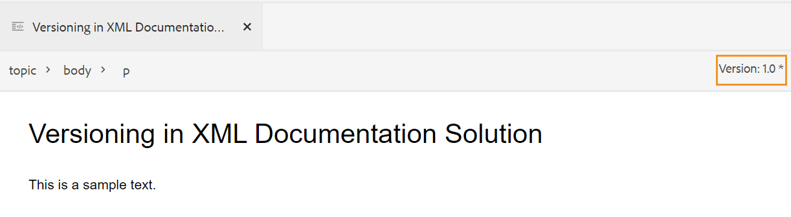

# as a Cloud Service [!DNL Adobe Experience Manager Guides]의 1월 릴리스

## 1월 릴리스로 업그레이드

as a Cloud Service as a Cloud Service 다음 단계를 수행하여 현재 [!DNL Adobe Experience Manager Guides] (이후 [!DNL AEM Guides]) 설정을 업그레이드하십시오.
1. Cloud Service의 Git 코드를 체크아웃하고 업그레이드하려는 환경에 해당하는 Cloud Service 파이프라인에 구성된 분기로 전환합니다.
1. Cloud Service Git 코드의 `/dox/dox.installer/pom.xml` 파일에서 `<dox.version>` 속성을 2022.1.78로 업데이트합니다.
1. 변경 사항을 커밋하고 Cloud Service as a Cloud Service 파이프라인을 실행하여 [!DNL AEM Guides]의 1월 릴리스로 업그레이드하십시오.

## 호환성 매트릭스

이 섹션에서는 2022년 1월 20일 릴리스에서 [!DNL AEM Guides] as a Cloud Service에서 지원하는 소프트웨어의 호환성 매트릭스를 나열합니다.

### FrameMaker 및 FrameMaker Publishing Server

| FMPS | FrameMaker |
| --- | --- |
| 호환되지 않음 | 2020 업데이트 4 이상 |
| | |

### 산소 연결기

| [!DNL AEM Guides] 클라우드 릴리스 | 산소 커넥터 창 | 산소 커넥터 Mac | Oxygen 창에서 편집 | Oxygen Mac에서 편집 |
| --- | --- | --- | --- | --- |
| 2022.1.0 | 2.4.0 | 2.4.0 | 2.2 | 2.2 |
|  |  |  |  |  |

## 새로운 기능 및 향상된 기능

### 문서 기반 게시

1월 릴리스에서는 웹 편집기 내에 통합된 기사 기반 게시 기능을 도입했습니다. 문서 기반 게시 기능을 사용하여 하나 이상의 주제에 대한 출력을 점진적으로 생성하거나 콘텐츠를 Knowledgebase 플랫폼에 게시할 수 있습니다.

이 기능을 사용하면 추가 방식으로 DITA 맵을 작성하고 준비가 되면 항목을 게시할 수 있습니다. 맵을 게시한 후에는 문서 기반 게시 기능을 사용하여 업데이트된 문서에 대해서만 증분 게시를 수행합니다.

AEM 외에도 이 고유한 기능을 사용하여 Salesforce와 같은 기술 자료 포털에 문서를 게시할 수 있습니다. 이 기능은 기술 콘텐츠의 지식 기반 저장소를 만들 수 있는 AEM 핵심 구성 요소 위에 구축된 OOTB 콘텐츠 템플릿과도 함께 제공됩니다. 이 템플릿의 장점은 조직의 요구 사항에 맞게 완전히 맞춤화할 수 있고 기업 인트라넷 포털과 같은 사용 사례를 지원할 수 있다는 점입니다.
문서 상태 및 수정된 시간에 따라 문서를 필터링할 수도 있습니다.

이 필요할 때 언제든지 게시할 수 있는 이 문서 게시를 통해 콘텐츠 게시를 완벽하게 제어할 수 있을 뿐만 아니라 업데이트된 콘텐츠를 게시하는 전체 시간을 줄일 수 있습니다.
이 템플릿을 사용하여 문서를 게시하면 게시된 페이지에 메타데이터를 전달할 수도 있습니다.
자세한 내용은 사용 안내서의 *웹 편집기에서 문서 기반 게시*&#x200B;를 참조하십시오.

### 향상된 웹 편집기

웹 편집기에는 다음과 같은 많은 향상된 기능과 새로운 기능이 도입되었습니다.

* 웹 편집기에도 제목 구성표에 대한 지원이 추가되었습니다. 이제 [주제 스키마] 패널을 사용하여 주제 스키마를 만들고 사용할 수 있습니다. 이제 주제 스키마를 추가하여 회사 메타데이터 및 분류법을 사용할 수 있습니다.

* 용어집 일괄 관리를 위해 이 버전에서는 새로운 용어집 핫스팟 도구가 도입되었습니다. 이 도구를 사용하면 선택한 맵 또는 열린 주제에 대해 텍스트를 용어집으로, 용어집을 용어로 빠르게 변환할 수 있습니다.

* 참조 파일의 재사용 가능한 컨텐츠를 빠르게 새로 고칠 수 있는 재사용 가능한 컨텐츠 패널에 새로 고침 기능이 추가되었습니다.
* 새 작업 복사본 표시기는 파일의 현재(작업 복사본)가 저장된 버전과 동기화되는지 여부를 보여 줍니다.

* 저장소 패널 및 파일 찾아보기 대화 상자의 검색 필터가 향상되어 더 많은 필터링 옵션을 사용할 수 있으며, 추가로 사용자 지정할 수 있습니다.

* 이제 웹 편집기에서 .docx 파일을 업로드할 수 있습니다.

### FrameMaker이 있는 작성자

이제 FrameMaker에서 문서를 작성하고 게시할 수 있습니다. FrameMaker은 Adobe Experience Manager에 기본 제공 커넥터와 함께 제공됩니다. FrameMaker에서 배포 및 공동 작업 환경에서 문서 버전을 유지 관리할 수 있는 사용하기 쉬운 인터페이스를 제공합니다.

콘텐츠를 만든 후에는 FrameMaker에서 PDF, HTML 5, EPUB 및 DITA와 같은 다양한 형식으로 문서를 게시할 수 있습니다. 또한 체크아웃, 종속 항목이 있는 체크아웃, 체크인, 새로 고침 등과 같은 다양한 파일 관리 작업을 수행할 수 있습니다.
[!DNL AEM Guides]에서 FrameMaker 버전 2020.4 이상을 사용하여 FrameMaker을 작성하려면 as a Cloud Service을 사용하십시오.

### 새 번역 대시보드

웹 편집기에 다음 기능과 함께 새로운 번역 대시보드가 도입되었습니다.

* 주제 목록 정렬, 검색 및 필터링.
* 참조 유형(직접 또는 간접 참조)별로 콘텐츠를 필터링합니다.
* 번역 요청을 시작하는 동안 기존 프로젝트를 쉽게 탐색할 수 있습니다.
* 두 개 이상의 언어에 대한 번역 요청이 시작되면 각 언어에 대해 여러 프로젝트를 생성하지 않도록 다국어 번역 메커니즘을 도입했습니다.
* 맵 대시보드에서 번역 탭을 숨기는 구성이 도입되었습니다. 기본적으로 표시됩니다. 맵 대시보드 또는 웹 편집기를 사용하여 콘텐츠를 번역할 수 있습니다.

### 향상된 게시

* 이제 작성자가 맵 및 주제 수준 메타데이터를 DITA-OT 게시로 전달할 수 있습니다. 이 기능은 태그, 작성자, 문서 상태 등과 같은 파일 메타데이터 속성을 사용하도록 사용자 지정 PDF 템플릿을 디자인할 때 유용합니다.

* AEM Site 출력 생성에서 **삭제 및 만들기** 옵션을 사용하는 경우 사용자가 삭제할 주제의 버전을 유지하거나 삭제할 수 있도록 새 구성을 추가했습니다.

### 향상된 파일 처리

이제 AEM Assets의 파일을 사용하는 동안 다음과 같은 개선 사항을 볼 수 있습니다.
* 충돌 해결 전략을 선택하기 위한 새로운 파일 업로드 경험과 대화 상자가 도입되었습니다.

* 체크 아웃된 파일을 덮어쓰지 않도록 하는 기능과 함께 업로드된 파일의 새 버전을 만드는 기능.
* 이제 버전 기록 보기에서 직접 이미지 미리보기를 볼 수 있습니다. 또한 DITA 및 비 DITA 파일의 경우 버전 내역에는 현재 버전 정보가 별도로 표시됩니다.

* 사용자가 DITA 파일을 만들 때마다 기본 파일 이름이 작은 대/소문자로 표시되어 기본 AEM 폴더 만들기 시나리오와 인라인으로 사용됩니다.

### 새로운 보고서 내보내기 기능

보고서는 콘텐츠의 상태를 식별하는 데 매우 유용합니다. as a Cloud Service [!DNL AEM Guides]은(는) 콘텐츠를 제어할 수 있는 다양한 보고서를 제공합니다. 이제 보고서를 볼 수 있을 뿐만 아니라 보고서 데이터를 CSV 파일로 내보내 더 큰 규모의 팀을 보고 공유할 수 있습니다. 보고서 데이터를 통해 끊어진 링크나 누락된 이미지를 한눈에 파악할 수 있습니다.

### 산소 DAM 새로 고침 경험 개선

Oxygen의 AEM Server에서 파일을 새로 고치면 현재 Oxygen 세션에 저장하지 않은 파일이 있으면 경고 메시지가 표시됩니다. 저장하지 않은 파일을 저장하기 위해 새로 고침 작업을 취소하도록 선택할 수 있습니다. 이 기능이 없으면 사용자가 문서에서 저장하지 않은 정보를 잃고 있었습니다.

### 기타 향상된 기능

* 이제 **/apps/projects/templates** 경로에 새 **Dita 프로젝트** 템플릿을 만들 수 있습니다.
* 이제 폴더 프로필에서 기본 **ui_config.json** 파일을 다운로드합니다. 업그레이드하는 동안 기존 **ui_config.json** 파일의 사용자 지정 변경 내용을 병합하는 데 사용할 수 있습니다.
* 새 버전의 JS 파일이 있는 경우에도 브라우저 캐시를 지울 필요가 없습니다.

## 해결된 문제

다양한 영역에서 수정된 버그는 다음과 같습니다.

### 웹 편집기

* 원추는 깨지지 않아도 빨간색으로 나타납니다. (8239)
* DITAVAL 편집기에서 모든 속성 추가 를 선택하면 조건부 속성 값이 자동으로 채워지지 않습니다. (8234)
* 작성자가 상대 경로를 사용하여 주제에 이미지를 삽입할 수 없습니다. (8112)
* 파일 이름에 공백이 있는 경우 작업 검토 페이지에 멀티미디어 파일이 표시되지 않습니다. (8111)
* 표 셀에 추가된 Ph conref는 빨간색으로 표시됩니다. (8083)
* 검토 중인 파일을 이동할 때 검토 작업의 링크가 업데이트되지 않습니다. (8080)
* 웹 편집기에서 크기 조정 속성이 75% 이상으로 설정된 이미지를 올바르게 렌더링하지 않습니다. (8073)
* GIF 이미지는 웹 편집기에서 정적 이미지로 렌더링됩니다. (8024)
* 메모 요소의 conkeyref는 웹 편집기 미리보기 또는 출력에 표시되지 않습니다. (8006)
* 자체가 conref인 요소에 대한 xref는 편집기에서 확인되지 않습니다. (7933)
* 키가 있는 제목이 편집기 미리보기 및 저장소 패널에서 올바르게 렌더링되지 않습니다. (7909)
* 특수 문자가 있는 코드 조각이 올바르게 저장되지 않습니다. (7908)
* MathML 방정식 서식을 지정한 후 주제를 저장하면 오류가 발생합니다. (7954)
* (tm)이 있는 keydef가 편집기에서 제대로 렌더링되지 않았으며 AEM 사이트 출력에 중복된 TM 기호가 포함되어 있습니다. (7859)
* 코드 조각 드래그 앤 드롭은 DTD에 따라 작동하지 않습니다. (7758)
* HTML이 그래픽에 대해 사용자 정의 치수를 무시합니다. (7718)
* 소스 파일을 이동할 때 conrefend 특성이 업데이트되지 않습니다. (7698)
* 참조 주제 유형 문서를 사용하면 몇 가지 UI 문제가 발생합니다. (7656)
* 작성자가 맵에 ditavalref를 추가할 때 DITAVAL 파일이 표시되지 않습니다. (7594)
* outputclass 특성을 `<tgroup>` 요소에 추가할 때 각 빈 `<entry>` 요소에 예기치 않은 공백이 있습니다. (7532)
* 맵 대시보드를 통해 연 주제에 대해서는 Source 버튼이 작동하지 않습니다. (7465)
* 예쁜 인쇄는 FrameMaker 또는 산소에서 파일을 열 때 볼 수 있는 빈 줄과 공백을 삽입합니다. (7408)
* 주제에 href=&quot;/&quot;인 맵은 AEM 사이트에 게시되지 않습니다. (7405)
* 루트 맵에 키 정의 수가 많은 경우 편집기에서 성능 문제가 발견되었습니다. (7400)
* 사용자 지정 템플릿이 있는 맵의 문서 상태가 해당 상태 프로필에서 상속되지 않습니다. (7359)
* `<tm>` 요소가 블록 요소로 잘못 렌더링되었습니다. (7286)
* 새 템플릿을 만들면 편집기 템플릿 패널에 중복 템플릿이 표시됩니다. (5814)
* 추가 속성 설정을 위한 이미지용 ui_config에 정의된 템플릿은 드래그/드롭 사례에 적용할 수 없습니다. (5713)
* menucascade에서 uicontrol의 기본 모양이 잘못되었습니다. (5483)
* 주제/맵에 대한 사용자 지정 템플릿은 UI에 새 이름을 표시하지 않습니다. 구성된 이름이 표시되지 않고 &quot;Topic&quot;/&quot;Map&quot;으로 표시됩니다. (4958)
* 사용자 환경 설정에서 Rootmap을 지우는 기능. (8534)
* 페이지를 새로 고친 후에도 새로 만든 맵 컬렉션이 나열되지 않습니다.(8603)
* 잠금 해제된 주제를 닫을 수 없습니다. (8545)
* 소스 모드와 작성자 모드 간을 전환하면 주제가 더티로 표시되며 콘텐츠를 다시 저장해야 합니다.(8524)
* 특수 문자 `[` 또는 `*` 검색 시 콘텐츠 패널 충돌을 다시 사용합니다.(8279)
* 키보드 단축키 Alt+Enter를 사용하여 요소 삽입 대화 상자를 열면 커서가 검색 막대에 표시되지 않습니다.(7912)
* 검색 옵션은 파일 이름에서만 검색하며 컨텐츠에서는 검색하지 않습니다. (7784)

### 산소 연결기

* 상위 폴더에 특수 문자가 있는 파일은 Oxygen에서 로드하는 동안 오류가 발생합니다. (8054)
* 새로 만든 문서를 Oxygen에서 열면 &quot;GUID를 찾을 수 없음&quot; 오류가 표시됩니다. (7856)
* Edit in Oxygen을 사용하여 AEM에서 파일을 체크 아웃하면 체크 인 옵션이 비활성화됩니다. (7471)

### 검토

* 댓글에 대해 실시간 동기화가 작동하지 않습니다. (7661)

### 맵 대시보드

* 맵 대시보드의 주제 또는 보고서 탭에 있는 주제 제목에서 conref 콘텐츠를 볼 수 없습니다. (8263)
* AEM Sites 출력 | DITA 주제 제목을 업데이트할 때 생성된 사이트 페이지의 jcr:title이 업데이트되지 않습니다. (8131)
* MAP 다운로드는 주제 내에 사용된 비디오 파일을 다운로드하지 않습니다. (8070)
* 다운로드 북맵 API를 통해 오브젝트 태그를 사용하면 미디어 파일이 다운로드되지 않습니다. (8057)
* 제목이 conref로 시작하는 파일에 conref가 있는 주제가 있으면 보고서 탭에 잘못된 보고서가 표시됩니다. (4698)
* 기준선 탭의 레이블 적용 대화 상자에 드롭다운에 레이블이 표시되지 않습니다. (8455)

### 게시

* [버전 관리 활성화]를 선택하면 처음으로 PDF 작성에 실패합니다. (8053,8294)
* AEM Site 출력의 &#39;tm; 태그 뒤에 공백 문자가 자동으로 추가됩니다. (7964)
* AEM 사이트 출력에서 YouTube 비디오를 볼 수 없습니다. (7401)
* 사용자가 맵 대시보드의 기준선 탭에서 모든 항목 찾아보기 를 클릭한 후 참조된 콘텐츠에 대해 레이블로 필터링할 수 없습니다. (7388)
* 속성 값이 SM 또는 reg인 요소 `<tm>`의 게시 주제가 생성된 출력에 잘못 표시됩니다. (7239)
* 이미지를 사용하여 기준선 게시를 수행해도 게시된 출력에서 이미지의 최신 버전이 선택되지 않습니다. (7231)
* 관련 있는 참조 주제가 기준선 탭에 표시됩니다. (5424)
* 제목에 conkeyref가 있는 주제에 대한 증분 게시가 예상대로 작동하지 않습니다. (4474)
* 해당 설정이 선택되어 있더라도 페이지 제목은 출력 URL 생성에 사용되지 않습니다. (8257)
* 기준선 게시 고정된 노드 대신 이미지의 현재 버전을 선택합니다. 이는 파일 이름에 공백이나 특수 문자가 있는 경우에도 표시됩니다. (8274,8322)
* mapref가 있는 유형 제목 체계가 있는 DITA 맵에 대해 증분 게시가 실패합니다. (8218)
* 맵이 벌크 Publish 대시보드에 추가될 때마다 Null이 추가됩니다. (8695)
* 주제의 기준 게시를 이미지와 함께 conref로 사용할 때 이미지가 출력에 게시되지 않습니다. (8564)
* AEM 사이트 게시에 사용된 기준선이 삭제되는 경우 예외적으로 게시에 실패합니다. (8572)
* 주제 재생성이 작동하지 않습니다. (8091)
* 표에 각주를 게시하는 데 문제가 있습니다. (4709)

### AEM Assets

* Assets UI에 설정된 대용량 콘텐츠에서 선택/삭제를 수행하는 동안 성능 문제가 발견되었습니다. (8238)
* DITA 술어를 검색 필터에 추가하면 저장된 검색 기능(스마트 컬렉션)이 중단됩니다. (8048)
* 이미지를 이전 버전으로 되돌리는 작업은 작동하지 않습니다. (DXML-7903)
* 삭제 권한이 없는 작성자에게도 삭제 옵션이 표시됩니다. (7322)
* Assets Editor용 CCMS 오버레이가 삭제 옵션의 렌더링을 중단합니다. (8093)
* 문서 프로필이 삭제되지 않습니다. (8604)
* &quot;모두 선택&quot;을 수행하고 멀티미디어/Dita_Content를 다른 폴더로 이동하는 동안 참조가 중단됩니다. (8621)
* 에셋 이동 시 소스에 잘못된 참조가 발생합니다. (8627)
* 고정 목록 보기가 로드되지 않습니다. (8542)

### 컨텐츠 가져오기

* HTML-DITA 변환 | &#39;tr&#39;에 빈 &#39;td&#39; 항목이 있는 테이블은 출력에 추가 행을 발생시킵니다. (8132)
* HTML-DITA 변환 | 여러 본문이 있는 테이블을 가진 HTML이 예외적으로 실패합니다. (7940)
* HTML-DITA 변환 | 소스 HTML에 주석이 있으면 오류가 발생합니다. (7937)
* DITA 1.3 DITA 파일을 가져오면 일부 href가 잘못된 링크로 변형됩니다. (8019)

## 알려진 문제

Adobe은 다음과 같은 {0 as a Cloud Service 2022년 1월 릴리스에 대한 문제를 확인했습니다.[!DNL AEM Guides]

### 해결 방법에 대한 알려진 문제

다음과 같은 알려진 문제에 대해 주어진 해결 방법을 사용하십시오.

* Mac의 산소 커넥터에 대해 웹 인증이 작동하지 않습니다.
  **해결 방법**: 지금은 Windows에서 산소 커넥터를 사용하십시오.

* Firefox 브라우저에서는 나란히 보기를 열지 않으면 검토 주석을 가져올 수 없습니다.
  **해결 방법**: 지금은 Chrome 브라우저를 사용하십시오.

* 파일 이름에 공간이 있는 이미지 또는 멀티미디어 파일을 이동할 때 참조가 중단됩니다.
  **해결 방법**: 이동하기 전에 파일 이름을 바꾸고 파일 이름에서 공백을 제거합니다.

* 맵 대시보드가 최신 버전의 Chrome 브라우저에서 간헐적으로 로드되지 않습니다.
  **해결 방법**: 맵 대시보드 페이지를 새로 고칩니다.

### 기타 알려진 문제

* Oxygen이 웹 인증을 사용하여 [!DNL AEM Guides] 솔루션과 연결되어 있으면 로그아웃이 실패합니다.
* 검토 작업을 사용자에게 다시 할당할 수 없습니다.
* 맵 컬렉션 UI에 텍스트가 왜곡되고 **모두 선택** 기능이 제대로 작동하지 않는 등의 문제가 있습니다.
