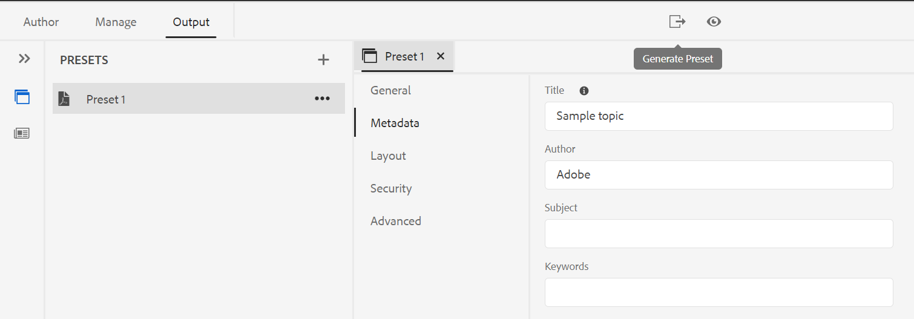

# Adobe Experience Manager Guides as a Cloud Service 9월 릴리스

## 9월 릴리스로 업그레이드

최신 Adobe Experience Manager Guides as a Cloud Service 업그레이드(나중에 참조) *AEM Guides as a Cloud Service*) 다음 단계를 수행하여 설정합니다.
1. Cloud Service의 Git 코드를 체크아웃하고 업그레이드하려는 환경에 해당하는 Cloud Service 파이프라인에 구성된 분기로 전환합니다.
1. 업데이트 `<dox.version>` 의 속성 `/dox/dox.installer/pom.xml` Cloud Service 파일 Git 코드 2022.9.178.
1. 변경 사항을 커밋하고 Cloud Service 파이프라인을 실행하여 AEM Guides as a Cloud Service의 9월 릴리스로 업그레이드합니다.

## 기존 콘텐츠를 색인화하는 단계

기존 콘텐츠를 색인화하기 위해 다음 단계를 수행하고 맵 수준에서 새 찾기 및 바꾸기 텍스트를 사용합니다.
* 올바른 인증을 사용하여 서버에 대한 POST 요청 실행 - `http://<server:port>/bin/guides/map-find/indexin`.
(선택 사항: 맵의 특정 경로를 전달하여 인덱싱할 수 있습니다. 기본적으로 모든 맵이 인덱싱됩니다 || 예 :   `https://<Server:port>/bin/guides/map-find/indexing?paths=<map_path_in_repository>`)
* API는 jobId를 반환합니다. 작업 상태를 확인하려면 작업 ID가 있는 GET 요청을 동일한 끝점으로 보낼 수 있습니다. `http://<server:port>/bin/guides/map-find/indexing?jobId={jobId}`
(예: `http://<_localhost:8080_>/bin/guides/map-find/indexing?jobId=2022/9/15/7/27/7dfa1271-981e-4617-b5a4-c18379f11c42_678)`
* 작업이 완료되면 위의 GET 요청은 성공으로 응답하고 맵이 실패한 경우 언급됩니다. 인덱싱된 맵은 서버 로그에서 확인할 수 있습니다.

## 호환성 매트릭스

이 섹션에서는 2022년 9월 AEM Guides as a Cloud Service 릴리스에서 지원하는 소프트웨어 애플리케이션에 대한 호환성 매트릭스를 살펴봅니다.

### FrameMaker 및 FrameMaker Publishing Server

| FMPS | FrameMaker |
| --- | --- |
| 호환되지 않음 | 2020 업데이트 4 이상 |
| | |

*AEM에서 생성된 기준 및 조건은 2020.2년부터 FMPS 릴리스에서 지원됩니다.

### 산소 연결기

| AEM Guides as a Cloud 릴리스 | 산소 커넥터 창 | 산소 커넥터 Mac | Oxygen 창에서 편집 | Oxygen Mac에서 편집 |
| --- | --- | --- | --- | --- |
| 2022.9.0 | 2.7.13 | 2.7.13 | 2.3 | 2.3 |
|  |  |  |  |

## 새로운 기능 및 향상된 기능

AEM Guides as a Cloud Service은 9월 릴리스에서 많은 개선 사항 및 새로운 기능을 제공합니다.

### 레이블을 기반으로 동적 기준선 만들기

이제 AEM Guides에서는 레이블을 기반으로 동적 기준선을 만드는 기능을 제공합니다. 기준선을 생성하거나, 기준선을 다운로드하거나, 기준선을 사용하여 번역 프로젝트를 생성하는 경우, 업데이트된 레이블을 기반으로 파일이 동적으로 선택됩니다. 이 기능은 레이블을 업데이트할 때 기준선을 수정할 필요가 없어 편리합니다.
기준 요소의 스냅샷을 CSV로 내보낼 수도 있습니다.

### 맵 수준에서 텍스트 찾기 및 바꾸기

이제 맵에서 특정 텍스트가 포함된 파일을 검색할 수 있습니다. 검색된 텍스트가 파일에서 강조 표시됩니다. 검색된 단어나 구를 파일 내의 다른 단어나 구로 바꿀 수도 있습니다.
다음 항목 선택 **바꾸기** 현재 항목 및 를 대체할 아이콘 **파일의 모두 바꾸기** 아이콘 - 선택한 파일에서 모든 발생 항목을 바꿉니다.

기본적으로 옵션은 **바꾸기 전 파일 체크 아웃** 및 **바꾸기 후 새 버전 만들기** 가 선택되므로 텍스트를 바꾸기 전에 파일이 체크 아웃되고, 텍스트를 바꾼 후에 새 버전이 만들어집니다.

### 번역 대시보드에서 동기화되지 않은 파일의 버전 차이 보기

이제 을(를) 번역하도록 선택할 수 있습니다. **동기화되지 않음** 두 버전의 항목 간에 수행된 변경 내용을 기반으로 하는 파일입니다.\

번역 대시보드에서 선택한 파일의 마지막 번역 버전과 현재 버전 간의 차이점을 쉽게 확인할 수 있습니다.

차이점을 기반으로 항목의 번역 여부를 결정할 수 있습니다.

### PDF 사전 설정에 사용 가능한 메타데이터 UI

DITA 맵의 출력 사전 설정에서 메타데이터를 설정할 수 있습니다. 제목, 작성자, 주제 및 키워드 메타데이터를 설정할 수 있습니다. 이 메타데이터는 출력 PDF의 파일 속성에 있는 메타데이터에 매핑됩니다.
이 메타데이터는 책 수준에서 정의된 메타데이터를 재정의합니다. 각 출력 사전 설정에서 구체적으로 메타데이터를 정의하고 이를 출력 PDF에 전달할 수 있습니다.

## 해결된 문제

다양한 영역에서 수정된 버그는 다음과 같습니다.

* 웹 편집기 | 항목 내에서 요소를 이동할 때 요소에 지정된 ID가 자동으로 할당된 ID로 덮어쓰여집니다. (7895)
* 변경 내용 추적 | Enter 키를 사용하여 새 요소를 입력하면 콘텐츠가 손실됩니다. (10246)
* dita 템플릿에서 기본 맵으로 참조되는 하위 맵이 만들어지지 않습니다. (10231)
* XML 편집기 | 복사-붙여넣기가 작성자 모드에서 작동하지 않습니다. (10309)
* 여러 버전 레이블을 선택한 후에는 선택을 취소할 수 없습니다. (9561)
* 사이트 검색 대화 상자의 경로에 대한 자동 탐색이 파일 검색처럼 작동하지 않습니다. (9920)
* [윤곽선] 패널에서 전환할 때 내용이 표시되지 않음 **작성자** 끝 **소스** 모드. (10319)
* 주제 템플릿의 콘텐츠를 사용하여 만든 새 주제의 Conref가 작동하지 않습니다. 복사한 해시 ID는 콘텐츠 사본에서 업데이트되지 않습니다. (9890)
* 웹 편집기 | 맵 템플릿에서 맵을 만드는 동안 로더가 존재하지 않습니다. (9891)
* 새 맵 편집기 | 맵 제목에 굵게 또는 기울임체로 추가된 텍스트가에서 전환할 경우 유지되지 않음 **작성자** (으)로 **레이아웃** 보기. (10218)
* 새 맵 편집기 | 모든 참조에 적용된 조건은 레이아웃 보기에서 제거할 수 없습니다. (10213)
* 새 맵 편집기 | 조건 참조를 적용하는 것이 작성자 보기와 같은 레이아웃 보기에서 작동하지 않습니다. (10198)
* 새 맵 편집기 | 컨텍스트 메뉴에서 왼쪽으로 이동하면 참조를 왼쪽으로 이동할 수 없는 경우 참조가 제거됩니다. (10219)
* 새 맵 편집기 |레이아웃 보기를 사용하여 만든 맵의 참조에 대해 아이콘이 잘못 표시됩니다. (10197)
* 저장소 패널 | 저장소 패널을 마우스 오른쪽 버튼으로 클릭하면 애플리케이션 오류가 표시됩니다. (10123)
* 찾기 및 바꾸기 | 다크 모드는 웹 편집기에서 검색 결과를 읽을 수 없습니다. (9978)
* 번역 | 메타데이터 및 태그가 번역된 사본에 전파되지 않습니다. (4696)
* 복사 붙여넣기(ctrl+c/ctrl+v) 컨텐츠에서 작성자 모드에 오류가 발생합니다. (10304)
* PDF 템플릿 | 배경 이미지를 PDF 레이아웃에 추가하면 이미지 경로 절대값이 표시되고 이미지가 출력 페이지에 표시되지 않습니다. (10297)
* 기본 PDF | 챕터 제목 및 챕터 제목이 PDF 게시에서 작동하지 않습니다. (9947)
* 기본 PDF | `xref` 특정 DITA 주제에 대한 개념이 올바르게 확인되지 않습니다. (10229)
* 기본 PDF | 생성된 PDF 출력의 표에 대한 캡션 텍스트를 볼 수 없습니다. (9827)
* 기본 PDF | 부록의 참조는 PDF 출력에 부록으로 표시되지 않습니다. (10182)
* 기본 PDF | 테이블에 대한 Frame 속성이 임시 HTML(클래스로)에 전파되지 않습니다. (10353)
* 기본 PDF | 임시 HTML 파일은 소스 DITA에서 값이 0인 경우에도 colsep 및 rowsep 클래스를 td 및 th에 추가합니다. (10352)
* 기본 PDF | 페이지 레이아웃에 추가된 critdate에 대한 메타데이터가 적용되지 않습니다. (10377)
* 기본 PDF | 특정 콘텐츠에 대한 PDF 생성에 실패합니다. (9927)
* 기본 PDF | conkeyref를 통한 콘텐츠가 PDF 출력에 표시되지 않습니다. (9836)
* 기본 PDF | 이미지 또는 외부 링크가 있는 키 정의에 대한 키 참조가 확인되지 않습니다. (10063)
* 맵의 작성자 보기에 표 목록 및 그림 목록에 대한 자리 표시자 텍스트가 표시되지 않습니다. (10330)
* 새 베이스라인을 만들 때 이미 선택한 베이스라인 필터는 적용되지 않습니다. (9954)
* 상위 폴더 이름에 공백 문자가 있으면 비디오 파일이 기준선에서 누락됩니다. 10031)
* 사용자 시간대가 서버 시간대와 다른 경우 기준 생성에서 최신 버전을 선택하지 않습니다. (10190)
* AEM 6.5.12에서 AEM Guides 4.1을 설치한 후 Control + F 단축키로 Assets 콘솔의 브라우저 검색 모달이 열리지 않습니다. (10189)

## 알려진 문제

Adobe은 AEM Guides as a Cloud Service 2022년 9월 릴리스에 대해 다음과 같은 알려진 문제를 확인했습니다.

* 동적 기준선은 기술 자료 게시와 통합되지 않습니다.

* 번역 | 대상 콘텐츠의 변경 사항으로 인해 소스 콘텐츠에 버전 차이 아이콘이 표시됩니다.
