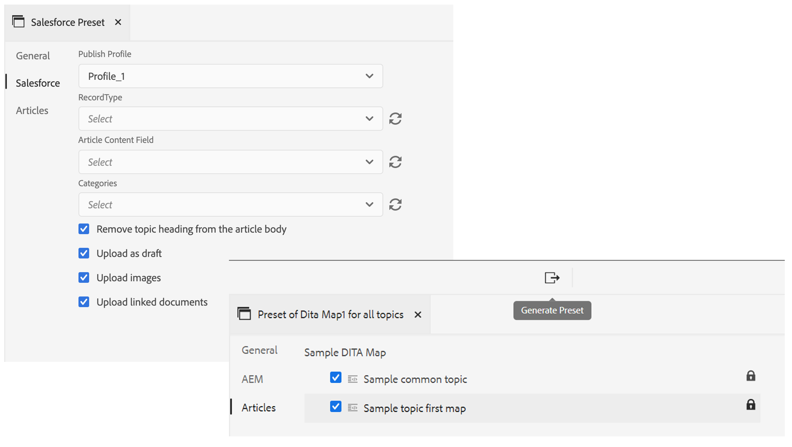
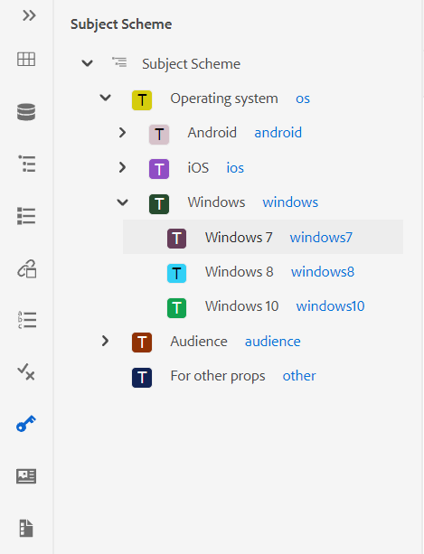
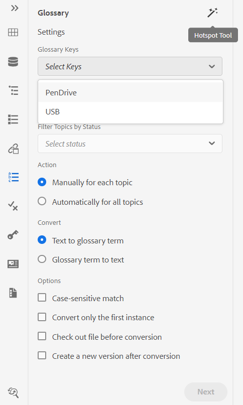
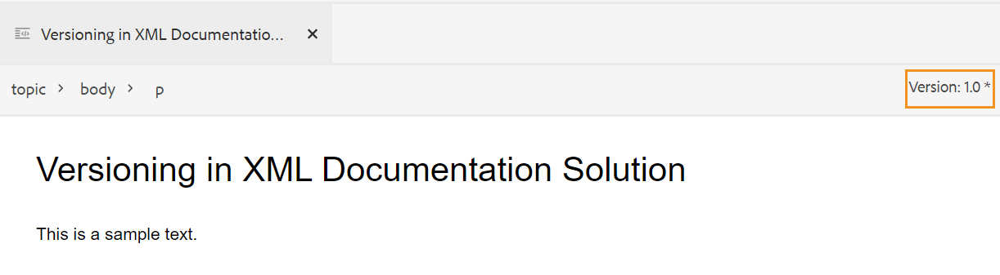
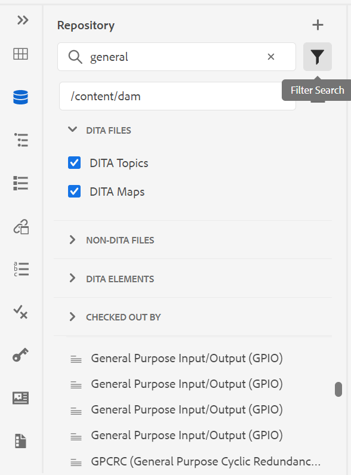
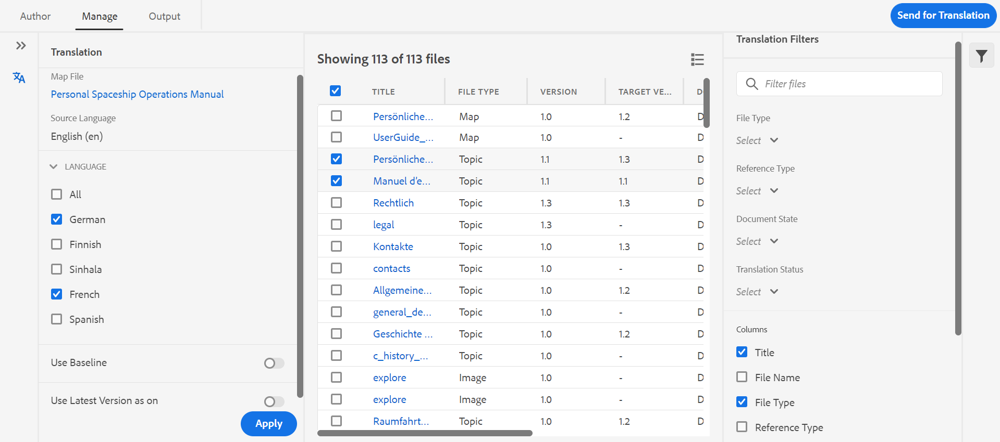
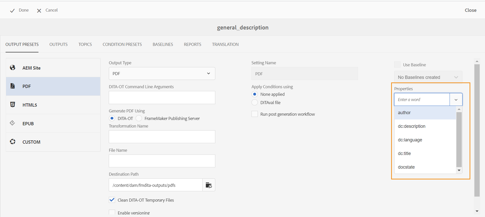
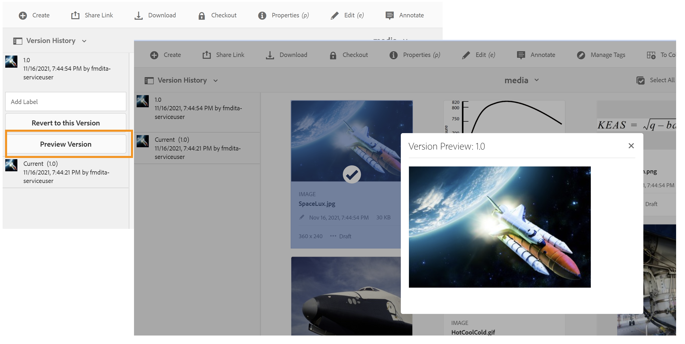
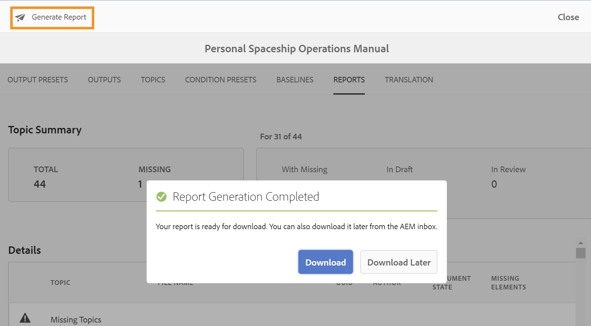

# 릴리스 정보 | Adobe Experience Manager Guides 4.0.x

**면책조항**:

*Adobe Experience Manager Guides*&#x200B;은(는) 이전에 *Adobe Experience Manager용 XML Documentation* 브랜드로 지정되었습니다. 설명서 내의 특정 참조는 이전 브랜딩을 계속 참조할 수 있지만 현재 제공에 여전히 적용할 수 있습니다.

이 릴리스 노트는 Adobe Experience Manager Guides 버전 4.0.x(이후 AEM Guides으로 지칭됨)의 업그레이드 지침, 새로운 기능 및 개선 사항에 대해 다룹니다.

## 4.0.3 | 릴리스 노트

### 호환성 매트릭스

이 섹션에서는 AEM Guides 버전 4.0.3에서 지원하는 소프트웨어 응용 프로그램의 호환성 매트릭스를 나열합니다.

#### Adobe Experience Manager

- 버전 6.5 서비스 팩 12, 10, 11 또는 9

자세한 내용은 설치 및 구성 안내서의 *기술 요구 사항* 섹션을 참조하십시오.

#### FrameMaker 및 FrameMaker Publishing Server

| 릴리스 | FMPS 2020 | FMPS 2019 | Fm 2020 | Fm 2019 |
|---|---|---|---|---|
| 비 UUID | 2020.2 이상* | 2019 | 2020.3 이상 | 2019.8 (최신 업데이트) |
| UUID | 2020.2 이상* | 호환되지 않음 | 2020.4 이상 | 호환되지 않음 |

*XML Documentation 솔루션에서 만든 기준 및 조건은 FMPS 릴리스 2020.2 이상에서 지원됩니다.*

#### 산소 연결기

| 릴리스 | 산소 커넥터 창 | 산소 커넥터 Mac | Oxygen 창에서 편집 | Oxygen Mac에서 편집 |
|---|---|---|---|---|
| 비 UUID | 1.6.8 | 1.6.8 | 1.5 | 1.5 |
| UUID | 2.3.8 | 2.3.8 | 2.2 | 2.2 |

### 해결된 문제

다양한 영역에서 수정된 버그는 다음과 같습니다.

- Oxygen은 AEM에서 파일 버전을 되돌린 후 잘못된 버전의 항목을 확인합니다. (9661)
- 파일 버전을 되돌리면 Assets UI에 잘못된 타임스탬프 차이가 표시됩니다. (9662)
- 파일을 임의 버전으로 되돌리면 자동으로 체크 아웃됩니다. (9663)
- 언어 코드가 fr-fr 또는 en-us로 언급되면 번역된 콘텐츠는 중단됩니다. (9665)
- UUID가 아닌 버전에서는 대상 언어 코드에 fr_ca와 같은 5개의 문자가 포함되어 있을 때 승인된 번역이 대상 언어에 통합되지 않습니다. (9666)
- 새 버전 만들기를 사용하여 번역을 완료한 후 이미지의 대상 버전이 jcr:root(으)로 표시됩니다. (9668)
- 기준선을 사용하여 번역을 수행하면 잘못된 버전의 이미지가 번역용으로 전송됩니다. (9669)

## 4.0.2 | 릴리스 노트

### 호환성 매트릭스

이 섹션에서는 AEM Guides 버전 4.0.2에서 지원하는 소프트웨어 응용 프로그램의 호환성 매트릭스를 나열합니다.

#### Adobe Experience Manager

- 버전 6.5 서비스 팩 12, 10, 11 또는 9

자세한 내용은 설치 및 구성 안내서의 *기술 요구 사항* 섹션을 참조하십시오.

#### FrameMaker 및 FrameMaker Publishing Server

| 릴리스 | FMPS 2020 | FMPS 2019 | Fm 2020 | Fm 2019 |
|---|---|---|---|---|
| 비 UUID | 2020.2 이상* | 2019 | 2020.3 이상 | 2019.8 (최신 업데이트) |
| UUID | 2020.2 이상* | 호환되지 않음 | 2020.4 이상 | 호환되지 않음 |

*XML Documentation 솔루션에서 만든 기준 및 조건은 FMPS 릴리스 2020.2 이상에서 지원됩니다.*

#### 산소 연결기

| 릴리스 | 산소 커넥터 창 | 산소 커넥터 Mac | Oxygen 창에서 편집 | Oxygen Mac에서 편집 |
|---|---|---|---|---|
| 비 UUID | 1.6.8 | 1.6.8 | 1.5 | 1.5 |
| UUID | 2.3.8 | 2.3.8 | 2.2 | 2.2 |

### 해결된 문제

다양한 영역에서 수정된 버그는 다음과 같습니다.

- 새로 만든 검토 문서에서 삽입되거나 삭제된 텍스트의 위치가 올바르지 않습니다. (9454)
- 버전 1.0은 4.0.1 업그레이드 후 **버전 기록** 패널의 특정 경우에 나열되지 않습니다. (9441)
- 버전 1.0의 현재 버전에 대한 레이블과 주석이 표시되지 않으며, **버전 기록** 패널의 특정 경우에 나열되지 않습니다. (9440)
- 편집기에서 특정 콘텐츠 파일을 열면 편집기가 중지됩니다. (9433)
- 저장소 패널에서 검색 및 *topicref* 검색 대화 상자가 대용량 콘텐츠 파일 검색 시 중지됩니다. (9432)
- 웹 편집기에서 파일을 한 번 저장할 때 파일에 대해 두 가지 버전이 만들어집니다. (9428)
- topicref에 비DITA 및 DITAVAL 자산을 삽입할 수 없습니다. (9363)
- 큰 키가 없는 지도 미리보기를 로드할 때 편집기가 중단됩니다. (9332)
- 참조는 FM 업데이트 4를 사용하여 작성하는 동안 소스 파일에서 에셋을 이동할 때 중단됩니다. (9177)

### 알려진 문제

- **업로드된 파일에 대한 새 버전 만들기** 설정이 켜져 있는 경우 **모두 저장**&#x200B;을(를) 간헐적으로 선택하면 새 버전이 만들어집니다.
- 폴더 프로필의 사용자 삭제 기능이 Chrome 브라우저에서 간헐적으로 작동하지 않습니다. **해결 방법**: Chrome 브라우저를 새로 고치십시오.

## 4.0.1 | 릴리스 노트

### 호환성 매트릭스

이 섹션에서는 XML Documentation 솔루션 버전 4.0.1에서 지원하는 소프트웨어 응용 프로그램에 대한 호환성 매트릭스를 나열합니다.

#### Adobe Experience Manager

- 버전 6.5 서비스 팩 12, 11 또는 10
- Java: 11

#### FrameMaker 및 FrameMaker Publishing Server

| 릴리스 | FMPS 2020 | FMPS 2019 | Fm 2020 | Fm 2019 |
|---|---|---|---|---|
| 비 UUID | 2020.2 이상* | 2019 | 2020.3 이상 | 2019.8 (최신 업데이트) |
| UUID | 2020.2 이상* | 호환되지 않음 | 2020.4 이상 | 호환되지 않음 |

*XML Documentation 솔루션에서 만든 기준 및 조건은 FMPS 릴리스 2020.2 이상에서 지원됩니다.*

#### 산소 연결기

| 릴리스 | 산소 커넥터 창 | 산소 커넥터 Mac | Oxygen 창에서 편집 | Oxygen Mac에서 편집 |
|---|---|---|---|---|
| 비 UUID | 1.6.8 | 1.6.8 | 1.5 | 1.5 |
| UUID | 2.3.8 | 2.3.8 | 2.2 | 2.2 |

### 해결된 문제

다양한 영역에서 수정된 버그는 다음과 같습니다.

- 중복 주제 참조가 추가/제거되면 맵에 대한 참조 트리가 끊어집니다. (8922)
- **버전 기록의**&#x200B;현재&#x200B;**버전 섹션에 여러 문제가 있습니다.** (8909)
- **모두 선택**&#x200B;을 사용하고 멀티미디어 파일 또는 DITA 콘텐츠를 다른 폴더로 이동하는 동안 참조가 중단됩니다. (8897)
- 웹 편집기의 **상호 참조 삽입** > **파일 참조** > **파일 검색** > **필터** > **검색 경로 변경** 대화 상자에서 여러 UI 문제가 발생했습니다. (8889)
- 맵 편집기에서 *topicref* 및 *ditavalref* 검색 문제(8983).
- 입력한 대로 검색하면 저장소 보기에서 원치 않는 검색 요청이 발생합니다. (8982)
- 폴더 프로필에서 관리자 사용자를 삭제할 수 없습니다. (8926)
- 참조별 각주는 AEM 사이트 출력의 각주 섹션으로 스크롤되지 않습니다. (9061)
- 업데이트된 문서를 Salesforce에 게시할 수 없습니다. (9008)
- 나란히 보기의 강조 표시 위치가 잘못되었습니다. (9009)
- DITA 주제에 조건을 드래그 앤 드롭할 수 없습니다. (9031)
- 폴더 프로필에 css_layout.css를 오버레이할 수 없습니다. (9032)
- 업로드 후 에셋을 볼 때 예외가 수신되었습니다. (9068)
- XML 편집기에서 허용되는 특수 문자의 사용자 지정이 제대로 작동하지 않습니다. (9075)
- 번역 워크플로에서는 번역된 에셋에 대한 추가 버전이 만들어집니다. (9107)
- 다른 주제의 이미지를 *conref*(으)로 사용하여 주제와 함께 기준선 게시를 수행하면 이미지가 출력에 표시되지 않습니다. (9172)
- 다운로드 맵 API 임시 디렉토리를 사용할 때 다운로드가 실패할 경우 정리되지 않습니다. (9176)
- 버전 4.0의 테이블에는 수평 정렬을 사용할 수 없습니다. (9207)
- *glossref*&#x200B;에 대해 Keys 특성이 표시되지 않으므로 삽입 참조를 통해 약식 양식을 삽입할 수 없습니다. (9213)
- *keydef*&#x200B;을(를) 만들면 4.0에서만 링크를 선택할 수 있습니다. (9214)
- 삽입 키 정의/*keyref* 기능 동작은 3.8.10과 비교하여 4.0에서 다릅니다. (9215)
- 버전 3.8.6 - 3.8.10의 웹 편집기 문제가 수정되었습니다. (9219)
- 탭의 제목에 키워드가 사용될 때 문제가 발생합니다. (9317)
- Source 보기에는 비조건부 속성에 대해 여러 오류가 표시됩니다. (9278)
- **경로 선택**&#x200B;의 검색 대화 상자에 문제가 있습니다. (9289)

## 4.0 | 릴리스 노트

### 호환성 매트릭스

이 섹션에서는 XML Documentation 솔루션 버전 4.0에서 지원하는 소프트웨어 응용 프로그램에 대한 호환성 매트릭스를 나열합니다.

#### Adobe Experience Manager

- 버전 6.5 서비스 팩 11, 10 또는 9

#### FrameMaker 및 FrameMaker Publishing Server

| 릴리스 | FMPS 2020 | FMPS 2019 | Fm 2020 | Fm 2019 |
|---|---|---|---|---|
| 비 UUID | 2020.2 이상* | 2019 | 2020.3 이상 | 2019.8 (최신 업데이트) |
| UUID | 2020.2 이상* | 호환되지 않음 | 2020.4 이상 | 호환되지 않음 |

*XML Documentation 솔루션에서 만든 기준 및 조건은 FMPS 릴리스 2020.2 이상에서 지원됩니다.*

#### 산소 연결기

| 릴리스 | 산소 커넥터 창 | 산소 커넥터 Mac | Oxygen 창에서 편집 | Oxygen Mac에서 편집 |
|---|---|---|---|---|
| 비 UUID | 1.6.8 | 1.6.8 | 1.5 | 1.5 |
| UUID | 2.3.8 | 2.3.8 | 2.2 | 2.2 |

### 새로운 기능 및 향상된 기능

#### 문서 기반 게시

버전 4.0에서는 웹 편집기에 통합된 문서 기반 게시 기능을 도입했습니다. 문서 기반 게시 기능을 사용하여 하나 이상의 주제에 대한 출력을 점진적으로 생성하거나 콘텐츠를 Knowledgebase 플랫폼에 게시할 수 있습니다.

이 기능을 사용하면 추가 방식으로 DITA 맵을 작성하고 준비가 되면 항목을 게시할 수 있습니다. 맵을 게시한 후에는 문서 기반 게시 기능을 사용하여 업데이트된 문서에 대해서만 증분 게시를 수행합니다.

AEM 외에도 이 고유한 기능을 사용하여 Salesforce과 같은 기술 자료 포털에 문서를 게시할 수 있습니다. 이 기능은 기술 콘텐츠의 지식 기반 저장소를 만들 수 있는 AEM 핵심 구성 요소 위에 구축된 OOTB 콘텐츠 템플릿과도 함께 제공됩니다. 이 템플릿의 장점은 조직의 요구 사항에 맞게 완전히 맞춤화할 수 있고 기업 인트라넷 포털과 같은 사용 사례를 지원할 수 있다는 점입니다.

이 필요할 때 언제든지 게시할 수 있는 이 문서 게시를 통해 콘텐츠 게시를 완벽하게 제어할 수 있을 뿐만 아니라 업데이트된 콘텐츠를 게시하는 전체 시간을 줄일 수 있습니다.

자세한 내용은 사용 안내서의 *웹 편집기에서 문서 기반 게시*&#x200B;를 참조하십시오.

#### 향상된 웹 편집기

웹 편집기에는 다음과 같은 많은 향상된 기능과 새로운 기능이 도입되었습니다.

- 핵심 프레임워크를 Coral 기반 UI에서 Spectrum 기반 UI로 변경했습니다. 이렇게 하면 매우 표준화되고 직관적인 UI가 제공됩니다.
- 새 파일 속성 기능이 오른쪽 패널에 도입되었습니다. 활성 문서의 속성을 확인할 수 있습니다. 정보는 다음 두 섹션으로 분류됩니다.
   - *일반*: 파일 이름, UUID, 메타데이터 태그, 언어, 만든 날짜, 체크 아웃한 상태 및 문서 상태와 같은 일반 파일 세부 정보를 포함합니다.
   - *참조*: 들어오는 참조와 나가는 참조가 있습니다.

     

- 웹 편집기에도 제목 구성표에 대한 지원이 추가되었습니다. 이제 [주제 스키마] 패널을 사용하여 주제 스키마를 만들고 사용할 수 있습니다. 이제 주제 스키마를 추가하여 회사 메타데이터 및 분류법을 사용할 수 있습니다.

  

- 용어집 일괄 관리를 위해 이 버전에서는 새로운 용어집 핫스팟 도구가 도입되었습니다. 이 도구를 사용하면 선택한 맵 또는 열린 주제에 대해 텍스트를 용어집으로, 용어집을 용어로 빠르게 변환할 수 있습니다.

  

- 참조 파일의 재사용 가능한 컨텐츠를 빠르게 새로 고칠 수 있는 재사용 가능한 컨텐츠 패널에 새로 고침 기능이 추가되었습니다.
- 새 파일 업데이트 표시기는 파일의 현재(작업 복사본)가 저장된 버전과 동기화되는지 여부를 보여 줍니다.

  

- 저장소 패널 및 파일 찾아보기 대화 상자의 검색 필터가 향상되어 더 많은 필터링 옵션을 사용할 수 있으며, 추가로 사용자 지정할 수 있습니다.

  

- 이제 웹 편집기에서 .docx 파일을 업로드할 수 있습니다.
- 사용자 환경 설정은 이제 브라우저의 쿠키가 아닌 사용자 프로필에 저장됩니다. 이렇게 하면 사용자가 브라우저 또는 사용자 세션 간에 환경 설정을 유지할 수 있습니다.

#### 새 번역 대시보드

웹 편집기에 다음 기능과 함께 새로운 번역 대시보드가 도입되었습니다.

- 주제 목록 정렬, 검색 및 필터링.
- 참조 유형(직접 또는 간접 참조)별로 콘텐츠를 필터링합니다.
- 번역 요청을 시작하는 동안 기존 프로젝트를 쉽게 탐색할 수 있습니다.
- 두 개 이상의 언어에 대한 번역 요청이 시작되면 각 언어에 대해 여러 프로젝트를 생성하지 않도록 다국어 번역 메커니즘을 도입했습니다.
- 맵 대시보드에서 번역 탭을 숨기는 구성이 도입되었습니다. 기본적으로 표시됩니다. 맵 대시보드 또는 웹 편집기를 사용하여 콘텐츠를 번역할 수 있습니다.

#### 향상된 게시

이제 게시 프로세스에서 다음과 같은 향상된 기능을 사용할 수 있습니다.

- 이제 FrameMaker Publishing Server을 통한 PDF 생성에서 기준선 및 조건 사전 설정을 지원합니다.
- 이제 작성자가 맵 및 주제 수준 메타데이터를 DITA-OT 게시로 전달할 수 있습니다. 이 기능은 사용자 지정 PDF 템플릿이 태그, 작성자, 문서 상태 등과 같은 파일 메타데이터 속성을 사용하도록 디자인된 경우에 유용합니다.

  

- AEM 사이트 출력 생성에서 **삭제 및 만들기** 옵션을 사용할 때 사용자가 삭제할 주제의 버전을 유지하거나 삭제할 수 있도록 configMgr에 새 구성을 추가했습니다.

#### 향상된 파일 처리

이제 AEM Assets의 파일을 사용하는 동안 다음과 같은 개선 사항을 볼 수 있습니다.

- 충돌 해결 전략을 선택하기 위한 새로운 파일 업로드 경험과 대화 상자가 도입되었습니다.

  

- 체크 아웃된 파일을 덮어쓰지 않도록 하는 기능과 함께 업로드된 파일의 새 버전을 만드는 기능.
- 이제 버전 기록 보기에서 직접 이미지 미리보기를 볼 수 있습니다. 또한 DITA 및 비 DITA 파일의 경우 버전 내역에는 현재 버전 정보가 별도로 표시됩니다.

  

#### 새로운 보고서 내보내기 기능

보고서는 콘텐츠의 상태를 식별하는 데 매우 유용합니다. XML Documentation 솔루션은 콘텐츠를 제어하는 다양한 보고서를 제공합니다. 이제 보고서를 볼 수 있을 뿐만 아니라 보고서 데이터를 CSV 파일로 내보내 더 큰 규모의 팀을 보고 공유할 수 있습니다. 보고서 데이터를 통해 끊어진 링크나 누락된 이미지를 한눈에 파악할 수 있습니다.

#### 산소 DAM 새로 고침 경험 개선

Oxygen의 AEM 서버에서 파일을 새로 고치면 현재 Oxygen 세션에 저장되지 않은 파일이 있는 경우 경고 메시지가 표시됩니다. 저장하지 않은 파일을 저장하기 위해 새로 고침 작업을 취소하도록 선택할 수 있습니다. 이 기능이 없으면 사용자가 문서에서 저장하지 않은 정보를 잃고 있었습니다.

#### 기타 향상된 기능

- AEM의 모범 사례에 따라 이제 애플리케이션 데이터가 /content/fmdita, /etc/fmdita/ 및 /content/dxml/에서 새 위치로 마이그레이션되었습니다.
- DAM 자산 업데이트 워크플로우가 XML 사후 처리 워크플로우와 함께 실행할 수 있도록 처리 능력 및 최적화된 성능으로 다시 도입되었습니다.
- 이제 XML Documentation API 패키지를 공개적으로 액세스할 수 있는 Maven 저장소에서 사용할 수 있습니다.
- 이제 /apps/projects/templates 경로 아래에 새 Dita 프로젝트 템플릿을 만들 수 있습니다.
- 이제 폴더 프로필에서 기본 ui_config.json 파일을 다운로드합니다. 업그레이드하는 동안 기존 ui_config.json 파일에서 사용자 지정 변경 사항을 병합하는 데 사용할 수 있습니다.

### 해결된 문제

다양한 영역에서 수정된 버그는 다음과 같습니다.

#### 웹 편집기

- 원추는 깨지지 않아도 빨간색으로 나타납니다. (8239)
- DITAVAL 편집기에서 **모든 속성 추가**&#x200B;를 선택하면 조건부 특성의 값이 자동으로 채워지지 않습니다. (8234)
- 작성자가 상대 경로를 사용하여 주제에 이미지를 삽입할 수 없습니다. (8112)
- 표 셀에 추가된 Ph conref는 빨간색으로 표시됩니다. (8083)
- UUID 기반 시스템의 경우 검토 중인 파일을 이동할 때 검토 작업의 링크가 업데이트되지 않습니다. (8080)
- 웹 편집기에서 크기 조정 속성이 75% 이상으로 설정된 이미지를 올바르게 렌더링하지 않습니다. (8073)
- GIF 이미지는 웹 편집기에서 정적 이미지로 렌더링됩니다. (8024)
- 메모 요소의 conkeyref는 웹 편집기 미리보기 또는 출력에 표시되지 않습니다. (8006)
- 자체가 conref인 요소에 대한 xref는 편집기에서 확인되지 않습니다. (7933)
- 키가 있는 제목이 편집기 미리보기 및 저장소 패널에서 올바르게 렌더링되지 않습니다. (7909)
- 특수 문자가 있는 코드 조각이 올바르게 저장되지 않습니다. (7908)
- JS 유효성 검사 문제가 있는 경우에도 POST 요청이 여전히 서버로 전송됩니다. (7989)
- MathML 방정식 서식을 지정한 후 항목을 저장하면 오류가 발생합니다. (7954)
- (tm)이 있는 keydef가 편집기에서 제대로 렌더링되지 않았으며 AEM 사이트 출력에 중복된 TM 기호가 포함되어 있습니다. (7859)
- 코드 조각 드래그 앤 드롭은 DTD에 따라 작동하지 않습니다. (7758)
- HTML에서 그래픽에 대해 사용자 정의 치수를 무시합니다. (7718)
- 소스 파일을 이동할 때 conrefend 특성이 업데이트되지 않습니다. (7698)
- 참조 주제 유형 문서를 사용하면 몇 가지 UI 문제가 발생합니다. (7656)
- 작성자가 맵에 ditavalref를 추가할 때 DITAVAL 파일이 표시되지 않습니다. (7594)
- outputclass 특성을 `<tgroup>` 요소에 추가할 때 각 빈 `<entry>` 요소에 예기치 않은 공백이 있습니다. (7532)
- 맵 대시보드를 통해 연 주제에 대해서는 Source 버튼이 작동하지 않습니다. (7465)
- 예쁜 인쇄는 FrameMaker 또는 Oxygen에서 파일을 열 때 볼 수 있는 빈 줄과 공백을 삽입합니다. (7408)
- 모든 주제에 href=&quot;/&quot;인 맵은 AEM 사이트에 게시되지 않습니다(7405)
- 루트 맵에 키 정의 수가 많은 경우 편집기에서 성능 문제가 발견되었습니다. (7400)
- 사용자 지정 템플릿이 있는 맵의 문서 상태가 해당 상태 프로필에서 상속되지 않습니다. (7359)
- `<tm>` 요소가 블록 요소로 잘못 렌더링되었습니다. (7286)
- 새 템플릿을 만들면 편집기 템플릿 패널에 중복 템플릿이 표시됩니다. (5814)
- 추가 속성 설정을 위한 이미지용 ui_config에 정의된 템플릿은 드래그/드롭 사례에 적용할 수 없습니다. (5713)
- menucascade에서 uicontrol의 기본 모양이 잘못되었습니다. (5483)
- 주제/맵에 대한 사용자 지정 템플릿은 UI에 새 이름을 표시하지 않습니다. 구성된 이름(4958)이 표시되지 않고 &quot;Topic&quot;/&quot;Map&quot;으로 표시됩니다.

#### 산소 연결기

- 상위 폴더에 특수 문자가 있는 파일은 Oxygen에서 로드하는 동안 오류가 발생합니다. (8054)
- 새로 만든 문서를 Oxygen에서 열면 &quot;GUID를 찾을 수 없음&quot; 오류가 표시됩니다. (7856)
- AEM에서 Edit in Oxygen을 사용하여 파일을 체크 아웃하면 체크 인 옵션이 비활성화됩니다. (7471)

#### 검토

- 검토 작업을 AEM 받은 편지함에서 재할당하는 경우 작업과 연결된 페이로드는 할당자가 볼 수 없습니다. (8003)
- 파일 이름에 공백이 있으면 [검토] 작업 페이지에 (멀티미디어) 파일의 내용이 표시되지 않습니다. (8111)

#### 대시보드 매핑

- 맵 대시보드의 주제 또는 보고서 탭에 있는 주제 제목에서 conref 콘텐츠를 볼 수 없습니다. (8263)
- AEM Sites 출력 DITA 주제 제목을 업데이트할 때 생성된 사이트 페이지의 | jcr:title이(가) 업데이트되지 않습니다. (8131)
- MAP 다운로드는 주제 내에 사용된 비디오 파일을 다운로드하지 않습니다. (8070)
- 북맵에 다른 폴더에 같은 이름의 주제가 2개 있는 경우 플랫 계층에 대해 AEM 북맵 다운로드가 실패합니다. 이름이 같지만 대/소문자가 다른 파일이 있는 경우 중복 파일로 처리됩니다. (8058)
- 다운로드 북맵 API를 통해 오브젝트 태그를 사용하면 미디어 파일이 다운로드되지 않습니다. (8057)
- 제목이 conref로 시작하는 파일에 conref가 있는 주제가 있으면 보고서 탭에 잘못된 보고서가 표시됩니다. (4698)

#### 게시

- [버전 관리 활성화]를 선택하면 PDF 만들기가 처음으로 실패합니다. (8053, 8294)
- UUID가 아닌 콘텐츠의 경우 conref 이미지가 AEM 사이트 출력에 표시되지 않습니다. (7907)
- AEM 사이트 출력의 &#39;tm; 태그 뒤에 공백 문자가 자동으로 추가됩니다. (7964)
- AEM 사이트 출력에서 YouTube 비디오를 볼 수 없습니다. (7401)
- 사용자가 맵 대시보드의 기준선 탭에서 모든 항목 찾아보기 를 클릭한 후 참조된 콘텐츠에 대해 레이블로 필터링할 수 없습니다. (7388)
- 속성 값이 SM 또는 reg인 요소 `<tm>`의 게시 주제가 생성된 출력에 잘못 표시됩니다. (7239)
- 이미지를 사용하여 기준선 게시를 수행해도 게시된 출력에서 이미지의 최신 버전이 선택되지 않습니다. (7231)
- 관련 있는 참조 주제가 기준선 탭에 표시됩니다. (5424)
- 제목에 conkeyref가 있는 주제에 대한 증분 게시가 예상대로 작동하지 않습니다. (4474)
- 해당 설정이 선택되어 있더라도 페이지 제목은 출력 URL 생성에 사용되지 않습니다. (8257)
- 기준선 게시 고정된 노드 대신 이미지의 현재 버전을 선택합니다. 이는 파일 이름에 공백이나 특수 문자가 있는 경우에도 표시됩니다. (8274, 8322)
- mapref가 있는 유형 제목 체계가 있는 DITA 맵에 대해 증분 게시가 실패합니다. (8218)

#### AEM Assets

- Assets UI에 설정된 대용량 콘텐츠에서 선택/삭제를 수행하는 동안 성능 문제가 발견되었습니다. (8238)
- DITA 술어를 검색 필터에 추가하면 저장된 검색 기능(스마트 컬렉션)이 중단됩니다. (8048)
- 이미지를 이전 버전으로 되돌리는 작업은 작동하지 않습니다. (DXML-7903)
- 삭제 권한이 없는 작성자에게도 삭제 옵션이 표시됩니다. (7322)
- Assets Editor용 CCMS 오버레이가 삭제 옵션의 렌더링을 중단합니다. (8093)

#### 컨텐츠 가져오기

- HTML에서 DITA로의 전환 | &#39;tr&#39;이 있는 테이블에 빈 &#39;td&#39; 항목이 있으면 출력에 추가 행이 발생합니다. (8132)
- HTML에서 DITA로의 전환 | 여러 본문이 있는 테이블이 있는 HTML이 예외적으로 실패합니다. (7940)
- HTML에서 DITA로의 전환 소스 HTML에 주석이 있으면 | 오류가 발생합니다. (7937)
- DITA 1.3 DITA 파일을 가져오면 일부 href가 잘못된 링크로 변형됩니다. (8019)

#### 기타

- 버전 기록 보기에서 이미지의 썸네일이 없거나 손상되었습니다. (7948, 8008)
- zipMapWithDependents API는 콘텐츠에 잘못된 참조가 있는 경우 관련 정보를 제공하지 않습니다. (7521)
- UUID 고객의 경우 UUID 파일을 식별하기 위한 정규 표현식, 출력을 생성하기 위한 페이지 제목 사용 등과 같은 몇 가지 구성에 대해 기본 구성 값이 변경되었습니다. (8301, 8305)

## 업그레이드 지침 {#upgrade-instructions}

현재 버전의 AEM Guides을 버전 4.0.3으로 쉽게 업그레이드할 수 있습니다. AEM Guides 버전 4.0.3으로 업그레이드하기 전에 다음 사항을 고려해야 합니다.

- 버전 4.0.2를 사용하는 경우 버전 4.0.3으로 바로 업그레이드할 수 있습니다. 4.0.3으로 업그레이드하기 전에 버전 4.0.2로 업그레이드해야 합니다.
- 버전 4.0을 사용 중인 경우 버전 4.0.2로 바로 업그레이드할 수 있습니다.
- 버전 4.0.1을 사용 중인 경우 제거해야 합니다.
- 버전 3.8.5를 사용 중인 경우 4.0.2로 업그레이드하기 전에 버전 4.0으로 업그레이드해야 합니다.
- 3.8.5 이전 버전을 사용하는 경우 제품별 설치 안내서의 업그레이드 섹션을 참조하십시오.

자세한 내용은 [업그레이드 지침](https://helpx.adobe.com/content/dam/help/en/xml-documentation-solution/4-0-3/Adobe-Experience-Manager-Guides_Upgrade-Instructions_EN.pdf)을 참조하세요.

