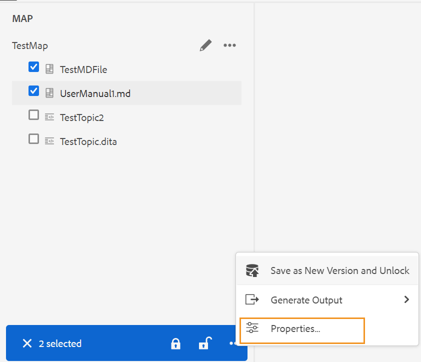

# Adobe Experience Manager Guides의 4.1.x 릴리스

이 릴리스 노트는 Adobe Experience Manager Guides 버전 4.1.x(이후 설명됨)의 업그레이드 지침, 새로운 기능 및 개선 사항에 대해 다룹니다 *AEM 안내서*).

## 최신 릴리스로 업그레이드

현재 버전의 AEM Guides를 버전 4.1.3으로 쉽게 업그레이드할 수 있습니다. AEM Guides 버전 4.1.3으로 업그레이드하기 전에 다음 사항을 고려해야 합니다.
* 버전 4.1 또는 4.1.x를 사용 중인 경우 버전 4.1.3으로 바로 업그레이드할 수 있습니다.
* 버전 4.0.x를 사용 중인 경우 4.1.3으로 업그레이드하기 전에 버전 4.1 또는 4.1.x로 업그레이드해야 합니다.
* 버전 3.8.5를 사용 중인 경우 4.1로 업그레이드하기 전에 버전 4.0.x로 업그레이드해야 합니다.
* 3.8.5 이전 버전을 사용하는 경우 제품별 설치 안내서의 업그레이드 섹션을 참조하십시오.

자세한 내용은 [업그레이드 지침](assets/Adobe-Experience-Manager-Guides-Upgrade-Instructions-EN.pdf).

## 4.1.3 | 릴리스 노트

## 호환성 매트릭스

이 섹션에서는 AEM Guides 4.1.3 릴리스에서 지원하는 소프트웨어 응용 프로그램에 대한 호환성 매트릭스를 나열합니다.

### ADOBE EXPERIENCE MANAGER

**비 UUID**
버전 6.5 서비스 팩 13, 12, 11 또는 10

**UUID**
버전 6.5 서비스 팩 13, 12, 11 또는 10

자세한 내용은 Adobe Experience Manager 안내서 설치 및 구성 안내서의 기술 요구 사항 섹션을 참조하십시오.

### FrameMaker 및 FrameMaker Publishing Server

| 릴리스 | FMPS 2020 | FMPS 2019 | Fm 2020 | Fm 2019 |
| --- | --- | --- | --- | --- |
| 4.1.3 (비 UUID) | 2020.2 이상* | 2019 | 2020.3 이상 | 2019.8 (최신 업데이트) |
| 4.1.3 (UUID) | 2020.2 이상* | 호환되지 않음 | 2020.4 이상 | 호환되지 않음 |
| | | | |

*AEM에서 생성된 기준 및 조건은 2020.2년부터 FMPS 릴리스에서 지원됩니다.

### 산소 연결기

| 릴리스 | 산소 커넥터 창 | 산소 커넥터 Mac | Oxygen 창에서 편집 | Oxygen Mac에서 편집 |
| --- | --- | --- |--- |--- |
| 4.1.3 (비 UUID) | 2.0 | 2.0 | 1.6 | 1.6 |
| 4.1.3 (UUID) | 2.7 | 2.7 | 2.3 | 2.3 |
|  |  |   |

## 해결된 문제

수정된 버그는 아래에 나열되어 있습니다.

* 웹 편집기는 빈 페이지를 간헐적으로 로드합니다. (10678)

## 4.1.2 | 릴리스 노트

## 호환성 매트릭스

이 섹션에서는 AEM Guides 4.1.2 릴리스에서 지원하는 소프트웨어 응용 프로그램에 대한 호환성 매트릭스를 나열합니다.

### ADOBE EXPERIENCE MANAGER

**비 UUID**
버전 6.5 서비스 팩 13, 12, 11 또는 10

**UUID**
버전 6.5 서비스 팩 13, 12, 11 또는 10

자세한 내용은 Adobe Experience Manager 안내서 설치 및 구성 안내서의 기술 요구 사항 섹션을 참조하십시오.

### FrameMaker 및 FrameMaker Publishing Server

| 릴리스 | FMPS 2020 | FMPS 2019 | Fm 2020 | Fm 2019 |
| --- | --- | --- | --- | --- |
| 4.1.2 (비 UUID) | 2020.2 이상* | 2019 | 2020.3 이상 | 2019.8 (최신 업데이트) |
| 4.1.2 (UUID) | 2020.2 이상* | 호환되지 않음 | 2020.4 이상 | 호환되지 않음 |
| | | | |

*AEM에서 생성된 기준 및 조건은 2020.2년부터 FMPS 릴리스에서 지원됩니다.

### 산소 연결기

| 릴리스 | 산소 커넥터 창 | 산소 커넥터 Mac | Oxygen 창에서 편집 | Oxygen Mac에서 편집 |
| --- | --- | --- |--- |--- |
| 4.1.2 (비 UUID) | 2.0 | 2.0 | 1.6 | 1.6 |
| 4.1.2 (UUID) | 2.7 | 2.7 | 2.3 | 2.3 |
|  |  |   |

## 해결된 문제

다양한 영역에서 수정된 버그는 다음과 같습니다.

* 모든 폴더 프로필을 선택할 때 보이지 않는 폴더 프로필(올바르지 않음)이 나타납니다. (10393)
* 사용자의 시간대가 서버 시간대와 다른 경우 기준 생성에서 최신 버전을 선택하지 않습니다. (10336)
* AEM Guides 4.1을 설치한 후 Ctrl+F 바로 가기로 인해 Assets 콘솔에서 브라우저 검색 모달이 열리지 않습니다. (10339)
* 폴더에 대한 참조가 있는 주제에 대해 기준선 만들기 오류가 발생합니다. (10383)
* [출력 사전 설정] 탭에는 간헐적으로 빈 화면이 표시되며, 경우에 따라 편집할 수 없는 사전 설정이 표시됩니다. (10390)
* 키 공간 관리로 인해 예외 및 오류가 발생합니다. (10449)

### 해결 방법에 대한 알려진 문제

* 번역 중에 내보낸 베이스라인은 편집기의 베이스라인 탭에 로드되지 않습니다.

  **해결 방법**: DITA 맵 대시보드의 기준선 탭을 사용합니다.

## 4.1 | 릴리스 노트

이 릴리스 노트는 Adobe Experience Manager Guides 버전 4.1.x(이후 설명됨)의 업그레이드 지침, 새로운 기능 및 개선 사항에 대해 다룹니다 *AEM 안내서*).

## 호환성 매트릭스

이 섹션에서는 AEM Guides 4.1 릴리스에서 지원하는 소프트웨어 응용 프로그램의 호환성 매트릭스를 나열합니다.

### ADOBE EXPERIENCE MANAGER

**비 UUID**
버전 6.5 서비스 팩 13, 12, 10 또는 11

**UUID**
버전 6.5 서비스 팩 13, 12, 10 또는 11

자세한 내용은 Adobe Experience Manager 안내서 설치 및 구성 안내서의 기술 요구 사항 섹션을 참조하십시오.

### FrameMaker 및 FrameMaker Publishing Server

| 릴리스 | FMPS 2020 | FMPS 2019 | Fm 2020 | Fm 2019 |
| --- | --- | --- | --- | --- |
| 4.1(비 UUID) | 2020.2 이상* | 2019 | 2020.3 이상 | 2019.8 (최신 업데이트) |
| 4.1(UUID) | 2020.2 이상* | 호환되지 않음 | 2020.4 이상 | 호환되지 않음 |
| | | | |

*AEM에서 생성된 기준 및 조건은 2020.2년부터 FMPS 릴리스에서 지원됩니다.

### 산소 연결기

| 릴리스 | 산소 커넥터 창 | 산소 커넥터 Mac | Oxygen 창에서 편집 | Oxygen Mac에서 편집 |
| --- | --- | --- |--- |--- |
| 4.1(비 UUID) | 2.0 | 2.0 | 1.6 | 1.6 |
| 4.1(UUID) | 2.7 | 2.7 | 2.3 | 2.3 |
|  |  |  |

## 새로운 기능 및 향상된 기능

AEM Guides는 4.1 릴리스에서 많은 개선 사항 및 새로운 기능을 제공합니다.

### 기본 PDF 게시

AEM Guides의 4.1 릴리스에도 기본 PDF 만들기에 대한 지원이 추가되었습니다. 새 게시 엔진에 다음과 같은 기능이 도입되었습니다.
* CSS 템플릿 만들기
* 다른 페이지 템플릿 만들기
* CSS 및 페이지 템플릿으로 구성된 PDF 템플릿 디자인
* PDF 형식으로 맵 및 주제 콘텐츠 게시

### 문서 기반 게시의 기술 자료 사이트 경로 지원

AEM Guides는 하나 이상의 주제에 대한 출력을 점진적으로 생성하거나 콘텐츠를 knowledgebase 플랫폼에 게시할 수 있는 문서 기반 게시 기능을 제공합니다. 4.1 릴리스에는 주제/맵을 게시해야 하는 기술 자료 사이트 경로를 선택할 수 있는 추가 옵션이 있습니다. 경로를 선택하면 지정된 경로에서 출력이 생성됩니다.

### 향상된 웹 편집기

* **향상된 키 해상도**

DITA 콘텐츠 키 참조는 한 주제의 콘텐츠 일부를 다른 주제에 삽입합니다. 키를 사용하여 콘텐츠를 찾습니다. DITA 주제와 연관된 키 참조를 해결해야 합니다. 선택한 루트 맵이 키 참조를 확인하는 데 가장 높은 우선 순위를 갖습니다.

이제 주요 참조는 다음 우선 순위 순서로 설정된 루트 맵을 기준으로 확인됩니다.

1. 사용자 환경 설정
1. 맵 보기 패널
1. 폴더 프로필

자세한 내용은 *키 참조 확인* 섹션(Adobe Experience Manager 안내서 사용 안내서)을 참조하십시오.

* **왼쪽 패널에 사용자 정의 패널 추가**

이제 웹 편집기의 왼쪽 패널 내에 사용자 지정 패널을 추가할 수 있습니다. 사용자 정의 패널을 프로젝트에 대한 도움말 제공이나 테스트 수행과 같은 다양한 용도로 사용할 수 있습니다. 사용자 지정 패널이 구성된 경우 내 패널 목록에도 표시됩니다. **편집기 설정**. 스위치를 전환하여 사용자 지정 패널을 표시하거나 숨길 수 있습니다.

* **DITA 맵에서 주제의 문서 상태를 변경하는 기능**

이제 DITA 맵 내에서 선택한 주제의 문서 상태를 쉽게 변경할 수 있습니다. DITA 맵에서 선택한 주제의 속성을 열고 편집할 수도 있습니다. **추가 옵션** [맵 보기] 패널 아래에 있는 메뉴

* **미리보기 모드에 표시되는 버전 정보**

웹 편집기는 버전을 관리하는 데 도움이 됩니다. 이제 주제의 미리 보기 모드에서 주제의 파일 탭 오른쪽 상단 모서리에 활성 주제 또는 DITA 맵의 버전을 볼 수도 있습니다.

* **향상된 웹 편집기 새로 고침 동작**

이제 웹 편집기의 브라우저 새로 고침 작업에서 다음과 같은 향상된 기능을 사용할 수 있습니다.

* 이제 웹 편집기에서 콘텐츠를 편집하는 동안 브라우저를 새로 고칠 수 있는 지원을 받게 됩니다. 저장하지 않은 변경 내용이 있는 파일을 편집하기 위해 열 때 브라우저 새로 고침 아이콘을 누르면 파일을 저장하거나 새로 고침 작업을 취소하라는 메시지가 표시됩니다.

* 브라우저를 새로 고치는 경우에도 왼쪽 패널과 오른쪽 패널의 보기는 유지됩니다.

* 활성 주제 또는 DITA 맵이 컨텐트 편집 영역에 다시 열립니다.

* **사용자 지정된 템플릿을 기반으로 맵 만들기**

이제 사용자 지정된 맵 템플릿을 만드는 강력한 기능을 사용할 수 있습니다. 맵 템플릿에서 참조되는 주제 템플릿 및 맵 템플릿과 함께 DITA 맵을 만드는 데 사용할 수 있습니다.

사용자 정의된 맵 템플릿에서 다른 맵 템플릿 및 주제 템플릿을 참조할 수도 있습니다. 참조된 맵 템플릿은 다양한 맵 템플릿, 주제 템플릿, 주제, 맵, 이미지, 비디오 및 기타 에셋을 지칭할 수 있다.

사용자 지정된 맵 템플릿을 사용하면 맵 템플릿과 전체 참조 폴더 구조를 매우 쉽게 복제할 수 있습니다. 이러한 사용자 정의된 템플릿은 재귀 구조 및 참조가 있는 여러 맵을 만들고 다시 만드는 데 특히 유용합니다.

* **Schematron 지원**
&quot;Schematron&quot;은 XML 파일에 대한 테스트를 정의하는 데 사용되는 규칙 기반 유효성 검사 언어를 의미합니다. Schematron 파일을 사용하여 특정 규칙을 정의한 다음 DITA 주제 또는 맵의 유효성을 검사할 수 있습니다. 웹 편집기는 Schematron 파일을 지원합니다. Schematron 파일을 가져와서 웹 편집기에서 편집할 수도 있습니다. 웹 편집기의 Schematron 지원을 통해 규칙 세트에 대한 파일의 유효성을 검사하고 전체 항목의 일관성과 정확성을 유지할 수 있습니다.

* **파일 닫기 대화 상자 개선**

웹 편집기에서 연 파일을 닫으려고 할 때 변경 사항을 저장하고 잠긴 파일의 잠금을 해제하라는 메시지가 AEM Guides에 표시됩니다. 프롬프트는 다음을 기반으로 표시됩니다. **닫을 때 체크인 요청** 및 **닫을 때 새 버전 요청** 관리자가 구성한 설정입니다.

구성을 기반으로 변경 사항을 저장하고 새 버전의 문서를 만들 수 있는 옵션이 제공됩니다. 또는 파일을 체크 인하고 변경 내용을 현재 버전에 저장할 수도 있습니다.

자세한 내용은 *파일 닫기 및 저장 시나리오* 섹션(Adobe Experience Manager 안내서 사용 안내서)을 참조하십시오.* **키워드 삽입** 기능이 개선되었습니다. 이제 키워드가 알파벳순으로 나열되므로 삽입할 키워드를 보다 쉽게 찾을 수 있습니다. 검색 상자에 검색 문자열을 입력하여 키워드를 검색할 수도 있습니다.

* **Markdown 문서 지원**
Markdown은 일반 텍스트 문서에 서식 요소를 추가하는 데 도움이 되는 간단한 마크업 언어입니다. 웹 편집기를 사용하면 DITA 문서와 함께 Markdown 문서(.md)를 사용할 수 있습니다. 웹 편집기에서 Markdown 문서를 쉽게 작성하고 미리 볼 수 있으며 DITA 맵 편집기를 통해 맵 파일에 추가할 수도 있습니다.  자세한 내용은 *웹 편집기에서 Markdown 문서 작성* 섹션: Adobe Experience Manager 안내서 사용.

* **기본 태그 보기 구성 기능**
사용자가 웹 편집기에서 태그 보기를 활성화하면 세션 중에도 활성화된 상태로 유지됩니다.  즉, 나중에 액세스하기 위해 [태그 보기]를 다시 활성화할 필요가 없습니다. 관리자는 웹 편집기에서 태그 보기에 대한 기본 상태를 구성할 수 있습니다. 새 사용자의 세션에 대한 태그 보기의 기본값은 ui_config.json 파일의 tagsView 속성에 의해 결정됩니다.

* 이제 저장소에서 보기 파일이 일괄로 로드됩니다. 주 또는 `/content/dam folder` 나열된 상태로 남아 있습니다. 그러나 다음 수준 또는 보조 폴더 75개의 파일이 한 번에 로드됩니다. 이 배치 로드는 효율적이며 폴더에 있는 모든 파일을 로드하는 것에 비해 파일에 더 빨리 액세스할 수 있습니다.

### 새 기준선 대시보드

AEM Guides 4.1 릴리스에서는 웹 편집기 내에 통합된 기준선 기능을 제공합니다. 이제 웹 편집기에서 기준선을 만들고 이를 사용하여 다른 버전의 항목을 게시하거나 번역할 수 있습니다.

**참고**: 업그레이드된 시스템의 경우 최신 버전을 업데이트하십시오. **ui_config.json** 폴더 프로필용.

이 기능을 사용하여 특정 날짜 및 시간에 사용할 수 있는 특정 버전의 주제로 기준선을 만듭니다. 또한 API를 통해 항목 버전에 대해 정의된 레이블로 기준선을 만들거나 업데이트할 수 있습니다.

파일 이름 또는 파일 위치를 기준으로 파일을 검색할 수 있습니다. 기준선 편집 창에 표시할 항목을 필터링하고 특정 열을 기준으로 정렬할 수도 있습니다.

기준 작성 프로세스의 성능이 더욱 향상되었습니다. 기준선을 만드는 프로세스는 비동기적이므로 기준선이 만들어지는 동안 웹 편집기에서 다른 파일을 계속 편집할 수 있습니다. 자세한 내용은 *웹 편집기에서 기준선 만들기 및 관리* Adobe Experience Manager 사용 안내서에서 참조하십시오.

참고: 맵 대시보드의 기준선 탭은 기본적으로 숨겨져 있습니다. 관리자는 맵 대시보드에서 기준선 탭을 활성화할 수 있습니다.

* 이제 맵 다운로드를 위한 API의 기준 매개 변수는 기준 요소의 제목을 사용하여 버전이 지정된 콘텐츠를 검색합니다.

### 향상된 번역 프로세스

* **범위 번역 프로젝트를 만드는 기능**
번역할 프로젝트에 대한 범위만 만들어야 하는 경우 다음을 선택할 수 있습니다. **새 범위 번역 프로젝트 만들기**. 이렇게 하면 번역용으로 복사본이 전송되지 않고 파일의 원래 번역 상태가 유지됩니다.

* 다음 **언어** 목록에는 언어 코드와 함께 언어 폴더가 표시됩니다. 예를 들어 프랑스어(fr) 및 독일어(de)가 있습니다.

번역에 대한 자세한 내용은 *웹 편집기에서 문서 번역* 섹션: Adobe Experience Manager 안내서 사용.

### 향상된 게시

* 에 액세스할 수도 있습니다 **대시보드 게시** 맵 대시보드에서 출력을 생성하는 동안 출력 탭에서 을 클릭합니다. 게시 대시보드에서 모든 활성 게시 작업 목록을 사용할 수 있습니다.

* 맵 대시보드에서 여러 DITAVAL 파일을 선택하여 조건부 콘텐츠를 생성할 수 있습니다. 파일을 추가하거나 삭제하여 파일 순서를 유지할 수 있습니다. 파일 이름 위로 마우스를 가져가면 파일이 저장된 AEM 저장소의 경로를 볼 수도 있습니다.

* AEM 사이트 출력의 메타데이터에 대한 기준선이 부여되었습니다. 기준 버전 속성을 메타데이터로 처리할 수도 있습니다. 기준선이 정의되지 않은 경우 최신 버전의 속성이 메타데이터로 처리됩니다.

* 다음 **파일 이름** 및 **DITA-OT 명령줄 인수** HTML 5, EPUB 및 사용자 지정 출력 사전 설정에 대한 옵션이 추가되었습니다. 이제 출력을 저장할 파일 이름을 지정할 수 있습니다. 출력을 생성하는 동안 DITA-OT에서 처리할 추가 인수를 지정할 수도 있습니다.

### 맵 대시보드

DITA 맵을 다운로드하도록 선택하면 요청이 대기열에 추가되고 맵을 다운로드할 준비가 되면 알림을 받습니다. 맵 파일을 즉시 다운로드하거나 AEM 알림 받은 편지함에 있는 링크에서 나중에 다운로드하도록 선택할 수 있습니다.

### 기타 향상된 기능

* AEM Guides는 이제 Oxygen XML Author 버전 24.1을 지원합니다.
* 이제 맵 다운로드를 위한 API의 기준 매개 변수는 기준 요소의 제목을 사용하여 버전이 지정된 콘텐츠를 검색합니다.

### 사용되지 않는 기능

AEM Guides에서는 더 이상 FrameMaker 문서에 대한 DITA 출력 형식 생성을 지원하지 않습니다. 이 DITA 옵션은 맵 대시보드의 출력 사전 설정에서도 제거되었습니다.

## 해결된 문제

다양한 영역에서 수정된 버그는 다음과 같습니다.

* 파일 경로 기반 게시 참조에 대한 대체 요소로는 작성 지원을 사용할 수 없습니다. (8076)
* DITA Add on 패키지를 사용하면 DAM 에셋 중복 검색을 방지할 수 있습니다. (8417)
* Oxygen에서 AEM으로 문서를 체크 인하면 문서의 일본어 내용이 물음표(???)로 바뀝니다. (9124)
* 체크 아웃된 파일 새로 고침이 Oxygen에서 웹 인증을 사용하여 로깅할 때 작동하지 않습니다. (9179)
* Oxygen에서 파일을 열면 파일이 체크 아웃되지 않습니다. (9192)
* Oxygen에서 AEM으로 문서를 체크 인하면 문서의 일본어 내용이 물음표(???)로 바뀝니다. (9276)
* 웹 인증이 Oxygen에서 작동하지 않습니다. (9296)
* 동일한 위치의 AEM에 파일이 이미 있으면 Oxygen에서 재업로드에 실패합니다. (9328)
* AEM과 로컬 시스템 간에 콘텐츠를 강제로 동기화하는 데 옵션을 사용할 수 없습니다. (9439)
* 를 사용하여 추가된 요소에 대해서는 ID가 자동으로 생성되지 않습니다. **재사용 가능한 콘텐츠 삽입** 보조 도구 모음의 대화 상자 (5826)
* 편집기를 통해 기존 파일과 이름이 같은 이미지를 업로드할 때 확인 대화 상자가 표시되지 않습니다. (6011)
* 문자 팔레트에는 줄바꿈하지 않는 공백을 사용할 수 없습니다. (7523)
* 요소 목록(Alt+Enter)은 어두운/어두운 테마로 회색으로 표시됩니다. (7913)
* 맵 패널 도구 모음에서 주제 개정을 저장할 때 버전이 업데이트되지 않습니다. (8228)
* 유효한 위치에서도 xref를 삽입할 수 없습니다. (8354)
* &#39;getversionlabels&#39; 작업에는 제한이 있으며 예상된 성능을 제공하지 않습니다. (8513)
* 현재 편집기에서 열리지 않는 잠기거나 편집된 파일을 닫을 때 확인 대화 상자에 문제가 발생합니다. (8692)
* 사용자 ID가 숫자인 경우 폴더 프로필에서 사용자를 관리자로 추가할 때 오류가 발생합니다. (8908)
* 맵 편집기에서 DITA 맵을 여는 경우에도 변환 패널이 표시됩니다. (9053)
* 언어 코드는 번역 패널의 언어와 함께 표시되지 않습니다. (9108)
* 번역 및 기준선 탭은 맵 대시보드에 잠시 표시됩니다. (9146)
* 번역이 완료되면 번역된 에셋에 대한 추가 버전이 만들어집니다. (9310)
* 타겟 언어 코드에 다음과 같은 5개의 문자가 포함되어 있으면 승인된 번역이 타겟 언어로 통합되지 않습니다. `fr_ca`. (9357)
* 번역된 콘텐츠는 생성된 타겟 언어 코드가 로 언급되면 중단됩니다. `fr-fr, `, `en-us`. (9527)
* 언어 폴더 외부에 있는 DITA 맵을 로드할 때 백엔드에 예외가 기록됩니다.(9543)
* 편집기의 사용자 지정 DITA 템플릿을 사용하여 DITA 파일을 만들 수 없습니다. (7262)
* FMPS를 통해 UUID DITA 맵을 게시하면 DITA 맵이 손실됩니다. (7278)
* AEM Guides는 에셋을 복사하여 붙여넣을 때 에셋의 고유하지 않은 속성을 복사하지 않습니다. (8241)
* 만들 때 DITA 맵 파일 이름이 소문자로 변환되지 않습니다. (8383)
* 새 검토 작업이 지정될 때 전송되는 이메일 알림에 검토 작업 설명이 표시되지 않습니다. (8507)
* 맵 API 다운로드 | 다운로드 프로세스 오류가 발생할 경우 임시 폴더가 정리되지 않습니다. (8523)
* `columnpreview.jsp` 는 SP에 따라 다릅니다.  (8543)
* &#39;대기 중&#39; 또는 &#39;실행 중&#39; 상태의 출력 작업은 게시 대시보드에서 정리되지 않습니다.  (8569)
* 아이콘 속성이 정의된 경우에도 생성 버튼을 사용하여 보고서를 생성할 때 기본 아이콘이 선택됩니다. (8573)
* 3.8.X에서 4.0으로 업그레이드하는 동안 검토 프로세스에서 문제가 발생합니다. (8788)
* 웹 편집기의 검토 패널에서 사용자 이름이 길면 수락/거부할 아이콘이 명확하게 표시되지 않습니다. (8793)
* 항목을 제거하고 이동 작업을 수행한 후 참조 트리가 끊어집니다. (8804)
* 사용자가 정의한 사용자 정의 DTD가 DITA-OT에 포함된 표준 DITA DTD보다 우선하지 않습니다. (9104)
* 나란히 보기에서 강조 표시 위치가 잘못되었습니다. (9305)
* 참조별 각주는 AEM 사이트 출력의 각주 섹션으로 스크롤되지 않습니다. (9061)
* AEM Site 출력에서 각주 순서가 올바르지 않습니다. (9327)
* 새로 만든 DITA 에셋은 항상 다른 사용자가 체크 아웃합니다. (9387)
* 오류는 항상 새 콘텐츠 생성 시 기록됩니다. (9388)
* 리뷰 작업 생성 프로세스의 세 번째 화면에 용어집 목록이 표시되지 않습니다. (4558)
* FrameMaker/산소 커넥터에서 여러 파일을 업로드할 때 잘못된 UUID 참조가 할당됩니다. (8269)
* 받은 편지함에서 검토 작업을 다시 할당할 때 이메일 알림이 전송되지 않습니다. (8376)
* 두 번째 관리자 사용자를 첫 번째 관리자 사용자로 폴더에 추가할 수 없습니다. (8430)
* **레이블 적용** 기준선 탭의 대화 상자에 드롭다운에 레이블이 표시되지 않습니다. (8455)
* 주제의 기준 게시를 이미지와 함께 conref로 사용할 때 이미지가 출력에 게시되지 않습니다. (8564)
* 남은 출력 기록 노드가 많으면 출력 제거 기능이 실패합니다. (8568)
* 버전 기록 패널 내의 현재 버전 섹션에는 잘못된 타임스탬프와 수정된 정보가 표시됩니다. (8765)
* 정의된 레이블을 기반으로 베이스라인이 업데이트되지 않았습니다. (8799)
* 상위 폴더에 파일 이름에 특수 문자가 있는 파일을 Oxygen에서 열 때 오류가 발생합니다( **Oxygen에서 편집** 단추). (8918)
* Oxygen에서 AEM으로 파일을 업로드할 수 없습니다. (9157)
* 콘텐츠가 다른 폴더로 이동되는 경우, 베이스라인이 있는 다운로드 맵이 작동하지 않습니다. (9331)
* AEM에서 버전을 되돌린 후 Oxygen이 잘못된 버전의 주제를 확인합니다. (9411)
* 저장소 패널 및 topicref 찾아보기 대화 상자에서 콘텐츠가 클 때 화면이 정지됩니다. (9432)
* 다음과 같은 경우 **업로드된 파일에 대한 새 버전 만들기** 켜짐 인 경우, 고정 노드에서 되돌리고 저장할 때 새 버전이 만들어집니다. (9473)
* 파일 버전을 되돌리면 자산 UI에 잘못된 타임스탬프 차이가 표시됩니다. (9480)
* 파일을 임의 버전으로 되돌리면 자동으로 체크 아웃됩니다. (9482)
* 편집기에서 파일을 체크 인해도 저장소 보기에 잠금 아이콘이 표시됩니다.  (5756)
* 웹 편집기의 작성자 보기를 사용하여 북맵에 프론트마크와 백마주 요소를 추가할 수 없습니다. (7652)
* 미리보기 모드는 를 지원하지 않습니다. `deliveryTarget` DITA의 조건부 처리 특성. (7685)
* XML 편집기에서 용어집 항목을 열 때 AEM은 수정되지 않은 경우에도 용어집 항목을 강제로 저장합니다. (8105)
* UI를 사용하여 맵에 Subjectref를 추가하면 참조 삽입 대화 상자가 열립니다. (8212)
* 특수 문자 검색 시 콘텐츠 패널 충돌 재사용 `[` 또는 `*` .(8279)
* 제작 용어집에서 웹 편집기는 콘텐츠를 메모로 표시합니다. (8384)
* XML 편집기는 코드 블록의 새 행을 제거합니다. (8522)
* 소스 모드와 작성자 모드 간을 전환하면 주제가 더티로 표시되며 콘텐츠를 다시 저장해야 합니다.(8524)
* 잠금 해제된 주제를 닫을 수 없습니다. (8545)
* 문서 기반 게시 사전 설정에서 기술 자료 경로를 선택할 수 있는 옵션이 없습니다. (8636)
* 즐겨찾기 보기에서 드래그 앤 드롭을 사용하여 북맵에 챕터를 추가할 때 속성이 누락됩니다. (8746)
* 키워드 삽입 대화 상자에는 검색 기능이 없으며 키워드가 정렬된 순서로 나열되지 않습니다. (9094)
* XML 편집기에서 검색을 수행하면 페이지가 고정됩니다. (9452)
* [출력] 탭 아래의 AEM 사전 설정에서 사이트가 누락되었습니다. (9567)
* XML 편집기의 작성자 모드에서 올바르게 렌더링되지 않는 SVG 이미지입니다. (9426)
* Salesforce를 통해 게시하는 동안 기준선이 적용되지 않습니다. (8953)
* 사용자 환경 설정에서 Rootmap을 지우는 기능이 없습니다. (8534)
