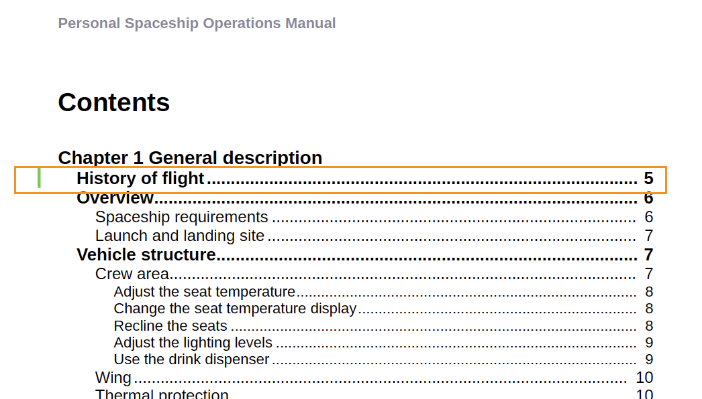

# Adobe Experience Manager Guides as a Cloud Service의 2023년 2월 릴리스의 새로운 기능

이 문서에서는 2023년 2월 Adobe Experience Manager Guides(이후 설명됨)의 새로운 기능 및 향상된 기능을 다룹니다 *AEM Guides as a Cloud Service*).

업그레이드 지침, 호환성 매트릭스 및 이 릴리스에서 해결된 문제에 대한 자세한 내용은 [릴리스 정보](release-notes-2023-2-0.md) 기사.

## 웹 편집기에서 보고서 생성

AEM Guides에는 기술 문서의 전체 완성도를 확인하고 보고서를 생성할 수 있는 웹 편집기 기능이 포함되어 있습니다.
에서 주제 목록을 보고, 메타데이터를 관리하고, 현재 맵의 모든 참조에 사용된 멀티미디어를 볼 수 있습니다.
**보고서** 웹 편집기의 탭

**주제 목록 보기 생성**

참조 유형, 문서 상태 및 작성자와 같은 주제에 대한 자세한 정보를 제공하는 주제 목록을 생성할 수 있습니다. CSV를 생성하여 DITA 맵에 있는 주제의 현재 스냅샷을 다운로드할 수도 있습니다.

**메타데이터 관리 및 문서 상태 변경**

개별 주제에 태그를 적용하거나 벌크 태그 지정 기능을 사용하여 여러 주제, DITA 맵 또는 하위 맵에 여러 태그를 적용할 수 있습니다. 선택한 모든 주제의 문서 상태를 가능한 다음 공통 문서 상태로 변경할 수도 있습니다.

**멀티미디어 보고서 생성**

현재 맵 내에서 참조에 사용된 멀티미디어에 대한 자세한 정보가 포함된 멀티미디어 보고서를 생성할 수 있습니다. 보고서에 나열된 멀티미디어 파일을 필터링하고 정렬할 수 있습니다.
CSV를 생성하여 DITA 맵에 사용된 멀티미디어의 현재 스냅샷을 다운로드할 수도 있습니다.

## 검토 기능을 위한 UX 개선

이제 AEM guides에서는 검토용으로 공유된 주제를 검토하는 데 도움이 되는 향상된 UX를 제공합니다. 최신 경험에서 검토 기능은 다음과 같이 개선되었습니다.

* 사용자 인터페이스 새로 고침
* 항목의 사용 가능한 조건에 따라 콘텐츠를 강조 표시할 수 있는 조건 패널
* [주석] 패널의 각 주석은 현재 주제의 해당 텍스트에 연결됩니다. 주석을 단 텍스트를 식별하는 데 도움이 됩니다.
* 주석은 문서에 있는 주석 텍스트 순서대로 표시됩니다.
* 검토 작업의 이름이 검토 워크플로에 표시됩니다.
* 검토 콘텐츠에 사용된 모든 주요 참조 및 용어집 용어를 해결하는 데 사용되는 검토 작업에 대한 루트 맵을 선택합니다.
* 텍스트를 빠르게 강조 표시하거나 취소하는 데 도움이 되는 상황별 도구 모음
* 자신의 주석을 편집하거나 삭제하는 옵션 메뉴
* 오래된 주석의 경우 주제의 이전 버전을 현재 검토 버전과 비교하는 데 도움이 되는 나란히 볼 수 있는 액세스 권한이 있습니다.
* 필터를 사용할 때 오른쪽 패널의 주석이 선택에 따라 필터링되고 왼쪽 패널의 주석 수가 그에 따라 업데이트됩니다.

  

## 번역 개선 사항

이제 웹 편집기에서 문서를 쉽게 번역할 수 있도록 번역 대시보드에서 보다 사용자 친화적인 개선 사항을 확인할 수 있습니다.

**대상 버전에 버전 레이블 전달**

AEM Guides를 사용하면 소스 파일의 레이블을 대상 파일에 전달할 수 있습니다. 이렇게 하면 번역된 파일의 소스 버전을 쉽게 식별할 수 있습니다.

예를 들어 버전 레이블 릴리스 1.0이 적용된 일부 소스 파일이 있는 경우 소스 레이블(릴리스 1.0)을 번역된 파일에 전달할 수도 있습니다.

**동기화되지 않은 자산에 대한 강제 동기화**

일부 에셋을 변경하는 경우 AEM Guides가 해당 에셋을 동기화되지 않은 것으로 표시합니다. 수정된 자산을 다시 번역하거나 동기화 중단 상태를 해제하도록 선택할 수 있습니다. 예를 들어 번역이 필요하지 않은 일부 사소한 변경 작업을 수행한 경우 해당 상태를 [동기화 중]으로 표시할 수 있습니다.

**주제 또는 맵에 대한 진행 중인 번역 프로젝트 보기**

번역 대시보드의 일부 참조가 진행 중일 수 있습니다. 이제 AEM Guides에서는 선택한 참조가 포함된 진행 중인 모든 번역 프로젝트 목록(대상 언어 포함)을 보는 데 도움이 되는 기능을 제공합니다.

## 웹 편집기에서 다양한 형식의 출력을 생성합니다.

이제 웹 편집기에서 주제나 DITA 맵에 대한 출력을 쉽게 생성할 수 있습니다. AEM Site, PDF, HTML5, JSON(Headless 출력 형식) 및 사용자 지정 출력과 같은 다양한 출력 사전 설정을 구성할 수 있습니다. 그런 다음 이를 사용하여 각 출력을 생성할 수 있습니다.

DITA 주제에서 속성을 정의한 다음 출력을 게시하는 동안 조건 사전 설정을 사용하여 조건을 적용할 수 있습니다. 베이스라인 게시 기능을 사용하여 특정 버전의 DITA 맵이나 주제를 선택적으로 게시할 수도 있습니다.

## 맵 수준에서 텍스트 찾기 및 바꾸기

AEM Guides를 사용하면 맵 내에서 특정 텍스트가 포함된 파일을 검색할 수 있습니다. 검색된 텍스트가 파일에서 강조 표시됩니다. 이제 모든 파일 내에서 검색된 단어나 구를 다른 단어나 구로 바꿀 수도 있습니다. 다음을 선택할 수 있습니다. **모두 바꾸기** 목록 맨 위의 오른쪽에 있는 아이콘을 클릭하면 모든 파일에서 검색된 용어가 모두 교체됩니다.

## 저장소 패널에서 파일 삭제 및 복제

이제에서 파일의 복제본이나 복사본을 쉽게 만들 수 있습니다. **옵션** 저장소 패널에서 선택한 파일의 메뉴입니다. 기본적으로 파일은 접미사(예: `filename_1.extension`).

## 기타 웹 편집기 개선 사항

* AEM Guides에서는 상황에 맞는 메뉴를 사용하여 이미지와 미디어 파일에 대한 몇 가지 일반적인 작업을 수행할 수 있습니다. 이제 저장소에서 선택한 이미지 또는 미디어를 찾거나 에셋 UI에서 파일 미리보기를 볼 수도 있습니다.

* 현재 폴더 프로필의 이름이 기본 도구 모음에 사용자 기본 설정 아이콘의 레이블로 표시됩니다. 이렇게 하면 작업 중인 폴더 프로필을 식별하는 데 도움이 됩니다.

* 맵 보기에서 맵을 열면 현재 맵의 제목이 기본 도구 모음의 중앙에 표시됩니다. 이 기능은 현재 열려 있는 맵을 사용자에게 알리는 데 유용합니다.

## 산소 편집기에서 UUID 대신 제목 보기

이제 AEM Guides를 사용하여 다음을 선택할 수 있습니다. **편집기 및 맵 관리자에서 제목 사용** 옵션 을 참조하십시오. 이 옵션을 선택하면 편집기나 DITA 맵 관리자에서 파일을 열면 파일 제목이 파일의 탭에 표시됩니다. 이 옵션을 선택하지 않으면 파일의 UUID가 파일의 탭에 표시됩니다.

## AEM Guides as a Cloud Service에 대한 Microservice 기반 게시

새로운 게시 마이크로서비스를 사용하면 AEM Guides as a Cloud Service에서 대규모 게시 워크로드를 동시에 실행하고 업계를 선도하는 Adobe I/O Runtime 서버리스 플랫폼을 활용할 수 있습니다.

각 게시 요청에 대해 AEM Guides는 사용자 요청에 따라 가로로 확장되는 별도의 컨테이너를 as a Cloud Service으로 실행합니다. 이를 통해 여러 게시 요청을 실행하고 향상된 성능을 얻을 수 있습니다.

자세한 내용은 [AEM Guides as a Cloud Service에 대한 새로운 마이크로서비스 기반 게시 구성](https://experienceleague.adobe.com/docs/experience-manager-guides-learn/tutorials/knowledge-base/publishing/configure-microservices.md).

## 기본 PDF | PDF 출력에 사용자 지정 책갈피 추가

이제 쉽게 탐색할 수 있도록 최종 PDF 출력의 특정 콘텐츠에 사용자 지정 책갈피를 추가할 수 있습니다. DITA 맵의 주제 또는 섹션 제목에서 생성된 목차에 추가됩니다.

## 기본 PDF | 목차 항목 및 주제 콘텐츠에 사용자 지정 스타일 적용

AEM Guides에서는 목차 항목 또는 PDF 출력의 특정 항목에 사용자 지정 스타일을 적용하는 기능을 제공합니다. 예를 들어 목차와 주제 제목의 텍스트 색상을 변경할 수 있습니다. 주제 내의 전체 내용에 스타일을 적용할 수도 있습니다.

## 기본 PDF | 각주 구성 요소의 페이지 마커 스타일 지정

이제 발 노트의 페이지 마커를 스타일링할 수 있습니다. 예를 들어 대괄호를 추가하거나 색상을 변경할 수 있습니다. 이러한 스타일은 사용자가 문서에서 페이지 마커를 쉽게 식별하는 데 도움이 됩니다.

## 기본 PDF | 목차에서 변경된 주제를 나타내도록 막대 변경

이제 AEM Guides를 사용하여 PDF 출력의 목차에서 변경된 주제를 빠르게 식별할 수 있습니다.  목차에서 변경된 주제 왼쪽에 변경 막대가 표시됩니다. 목차에서 항목을 클릭하고 자세한 변경 내용을 볼 수 있습니다.

