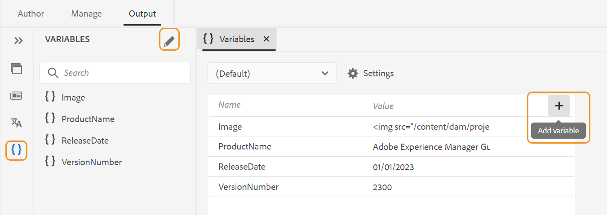
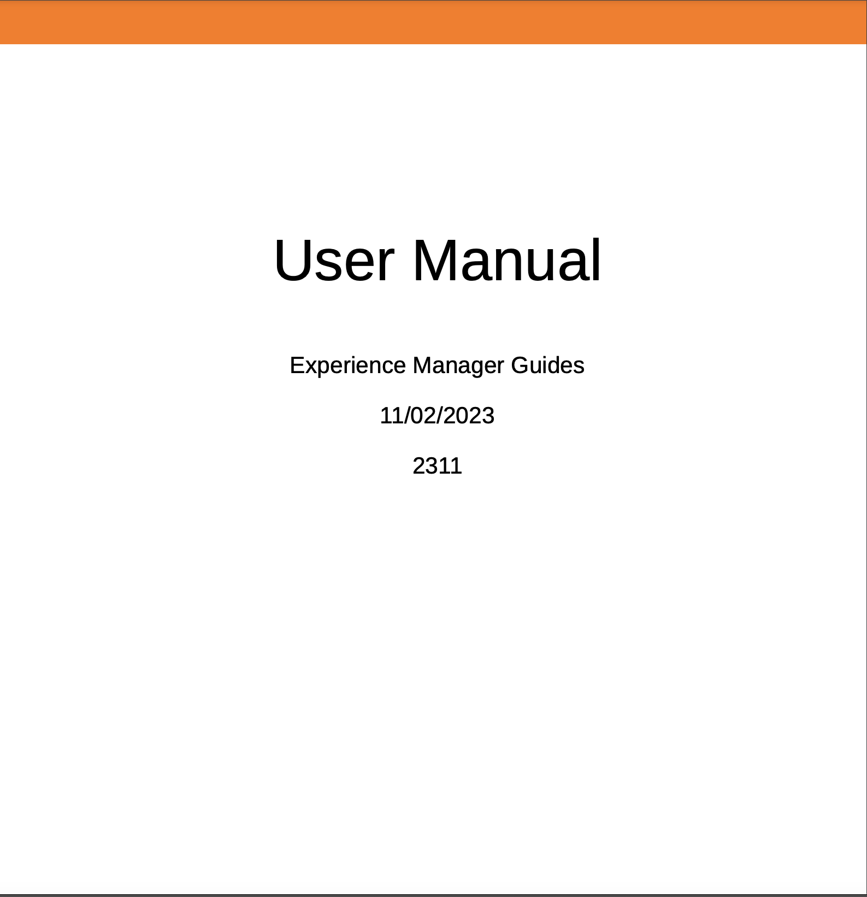

# Adobe Experience Manager Guides as a Cloud Service의 2023년 12월 릴리스의 새로운 기능

이 문서에서는 Adobe Experience Manager 안내서 2023년 12월 버전(나중에 설명됨)의 새로운 기능 및 향상된 기능을 다룹니다 *Experience Manager 가이드 as a Cloud Service*).

업그레이드 지침, 호환성 매트릭스 및 이 릴리스에서 수정된 문제에 대한 자세한 내용은 을 참조하십시오. [릴리스 정보](release-notes-2023.12.0.md).

## PDF 출력에서 변수 사용

변수를 사용하여 재사용 가능한 정보를 동적으로 삽입하고 관리할 수 있습니다. Experience Manager 안내서는 PDF 출력을 생성하는 동안 변수를 만들고, 편집하고, 미리 보는 데 도움이 됩니다. 변수의 값을 빠르게 수정하고 문서를 휴대하고 쉽게 업데이트할 수 있습니다.

{width="800" align="left"}

*웹 편집기에서 변수를 만들고 관리합니다.*

기본값을 재정의하는 변수 세트를 만들고 변수에 대체 값을 할당할 수도 있습니다. 이러한 변수를 페이지 레이아웃에 삽입하고 동일한 PDF 레이아웃을 사용합니다. 모든 값 세트에 대해 별도의 레이아웃을 만들 필요가 없습니다. 예를 들어 각 제품 릴리스에 대해 변수 세트를 만들 수 있습니다. 이 변수 세트는 제품 이름, 버전 번호 및 릴리스 날짜와 같은 다양한 제품 세부 사항에 대한 변수로 구성될 수 있습니다. 그런 다음 이러한 변수에 대해 다른 값을 추가할 수 있습니다.

**변수 세트 1: Adobe-세트1**

* ProductName: Experience Manager 가이드
* 버전 번호: 2311
* 릴리스 날짜: 2023/11/02

**변수 세트 2: Adobe 세트 2**

* ProductName: Experience Manager 가이드
* 버전 번호: 2310
* 릴리스 날짜: 2023/09/27

*PDF 레이아웃의 변수를 사용하여 PDF 출력을 생성합니다.*

스타일을 적용하고 HTML 마크업을 사용하여 변수의 서식을 지정할 수 있습니다.  필요할 때마다 변수의 값을 빠르게 업데이트하고 출력을 재생성할 수도 있습니다. 예를 들어 버전에 대한 세부 정보를 업데이트해야 하는 경우 VersionNumber 변수에서 버전 값을 편집하고 출력을 재생성할 수 있습니다.

사용 방법에 대해 자세히 알아보기 [PDF 출력의 변수](../native-pdf/native-pdf-variables.md).

## 속성 편집을 위한 경험 개선

이제에서 요소에 대한 속성을 추가하거나 편집할 수 있는 개선된 경험을 얻을 수 있습니다. **컨텐츠 속성** 패널을 엽니다.

{width="300" align="left"}

*[컨텐츠 속성] 패널에서 속성을 추가합니다.*

속성을 쉽게 편집하고 삭제할 수도 있습니다.

자세한 내용은 **컨텐츠 속성** 내의 기능 설명 [오른쪽 패널](../user-guide/web-editor-features.md#id2051EB003YK) 섹션.

## 작성 중 메타데이터 편집

이제 작성 중에 의 드롭다운을 사용하여 파일 메타데이터 태그를 업데이트할 수 있습니다. **파일 속성** 오른쪽 패널에서 다음을 선택할 수도 있습니다. **더 많은 속성 편집** 더 많은 메타데이터를 업데이트하십시오.

{width="300" align="left"}

*오른쪽 패널에서 메타데이터를 업데이트하고 파일 속성을 편집합니다.*

자세한 내용은 **파일 속성** 내의 기능 설명 [오른쪽 패널](../user-guide/web-editor-features.md#id2051EB003YK) 섹션.

## ServiceNow 기술 자료에 콘텐츠를 게시하는 기능

이제 콘텐츠를 ServiceNow 기술 자료 플랫폼에 게시할 수도 있습니다.

2023년 12월 릴리스에서는 관리자로서 ServiceNow 기술 자료 서버에 대한 게시 프로필을 만들 수 있습니다. 그런 다음 작성자 또는 게시자는 ServiceNow 게시 프로필을 출력 사전 설정에 선택하여 출력을 지정된 기술 자료에 게시할 수 있습니다.

이 기능을 사용하면 텍스트, 비디오 및 이미지와 같은 콘텐츠를 ServiceNow 기술 자료 플랫폼에 게시하고 포괄적인 저장소를 유지 관리할 수 있습니다.

{width="300" align="left"}

*ServiceNow 기술 자료에 대한 출력 사전 설정을 만듭니다.*

에 대해 자세히 알아보기 [기술 자료](../user-guide/generate-output-knowledge-base.md) 출력 사전 설정.

## 향상된 맵 컬렉션 대시보드

Experience Manager 안내서에서는 향상된 맵 컬렉션 대시보드를 제공합니다. 맵 컬렉션에서 DITA 맵에 대한 메타데이터 속성을 대량으로 빠르게 구성할 수 있습니다. 이 기능은 각 DITA 맵에 대한 메타데이터 속성을 개별적으로 업데이트할 필요가 없으므로 편리합니다.

이제 DITA 맵의 파일 이름을 볼 수 있습니다. 기준선을 볼 수도 있습니다. 사전 설정에 사용되는 기준선을 빠르게 찾을 수 있습니다.

{width="800" align="left"}

*맵 컬렉션 대시보드에서 출력을 보고, 편집하고, 생성합니다.*

방법 알아보기 [출력 생성을 위해 맵 컬렉션 사용](../user-guide/generate-output-use-map-collection-output-generation.md).

## 맵 보기에서 주요 속성 보기

주제 또는 맵 참조에 대한 키 속성을 정의하면 왼쪽 패널에서 제목, 해당 아이콘 및 키를 볼 수도 있습니다. 키가 다음으로 표시됩니다. `key=<key-name>`.

자세한 내용은 **맵 보기** 의 기능 설명 [왼쪽 패널](../user-guide/web-editor-features.md#id2051EA0M0HS) 섹션.

 {width="300" align="left"}

*맵 보기에서 키 속성을 봅니다.*

## 레이블을 기반으로 기준선을 복제하는 기능

이제 Experience Manager 안내서에서 웹 편집기에서 기준선을 만드는 데 사용할 수 있는 향상된 사용자 환경을 제공합니다.\
 {width="300" align="left"}
*웹 편집기에서 기준선을 만듭니다.*

또한 레이블을 기반으로 기준선을 복제할 수도 있습니다. 참조 버전은 복제하는 동안 지정된 레이블(있는 경우)을 기반으로 선택되거나, 복제된 기준선에서 버전을 선택합니다.

 {width="300" align="left"}

*레이블을 기반으로 기준선을 복제하거나 정확한 사본을 만듭니다.*

방법 자세히 알아보기 [웹 편집기에서 기준선 만들기 및 관리](../user-guide/web-editor-baseline.md).

## 벌크 활성화 맵 컬렉션 생성 프로세스 개선

벌크 활성화 맵 컬렉션을 만드는 과정은 이제 더 조화롭다. 이제 활성화 결과 페이지가 표시되면 활성화 결과와 로그를 볼 수 있습니다.
자세한 내용은 다음을 참조하십시오. [벌크 활성화 맵 컬렉션 만들기](../user-guide/conf-bulk-activation-create-map-collection.md).

## AEM Site 출력에서 교차 맵 링크 해결

AEM Site 출력에서 렌더링되는 교차 맵 링크(범위 피어가 있는 XREF)는 이제 생성된 맵에 대해 설정된 게시 컨텍스트의 파일 제목에 따라 확인됩니다.

## 문서 제목을 사용하도록 AEM 사이트 출력의 URL을 구성합니다.

Experience Manager 안내서를 통해 관리자는 AEM Site 출력의 URL을 구성할 수 있습니다. 파일 이름이 존재하지 않거나 모든 특수 문자를 포함하는 경우 AEM Site 출력의 URL에서 구분 기호로 대체하도록 을 구성할 수 있습니다. 첫 번째 하위 주제의 이름으로 바꿀 수도 있습니다. 방법 알아보기 [문서 제목을 사용하도록 AEM 사이트 출력의 URL을 구성합니다](../cs-install-guide/conf-output-generation.md#configure-the-url-of-the-aem-site-output-to-use-the-document-title).

