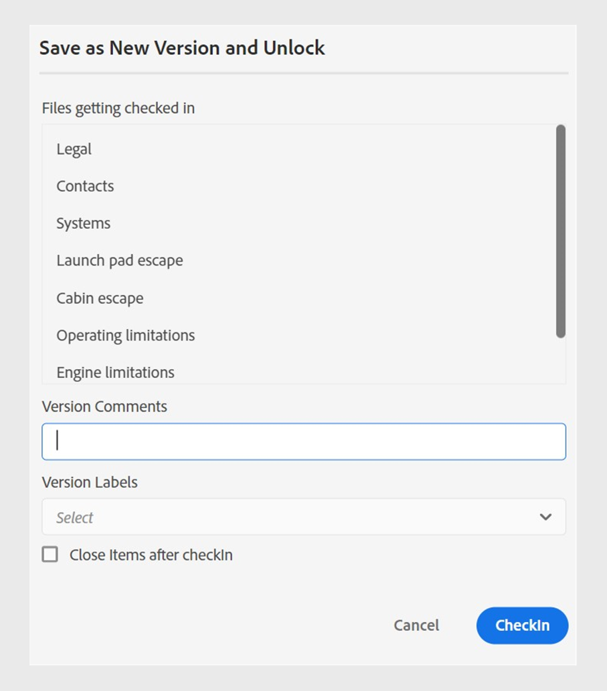

# 2024.4.0 릴리스의 새로운 기능

이 문서에서는 Adobe Experience Manager Guides 2024.4.0 릴리스의 새로운 기능 및 향상된 기능을 다룹니다.

이 릴리스에서 해결된 문제 목록을 보려면 [2024.4.0 릴리스에서 해결된 문제](fixed-issues-2024-04-0.md)를 확인하십시오.

[2024.4.0 릴리스의 업그레이드 지침](upgrade-instructions-2024-04-0.md)에 대해 알아봅니다.

## 사전 구성된 언어 그룹을 사용하여 콘텐츠를 여러 언어로 번역

이제 Experience Manager Guides를 사용하면 언어 그룹을 만들고 콘텐츠를 여러 언어로 간편하게 번역할 수 있습니다. 이 기능은 조직의 필요에 따라 번역을 구성하고 관리하는 데 도움이 됩니다.

예를 들어 유럽 일부 국가의 콘텐츠를 번역해야 하는 경우 영어(EN), 프랑스어(FR), 독일어(DE), 스페인어(ES), 이탈리아어(IT)와 같은 유럽 언어에 대한 언어 그룹을 만들 수 있습니다.

{width="300" align="left"}

*문서를 번역하려는 언어 그룹 또는 언어를 선택합니다.*

>[!NOTE]
>
>언어의 대상 폴더가 없거나 대상 언어가 소스와 동일한 경우 회색으로 표시되며 경고 기호가 나타납니다.

관리자는 언어 그룹을 생성하고 이를 여러 폴더 프로필로 구성할 수 있습니다. 작성자는 폴더 프로필에 구성된 언어 그룹을 조회할 수 있습니다.

언어 그룹을 만들면 번역 프로젝트의 전반적인 효율성과 생산성이 향상되어 궁극적으로 여러 언어에 대한 현지화 프로세스가 개선됩니다.

[웹 편집기에서 문서를 번역하는 방법](../user-guide/translate-documents-web-editor.md)을 알아보세요.

## 번역 후 자동으로 번역 프로젝트 삭제 또는 비활성화

이제 관리자는 번역을 완료한 후 번역 프로젝트를 자동으로 비활성화하거나 삭제하도록 구성할 수 있습니다. 이 기능을 사용하면 번역을 완료한 후 리소스를 효율적으로 사용하고 파일을 관리할 수 있습니다.

프로젝트를 삭제하면 프로젝트에 있는 모든 파일과 폴더가 영구적으로 제거됩니다. 번역 프로젝트를 삭제하면 사용 중인 디스크 공간도 확보할 수 있습니다.

나중에 사용하려면 번역 프로젝트를 비활성화할 수 있습니다.

{width="550" align="left"}

*번역 프로젝트에 대한 언어 그룹 및 정리 설정을 구성합니다.*

[번역 프로젝트를 자동으로 삭제하거나 사용하지 않도록 설정하는 방법](../user-guide/translate-documents-web-editor.md#automatically-delete-or-disable-a-completed-translation-project)에 대해 자세히 알아보세요.

## 미리 보기 인스턴스에서 일괄 활성화 컬렉션에서 맵의 출력을 활성화합니다

이제 게시 인스턴스에서 벌크 활성화 컬렉션에 대한 출력을 활성화할 뿐만 아니라 Cloud Service으로 Experience Manager 가이드가 **미리 보기** 인스턴스에서 활성화할 수 있는 기능을 제공합니다.

이 기능을 사용하면 콘텐츠를 미리 보기 인스턴스로 활성화할 수 있으므로 **Publish** 인스턴스로 활성화하기 전에 콘텐츠의 모양과 작동 방식을 확인할 수 있습니다.

{width="800" align="left"}

***감사 기록**탭에서 활성화된 맵 출력에 대한 정보를 봅니다.*

[일괄 활성화](../user-guide/conf-bulk-activation-publish-map-collection.md)에 대해 자세히 알아보세요.

## 데이터 소스 커넥터의 개선 사항

2024.4.0 릴리스에는 데이터 소스 커넥터에 대한 다음과 같은 개선 사항이 포함됩니다.

### Salsify, Akeneo 및 Microsoft Azure ADO(DevOps Boards) 데이터 소스에 연결

기존의 기본 제공 커넥터 외에도 Experience Manager Guides는 Salsify, Akeneo 및 Microsoft Azure DevOps Boards (ADO) 데이터 소스에 대한 커넥터를 제공합니다. 관리자는 이러한 커넥터를 다운로드하고 설치할 수 있습니다. 그런 다음 설치된 커넥터를 구성합니다.

### 샘플 쿼리를 복사하여 붙여 넣어 콘텐츠 조각 또는 주제를 만듭니다.

생성기에서 샘플 데이터 쿼리를 손쉽게 복사하고 붙여넣어 콘텐츠 스니펫이나 주제를 생성할 수 있습니다. 이 기능을 사용하면 구문을 기억하거나 쿼리를 수동으로 만들 필요가 없습니다. 쿼리를 수동으로 입력하는 대신 샘플 쿼리를 복사하여 붙여넣고 편집한 후 요구 사항에 따라 데이터를 가져오는 데 사용할 수 있습니다.

{width="800" align="left"}

*샘플 쿼리를 복사하고 편집하여 콘텐츠 스니펫을 만듭니다.*

### 파일 커넥터를 사용하여 JSON 데이터 파일에 연결

이제 관리자는 JSON 데이터 파일을 데이터 소스로 사용하도록 JSON 파일 커넥터를 구성할 수 있습니다. 커넥터를 사용하여 컴퓨터 또는 Adobe Experience Manager Assets에서 JSON 파일을 가져옵니다. 그런 다음 작성자는 생성기를 사용하여 콘텐츠 조각이나 주제를 만들 수 있습니다.

이 기능을 사용하면 JSON 파일에 저장된 데이터를 사용하고 다양한 스니펫에서 재사용할 수 있습니다. JSON 파일을 업데이트할 때마다 콘텐츠도 동적으로 업데이트됩니다.

### 커넥터에 대한 여러 리소스 URL을 구성하여 콘텐츠 조각 또는 주제를 만듭니다

관리자는 일반 REST 클라이언트, Salsify, Akeneo 및 Microsoft Azure DevOps 보드(ADO)와 같은 일부 커넥터에 대해 여러 리소스 URL을 구성할 수 있습니다.

그런 다음 작성자는 데이터 소스에 연결하여 생성기를 사용하여 콘텐츠 스니펫이나 주제를 만듭니다. 이 기능을 사용하면 각 URL에 대한 데이터 소스를 만들 필요가 없기 때문에 유용합니다. 따라서 단일 콘텐츠 조각 또는 주제의 특정 데이터 소스에 대한 리소스에서 데이터를 빠르게 가져올 수 있습니다.

데이터 원본 커넥터에 대한 자세한 내용 및 [사용자 인터페이스에서 데이터 원본 커넥터를 구성하는 방법](../cs-install-guide/conf-data-source-connector-tools.md)을 참조하세요.

[데이터 소스의 데이터를 사용하는 방법](../user-guide/web-editor-content-snippet.md)에 대해 알아봅니다.

## 사용자 환경 설정의 새로운 UI를 사용하여 웹 편집기 환경 맞춤화

이제 웹 편집기의 **사용자 환경 설정** 대화 상자에 새 **모양** 탭이 포함됩니다. 이 새 탭에서는 웹 편집기 인터페이스에서 가장 일반적인 모양과 느낌의 환경 설정을 편리하게 구성할 수 있습니다.

제목 또는 파일 이름별로 파일을 보도록 구성하고 응용 프로그램의 테마 및 소스 보기를 변경할 수 있습니다. 또한 저장소 보기에서 열린 파일을 찾고 줄바꿈하지 않는 공백을 처리하도록 설정을 구성하는 데 도움이 됩니다.

사용자 환경 설정의 {width="550" align="left"}

*기본 설정에 따라 모양을 사용자 지정합니다.*

[왼쪽 패널](../user-guide/web-editor-features.md#id2051EA0M0HS) 섹션에서 **사용자 환경 설정** 기능 설명에 대해 자세히 알아보세요.

## 웹 편집기의 저장소 보기에서 열려 있는 파일을 찾습니다

**사용자 환경 설정**&#x200B;에서 **항상 리포지토리에서 파일 찾기** 옵션을 선택하여 리포지토리 보기에서 파일을 빠르게 탐색하고 찾습니다. 수동으로 검색할 필요가 없습니다.

편집하는 동안 이 기능을 사용하면 저장소 계층 구조 내에서 파일의 위치를 쉽게 볼 수도 있습니다.

자세한 내용은 [저장소 보기에서 열려 있는 파일을 찾습니다](../user-guide/web-editor-edit-topics.md#locate-an-open-file-in-the-repository-view)를 참조하십시오.

## 웹 편집기에서 줄바꿈하지 않는 공백에 대한 처리가 개선되었습니다.

Experience Manager Guides을 사용하면 웹 편집기에서 문서를 편집하는 동안 줄바꿈하지 않는 공백 표시기를 표시할 수 있습니다. 또한 줄바꿈하지 않는 공백의 처리도 향상됩니다.
연속된 여러 공백을 단일 공백으로 변환하여 웹 편집기에서 문서의 WYSIWYG 보기를 유지합니다. 이 기능은 문서의 전체 모양과 전문성을 개선하는 데도 도움이 됩니다.

자세한 내용은 웹 편집기의 [기타 기능](../user-guide/web-editor-other-features.md)을 참조하세요.

## Adobe Experience Manager Assets의 선택적 폴더에 대한 사후 처리 비활성화

이제 관리자는 Experience Manager Assets의 선택적 폴더에 대해 사후 처리 및 UUID 생성을 비활성화할 수 있습니다. 이 구성은 특히 많은 에셋 또는 복잡한 폴더 구조를 처리할 때 유용할 수 있습니다. 또한 여러 사용자가 서로 간섭하지 않고 자산을 동시에 빠르게 업로드할 수 있습니다.  

폴더에 대한 사후 처리를 비활성화하면 모든 하위 폴더에도 영향을 줍니다. 그러나 이제 Experience Manager Guides에서는 무시된 폴더 내의 개별 하위 폴더에 대해 사후 처리를 선택적으로 활성화할 수 있는 기능을 제공합니다.

[폴더에 대한 후처리를 사용하지 않도록 설정하는 방법](../cs-install-guide/conf-folder-post-processing.md)을 알아보세요.

## 저장소 보기에서 파일을 검색하고 필터링할 수 있는 경험이 개선되었습니다.

이제 파일을 필터링하는 동안 향상된 환경을 경험할 수 있습니다. 향상된 파일 필터링 기능은 파일을 쉽게 검색하고 탐색할 수 있는 향상된 방법을 제공합니다.

{width="300" align="left"}

*텍스트가 포함된 파일 검색`general purpose.`*

관련 파일에 대한 더 빠른 액세스, 더 직관적인 사용자 인터페이스 등의 이점을 활용하여 검색 환경을 더욱 원활하고 효율적으로 만들어 보십시오.

 {width="300" align="left"}

*빠른 필터를 사용하여 DITA 및 비 DITA 파일을 검색합니다.*

[왼쪽 패널](../user-guide/web-editor-features.md#id2051EA0M0HS) 섹션의 **필터 검색** 기능에 대해 자세히 알아보십시오.

## 위치에 따라 유효한 요소를 보고 삽입하기 위한 분리된 목록

이제 웹 편집기에서 문서를 편집하는 동안 현재 위치와 현재 위치 외부에 유효한 분리된 요소 목록을 볼 수 있습니다. 요구 사항에 따라 다음 옵션 중에서 요소를 선택합니다.

* 현재 커서 위치 자체에 삽입할 수 있는 **현재 위치의 올바른 요소**.
* **현재 위치 외부에 있는 올바른 요소** 요소 계층 내에서 현재 요소의 부모 뒤에 삽입할 수 있습니다.

{width="300" align="left"}

*현재 위치에 요소를 삽입할 올바른 요소의 분리된 목록을 봅니다.*

이 유효한 요소의 분할 목록은 콘텐츠 구조를 유지하고 DITA 표준을 따르는 데 도움이 됩니다.

[보조 도구 모음](../user-guide/web-editor-features.md#2051ea0j0y4) 섹션에서 **요소 삽입** 기능에 대해 자세히 알아보세요.

## 콘텐츠 속성 유형 이 드롭다운 메뉴로 표시됩니다.

이제 콘텐츠 속성 **Type**&#x200B;이(가) 드롭다운 메뉴로 나타납니다. 드롭다운에서 현재 태그에 대한 전체 계층의 태그를 보고 선택할 수 있습니다.

이 드롭다운 메뉴를 사용하면 계층 구조 내에서 관련 태그에 빠르게 액세스할 수 있습니다.

{width="300" align="left"}

*현재 태그에 대한 계층 구조에서 태그를 선택하십시오.*

[오른쪽 패널](../user-guide/web-editor-features.md#id2051eb003yk) 섹션에서 **콘텐츠 속성** 기능에 대해 자세히 알아보세요.

## 맵 편집기에서 파일을 일괄적으로 확인하는 동안 성능이 향상되었습니다.

Experience Manager Guides은 맵 편집기에서 대량 파일 체크인 기능의 성능과 경험을 개선합니다. 이 개선 사항은 파일을 더 빨리 대량으로 체크 인하는 데 도움이 됩니다.
**새 버전으로 저장 및 잠금 해제** 대화 상자에서 파일에 대한 체크 인 작업의 진행 상황을 볼 수도 있습니다. 마지막으로 작업이 완료되고 선택한 모든 체크 아웃된 파일이 체크 인되면 성공 메시지가 나타납니다.

{width="300" align="left"}

*맵 편집기에서 일괄적으로 검사한 파일의 목록과 상태를 봅니다.*

[고급 맵 편집기로 작업하는 방법](../user-guide/map-editor-advanced-map-editor.md) 알아보기

## DITA-OT를 통해 출력을 생성하는 동안 임시 파일 다운로드

AEM Site, HTML, 사용자 지정, JSON 또는 PDF 출력을 DITA-OT를 통해 게시할 때 생성된 임시 파일을 다운로드할 수도 있습니다. 이 기능을 사용하면 출력 생성 프로세스 중에 발생할 수 있는 문제를 분석하고 효과적으로 해결할 수 있습니다.  
DITA-OT를 사용하여 생성된 출력으로 전달된 메타데이터 속성을 선택한 경우 metadata.xml 파일을 다운로드할 수도 있습니다. 

사전 설정에 대한 자세한 내용은 [출력 사전 설정 이해](../user-guide/generate-output-understand-presets.md)를 참조하십시오.

## IMS JWT 자격 증명을 Microservice 기반 게시를 위한 IMS OAuth 자격 증명으로 바꾸기

서비스 계정(JWT) 자격 증명은 **OAuth 서버 간** 자격 증명을 위해 더 이상 사용되지 않습니다. 서비스 계정(JWT) 자격 증명을 사용하는 응용 프로그램은 2025년 1월 1일 이후에 작동을 중지합니다. 애플리케이션이 계속 작동하도록 하려면 2025년 1월 1일까지 새 자격 증명으로 마이그레이션해야 합니다.

이제 Experience Manager Guides용 클라우드 게시 서비스는 Adobe IMS OAuth 기반 인증으로 보호됩니다. [OAuth 인증을 통해 마이크로서비스 기반 게시를 구성](../knowledge-base/publishing/configure-microservices-imt-config.md)하는 방법에 대해 알아봅니다.
