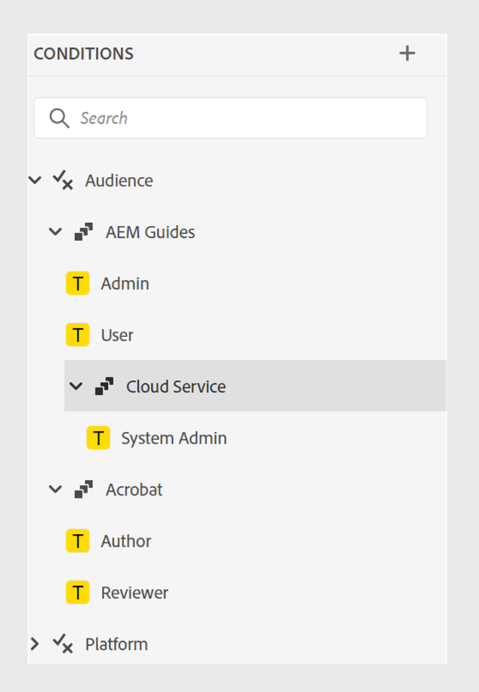

# 2024.10.0 릴리스(2024년 10월)의 새로운 기능

이 문서에서는 Adobe Experience Manager Guides as a Cloud Service 2024.10.0 릴리스와 함께 도입된 새로운 기능과 향상된 기능을 다룹니다.

이 릴리스에서 해결된 문제 목록을 보려면 [2024.10.0 릴리스에서 해결된 문제](fixed-issues-2024-10-0.md)를 확인하십시오.

[2024.10.0 릴리스의 업그레이드 지침](../release-info/upgrade-instructions-2024-10-0.md)에 대해 알아봅니다.

## 향상된 게시 기능

2024.10.0 릴리스에서는 다음과 같은 콘텐츠 게시 기능이 개선되었습니다.

### 콘텐츠 조각 게시의 개선 사항

Experience Manager Guides은 또한 콘텐츠 조각에 몇 가지 유용한 개선 사항을 제공합니다.

- Experience Manager Guides을 사용하면 주제 또는 해당 요소를 콘텐츠 조각에 게시할 수 있습니다.

- **파일 속성**&#x200B;의 **출력** 섹션에서 주제의 콘텐츠 조각을 게시하고 볼 수 있습니다.

- 콘텐츠 조각에 게시하는 동안 조건으로 콘텐츠를 필터링하여 콘텐츠 조각 변형을 쉽게 만들 수 있습니다.

- 새 매핑 인터페이스를 사용하여 요소를 쉽게 선택하고 컨텐츠 조각에 게시할 수 있습니다.

이제 콘텐츠 조각 게시는 전체 콘텐츠 조각을 덮어쓰는 대신 매핑된 콘텐츠만 대체합니다. 이 기능을 사용하면 콘텐츠 조각에 여러 주제 또는 콘텐츠 조각 편집기와 같은 여러 소스의 데이터가 포함될 수 있습니다.

자세한 내용은 [Publish 콘텐츠 조각](../user-guide/publish-content-fragment.md)을 참조하세요.

### 조건 필터를 기반으로 하는 Publish 경험 조각 변형

Experience Manager Guides을 사용하면 주제 또는 해당 요소를 경험 조각에 게시할 수 있습니다. 이제 조건 또는 DITAVAL 필터를 사용하여 경험 조각 변형을 만들고 여러 채널 또는 여러 대상에 재사용할 수도 있습니다.

[Publish 경험 조각](../user-guide/publish-experience-fragment.md)을 만드는 방법에 대해 자세히 알아보세요.

### 사용하기 쉽도록 AEM Sites 사전 설정 재구성됨

출력 사전 설정을 빠르게 구성하고 AEM Sites 출력을 생성하는 데 도움이 되도록 설정이 재구성되었습니다.
**새 출력 사전 설정** 대화 상자에서 **기존 구성 요소 매핑 사용** 옵션을 선택하여 기존 AEM Sites 사전 설정을 만들 수 있습니다.

AEM Sites 사전 설정에서 **일반**, **콘텐츠** 및 **교차 맵 참조** 탭을 봅니다.
- **일반**: 출력을 생성하는 일반 구성을 포함합니다. 사이트 및 출력 경로를 지정하고, 기존 출력 페이지를 삭제 또는 덮어쓰고, 제거된 주제에 대해 이전에 생성된 페이지를 삭제하고, 디자인 템플릿을 선택하고, 임시 파일을 유지하고, 사후 생성 워크플로우를 지정할 수 있습니다.
- **Content**: 출력 생성을 위해 콘텐츠에 적용할 수 있는 설정이 포함되어 있습니다. 필터, DITA 맵의 기준선 및 게시할 메타데이터 속성을 선택할 수 있습니다.
- **교차 맵 참조**: 이 목록에는 범위 =&quot;peer&quot;가 있는 교차 맵 참조가 포함된 항목이 포함되어 있습니다. 다른 DITA 맵에서 사용할 수 있는 주제에 대해 scope=&quot;peer&quot;를 사용하여 교차 맵 참조 목록에 대한 게시 컨텍스트를 지정할 수 있습니다. 이 탭은 Experience Manager Guides(UUID) 버전을 사용하는 경우에 나타납니다.

### 웹 편집기의 AEM Sites 사전 설정에서 교차 맵 참조

Experience Manager Guides의 최신 개선 사항에서는 웹 편집기의 AEM Sites 사전 설정에서 교차 맵 참조를 도입했습니다.
Experience Manager Guides의 교차 맵 참조는 콘텐츠 탐색을 개선하고, 콘텐츠 재사용을 늘리며, 사용자 경험을 개선하는 데 도움이 됩니다.

scope=&quot;peer&quot;가 있는 다른 DITA 맵에서 사용할 수 있는 주제에 대한 교차 맵 참조 목록에 대한 게시 컨텍스트를 지정할 수 있습니다. 예를 들어 맵 A의 항목 1에는 항목 2에 대한 참조가 포함되어 있습니다. 주제 2는 단일 또는 다중 지도에 존재할 수 있다.  각 링크에 대해 상위 맵과 특정 사전 설정 또는 가장 최근에 게시된 출력을 선택할 수 있습니다.

파일에서 동일한 주제가 두 번 이상 참조되는 경우 각 인스턴스에 대해 다른 게시 컨텍스트를 추가할 수 있습니다. 따라서 컨텐츠를 보다 유연하게 제어하고 제어할 수 있습니다. 예를 들어 항목 3은 맵 B와 맵 C 모두에 있습니다. 항목 1에는 항목 3에 대한 두 개의 참조가 포함되어 있습니다. 맵 B를 첫 번째 링크의 상위 맵으로 선택하고 맵 C를 두 번째 링크의 상위 맵으로 선택할 수 있습니다.

***AEM Sites**&#x200B;사전 설정의&#x200B;**상호 맵 참조**&#x200B;탭에서 연결된 주제에 대한 게시 컨텍스트를 지정하십시오.*

[AEM Sites 사전 설정](../user-guide/generate-output-aem-site.md)에 대해 자세히 알아보세요.

### HTML5 출력에 대해 플랫 파일 계층이나 중첩 파일 계층을 선택하는 옵션

이제 Experience Manager Guides을 사용하면 전체 콘텐츠가 HTML5 출력 형식으로 게시되고 단일 폴더에 저장되는 임시 파일에 대한 플랫 폴더 계층 구조를 유지할 수 있습니다.
파일 계층 구조를 병합하지 않으면 HTML5 출력이 중첩 폴더 계층 구조로 생성됩니다. 즉, 하위 폴더로 구성된 파일이 있는 컨텐츠의 원래 폴더 구조가 출력에서 복제됩니다. 이 중첩된 폴더 계층 구조를 사용하면 파일을 보다 복잡하게 구성하고 분류할 수 있으므로 대량의 데이터를 보다 쉽게 관리하고 탐색할 수 있습니다.

[HTML5 출력을 생성](../user-guide/generate-output-html5.md)하는 방법에 대해 자세히 알아보세요.

## 편집기 개선 사항

2024.10.0 릴리스에 다음과 같은 편집기 개선 사항이 추가되었습니다.

### 잠긴 파일의 작성자 및 Source 모드에 대한 읽기 전용 액세스

다른 사용자가 DITA 또는 Markdown 파일을 잠갔거나 체크 아웃한 경우에는 내용을 편집하거나 변경할 수 없습니다. 미리보기 외에 작성자 또는 Source 모드에서 읽기 전용 파일로 볼 수도 있습니다.
읽기 전용 모드에서는 **작성자** 또는 **Source** 모드에서 태그 및 특성과 함께 콘텐츠를 보고 파일 속성을 편집할 수 있습니다.

읽기 전용 DITA 맵에 대해 **레이아웃** 보기에 액세스할 수도 있습니다.
>[!NOTE]
>
> 작성자, Source 및 레이아웃 모드에서 읽기 전용 파일에 조화롭게 액세스할 수 있도록 폴더 프로필 관리자는 *ui_config.json*&#x200B;을(를) 업데이트해야 합니다.

*작성자 및 Source 모드에서 잠긴 파일을 봅니다.*

[Author 및 Source 모드에서 잠긴 파일을 여는 방법](../user-guide/web-editor-edit-topics.md#open-locked-files-in-author-and-source-modes)을 알아봅니다.

### 향상된 콘텐츠 구성을 위한 그룹화된 조건

이제 Experience Manager Guides을 사용하여 조건을 그룹화하고 중첩된 계층에 표시할 수 있으므로 여러 조건을 단일 그룹에 추가할 수 있습니다. 조건을 그룹화하면 콘텐츠에서 더 잘 구성하고 적용할 수 있습니다.

{width="300" align="left"}

[왼쪽 패널](../user-guide/web-editor-features.md#id2051EA0M0HS) 섹션에서 **조건** 기능 설명에 대해 자세히 알아보세요.

