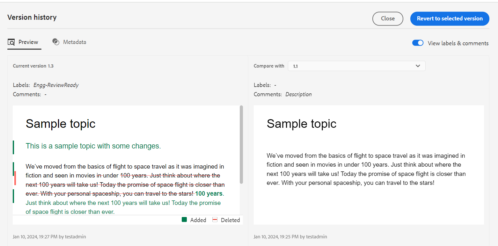
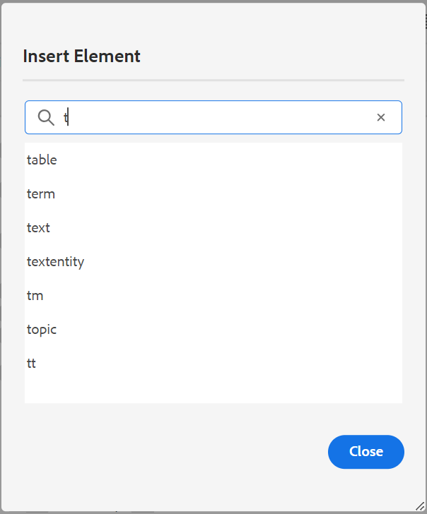

# Adobe Experience Manager Guides as a Cloud Service의 2024년 2월 릴리스의 새로운 기능

이 문서에서는 2024년 2월 Adobe Experience Manager 안내서(나중에 설명됨)의 새로운 기능과 향상된 기능을 다룹니다 *Experience Manager 가이드 as a Cloud Service*).

업그레이드 지침, 호환성 매트릭스 및 이 릴리스에서 수정된 문제에 대한 자세한 내용은 을 참조하십시오. [릴리스 정보](release-notes-2023-12-0.md).

## 콘텐츠 작성자를 위한 AI 기반 스마트 제안

이제 웹 편집기의 새로운 AI 기반 기능인 스마트 추천 기능을 사용하여 작성 여정을 향상시킬 수 있습니다. 이 지능형 기능은 콘텐츠를 작성하는 동안 콘텐츠 참조에 대한 실시간 제안 사항을 제공하여 워크플로를 개선하고 정확성을 높이며 탁월한 효율성을 보장합니다.

콘텐츠를 정확하고 일관되게 유지하기 위해 검색 및 제안은 조직이 소유한 콘텐츠로 제한되고 검색하는 키워드와 거의 일치합니다.

 {width="800" align="left"}

*스마트 제안을 보고 콘텐츠 저장소에서 일치하는 콘텐츠 참조를 찾아 추가합니다.*

다른 항목에서 현재 콘텐츠를 유사한 콘텐츠와 비교할 수도 있습니다. 그런 다음 다양한 주제에서 콘텐츠 조각을 쉽게 선택하여 현재 주제에 콘텐츠 참조로 추가할 수 있습니다. 콘텐츠 참조를 추가하면 특히 대규모 문서 프로젝트에서 업데이트를 보다 쉽게 관리할 수 있습니다. 예를 들어, 제품의 최신 기능에 대한 브로셔를 만든다고 가정합니다. 이 경우 관련 기능 문서에서 업데이트된 사양을 컨텐트 참조로 신속하게 추가할 수 있습니다.

이 지능형 기능을 사용하면 관련 컨텐츠를 수동으로 검색하는 수작업이 줄어들고 새로운 컨텐츠 생성에 집중할 수 있습니다.  또한 일관성을 유지하고 팀 협업을 향상하는 데 도움이 됩니다.

## 웹 편집기의 버전 내역 기능 개선

이제 Experience Manager 안내서에서는 시간이 지남에 따라 문서에 수행된 변경 사항을 비교할 수 있도록 해주는 향상된 버전 기록 기능을 제공합니다. 새 나란히 보기에서 현재 버전의 콘텐츠 및 메타데이터를 동일한 문서의 이전 버전과 쉽게 비교할 수 있습니다. 비교 버전에 대한 레이블과 주석을 볼 수도 있습니다. 관리자는 주제의 버전 메타데이터와 해당 값을 **버전 기록** 대화 상자.

{width="800" align="left"}
*주제의 다른 버전에서 변경 사항을 미리 봅니다.*

에 대해 자세히 알아보기 **버전 기록** 의 기능 설명 [왼쪽 패널](../user-guide/web-editor-features.md#id2051EA0M0HS) 섹션.

## 향상된 번역 패널

다음 **번역** 패널이 개선되었습니다.  다음을 볼 수 있습니다. **사용 가능한 언어** 프로젝트를 번역할 로케일을 나열하고 빠르게 선택합니다. 단일 선택 항목을 사용하여 다음을 선택할 수도 있습니다 **모두 선택** 을 클릭하여 프로젝트를 사용 가능한 모든 언어로 번역할 수 있습니다.

{width="300" align="left"}

*프로젝트를 번역할 로케일을 선택합니다. 번역할 파일의 기본, 기준선 또는 최신 버전을 선택합니다.*

방법 자세히 알아보기 [콘텐츠 번역](../user-guide/translation.md).

## 요소 삽입 대화 상자의 검색 논리가 개선되었습니다.

이제 요소 삽입 대화 상자에서 요소를 쉽게 찾을 수 있습니다.  검색 상자에 문자열을 입력하고 입력한 문자열로 시작하는 모든 유효한 요소의 목록을 가져올 수 있습니다.

예를 들어, 요소를 삽입할 단락을 편집하는 동안 문자 &#39;t&#39;를 검색하여 &#39;t&#39;로 시작하는 유효한 모든 요소를 가져올 수 있습니다.

{width="300" align="left"}

*문자로 시작하는 모든 유효한 요소를 검색하려면 문자를 입력합니다.*

자세한 내용은 **요소 삽입** 의 기능 설명 [왼쪽 패널](../user-guide/web-editor-features.md#id2051EA0M0HS) 섹션.

## 동일한 수준에서 목록을 분할하는 기능

이제 웹 편집기에서 목록을 쉽게 분할할 수 있습니다. 다음 항목 선택 **목록 분할** 현재 목록을 분할하려면 목록 항목의 컨텍스트 메뉴에서 옵션을 선택합니다. 분할을 위해 선택한 목록 항목부터 시작하여 동일한 레벨에 새 목록이 생성됩니다.

{width="300" align="left"}

*현재 목록을 분할하려면 옵션을 선택합니다.*

자세한 내용은 **목록 삽입** 의 기능 설명 [왼쪽 패널](../user-guide/web-editor-features.md#id2051EA0M0HS) 섹션.

## 작성의 소스 모드에서 파일 속성에 액세스

이제 오른쪽 패널에 액세스할 수 있습니다 **파일 속성** 레이아웃, 작성자, 소스, 미리보기 등 네 가지 모드 또는 보기에서 모두 사용할 수 있습니다.  이렇게 하면 다른 모드 간에 전환하는 경우에도 파일의 속성을 볼 수 있습니다.

자세한 내용은 **파일 속성** 의 기능 설명 [오른쪽 패널](../user-guide/web-editor-features.md#id2051EB003YK) 섹션.

## 여러 출력 사전 설정을 동시에 게시

Experience Manager은 적용된 레이블에 따라 항목을 자동으로 선택하여 기준선을 만드는 기능을 제공합니다. 이제 동일한 DITA 맵의 자동 기준선을 사용하여 여러 출력 사전 설정을 원활하게 게시할 수도 있습니다. 한 번에 하나의 사전 설정만 게시할 필요는 없지만 여러 출력 사전 설정을 동시에 쉽게 게시할 수 있습니다.

## 기본 PDF 개선 사항

2024년 2월 릴리스에서는 다음과 같은 네이티브 PDF 기능이 개선되었습니다.

### PDF 출력에 에셋 메타데이터 전달

이제 Experience Manager은 DITA 맵의 에셋 메타데이터 속성을 PDF 출력으로 전달하는 기능을 제공합니다.
기본 PDF 출력 사전 설정에서 PDF 게시 프로세스에 전달할 메타데이터를 선택할 수 있습니다. 사용자 지정 속성과 기본 속성을 모두 선택할 수 있습니다.  선택한 메타데이터 속성은 기본 PDF을 사용하여 생성된 PDF 파일로 전달됩니다.

이 기능은 작성자, 작성 날짜 또는 문서 제목과 같은 에셋 속성을 일관되게 유지하는 데 도움이 되므로 편리합니다. 이렇게 하면 문서를 보다 쉽게 구성, 검색 및 분류할 수 있습니다.

자세한 내용은 **고급** 의 설정 [PDF 출력 게시](../web-editor/native-pdf-web-editor.md).

### 에 추가된 메타데이터 사용 `topicmeta` PDF 출력용 요소

기본 PDF 게시의 메타데이터 기능은 콘텐츠 관리에 도움이 되며 인터넷에서 파일을 검색하는 데 도움이 됩니다.

*메타데이터 옵션을 추가하고 사용자 지정하려면 옵션을 선택하십시오.*

이제 Experience Manager 안내서에서 추가한 메타데이터를 사용하는 옵션을 제공합니다. `topicmeta` PDF 출력의 메타데이터 필드를 채우는 DITA 맵의 요소입니다. 이 옵션은 기본적으로 선택되어 있습니다.

이 기능은 더 나은 문서 관리에 도움이 되고 일관성을 보장하며 문서를 검색할 수 있게 해 줍니다.

자세히 알아보려면 **메타데이터** 의 탭 [PDF 출력 게시](../web-editor/native-pdf-web-editor.md).