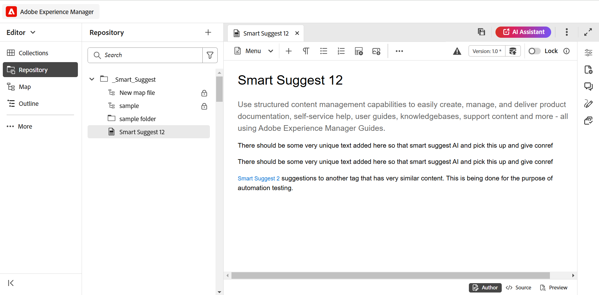

# 2025.02.0 릴리스의 새로운 기능(2025년 2월)

이 문서에서는 Adobe Experience Manager Guides as a Cloud Service 2025.02.0 릴리스와 함께 도입된 새로운 기능 및 향상된 기능을 다룹니다.

## 생산성 및 경험 향상을 위한 Experience Manager Guides UI 개선

이제 Adobe Experience Manager Guides은 이전보다 빠르고 효율적으로 작업할 수 있도록 개선된 디자인과 향상된 기능을 제공합니다. 새로운 UI는 완전히 새로운 홈 페이지, 보다 깔끔하고 조직화된 편집기 도구 모음, 전용 맵 콘솔 및 향상된 기능을 통해 직관적이고 향상된 사용자 경험을 제공합니다.

주요 기능은 다음과 같습니다.

- **홈 페이지 소개**: 이제 Experience Manager Guides에는 최근에 액세스한 파일, 컬렉션 등의 빠른 보기를 포함하여 직관적인 시작 화면 환경을 제공하는 홈 페이지가 있습니다.

  자세한 내용은 [Adobe Experience Manager Guides 홈 페이지 경험](../user-guide/intro-home-page.md)을 참조하세요.

  {width="800" align="left"}

- **새로운 편집기 경험**: 이제 새로운 모양과 느낌으로 편집기를 경험해 보십시오. 개선된 편집기 인터페이스에서는 보다 깔끔하고 조직적인 도구 모음, 원활한 탐색 및 전반적으로 직관적인 환경을 통해 문서를 보다 빠르고 효율적으로 작성할 수 있습니다.

  [편집기 기능을 알아보세요](../user-guide/web-editor-features.md).

  {width="800" align="left"}

- **전용 맵 콘솔**: 모든 맵 관리 및 게시 기능이 병합되는 전용 콘솔인 맵 콘솔을 소개합니다. 이제 하나의 인터페이스에서 출력을 생성하고, 콘텐츠를 번역하고, 보고서를 작성하는 등의 옵션을 사용할 수 있습니다.

  [맵 관리 및 게시](../user-guide/map-console-overview.md)에 대해 자세히 알아보세요.

  {width="800" align="left"}

## Adobe Workfront과 통합하여 강력한 작업 관리 기능

이제 Experience Manager Guides은 Adobe Workfront과 원활하게 통합되어 Experience Manager Guides 핵심 CCMS 기능 외에도 강력한 프로젝트 관리 기능에 액세스할 수 있습니다.

이 통합을 통해 Experience Manager Guides에서 직접 Adobe Workfront 작업을 만들고 관리할 수 있습니다. 예를 들어 작성자는 Experience Manager Guides 인터페이스 내에서 직접 검토 작업(하나 이상의 DITA 주제 또는 맵이 추가됨)을 만들어 검토자에게 할당할 수 있습니다. 검토자는 Experience Manager Guides Review UI에서 할당된 작업에 대해 작업하고 주석을 포함하여 작성자에게 반환할 수 있습니다. 마찬가지로 게시 및 번역 작업을 만든 다음 이를 작업에 필요한 사용자에게 할당할 수 있습니다.

또한 통합은 작업 대기열을 모니터링하는 기능을 제공하여 모든 작업(할당된 작업)을 체계적으로 관리할 수 있습니다. 또한 프로젝트 관리자는 Adobe Workfront의 강력한 기능을 활용하여 Experience Manager Guides 내에서 프로젝트를 심층적으로 관리할 수 있습니다.

자세한 내용은 [Workfront 통합](../user-guide/workfront-integration.md)을 참조하세요.

{width="800" align="left"}

## 생산성 향상을 위한 스마트 작성 및 도움말 기능이 포함된 AI Assistant(Beta)

이제 Experience Manager Guides의 AI 기반 스마트 작성 및 도움말 기능을 통해 향상된 생산성을 경험해 보십시오. AI Assistant를 사용하면 스마트 작성 기능과 스마트 제안을 통해 기존 저장소의 콘텐츠를 재사용하여 효율성을 높일 수 있습니다. 스마트 도움말을 사용하여 Experience Manager Guides 기능, 워크플로 등과 관련된 쿼리에 대한 적절한 답변을 신속하게 찾을 수 있습니다.

자세한 내용은 Experience Manager Guides의 [AI 길잡이](../user-guide/ai-assistant.md)를 참조하세요.

{width="300" align="left"}

## 더 빠르고 확장 가능한 새로운 AEM Sites 게시 엔진

빠른 페이지 생성 및 렌더링을 위해 합성 구성 요소 매핑으로 최적화된 완전히 새로운 게시 엔진을 사용하여 AEM Sites에 보다 빠르고 확장 가능한 게시를 경험하십시오. AEM 템플릿 편집기를 사용하여 요구 사항에 따라 사용자 정의할 수 있는 새로운 편집 가능한 템플릿에서 사용할 수 있습니다. 템플릿은 WCM 코어 구성 요소와 전문 안내서 구성 요소의 조합을 활용하여 최종 사용자가 AEM Sites 페이지에서 최상의 경험을 얻을 수 있도록 합니다. 이 새로운 게시 엔진의 기능을 활용하도록 기존 템플릿을 사용자 지정할 수도 있습니다.

[AEM Sites 게시](../user-guide/generate-output-aem-site-web-editor.md)에 대해 자세히 알아보세요.

{width="500" align="left"}

## 단일 주제 게시로 독립 실행형 콘텐츠를 AEM Sites에 원활하게 게시

전체 맵을 게시하지 않고도 개별 주제를 AEM Sites 페이지에 직접 게시할 수 있도록 하는 AEM Sites 페이지에 단일 주제 게시를 소개합니다.  이렇게 하면 게시 프로세스가 간소화되므로 마케팅 콘텐츠, 기술 게시판 또는 기타 독립 실행형 콘텐츠와 같은 독립 실행형 콘텐츠로 작업할 때 보다 효율적입니다. 또한 단일 주제를 게시하기 위해 맵을 만들 필요가 없어 콘텐츠 유지 관리를 간소화합니다.

자세한 내용은 [AEM Sites 페이지 게시](../user-guide/publish-aem-sites.md)를 참조하십시오.

{width="500" align="left"}

## 풍부한 작성 환경을 위한 완전히 새로운 Markdown 편집기

이제 Markdown 주제를 보다 깨끗하고 효율적이며 강력한 방식으로 작성할 수 있습니다. Experience Manager Guides에서는 콘텐츠를 동시에 작성하고 미리 볼 수 있는 **나란히** 보기를 포함하여 잘 구성된 도구 모음과 고급 기능이 있는 새로운 Markdown 편집기 인터페이스를 도입했습니다. 또한 맵의 일부인 Markdown 주제를 여러 채널에 원활하게 게시할 수 있습니다.

자세한 내용은 [Markdown 작성](../user-guide/web-editor-markdown-topic.md)을 참조하세요.

{width="800" align="left"}

## 편집기 개선 사항

새 릴리스의 일부로 다음과 같은 편집기 개선이 이루어졌습니다.

**표 삽입 개선 사항**

- 표 또는 간단한 삽입 대화 상자에서 머리글 행, 본문 행 및 열에 대한 기본값을 구성할 수 있습니다.
- 외부 소스에서 복사한 표를 단순화하거나 표로 붙여넣도록 표 설정을 구성하는 기능.

  자세한 내용은 [편집기 기능 이해](../user-guide/web-editor-features.md#content-insertion-options)의 표 섹션을 참조하십시오.

**DITA 요소에 대한 알기 쉬운 이름 기능을 개선했습니다**

DITA 요소의 친숙한 이름 기능이 개선되었습니다. 이제 요소에 친숙한 이름이 지정되면 기본 열거형 값이 유지되고 업데이트된 이름이 탐색 표시, 콘텐츠 속성, 재사용 가능한 콘텐츠 패널, 용어집 패널 및 기타 관련 위치에 반영됩니다.

**필터링된 검색에 대한 환경 개선**

Adobe Experience Manager Guides 저장소의 필터링된 검색 결과에 대한 에셋 표시 제한이 늘어났습니다. 이제 검색 기준과 일치하는 모든 관련 에셋 또는 파일이 검색 결과에 반환됩니다. 목록을 스크롤하여 더 많은 결과를 로드할 수 있으므로 필요한 에셋을 찾기 위해 반복적인 검색을 수행할 필요가 없습니다.

**이미지의 대체 텍스트가 이제 요소로 추가됨**

이제 이미지에서는 최신 DITA 표준에 따라 대체 텍스트에 `<alt>` 요소를 사용합니다. 대체 텍스트에 대한 `@alt` 특성은 더 이상 사용되지 않지만 이전 DITA 버전에서 지원됩니다.

**편집기 도구 모음에서 상호 참조 사용자 지정**

이제 **상호 참조**&#x200B;를 위한 사용자 지정 도구 모음 단추를 만들어 메뉴 옵션 중 하나에 직접 액세스할 수 있습니다. 예를 들어 이 옵션을 구성하여 웹 링크, 이메일 링크, 파일 참조 또는 요구 사항에 따라 사용 가능한 다른 옵션으로 바로 이동할 수 있습니다.

자세한 내용은 [상단 표시줄 및 도구 모음 사용자 지정](../guides-ui-extensions/customisations/toolbar-topbar.md)을 참조하세요.

## 향상된 기능 검토

2025.02.0 릴리스에서는 다음과 같은 검토 개선이 이루어졌습니다.

- 이제 검토 작업을 생성할 때 프로젝트 이름을 입력하여 프로젝트 드롭다운 목록에서 해당 프로젝트를 빠르게 찾아 선택할 수 있습니다. 이 향상된 기능을 통해 긴 프로젝트 목록을 스크롤할 필요가 없어져 특히 여러 프로젝트를 관리할 때 검토 작업을 보다 빠르고 효율적으로 할당할 수 있습니다.

- 편집기 및 검토 UI에서 검토 **회신** 상자는 이제 여러 줄 항목을 지원합니다. **Shift**+**Enter**&#x200B;를 사용하여 다음 줄로 이동할 수 있습니다. 주석을 작성하는 동안 주석 상자를 확장할 수도 있습니다.

  자세한 내용은 [항목 검토](../user-guide/review-topics.md)를 참조하세요.

- 이제 작성자는 검토 작업이 닫음으로 표시된 경우에도 편집기에서 검토 주석에 액세스할 수 있습니다. 최신 개선 사항을 통해 검토 패널에는 편집기의 각 프로젝트에 대한 활성 및 마감된 검토 작업이 모두 포함됩니다. 마감된 검토 작업을 선택하면 해당 주석이 오른쪽의 [주석] 패널에 표시되므로 작업이 마감된 후에도 중요한 검토 주석에 지속적으로 액세스할 수 있습니다.

  자세한 내용은 [편집기 기능 이해](../user-guide/web-editor-features.md)의 검토 섹션을 참조하십시오.

## 향상된 게시 기능

새 릴리스의 일부로 다음과 같은 게시 기능이 개선되었습니다.

**기본 PDF에 대한 개선 사항**

- 기본 PDF 출력을 생성할 때 저작권, 작성자 및 기타 세부 정보와 같은 주제의 `prolog` 요소의 메타데이터를 페이지 레이아웃에 포함하는 기능입니다. 이렇게 하면 생성된 PDF가 보다 상세하고 중요한 컨텍스트를 제공하여 독자에게 보다 유익합니다.

  자세한 내용은 [페이지 레이아웃에서 필드 및 메타데이터 추가](../native-pdf/design-page-layout.md#add-fields-and-metadata-add-fields-metadata)를 참조하세요.

  {width="300" align="left"}

- 기본 PDF 출력에 대한 DITA-OT 사전 처리를 활성화하거나 비활성화하는 옵션이 도입되었습니다. 처리하는 동안 콘텐츠에 DITA-OT 기반 정규화 또는 사용자 지정 DITA-OT 플러그인이 필요한 경우 이 옵션을 활성화합니다. 이를 통해 PDF 생성을 위한 콘텐츠 처리 방법을 보다 세밀하게 제어할 수 있습니다. 기본적으로 이 설정은 **사용**(으)로 설정됩니다.

  자세한 내용은 [PDF 출력 사전 설정으로 작업](../user-guide/generate-output-pdf.md)을 참조하세요.

  {width="500" align="left"}

- 기본 PDF 출력 생성에 대한 인쇄 설정이 **템플릿** 설정에서 **기본 PDF 출력 사전 설정**(으)로 이동되었습니다. 이제 색상 프로파일과 같은 인쇄 설정이 다른 온라인 및 인쇄 PDF에 동일한 템플릿을 사용할 수 있습니다.

  자세한 내용은 [기본 PDF 출력 사전 설정](../web-editor/native-pdf-web-editor.md)을 참조하세요.

- 특히 긴 PDF에서 원활한 페이지 탐색을 위해 기본 PDF 출력에서 목차 페이지에 대한 책갈피를 추가하는 기능.

  자세한 내용은 [PDF 출력에서 사용자 지정 책갈피 추가](../native-pdf/add-custom-bookmark.md)를 참조하십시오.

## 콘텐츠 관리 개선 사항

새로운 릴리스의 일부로 다음과 같은 콘텐츠 관리 개선 사항이 이루어졌습니다.

보고서의 **사용자 지정 메타데이터 필드**

이 기능을 사용하면 **설정**&#x200B;을 통해 보고서에 대한 사용자 지정 메타데이터 필드를 구성할 수 있습니다. 구성하고 나면 보고서의 [필터] 패널에서 **열** 아래에 있는 이러한 필드를 볼 수 있습니다. 이 필드를 선택하거나 선택 해제하여 가시성을 제어할 수 있습니다.

자세한 내용은 맵 콘솔의 [DITA 맵 보고서](../user-guide/reports-web-editor.md)를 참조하십시오.

**번역 UI의 새로 고침 단추**

번역 UI에 업데이트 된 파일 및 상태로 번역 대시보드를 새로 고칠 수 있는 새로 고침 버튼을 도입했습니다.

**자산 사후 처리 워크플로우에 대한 개선 사항**

에셋 후처리에 대한 지원은 REST API 및 API SDK을 통해 제공되었습니다. 이제 자산 처리 이벤트가 트리거되고 추가 워크플로우를 정의하는 데 들릴 수 있습니다.

자세한 내용은 [사후 처리 이벤트 처리기](../api-reference/post-process-event.md)를 참조하십시오.

## 더 이상 사용되지 않는 기능

**빠른 생성**

Experience Manager Guides에서는 더 이상 저장소 보기 또는 맵 보기에서 직접 출력을 생성하는 **빠른 생성** 기능을 지원하지 않습니다.

이 기능은 저장소 및 맵 보기 패널에서 모두 제거되었습니다. 모든 맵 관리 및 게시 관련 작업에 **맵 콘솔**&#x200B;을 사용하는 것이 좋습니다.

자세한 내용은 [맵 관리 및 게시](../user-guide/map-console-overview.md)를 참조하세요.

**DITA-OT 명령줄에 루트 맵 메타데이터 인수 전달**

DITA-OT 명령줄을 통해 루트 맵 메타데이터 인수를 전달하는 기능은 릴리스의 일부로 더 이상 사용되지 않습니다. 이제 사전 설정의 **파일 속성** 또는 **메타데이터** 필드를 사용하여 필요한 DITA-OT 메타데이터를 전달하는 것이 좋습니다.

DITA-OT 명령줄에서 메타데이터를 계속 전달하려면 `Config.Manager`에서 `pass.metadata.args.cmd.line`을(를) 업데이트해야 합니다.

자세한 내용은 [출력 생성 설정 구성](../cs-install-guide/conf-output-generation.md#configure-the-dita-ot-command-line-argument-field-to-accept-root-map-metadata)을 참조하세요.

