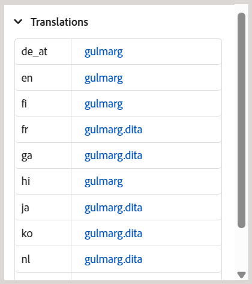
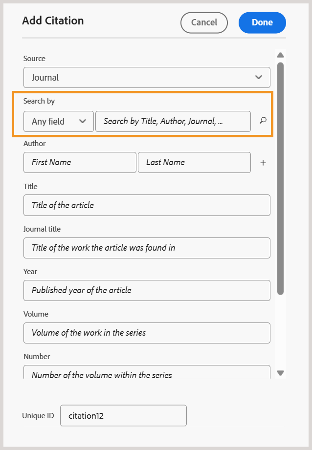
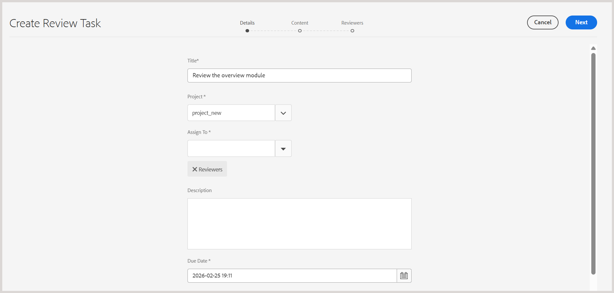

# 2026.03.0 릴리스의 새로운 기능(2026년 3월)

이 문서에서는 Adobe Experience Manager Guides as a Cloud Service 2026.03.0 릴리스와 함께 도입된 새로운 기능 및 향상된 기능을 다룹니다.

이 릴리스에서 해결된 문제 목록을 보려면 [2026.03.0 릴리스에서 해결된 문제](fixed-issues-2026-03-0.md)를 확인하십시오.

[2026.03.0 릴리스의 업그레이드 지침](../release-info/upgrade-instructions-2026-03-0.md)에 대해 알아봅니다.

## Experience Manager Guides에서 제품 교육 및 학습 컨텐츠 소개

Experience Manager Guides의 **제품 교육 및 학습** 콘텐츠 기능을 사용하면 교육 팀과 지침 디자이너가 Experience Manager Guides 인터페이스에서 직접 대화형 eLearning 과정을 빌드할 수 있습니다.

템플릿 기반 작성, 대화형 과정 구성 요소 및 평가 지원을 통해 팀은 조직 목표에 부합하는 고품질 교육 콘텐츠를 개발할 수 있습니다.

>[!NOTE]
> 
> 제품 교육 및 학습 컨텐츠 기능은 Experience Manager Guides as a Cloud Service의 모든 인스턴스에 대해 기본적으로 비활성화 상태로 유지됩니다. 관리자는 **Workspace 설정** > **일반**&#x200B;에서 폴더 프로필 수준에서 이 기능을 활성화할 수 있습니다.

주요 기능은 다음과 같습니다.

- 중앙 집중식 학습 콘텐츠 관리
- 템플릿 기반 작성
- 콘텐츠 재사용 지원
- 평가 생성 및 관리
- 웹 기반 검토 워크플로우
- 업계 최고의 번역 관리
- 즉시 사용 가능한 SCORM 및 PDF 출력 형식을 사용하는 다중 채널 게시

자세한 내용은 [시작 안내서](../learning-content/course-overview.md) 및 [구성 안내서](../lc-config-guide/introduction.md)를 참조하세요.

## 편집기 개선 사항

이 릴리스의 일부로 다음과 같은 편집기 개선이 이루어졌습니다.

### Schematron 유효성 검사 패널 개선 사항

명확성, 유용성 및 유효성 검사 결과를 개선하기 위해 Schematron 사용자 인터페이스가 다음과 같이 개선되었습니다.

- Schematron 파일이 추가되지 않은 경우 유효성 검사 패널에 빈 상태 메시지가 표시되어 다음 단계에 대한 명확성과 방향을 제공합니다.

  {width="350" align="left"}
- 여러 개의 Schematron 파일이 추가되면 통합된 아코디언으로 구성되므로 구성된 Schematron 파일을 더 잘 볼 수 있습니다.

  {width="350" align="left"}
- 이제 Schematron 파일에 정의된 역할 특성을 기반으로 유효성 검사 결과가 `Fatal`, `Error`, `Warn` 또는 `Info`(으)로 분류됩니다. 각 카테고리에는 명확한 해석을 위한 상황별 툴팁과 함께 표시되는 카운트가 포함되어 있습니다.

  {width="350" align="left"}

Experience Manager Guides에서 Schematron 파일을 사용하는 방법에 대한 자세한 내용은 [Schematron 파일에 대한 지원](../user-guide/support-schematron-file.md)을 참조하십시오.

### 이제 편집기 인터페이스의 오른쪽 패널에서 번역 언어 사본을 사용할 수 있습니다

이제 편집기의 **파일 속성** 아래 오른쪽 패널에서 새 *번역* 섹션을 사용할 수 있습니다. 이 섹션에서는 현재 열려 있는 에셋(맵, 주제, 이미지 등)에 대해 사용 가능한 모든 언어 사본에 직접 액세스할 수 있습니다. 이러한 언어 사본을 보거나 액세스하려면 더 이상 Assets UI로 이동할 필요가 없습니다.

{width="350" align="left"}

각 언어 사본에 대해 파일 위로 마우스를 가져가 저장소에서 해당 경로를 찾거나 편집기에서 열도록 선택하면 됩니다. 파일을 여는 것 외에도 **옵션** 메뉴를 사용하여 여러 작업을 수행할 수 있습니다. 수행할 수 있는 작업에는 편집, 미리보기, UUID 복사, 경로 복사, 컬렉션에 추가 및 속성이 포함됩니다.

자세한 내용은 편집기에서 [오른쪽 패널](../user-guide/web-editor-right-panel.md#file-properties)을 참조하세요.

### 모든 저널 필드에서 인용 검색

이제 *인용 추가* 대화 상자의 *모든 필드* 옵션을 사용하여 *제목*, *저널 제목*, *작성자*, *연도*, *볼륨*, **숫자** 및 **페이지**&#x200B;와 같은 모든 저널 필드에서 인용 부호를 검색할 수 있습니다. 입력한 텍스트를 기반으로 가장 일치하는 인용구를 검색합니다.

Experience Manager Guides에서 인용을 추가하는 방법에 대한 자세한 내용은 [콘텐츠의 인용을 추가 및 관리](../user-guide/web-editor-apply-citations.md)를 참조하십시오.

{width="350" align="left"}

## 향상된 기능 검토

이 릴리스의 검토 기능에는 다음과 같은 향상된 기능을 사용할 수 있습니다.

- 이제 검토 작업에 검토자를 할당하는 것은 활성 프로젝트 선택에 따라 다릅니다. **검토 작업 만들기** 페이지의 *할당 대상* 필드는 활성 프로젝트를 선택할 때까지 사용할 수 없습니다. 프로젝트를 선택한 후 **할당 대상** 필드를 사용하도록 설정하고 해당 프로젝트와 연결된 사용자 및 사용자 그룹만 나열합니다. 이렇게 하면 검토 작업이 유효한 프로젝트 구성원에게만 할당되고 검토자가 임의로 선택되지 않도록 합니다.

  

- 이제 **할당 대상** 필드에서 자동 검색 기능을 지원하므로 텍스트를 입력하여 사용자 또는 사용자 그룹을 빠르게 찾을 수 있습니다.

이러한 향상된 기능을 통해 검토자 선택을 보다 정확하고 효율적으로 수행할 수 있으며 프로젝트별 검토 워크플로에 맞게 조정할 수 있습니다.

자세한 내용은 [검토할 항목 보내기](../user-guide/review-send-topics-for-review.md)를 참조하십시오.

## 에셋 관리 개선 사항

이번 릴리스에서는 자산 관리에 대해 다음과 같은 개선 사항이 도입되었습니다.

### 플랫 파일 계층을 사용하여 원래 파일 이름 및 관련 메타데이터가 있는 맵을 다운로드합니다.

이제 플랫 파일 계층 옵션을 사용하여 원래 파일 이름이 있는 맵을 다운로드할 수 있습니다. 또한 다운로드한 패키지에는 `metadata.json` 파일이 포함되어 있어 연결된 메타데이터를 Experience Manager Guides 외부에서 쉽게 액세스하고 재사용할 수 있습니다.

Experience Manager Guides에서 파일을 다운로드하는 방법에 대한 자세한 내용은 [파일 다운로드](../user-guide/authoring-download-assets.md)를 참조하십시오.

### 정규 표현식을 사용하여 사후 처리 활성화 또는 비활성화

이제 regex를 사용하여 폴더에 대한 사후 처리를 활성화 또는 비활성화할 수 있습니다. 이 향상된 기능을 통해 관리자는 개별 폴더 경로를 지정하는 대신 단일 구성을 사용하여 여러 폴더 또는 전체 폴더 계층에 적용되는 사후 처리 규칙을 정의할 수 있습니다.

자세한 내용은 [regex를 사용하여 사후 처리를 활성화 또는 비활성화하십시오](../cs-install-guide/conf-folder-post-processing.md#use-regex-to-enable-or-disable-post-processing)를 참조하십시오.

