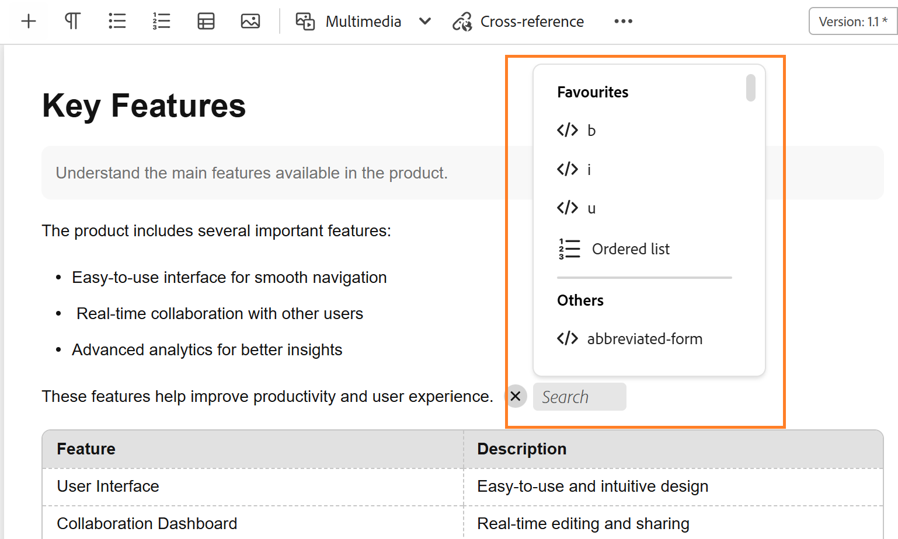

# 2026.05.0 릴리스의 새로운 기능(2026년 5월)

이 문서에서는 Adobe Experience Manager Guides as a Cloud Service 2026.05.0 릴리스와 함께 도입된 새로운 기능 및 향상된 기능을 다룹니다.

이 릴리스에서 수정된 문제 목록을 보려면 [2026.05.0 릴리스에서 수정된 문제](fixed-issues-2026-05-0.md)를 확인하십시오.

[2026.05.0 릴리스의 업그레이드 지침](../release-info/upgrade-instructions-2026-05-0.md)에 대해 알아봅니다.

## Editor 2.0 소개

편집기 2.0(즉, 새 편집기)은 간소화된 작성을 제공하므로, 보다 직관적인 환경을 통해 태그와 태그가 아닌 모드 모두에서 컨텐츠를 보다 효율적으로 만들 수 있습니다. 이 릴리스는 크고 복잡한 주제에 대해서도 페이지 로드 속도가 빨라지고 편집이 더 부드러워져 성능이 향상됩니다. 또한 탐색과 커서 동작 주변에서 주요 작성 간격을 해결하여 안정성을 향상시킵니다. 또한 최신 인터페이스는 기능 균형을 간편하게 유지하는 새롭고 사용자 친화적인 UI를 제공합니다. 자세한 내용은 [편집기 소개](../user-guide/web-editor.md)를 참조하세요.

다음은 편집기 2.0의 기능을 강조 표시하는 개요 비디오입니다.

>[!VIDEO](https://video.tv.adobe.com/v/3484007)

>[!NOTE]
>
> AEM Guides 고객 지원 팀에 문의하여 환경에서 편집기 2.0을 활성화하십시오.

다음은 보다 쉽고 효율적으로 작성할 수 있도록 향상된 기능입니다.

### 재설계된 사용자 인터페이스 및 경험

새로운 인터페이스는 전반적인 유용성을 향상시켜 탐색 및 콘텐츠 작성을 보다 직관적이고 일관되게 만듭니다.

- **작성 및 미리 보기 모드에서 요소에 대한 풍부한 CSS**: 요소에 대한 향상된 기본 CSS는 작성 및 미리 보기 모드 모두에서 향상된 스타일을 제공하고 시각적 일관성을 향상시킵니다.

  {width="650"}

- **어두운 테마 지원**: 콘텐츠 편집 영역에서 어두운 테마를 지원하면 어두운 인터페이스를 사용하는 작업을 선호하는 사용자의 작성 환경이 향상됩니다.

  {width="650"}

- **통합 사용자 수준 편집기 설정**: 작성자가 편집기 동작을 보다 잘 제어할 수 있도록 해 주는 새로운 중앙 집중식 설정 패널을 통해 사용자는 한 위치에서 환경 설정을 보다 쉽게 관리할 수 있습니다. 구성 옵션에는 다음과 같은 활성화/비활성화 기능이 포함됩니다.

   - 작성자 모드에서 줄바꿈하지 않는 공백
   - 속성이 있거나 속성이 없는 태그 가시성 설정
   - 작성자 모드의 XML 주석
   - 편집기의 요소 삽입을 위한 빠른 삽입 메뉴

  {width="350"}

  편집기 설정을 구성하는 방법에 대한 자세한 내용은 [편집기 설정](../user-guide/config-editor-settings.md)을 참조하세요.

- **작성자 모드에서 조건부 콘텐츠의 더 나은 표현**: 조건부 콘텐츠는 작성자 모드에서 더 명확하게 표시되므로 작성자가 더 효과적으로 변형을 식별하고 관리할 수 있습니다. 자세한 내용은 편집기의 왼쪽 패널에서 [조건](../user-guide/web-editor-left-panel.md#conditions)을 참조하세요.

  {width="650"}

### 향상된 작성 기능

향상된 도구와 유연성을 통해 콘텐츠 생성 및 편집 워크플로를 간소화할 수 있습니다.

- **태그 모드에서 요소와 함께 특성을 봅니다**: 이제 작성자가 태그 모드에서 요소 특성을 볼 수 있으므로 더 나은 가시성과 구조화된 컨텐츠를 제어할 수 있습니다. 이 기능을 구성하려면 [편집기 설정](../user-guide/config-editor-settings.md)을 봅니다.

  {width="650"}

- **빠른 삽입 메뉴**: 도구 모음으로 이동하지 않고 커서 위치에서 작성자 모드로 편집하는 동안 요소를 바로 추가할 수 있습니다. 자주 사용하는 요소는 편집기 설정을 통해 즐겨찾기 섹션에서 구성하여 보다 신속하게 액세스할 수도 있습니다. 자세한 내용은 [항목 편집](../user-guide/web-editor-edit-topics.md)을 참조하세요.

  {width="650"}

- **작성자 모드에서 XML 주석을 보고, 편집하고, 삽입하는 기능**: 콘텐츠 내의 가시성을 향상시키기 위해 작성자가 작성자 모드에서 직접 XML 주석을 보고, 편집하고, 삽입할 수 있습니다. 이 기능을 구성하려면 [편집기 설정](../user-guide/config-editor-settings.md)을 봅니다.

  {width="650"}

- **나란히 모드**: 작성자 모드와 Source 모드를 동시에 볼 수 있으며, 두 보기는 콘텐츠 변경 내용을 보다 쉽게 비교, 편집 및 확인할 수 있도록 완벽하게 동기화됩니다. 자세한 내용은 [편집기 보기](../user-guide/web-editor-views.md)를 참조하세요.

  {width="650"}

- **테이블 작성 개선**: 테이블을 만들고 관리하기 위한 보다 직관적이고 효율적인 상호 작용으로 전체 테이블 작성 환경을 개선합니다.

   - 유동적이고 직관적인 상호 작용: 행 및 열 재정렬을 위한 드래그 앤 드롭 지원과 함께 행과 열을 쉽게 삽입할 수 있습니다.
   - 상황별 도구 모음: 형식 지정, 정렬, 병합 및 기타 추가 작업과 같은 테이블 관련 작업에 표 내에서 직접 액세스합니다.
   - 테이블 구성: 한 번의 작업으로 여러 행 또는 열을 추가하여 반복 단계를 줄이고 효율성을 개선합니다.

  {width="650"}

  자세한 내용은 [테이블 작업](../user-guide/web-editor-other-features.md#work-with-tables-in-the-new-editor)을 참조하세요.

### 큰 주제에 대한 성능 개선

새 편집기는 더 빠른 컨텐츠 렌더링, 더 안정적인 실행 취소 및 다시 실행 기능, 저장하지 않은 변경 사항을 명확하게 나타내는 더티 마커를 제공하여 크고 복잡한 주제로 작업하는 경험을 향상시킵니다.

## [컨텐츠 속성] 패널에서 파일에 있는 참조의 경로 및 UUID에 액세스

이제 **링크 경로**&#x200B;를 사용하여 선택한 참조의 상대 경로를 보고 **UUID 연결**&#x200B;을 사용하여 콘텐츠 속성 패널에서 고유 식별자를 볼 수 있습니다. 또한 링크 경로 및 링크 UUID 옆에 있는 아이콘을 사용하여 인터페이스에서 직접 전체 절대 경로 및 관련 UUID를 복사할 수 있으므로 연결된 에셋을 더 쉽게 추적하고 재사용할 수 있습니다.

자세한 내용은 [콘텐츠 속성](../user-guide/web-editor-right-panel.md#content-properties)을 참조하세요.

## 향상된 기능 검토

이 릴리스의 일부로 다음과 같은 검토 개선 사항이 적용되었습니다.

- 이제 **자동 미리 알림**&#x200B;을(를) 사용하여 검토 작업의 기한 이전과 기한이 지난 후에 검토자에 대한 AEM 알림 및 전자 메일 미리 알림을 예약할 수 있습니다. 각 사례에 대해 미리 알림을 여러 개 구성할 수 있습니다. 미리 알림은 정의된 순서로 전송되며 작업 기한이 지난 후 트리거되는 미리 알림은 구성된 미리 알림 일정에 따라 달라집니다. 자세한 내용은 [검토할 항목 보내기](../user-guide/review-send-topics-for-review.md)를 참조하십시오.

- 이제 검토자는 검토 중인 주제에 대한 버전 내역에 액세스하여 이전 검토 작업에서 동일한 주제에 대한 이전에 검토한 버전과 업데이트된 버전을 보고 비교할 수 있습니다. 이렇게 하면 검토자가 현재 검토 컨텍스트 내에서 주석, 레이블 및 기타 관련 세부 사항을 검토하여 이전 검토 주기 이후에 변경된 내용을 확인하고 연속성을 유지할 수 있습니다. 자세한 내용은 검토자의 [버전 기록](../user-guide/review-topics.md#version-history-for-the-reviewer)을 확인하세요.

## Experience Manager Guides에 도입된 새로운 기준선 경험

>[!NOTE]
>
> AEM Guides 고객 지원 팀에 문의하여 환경에서 새 기준선을 활성화하십시오.

이제 다시 디자인된 기본 아키텍처를 기반으로 구축된 **새로운 기본 경험**&#x200B;을 통해 크고 복잡한 기본 요소를 보다 빠르고 안정적이며 쉽게 확장할 수 있습니다. 이 업데이트는 기존 워크플로우를 유지하면서 오랜 성능 및 안정성 문제를 해결합니다.

베타 버전의 향상된 기능으로 제공되는 이 업데이트는 자동화 및 대규모 기준선 작업에 대한 지원이 추가되어 더 빠르고, 더 안정적이며, 예측 가능한 기준선 경험을 제공함으로써 느린 로드, 일치하지 않는 기준선 상태, 제한된 관리 용이성과 같은 일반적인 불만 사항에 대한 솔루션을 제공합니다. 주요 개선 사항은 다음과 같습니다.

- 향상된 성능 및 확장성
- UI 및 백엔드 일관성 강화
- 확장된 필터링, 탐색 및 종속성 가시성

자세한 내용은 [Experience Manager Guides의 새 기준선 경험(Beta)을 봅니다](../user-guide/web-editor-baseline-v2.md).

