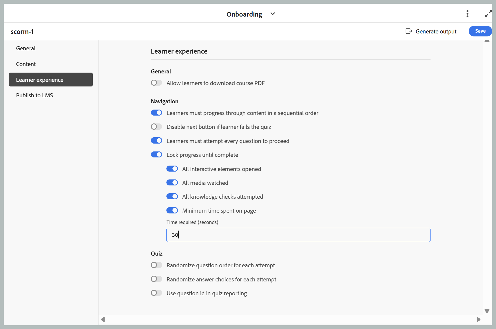

# 2026.08.0 릴리스(2026년 8월)의 새로운 기능

이 문서에서는 Adobe Experience Manager Guides as a Cloud Service 2026.08.0 릴리스와 함께 도입된 새로운 기능 및 향상된 기능을 다룹니다.

이 릴리스에서 수정된 문제 목록을 보려면 [2026.08.0 릴리스에서 수정된 문제](fixed-issues-2026-08-0.md)를 확인하십시오.

[2026.08.0 릴리스의 업그레이드 지침](../release-info/upgrade-instructions-2026-08-0.md)에 대해 알아봅니다.

## 맵 관리 및 출력 게시를 위한 새로운 맵 컬렉션

새로운 맵 컬렉션은 맵 컬렉션 관리 및 출력 생성 활동을 단일 인터페이스로 통합합니다. 한 위치에서 맵 및 사전 설정을 관리하고, 출력을 생성하고 게시하며, 생성 및 게시 기록을 보는 등의 작업을 수행할 수 있습니다. 관련 게시 작업을 함께 가져오면 맵 컬렉션을 더 쉽게 사용하여 작업하고 여러 맵과 관련 언어에서 출력 활동을 추적할 수 있습니다. 이 업데이트는 큰 맵 컬렉션에서 표시되는 성능 문제도 해결합니다.

자세한 내용은 [출력 생성을 위해 새 맵 컬렉션 사용](../user-guide/generate-output-use-new-map-collection-output-generation.md)을 참조하세요.

## Git 커넥터를 사용하여 Git 저장소에서 콘텐츠 가져오기

이제 Experience Manager Guides에서는 Git 저장소에서 Experience Manager Guides으로 컨텐츠를 가져올 수 있는 Git 커넥터를 도입했습니다. 콘텐츠를 가져온 다음에는 작성, 검토, 번역 및 게시 워크플로우에 Experience Manager Guides을 계속 사용할 수 있습니다.

가져온 콘텐츠를 최신 상태로 유지할 수 있도록 Git 커넥터는 업데이트를 가져올 수 있도록 소스 저장소에서 콘텐츠를 다시 가져오는 기능도 지원합니다. 여기에는 콘텐츠 업데이트를 식별하고, 가져오기 및 다시 가져오기 작업 동안 주제를 유지하고 GUID를 매핑하는 지능형 변경 감지 기능이 포함되어 있으며, 충돌 해결 기능을 제공하여 Experience Manager Guides에서 이미 사용 가능한 콘텐츠와 저장소 콘텐츠 간의 차이를 관리하는 데 도움이 됩니다. 자세한 내용은 [Git 커넥터를 사용하여 콘텐츠 가져오기](../user-guide/web-editor-git-connector.md)를 참조하십시오.

## Experience Manager Guides, AI Assistant 통합을 위한 MCP 지원 추가

Experience Manager Guides은 이제 MCP(Model Context Protocol) 통합을 지원하므로 Anthropic Cloud와 같은 AI 지원 담당자가 AEM Guides 환경에 직접 연결할 수 있습니다.

인증된 사용자는 단일 MCP 끝점을 통해 기존 AEM 권한으로 작업하는 동안 주제 및 맵을 관리하고, 기준선을 만들고, 내보내고, 자연어를 사용하여 보고서를 생성할 수 있습니다. 따라서 탐색이 많은 반복적인 작업을 수행할 필요가 없어지고 설명서 팀이 Cursor 및 Visual Studio Code와 같은 MCP 지원 개발자 도구와 채팅 응용 프로그램에서 보다 효율적으로 작업할 수 있습니다. 자세한 내용은 [Adobe Experience Manager Guides MCP 서버 사용](../install-conf-guide/conf-aem-guides-mcp.md)을 참조하세요.

## 향상된 기능 검토

### 다른 검토자에게 검토 작업 위임

이제 검토자는 검토 작업에 사용할 수 있는 새로운 **대리인** 옵션을 사용하여 작성자에게 돌아가기 전에 다른 사용자에게 검토에 관여하도록 권장할 수 있습니다. 이 기능은 콘텐츠 일부가 검토자의 전문 지식을 벗어나거나 프로젝트 관리자를 통해 요청을 라우팅하지 않고도 검토를 완료하기 전에 두 번째 의견이 필요한 경우 유용합니다.

위임 옵션을 선택하면 작성자에게 권장 사항이 전송되고 작성자는 작업에 권장 검토자를 추가할지 여부를 결정합니다. [다른 검토자에게 검토 작업 위임](../user-guide/review-complete-review-tasks.md#delegate-a-review-task-to-another-reviewer)에 대해 자세히 알아보세요.

{width="350"}

### 이제 작업 설명이 검토 UI에 표시됨

이제 검토자는 알림 이메일에만 의존하지 않고 검토 경험 내에서 직접 작업 설명을 볼 수 있습니다. 이제 검토 작업을 만드는 동안 입력한 설명이 검토 UI와 편집기 인터페이스의 **정보** 아이콘을 통해 액세스할 수 있는 [검토 세부 정보] 대화 상자에 표시됩니다.

이를 통해 검토자는 검토 전반에 걸쳐 지침, 범위 및 집중 영역에 액세스할 수 있습니다. 자세한 내용은 [검토할 항목 보내기](../user-guide/review-send-topics-for-review.md)를 참조하십시오.

{width="350"}

### 검토 중 태깅 목록에서 사용자 식별

검토 의견 또는 답글에서 사용자를 태그 지정할 때 이제 태그 지정 드롭다운에 사용자 ID와 함께 각 사용자의 이메일 주소가 표시됩니다. 이렇게 하면 특히 표시 이름만 모호할 수 있는 대규모 조직에서 올바른 검토자를 보다 쉽게 식별하고 선택할 수 있습니다.

이메일 주소를 사용할 수 없는 경우 대신 사용자 ID가 표시됩니다. 검토 UI 작업에 대한 자세한 내용은 [댓글로 작업 사용자 태그 지정](../user-guide/review-topics.md#tag-task-users-in-a-comment)을 참조하세요.

### 항목에 대한 모든 검토 작업 보기

이제 작성자가 [주석] 패널에서 현재 열려 있는 주제와 연결된 열려 있거나 닫힌 모든 검토 작업을 직접 볼 수 있습니다. 드롭다운에는 각 작업의 상태 및 프로젝트와 함께 주제가 포함된 모든 검토 작업이 나열되며, 이 두 작업 간을 전환하여 주제를 종료하거나 검토 프로젝트를 전환하지 않고도 주석을 볼 수 있습니다. [주제에 대한 모든 검토 작업 보기](../user-guide/review-address-review-comments.md#view-all-review-tasks-for-a-topic)에 대해 자세히 알아보세요.

{width="350"}

### DITAVAL 조건을 통한 검토 경험 향상

검토 작업에 하나 이상의 첨부된 DITAVAL 파일이 포함된 경우 이제 조건 패널에 각 조건이 첨부된 DITAVAL 파일과 일치하도록 미리 설정된 토글로 표시되므로 검토자는 검토 개시자가 의도한 대로 콘텐츠를 볼 수 있습니다. 토글을 끄면 검토에서 해당 콘텐츠가 숨겨집니다. 토글을 끄면 콘텐츠가 복원됩니다.

자세한 내용은 [DITAVAL 기반 조건이 있는 조건 패널](../user-guide/review-topics.md#conditions-panel-with-ditaval-based-conditions)을 참조하세요.

{width="350"}

## 향상된 게시 기능

### 출력 사전 설정을 템플릿으로 사용

이제 관리자는 맵 콘솔을 통해 한 번의 작업으로 폴더 프로필의 모든 맵에 표준화된 구성을 적용하여 출력 사전 설정을 템플릿으로 지정할 수 있습니다. 템플릿이 적용되면 영향을 받는 맵 수가 표시되어 롤아웃 전에 관리자가 완전히 볼 수 있습니다. 일관성을 유지하기 위해 템플릿 사전 설정은 관리자만 수정할 수 있으며, 템플릿 사전 설정에 대해 출력 생성이 비활성화됩니다(사전 설정을 템플릿으로 설정하기 전에 출력이 이미 생성된 경우 제외).

자세한 내용은 [출력 생성을 위한 템플릿 사전 설정 구성](../install-conf-guide/template-presets-output-generation.md)을 참조하십시오.

### 콘텐츠 상태 검사를 통해 콘텐츠 품질 유효성 검사

콘텐츠 상태 검사는 게시하기 전에 DITA 맵에서 콘텐츠 품질을 확인하는 데 도움이 됩니다. 관리자는 끊어진 링크, 중복 ID 및 Schematron 유효성 검사를 결합하여 재사용 가능한 상태 검사 사전 설정을 만들 수 있습니다.

작성자는 DITA 맵 또는 선택한 베이스라인에서 상태 검사를 실행하여 연관된 주제 및 맵에서 문제에 대한 통합 보고서를 생성할 수 있습니다. 자세한 내용은 [맵에서 상태 확인 실행](../user-guide/map-editor-other-features.md#run-health-check-on-a-map)을 참조하세요.

## 번역 개선 사항

### 번역 프로젝트에 대한 사용자 지정 폴더 경로 지정

이제 번역을 위해 콘텐츠를 보낼 때 모든 프로젝트가 `/content/projects` 아래의 단일 위치로 기본 설정되는 대신 새 번역 프로젝트가 만들어지는 폴더를 선택할 수 있습니다. 이를 통해 프로젝트 구조가 복잡해지는 것을 방지하고 번역 프로젝트 수가 증가함에 따라 페이지 로드 성능을 향상시킬 수 있습니다.

자세한 내용은 [번역 프로젝트 만들기](../user-guide/translate-documents-web-editor.md#create-a-translation-project)를 참조하세요.

## 학습 콘텐츠 개선 사항

이 릴리스의 제품 교육 및 학습 콘텐츠 기능에는 다음과 같은 개선 사항이 있습니다.

- 이제 SCORM 출력 구성에서 새로운 **학습자 경험** 탭을 사용할 수 있으므로 학습자가 SCORM 출력과 상호 작용하고 탐색하는 방법을 구성할 수 있습니다. 설정은 [일반], [탐색] 및 [퀴즈]에 구성되어 맞춤화된 학습 환경을 위한 콘텐츠 접근성, 탐색 흐름 및 퀴즈 동작을 제어할 수 있습니다.

  이제 **탐색**&#x200B;에서 페이지에서 **다음** 단추를 사용할지 여부를 제어할 수 있으므로 학습자가 모든 대화형 요소 열기, 모든 미디어 시청 등과 같은 해당 페이지의 지정된 조건이 충족된 후에만 진행할 수 있습니다. 자세한 내용은 [SCORM 사전 설정 구성](../learning-content/config-scorm-preset.md)을 참조하십시오.

  {width="650"}

- 이제 SCORM 출력에서 학습자에 대해 PDF 다운로드를 활성화할 수 있습니다. 이 옵션이 활성화되면 학습자는 게시된 SCORM 출력에 PDF 다운로드 아이콘이 추가되어 오프라인 참조를 위해 PDF 버전의 강의 콘텐츠를 다운로드할 수 있습니다. 이를 통해 학습자가 강의 자료에 액세스하는 방법에 대한 유연성을 높이는 동시에 작성자가 게시된 경험을 보다 세밀하게 제어할 수 있습니다. 구성 세부 정보 및 필수 구성 요소는 [학습자가 강의 PDF을 다운로드할 수 있도록 허용](../learning-content/config-scorm-preset.md)을 참조하세요.

  {width="650"}

- 이제 게시된 강의 결과에서 학습자는 퀴즈 시도를 완료한 후 **답변 검토** 옵션을 사용하여 제출된 답변을 다시 살펴보고 정답 또는 오답을 확인할 수 있습니다. [퀴즈의 질문 속성에 대해 자세히 알아보세요](../learning-content/quiz-insert-questions.md#question-properties).

  {width="650"}

- 이제 과정 내의 지식 확인 질문에서 학습자가 잘못된 답변을 선택하면 **다시 시도** 단추가 표시되어 질문을 다시 시도할 수 있습니다. 이 동작은 단일 선택 및 다중 선택 지식 검사 시에도 일관됩니다. 자세한 내용은 삽입 메뉴의 [기타 옵션](../learning-content/lc-other-insert-options.md)을 참조하세요.

- HTML 주제가 학습 그룹 맵에 추가되면 이제 `format="html"` 특성이 해당 `topicref`에 자동으로 추가되므로 DITA-OT 4.x에서 올바르게 처리 및 게시됩니다. 자세한 내용은 [강의에 기존 콘텐츠 추가](../learning-content/manage-course.md#add-existing-content)를 참조하세요.

## API 개선 사항

이 릴리스에서는 에셋 관리, 번역 및 게시를 위한 새로운 Swagger API를 도입하여 이러한 워크플로를 기존 도구 및 시스템과 보다 쉽게 연결할 수 있습니다. 자세한 내용은 Experience Manager Guides 릴리스의 [API 업데이트](../api-reference/api-update-swagger.md)를 참조하세요.

