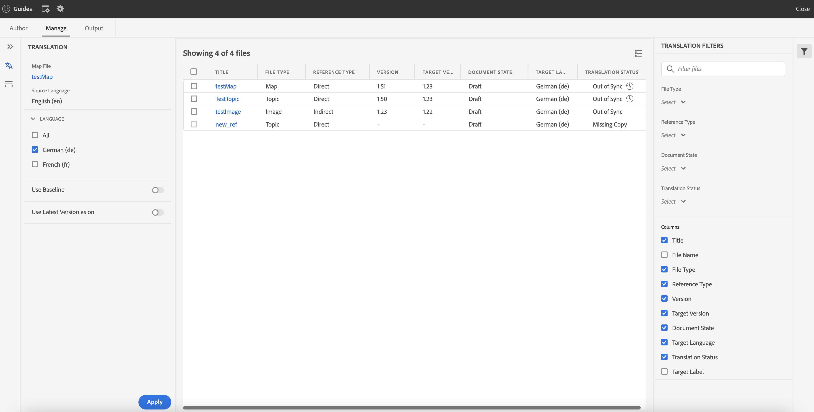
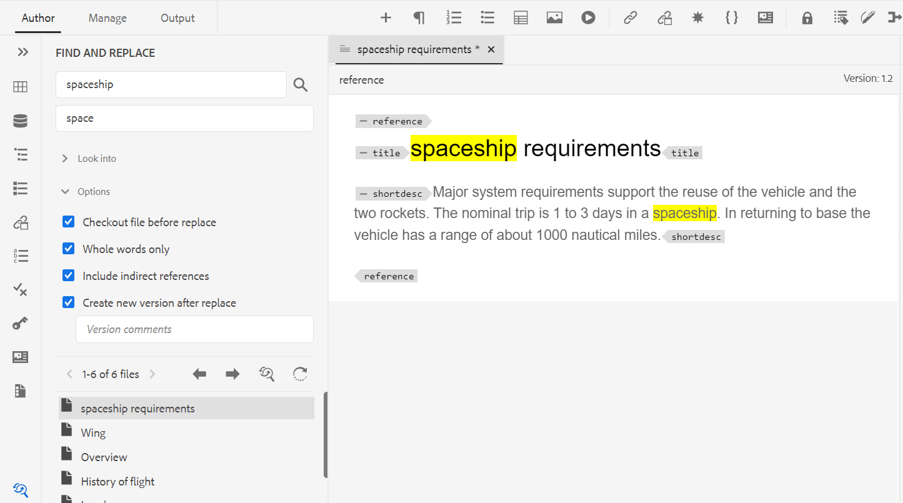

# Adobe Experience Manager Guides 4.2 릴리스의 새로운 기능 (2023년 2월)

이 문서에서는 Adobe Experience Manager Guides 버전 4.2(*AEM Guides*)의 새로운 기능 및 향상된 기능을 다룹니다.

업그레이드 지침, 호환성 매트릭스 및 이 릴리스에서 해결된 문제에 대한 자세한 내용은 [릴리스 정보](release-notes-4-2.md) 문서를 참조하십시오.

## 웹 편집기에서 보고서 생성

AEM Guides에는 기술 문서의 전체 완성도를 확인하고 보고서를 생성할 수 있는 웹 편집기 기능이 포함되어 있습니다.
항목 목록을 보고 현재 맵에 대한 모든 참조의 메타데이터를 관리할 수 있습니다.
웹 편집기의 **보고서** 탭

**주제 목록 보기 생성**

참조 유형, 문서 상태 및 작성자와 같은 주제에 대한 자세한 정보를 제공하는 주제 목록을 생성할 수 있습니다. CSV를 생성하여 DITA 맵에 있는 주제의 현재 스냅샷을 다운로드할 수도 있습니다.

**메타데이터 관리 및 문서 상태 변경**

개별 주제에 태그를 적용하거나 벌크 태그 지정 기능을 사용하여 여러 주제, DITA 맵 또는 하위 맵에 여러 태그를 적용할 수 있습니다. 선택한 모든 주제의 문서 상태를 가능한 다음 공통 문서 상태로 변경할 수도 있습니다.

## 검토 기능을 위한 UX 개선

이제 AEM guides에서는 검토용으로 공유된 주제를 검토하는 데 도움이 되는 향상된 UX를 제공합니다. 최신 경험에서 검토 기능은 다음과 같이 개선되었습니다.

* 사용자 인터페이스 새로 고침
* 항목의 사용 가능한 조건에 따라 콘텐츠를 강조 표시할 수 있는 조건 패널
* [주석] 패널의 각 주석은 현재 주제의 해당 텍스트에 연결됩니다. 주석을 단 텍스트를 식별하는 데 도움이 됩니다.
* 주석은 문서에 있는 주석 텍스트 순서대로 표시됩니다.
* 검토 작업의 이름이 검토 워크플로에 표시됩니다.
* 검토 콘텐츠에 사용된 모든 주요 참조 및 용어집 용어를 해결하는 데 사용되는 검토 작업에 대한 루트 맵을 선택합니다.
* 텍스트를 빠르게 강조 표시하거나 취소하는 데 도움이 되는 상황별 도구 모음
* 자신의 주석을 편집하거나 삭제하는 옵션 메뉴.
* 오래된 주석의 경우 주제의 이전 버전을 현재 검토 버전과 비교하는 데 도움이 되는 나란히 볼 수 있는 액세스 권한이 있습니다
* 필터를 사용할 때 오른쪽 패널의 주석은 선택 내용에 따라 필터링되고
왼쪽 패널의 주석 수가 그에 따라 업데이트됩니다.

자세한 내용은 Adobe Experience Manager Guides 사용 안내서의 *주제 또는 맵 검토* 섹션을 참조하십시오.

## 번역 개선 사항

이제 웹 편집기에서 문서를 쉽게 번역할 수 있도록 번역 대시보드에서 보다 사용자 친화적인 개선 사항을 확인할 수 있습니다.

**버전 레이블 열이 번역 대시보드에 추가됨**

번역 대시보드에서는 버전 레이블 열도 볼 수 있습니다. 선택한 소스 파일 버전에 대한 레이블 이 표시됩니다. 이렇게 하면 특정 레이블이 있는 모든 파일을 선택하여 한 번에 번역할 수 있습니다.

**번역 대시보드에서 동기화되지 않은 파일의 버전 차이점 보기**

이제 선택한 버전과 마지막으로 번역된 소스 버전의 항목 간의 차이점을 확인할 수 있습니다. 두 버전의 항목 간에 수행한 변경 사항에 따라 **동기화되지 않음** 파일을 번역하도록 선택할 수도 있습니다.

**대상 버전에 버전 레이블 전달**

AEM Guides을 사용하면 소스 파일의 레이블을 타겟 파일에 전달할 수 있습니다. 이렇게 하면 번역된 파일의 소스 버전을 쉽게 식별할 수 있습니다.

예를 들어 버전 레이블 릴리스 1.0이 적용된 일부 소스 파일이 있는 경우 소스 레이블(릴리스 1.0)을 번역된 파일에 전달할 수도 있습니다.

**동기화되지 않은 자산에 대해 강제 동기화**

일부 에셋을 변경하면 AEM Guides이 해당 에셋을 동기화되지 않음으로 표시합니다. 수정된 자산을 다시 번역하거나 동기화 중단 상태를 해제하도록 선택할 수 있습니다. 예를 들어 번역이 필요하지 않은 일부 사소한 변경 작업을 수행한 경우 해당 상태를 [동기화 중]으로 표시할 수 있습니다.

**주제 또는 맵에 대한 진행 중인 번역 프로젝트 보기**

번역 대시보드의 일부 참조가 진행 중일 수 있습니다. 이제 AEM Guides에서는 선택한 참조가 포함된 진행 중인 모든 번역 프로젝트 목록(대상 언어 포함)을 볼 수 있는 기능을 제공합니다.

자세한 내용은 Adobe Experience Manager Guides 사용 안내서의 *웹 편집기에서 문서 번역* 섹션을 참조하십시오.

## 웹 편집기에서 다양한 형식의 출력을 생성합니다.

이제 웹 편집기에서 주제나 DITA 맵에 대한 출력을 쉽게 생성할 수 있습니다. AEM Site, PDF, HTML5 및
JSON(Headless 출력 형식) 및 사용자 지정 출력입니다. 이러한 매개 변수를 사용하여 각 출력을 생성합니다. DITA 주제에서 속성을 정의한 다음 출력을 게시하는 동안 조건 사전 설정을 사용하여 조건을 적용할 수 있습니다. 베이스라인 게시 기능을 사용하여 특정 버전의 DITA 맵이나 주제를 선택적으로 게시할 수도 있습니다.

**전역 및 폴더 프로필 출력 사전 설정 관리**

AEM Guides에서는 전역 및 폴더 프로필에 대한 출력 사전 설정을 만들고 관리하는 기능을 제공합니다. 그러면 이러한 출력 사전 설정을 사용하여 해당 전역 또는 폴더 프로필과 관련된 모든 맵의 출력을 쉽게 생성할 수 있습니다.

이러한 전역 사전 설정은 모든 관련 맵의 **출력** 탭에 나타납니다. 이러한 매개 변수를 사용하여 모든 관련 맵에 대한 출력을 생성할 수 있습니다. 사전 설정을 기본 PDF 사전 설정으로 선택하여 PDF 출력을 생성할 수 있습니다. **옵션** 메뉴에서 기존 출력 사전 설정을 **편집**, **이름 바꾸기**, **복제** 또는 **삭제**&#x200B;할 수도 있습니다.

>[!NOTE]
>
>폴더 수준 관리자만 전역 및 폴더 프로필 사전 설정을 만들 수 있습니다.

## 맵 수준에서 텍스트 찾기 및 바꾸기

이제 맵에서 특정 텍스트가 포함된 파일을 검색할 수 있습니다. 검색된 텍스트가 파일에서 강조 표시됩니다. 검색된 단어나 구를 파일 내의 다른 단어나 구로 바꿀 수도 있습니다. 현재 발생 항목을 바꾸려면 **단일 발생 항목 바꾸기** 아이콘을 선택하고 선택한 파일의 모든 발생 항목을 바꾸려면 **파일에서 모두 바꾸기** 아이콘을 선택합니다. **모두 바꾸기** 아이콘을 선택하여 모든 파일에서 검색어를 모두 바꿀 수 있습니다.

기본적으로 **바꾸기 전 파일 체크 아웃** 및 **바꾸기 후 새 버전 만들기** 옵션이 선택되어 있으므로 텍스트를 바꾸기 전에 파일을 체크 아웃하고 텍스트를 바꾼 후에 새 버전을 만듭니다. DITA 맵 내의 간접 참조에서 문자열을 검색할 수도 있습니다. 기본적으로 비활성화되어 있으므로 직접 참조에서만 검색이 수행됩니다.

## 맵 편집기의 레이아웃 보기

이제 맵 편집기에서 DITA 맵의 전체 레이아웃을 볼 수 있습니다. 편집할 맵을 열면 맵 편집기의 레이아웃 보기가 열립니다. 이 보기에서는 맵 계층 구조를 트리 보기로 볼 수 있습니다. 맵에서 주제를 편집하고 구성하거나 구성할 수도 있습니다.

레이아웃 보기에는 맵에 있는 주제에 대해 많은 작업을 수행하는 데 도움이 되는 별도의 도구 모음이 포함되어 있습니다.
주제 참조, 주제 그룹, 키 정의를 맵에 삽입할 수 있습니다. 지도에 있는 주제를 위, 아래, 왼쪽 또는 오른쪽으로 이동하여 재구성할 수 있습니다. 항목을 드래그 앤 드롭하여 맵에서 이동할 수도 있습니다. 또한 맵 편집기에서는 파일 잠금 또는 잠금 해제, 버전 내역 확인 및 버전 레이블 관리를 수행하는 아이콘도 제공합니다.

또한 레이아웃 보기에서는 **보기 옵션**&#x200B;을 제공하여 줄 번호, 표시 또는 숨기기 확인란을 표시하거나 숨기거나 맵에서 항목의 파일 이름이나 제목을 표시합니다.
주제에 적용된 조건부 필터를 기반으로 주제를 볼 수도 있습니다.

맵 파일에서 주제를 구성할 수 있을 뿐만 아니라 레이아웃 보기의 요소에 사용할 수 있는 **옵션** 메뉴를 사용하여 참조를 추가, 이동, 복사, 붙여넣기 또는 삭제할 수도 있습니다.

오른쪽 패널에는 맵 편집기의 레이아웃 보기에 콘텐츠 속성 및 맵 속성 이 표시됩니다. 이제 주제 또는 맵에 대한 메타데이터 정보를 설정할 수도 있습니다. 선택한 주제 또는 맵의 탐색 제목, 링크 텍스트, 짧은 설명 및 키워드를 정의할 수 있습니다.

자세한 내용은 Adobe Experience Manager Guides 사용 안내서의 *레이아웃 보기* 섹션을 참조하십시오.

## 빠른 생성 패널

이제 AEM Guides에서는 DITA 맵용으로 만들어진 사전 설정에 대한 출력을 빠르게 생성하고 볼 수 있도록 해주는 빠른 생성 패널을 제공합니다.

**빠른 생성** 패널에서 DITA 맵에 대해 만들어진 모든 출력 사전 설정 목록을 볼 수 있습니다. 사전 설정에 대해 생성된 출력을 빠르게 볼 수도 있습니다. 출력 생성이 완료되면 성공 또는 실패 메시지가 표시됩니다. 생성 프로세스에서 발생한 오류에 대한 세부 정보가 포함된 오류 로그를 볼 수도 있습니다.

## 레이블을 기반으로 동적 기준선 만들기

이제 AEM Guides에서는 레이블을 기반으로 동적 기준선을 만들 수 있는 기능을 제공합니다. 기준선을 생성하거나, 기준선을 다운로드하거나, 기준선을 사용하여 번역 프로젝트를 생성하는 경우, 업데이트된 레이블을 기반으로 파일이 동적으로 선택됩니다. 이 기능은 레이블을 업데이트할 때 기준선을 수정할 필요가 없으므로 편리합니다.

## 저장소 패널에서 파일 삭제 및 복제

이제 저장소 패널에서 선택한 파일의 **옵션** 메뉴에서 파일(한 번에 하나의 파일)을 쉽게 삭제할 수 있습니다. 파일을 삭제하기 전에 확인 메시지가 표시됩니다. 파일이 다른 파일에서 참조되지 않으면 삭제되고 성공 메시지가 표시됩니다.

선택한 파일의 복제본이나 복사본을 만들 수도 있습니다. 기본적으로 파일은
접미사(예: filename_1.extension).

## 기타 웹 편집기 개선 사항

* AEM Guides에서는 컨텍스트 메뉴를 사용하여 이미지 및 미디어 파일에 대한 몇 가지 일반적인 작업을 수행할 수 있습니다. 이제 저장소에서 선택한 이미지 또는 미디어를 찾거나 Assets UI에서 파일의 미리보기를 볼 수도 있습니다.

* 현재 폴더 프로필의 이름이 기본 도구 모음에 사용자 기본 설정 아이콘의 레이블로 표시됩니다. 이렇게 하면 작업 중인 폴더 프로필을 식별하는 데 도움이 됩니다.

* 맵 보기에서 맵을 열면 현재 맵의 제목이 기본 도구 모음의 중앙에 표시됩니다. 이 기능은 현재 열려 있는 맵을 사용자에게 알리는 데 유용합니다.

## 선택한 파일 버전 제거

컨텐트를 만들고 유지 관리할 때 저장소의 DITA 파일에 대해 여러 버전이 생성될 수 있습니다. AEM Guides을 사용하면 저장소에서 이전 버전의 DITA 파일을 제거하고 디스크 공간을 확보할 수 있습니다.

AEM Guides은 기준선에 포함되어 있거나 레이블이 적용된 파일의 첫 번째 버전을 삭제하지 않습니다. 제거 작업은 번역 또는 검토 워크플로에 포함된 파일도 삭제하지 않습니다. 유지할 버전 수를 선택하고 정의된 일 수보다 오래된 파일도 삭제할 수 있습니다.

제거 작업을 시작하기 전에 보고서를 미리 확인하여 제거할 버전을 확인할 수 있습니다. 그런 다음 제거 작업을 시작하거나 취소할 수 있습니다.

제거 작업이 완료되면 제거 보고서를 확인하여 제거된 파일을 확인할 수 있습니다.

## 산소 편집기에서 UUID 대신 제목 보기

이제 AEM Guides에서 설정에서 **편집기 및 맵 관리자에서 제목 사용** 옵션을 선택할 수 있습니다. 이 옵션을 선택하면 편집기나 DITA 맵 관리자에서 파일을 열면 파일 제목이 파일의 탭에 표시됩니다. 이 옵션을 선택하지 않으면 파일의 UUID가 파일의 탭에 표시됩니다.

## PDF 사전 설정에 사용 가능한 메타데이터 UI

DITA 맵의 출력 사전 설정에서 메타데이터를 설정할 수 있습니다. 제목, 작성자, 주제 및 키워드 메타데이터를 설정할 수 있습니다. 이 메타데이터는 출력 PDF의 파일 속성에 있는 메타데이터에 매핑됩니다. 이 메타데이터는 책 수준에서 정의된 메타데이터를 재정의합니다. 각 출력 사전 설정에서 구체적으로 메타데이터를 정의하고 이를 출력 PDF에 전달할 수 있습니다.

## 기본 PDF | 문서 버전 간의 차이를 표시하는 변경 막대가 있는 PDF

이제 변경 막대를 사용하여 두 버전 간의 콘텐츠 차이를 표시하는 PDF을 만들 수 있습니다. 현재 버전을 이전 버전의 베이스라인과 비교하거나 선택한 두 베이스라인 버전 간에 비교하도록 선택할 수 있습니다.

PDF에 변경 막대가 표시되어 수정, 삽입 또는 삭제된 콘텐츠를 나타냅니다. 다음과 같은 작업도 수행할 수 있습니다.
* 삽입한 내용을 녹색으로 밑줄로 표시
* 삭제된 컨텐츠를 빨간색으로 표시하고 취소선으로 표시

## 기본 PDF | 출력 경로 및 PDF 파일 이름에 대한 변수 지원

이제 다음의 기본 변수를 사용하여 출력 경로와 PDF 파일을 정의할 수도 있습니다. 단일 또는 변수 조합을 사용하여 다음 옵션을 정의할 수 있습니다.
* `${map_filename}`
* `${map_title}`
* `${preset_name}`
* `${language_code}`
* `${map_parentpath}`(출력 경로만 해당)
* `${path_after_langfolder}`(출력 경로만 해당)

## 기본 PDF | DITA 맵에 대한 목차 생성 및 페이지 레이아웃 재정렬

이제 템플릿의 고급 PDF 설정을 사용하여 DITA 맵에서 목차를 생성할 수도 있습니다. 다양한 페이지 레이아웃의 표시를 활성화 또는 비활성화하고 위치 순서를 변경할 수 있습니다.

## 기본 PDF | PDF 출력에 사용자 지정 책갈피 추가

이제 쉽게 탐색할 수 있도록 최종 PDF 출력의 특정 콘텐츠에 사용자 지정 책갈피를 추가할 수 있습니다. DITA 맵의 주제 또는 섹션 제목에서 생성된 목차에 추가됩니다.

## 기본 PDF | 목차 항목 및 주제 콘텐츠에 사용자 지정 스타일 적용

AEM Guides에서는 목차 항목 또는 PDF 출력의 특정 항목에 사용자 지정 스타일을 적용하는 기능을 제공합니다. 예를 들어 목차와 주제 제목의 텍스트 색상을 변경할 수 있습니다. 주제 내의 전체 내용에 스타일을 적용할 수도 있습니다.
