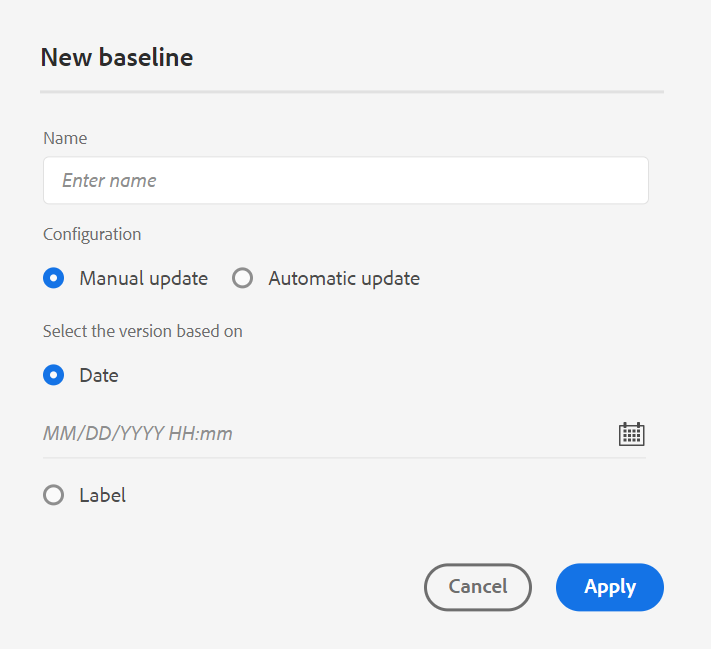
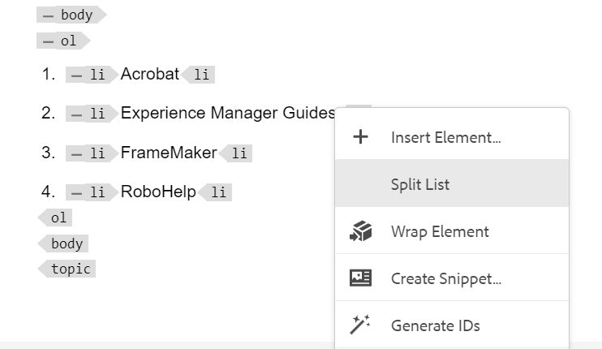

# 4.4.0 릴리스의 새로운 기능(2024년 1월)

이 문서에서는 Adobe Experience Manager Guides 버전 4.4.0의 새로운 기능 및 향상된 기능을 다룹니다.

이 릴리스에서 수정된 문제 목록을 보려면 [4.4.0 릴리스에서 수정된 문제](../release-info/fixed-issues-4-4.md)를 확인하십시오.

[4.4.0 릴리스에 대한 업그레이드 지침](../release-info/upgrade-instructions-4-4.md)에 대해 알아봅니다.

## 웹 편집기의 버전 내역 기능 개선

이제 Experience Manager Guides에서는 시간에 따른 문서의 변경 사항을 비교할 수 있는 향상된 버전 기록 기능을 제공합니다. 새 나란히 보기에서 현재 버전의 콘텐츠 및 메타데이터를 동일한 문서의 이전 버전과 쉽게 비교할 수 있습니다. 비교 버전에 대한 레이블과 주석을 볼 수도 있습니다. 관리자는 **버전 기록** 대화 상자에 주제의 버전 메타데이터와 해당 값이 표시되도록 제어할 수 있습니다.

{width="800" align="left"}
*주제의 다른 버전에서 변경 내용을 미리 봅니다.*

[왼쪽 패널](../user-guide/web-editor-features.md#id2051EA0M0HS) 섹션에서 **버전 기록** 기능 설명에 대해 자세히 알아보세요.

## 조건 사전 설정 관리

DITA 주제에서 조건 속성을 정의할 수 있습니다. 그런 다음 조건 사전 설정에서 조건 속성을 사용하여 DITA 맵의 콘텐츠를 게시합니다. 이제 Experience Manager Guides에서는 조건 사전 설정을 보다 효율적으로 만들고 관리하는 데 도움이 되는 웹 편집기의 풍부한 경험도 제공합니다. 쉽게 편집, 복제 또는 삭제할 수도 있습니다.

웹 편집기 ](assets/web-editor-manage-condition-presets.png){width="550" align="left"}의 관리 탭에서 을 참조하세요.

## 속성 편집을 위한 경험 개선

이제 웹 편집기의 **콘텐츠 속성** 패널에서 요소의 특성을 추가하거나 편집할 수 있는 개선된 경험이 제공됩니다.

{width="300" align="left"}

*콘텐츠 속성 패널에서 특성을 추가합니다.*

속성을 쉽게 편집하고 삭제할 수도 있습니다.
자세한 내용은 [오른쪽 패널](../user-guide/web-editor-features.md#id2051EB003YK) 섹션의 **콘텐츠 속성** 기능 설명을 참조하십시오.

## 작성 중 메타데이터 편집

이제 작성하는 동안 오른쪽 패널의 **파일 속성**&#x200B;에서 드롭다운을 사용하여 파일 메타데이터 태그를 업데이트할 수 있습니다. **속성을 더 편집**&#x200B;하여 더 많은 메타데이터를 업데이트할 수도 있습니다.

{width="300" align="left"}

*오른쪽 패널에서 메타데이터를 업데이트하고 파일 속성을 편집합니다.*

자세한 내용은 [오른쪽 패널](../user-guide/web-editor-features.md#id2051EB003YK) 섹션의 **파일 속성** 기능 설명을 참조하십시오.

## 맵 보기에서 주요 속성 보기

주제 또는 맵 참조에 대한 키 속성을 정의하면 왼쪽 패널에서 제목, 해당 아이콘 및 키를 볼 수도 있습니다. 키가 `key=<key-name>`(으)로 표시됩니다.

맵 보기의  {width="300" align="left"}

*맵 보기에서 키 특성을 봅니다.*

자세한 내용은 [왼쪽 패널](../user-guide/web-editor-features.md#id2051EA0M0HS) 섹션의 **맵 보기** 기능 설명을 참조하십시오.

## 레이블을 기반으로 기준선을 복제하는 기능

이제 Experience Manager Guides에서는 웹 편집기에서 기준선을 만들 수 있는 향상된 사용자 환경을 제공합니다.
**수동 업데이트** 및 **자동 업데이트** 옵션은 보다 직관적이며, 정적 기준선을 만들거나 레이블에 따라 자동으로 업데이트하는 것을 쉽게 선택할 수 있습니다.

 {width="300" align="left"}
*웹 편집기에서 기준선을 만듭니다.*

또한 레이블을 기반으로 기준선을 복제할 수도 있습니다. 참조 버전은 복제하는 동안 지정된 레이블(있는 경우)을 기반으로 선택되거나, 복제된 기준선에서 버전을 선택합니다.

 {width="300" align="left"}을(를) 복제합니다.

*레이블을 기반으로 기준선을 복제하거나 정확한 복사본을 만듭니다.*

[웹 편집기에서 기준선을 만들고 관리하는 방법](../user-guide/web-editor-baseline.md)에 대해 자세히 알아보세요.

## 향상된 맵 컬렉션 대시보드

Experience Manager Guides은 향상된 맵 컬렉션 대시보드를 제공합니다. 맵 컬렉션에서 DITA 맵에 대한 메타데이터 속성을 대량으로 빠르게 구성할 수 있습니다. 이 기능은 각 DITA 맵에 대한 메타데이터 속성을 개별적으로 업데이트할 필요가 없으므로 편리합니다.

이제 DITA 맵의 파일 이름을 볼 수 있습니다. 기준선을 볼 수도 있습니다. 사전 설정에 사용되는 기준선을 빠르게 찾을 수 있습니다.

{width="800" align="left"}

*맵 컬렉션 대시보드에서 출력을 보고 편집하고 생성합니다.*

[출력 생성을 위해 맵 컬렉션을 사용](../user-guide/generate-output-use-map-collection-output-generation.md)하는 방법에 대해 알아봅니다.

## 향상된 번역 패널

**번역** 패널이 개선되었습니다.  **사용 가능한 언어** 목록을 보고 프로젝트를 번역할 로케일을 빠르게 선택할 수 있습니다. 한 번만 선택하면 **모두 선택**&#x200B;을 선택하여 프로젝트를 사용 가능한 모든 언어로 번역할 수도 있습니다.

{width="300" align="left"}

*프로젝트를 번역할 로케일을 선택하십시오. 번역할 파일의 기본, 기준선 또는 최신 버전을 선택하십시오.*

[콘텐츠를 번역](../user-guide/translation.md)하는 방법에 대해 자세히 알아보세요.

## 요소 삽입 대화 상자의 검색 논리가 개선되었습니다.

이제 요소 삽입 대화 상자에서 요소를 쉽게 찾을 수 있습니다.  검색 상자에 문자열을 입력하고 입력한 문자열로 시작하는 모든 유효한 요소의 목록을 가져올 수 있습니다.

예를 들어, 요소를 삽입할 단락을 편집하는 동안 문자 &#39;t&#39;를 검색하여 가져올 수 있습니다
&#39;t&#39;로 시작하는 모든 유효한 요소입니다.

{width="300" align="left"}

*문자로 시작하는 모든 유효한 요소를 검색하려면 문자를 입력하십시오.*

자세한 내용은 [왼쪽 패널](../user-guide/web-editor-features.md#id2051EA0M0HS) 섹션에서 **요소 삽입** 기능 설명을 참조하십시오.

## 동일한 수준에서 목록을 분할하는 기능

이제 웹 편집기에서 목록을 쉽게 분할할 수 있습니다. 현재 목록을 분할하려면 목록 항목의 컨텍스트 메뉴에서 **목록 분할** 옵션을 선택하십시오. 분할을 위해 선택한 목록 항목부터 시작하여 동일한 레벨에 새 목록이 생성됩니다.

{width="300" align="left"}

*현재 목록을 분할하려면 옵션을 선택하십시오.*

자세한 내용은 [왼쪽 패널](../user-guide/web-editor-features.md#id2051EA0M0HS) 섹션에서 **목록 삽입** 기능 설명을 참조하십시오.

## DITA 요소를 쉽게 래핑 해제

이제 웹 편집기에서 요소의 컨텍스트 메뉴에 있는 옵션을 사용하여 요소의 래핑을 쉽게 취소할 수 있습니다. 이렇게 하면 요소의 텍스트를 상위 요소와 쉽게 병합할 수 있습니다.
자세한 내용은 [웹 편집기의 다른 기능](../user-guide/web-editor-other-features.md)에서 **요소 줄 바꿈 취소** 섹션을 참조하십시오.

## 작성의 소스 모드에서 파일 속성에 액세스

이제 레이아웃, 작성자, Source 및 미리 보기의 네 가지 모드 또는 보기에서 오른쪽 패널의 **파일 속성** 기능에 액세스할 수 있습니다.  이렇게 하면 다른 모드 간에 전환하는 경우에도 파일의 속성을 볼 수 있습니다.

자세한 내용은 [오른쪽 패널](../user-guide/web-editor-features.md#id2051EB003YK) 섹션에서 **파일 속성** 기능 설명을 참조하십시오.

## 제목 또는 파일 이름별로 파일 보기

이제 웹 편집기에서 파일을 보는 기본 방법을 선택할 수 있습니다. 작성자 보기의 여러 패널에서 제목 또는 파일 이름별로 파일 목록을 볼 수 있습니다.

{width="550" align="left"}

***사용자 환경 설정**대화 상자에서 파일을 보는 기본 방법을 변경합니다.*

## 브라우저를 새로 고칠 때 파일 탭 복원

Experience Manager Guides은 브라우저를 새로 고칠 때 웹 편집기에서 열린 파일 탭의 상태를 복원합니다. 자세한 내용은 [웹 편집기의 항목 편집](../user-guide/web-editor-edit-topics.md)에서 **파일을 편집하는 동안 브라우저 새로 고침** 섹션을 참조하십시오.

## 키보드 단축키를 사용한 탐색 기능

이제 Experience Manager Guides에서 키보드 단축키를 사용하여 웹 편집기에서 커서를 이동할 수도 있습니다. 키보드 단축키를 사용하여 한 단어를 왼쪽 또는 오른쪽으로 빠르게 이동할 수 있습니다. 키보드 단축키를 사용하여 줄의 시작 또는 끝으로 이동할 수도 있습니다.
이제 키보드 단축키를 사용하여 커서를 다음 요소의 시작 또는 이전 요소의 끝으로 이동할 수도 있습니다.
[웹 편집기의 키보드 단축키에 대해 자세히 알아보세요](../user-guide/web-editor-keyboard-shortcuts.md).

## AEM Site 출력에서 교차 맵 링크 해결

AEM Site 출력에서 렌더링되는 교차 맵 링크(범위 피어가 있는 XREF)는 이제 생성된 맵에 대해 설정된 게시 컨텍스트의 파일 제목에 따라 확인됩니다.

## 문서 제목을 사용하도록 AEM 사이트 출력의 URL을 구성합니다.

Experience Manager Guides을 사용하면 관리자가 AEM Site 출력의 URL을 구성할 수 있습니다. 파일 이름이 존재하지 않거나 모든 특수 문자를 포함하는 경우 AEM Site 출력의 URL에서 구분 기호로 대체하도록 을 구성할 수 있습니다. 첫 번째 하위 주제의 이름으로 바꿀 수도 있습니다. [문서 제목을 사용하도록 AEM 사이트 출력의 URL을 구성하는 방법](../cs-install-guide/conf-output-generation.md#configure-the-url-of-the-aem-site-output-to-use-the-document-title)을 알아봅니다.

## Publish 여러 출력 사전 설정 병렬

Experience Manager은 적용된 레이블에 따라 항목을 자동으로 선택하여 기준선을 만드는 기능을 제공합니다. 이제 동일한 DITA 맵의 자동 기준선을 사용하여 여러 출력 사전 설정을 원활하게 게시할 수도 있습니다. 한 번에 하나의 사전 설정만 게시할 필요는 없지만 여러 출력 사전 설정을 동시에 쉽게 게시할 수 있습니다.

[웹 편집기에서 기준선을 만들고 관리하는 방법](../user-guide/web-editor-baseline.md)에 대해 자세히 알아보세요.

## 기본 PDF 개선 사항

4.4.0 릴리스에서는 다음과 같은 네이티브 PDF 기능이 개선되었습니다.

### PDF 출력에서 변수 사용

변수를 사용하여 재사용 가능한 정보를 동적으로 삽입하고 관리할 수 있습니다. Experience Manager Guides을 사용하면 PDF 출력을 생성하는 동안 변수를 만들고, 편집하고, 미리 볼 수 있습니다. 변수의 값을 빠르게 수정하고 문서를 휴대하고 쉽게 업데이트할 수 있습니다.

{width="800" align="left"}

*웹 편집기에서 변수를 만들고 관리합니다.*

기본값을 재정의하는 변수 세트를 만들고 변수에 대체 값을 할당할 수도 있습니다. 이러한 변수를 페이지 레이아웃에 삽입하고 동일한 PDF 레이아웃을 사용합니다. 모든 값 세트에 대해 별도의 레이아웃을 만들 필요가 없습니다. 예를 들어 각 제품 릴리스에 대해 변수 세트를 만들 수 있습니다. 이 변수 세트는 제품 이름, 버전 번호 및 릴리스 날짜와 같은 다양한 제품 세부 사항에 대한 변수로 구성될 수 있습니다. 그런 다음 이러한 변수에 대해 다른 값을 추가할 수 있습니다.

**변수 집합 1: Adobe 집합1**

* 제품 이름: Experience Manager Guides
* 버전 번호: 2311
* 릴리스 날짜: 2023/11/02

**변수 집합 2: Adobe 집합2**

* 제품 이름: Experience Manager Guides
* 버전 번호: 2310
* 릴리스 날짜: 2023/09/27

*PDF 레이아웃에서 변수를 사용하여 PDF 출력을 생성합니다.*

스타일을 적용하고 HTML 마크업을 사용하여 변수의 서식을 지정할 수 있습니다.  필요할 때마다 변수의 값을 빠르게 업데이트하고 출력을 재생성할 수도 있습니다. 예를 들어 버전에 대한 세부 정보를 업데이트해야 하는 경우 VersionNumber 변수에서 버전 값을 편집하고 출력을 재생성할 수 있습니다.

PDF 출력](../native-pdf/native-pdf-variables.md)에서 [변수를 사용하는 방법에 대해 자세히 알아보세요.

### 에셋 메타데이터를 PDF 출력에 전파

이제 Experience Manager은 DITA 맵에서 PDF 출력으로 에셋의 메타데이터 속성을 전송하는 기능을 제공합니다.
기본 PDF 출력 사전 설정에서 PDF 게시 프로세스에 전파할 메타데이터를 선택할 수 있습니다. 사용자 지정 속성과 기본 속성을 모두 선택할 수 있습니다.  선택한 메타데이터 속성은 기본 PDF을 사용하여 생성된 PDF 파일로 전송됩니다.

이 기능은 작성자, 작성 날짜 또는 문서 제목과 같은 에셋 속성을 일관되게 유지하는 데 도움이 되므로 편리합니다. 이렇게 하면 문서를 보다 쉽게 구성, 검색 및 분류할 수 있습니다.

자세한 내용은 [Publish PDF 출력](../web-editor/native-pdf-web-editor.md)에서 **고급** 설정을 확인하세요.

### PDF 출력을 위해 `topicmeta` 요소에 추가된 메타데이터 사용

기본 PDF 게시의 메타데이터 기능은 콘텐츠 관리에 도움이 되며 인터넷에서 파일을 검색하는 데 도움이 됩니다.

*메타데이터 옵션을 추가하고 사용자 지정할 옵션을 선택하십시오.*

이제 Experience Manager Guides에서는 DITA 맵의 `topicmeta` 요소에 추가한 메타데이터를 사용하여 PDF 출력의 메타데이터 필드를 채우는 옵션을 제공합니다. 이 옵션은 기본적으로 선택되어 있습니다.

이 기능은 더 나은 문서 관리에 도움이 되고 일관성을 보장하며 문서를 검색할 수 있게 해 줍니다.

자세한 내용은 [Publish PDF 출력](../web-editor/native-pdf-web-editor.md)에서 **메타데이터** 탭을 참조하십시오.

### 기본 제공 PDF 템플릿 사용 및 복제

Experience Manager Guides은 기본 제공 또는 팩토리 PDF 템플릿을 제공합니다. 팩토리 PDF 템플릿을 복제하여 사용자 지정 PDF 템플릿을 만듭니다.

이제 템플릿을 만들고 복제하는 동안 템플릿에 대한 썸네일 이미지를 미리 볼 수도 있습니다. 이 이미지를 편집하거나 삭제할 수도 있습니다. 이 기능은 유사한 이름의 템플릿을 브랜딩하거나 구별하는 데 유용합니다.
[PDF 템플릿](../native-pdf/pdf-template.md)에 대해 자세히 알아보세요.

{width="550" align="left"}

*기존 PDF 템플릿을 복제합니다.*

### 페이지 순서 변경 및 시트당 여러 페이지 게시

소스 문서에 따라 페이지를 게시하는 것 외에도 여러 페이지로 된 문서를 게시하는 동안 PDF에서 페이지 순서를 변경할 수도 있습니다.  따라서 모든 홀수 페이지 또는 모든 짝수 페이지를 먼저 포함하여 다양한 순서로 페이지를 게시할 수 있는 유연성을 제공합니다. 책자로 발간하여 책처럼 페이지를 읽을 수도 있다. 한 장에 게시할 페이지 수를 결정할 수도 있습니다. 자세한 내용은 [조직 페이지](../native-pdf/components-pdf-template.md#page-organization) 섹션을 참조하십시오.

### 정렬 키를 기준으로 용어집 용어 정렬

이제 정렬 키를 기준으로 용어집 용어를 정렬할 수도 있습니다. &#39;sort-as&#39; 태그를 사용하여 용어집 용어에 대한 정렬 키를 정의할 수 있습니다. 그런 다음 용어 대신 정렬 키를 기준으로 정렬할 수 있습니다. 이렇게 하면 다른 언어로 사용되는 용어에 따라 용어집 용어를 정렬할 수 있습니다. 구문 또는 단어 그룹이 있는 용어집에 대해 단일 정렬 키를 정의할 수도 있습니다.
자세한 내용은 [고급 PDF 설정](../native-pdf/components-pdf-template.md#advanced-pdf-settings)을 참조하세요.

### 기본 PDF 템플릿에 대한 리소스 관리 개선

이제 Experience Manager Guides에서 기본 PDF 템플릿에 대한 리소스 관리를 개선했습니다. 이제 여러 기본 PDF 템플릿에서 이미지, CSS 파일 및 글꼴 파일과 같은 리소스를 공유하고 재사용할 수 있습니다. 이러한 향상된 기능을 통해 대규모 템플릿 세트에 대한 리소스를 훨씬 간편하게 관리할 수 있습니다. 각 템플릿에 대해 중복 리소스를 만들 필요가 없으며, 이러한 리소스를 공유 폴더에 보관하고 모든 기본 PDF 템플릿에서 사용할 수 있습니다.
자세한 내용은 [PDF 템플릿](../native-pdf/pdf-template.md)을(를) 참조하세요.
