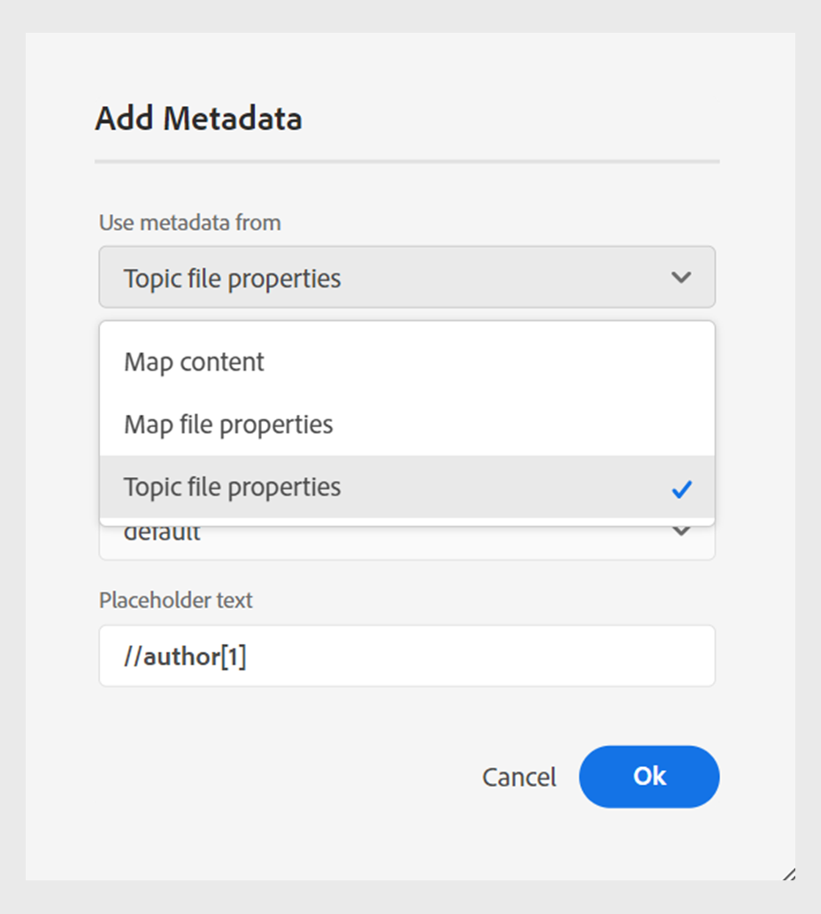
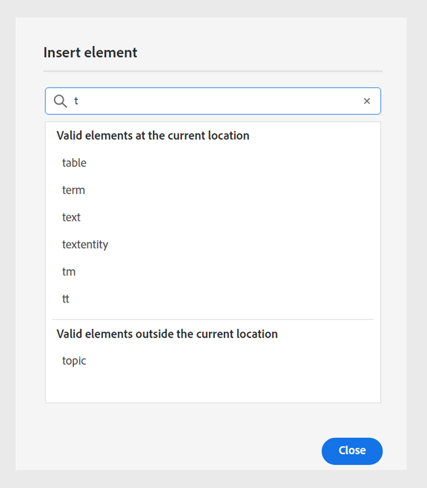

# 4.6.0 릴리스의 새로운 기능(2024년 9월)

이 문서에서는 Adobe Experience Manager Guides 버전 4.6.0과 함께 도입된 새로운 기능 및 향상된 기능을 다룹니다.

이 릴리스에서 수정된 문제 목록을 보려면 [4.6.0 릴리스에서 수정된 문제](../release-info/fixed-issues-4-6-0.md)를 확인하십시오.

[4.6.0 릴리스에 대한 업그레이드 지침](../release-info/upgrade-instructions-4-6-0.md)에 대해 알아봅니다.

## 향상된 게시 기능

4.6.0 릴리스에서는 다음과 같은 콘텐츠 게시 기능이 개선되었습니다.

### 주제 또는 해당 요소를 경험 조각에 Publish

경험 조각 은 콘텐츠와 레이아웃을 통합하는 Adobe Experience Manager 내의 모듈식 콘텐츠 단위입니다. 경험 조각은 일관되고 매력적인 경험을 만드는 데 중요하며, 이는 여러 채널에서 추가로 재사용할 수 있습니다. 예를 들어 브랜딩 요소, 프로모션 배너, 고객 추천 및 이벤트 프로모션을 사용하여 머리글이나 바닥글에 대한 경험 조각을 만들 수 있습니다.

 {width="300" align="left"}

*Publish 및&#x200B;**파일 속성**&#x200B;의&#x200B;**출력**&#x200B;섹션에서 주제의 경험 조각을 봅니다.*

이제 Experience Manager Guides을 사용하여 주제 또는 해당 요소를 경험 조각에 게시할 수 있습니다. 주제 또는 해당 요소와 경험 조각 템플릿 간에 JSON 기반 매핑을 만들 수 있습니다. 조건 필터를 사용하여 경험 조각 변형을 만들 수도 있습니다.

[Publish 경험 조각](../user-guide/publish-experience-fragment.md)을 만드는 방법에 대해 자세히 알아보세요.

### 콘텐츠 조각 게시의 개선 사항

Experience Manager Guides은 또한 콘텐츠 조각에 몇 가지 유용한 개선 사항을 제공합니다.

- Experience Manager Guides을 사용하면 주제 또는 해당 요소를 콘텐츠 조각에 게시할 수 있습니다.

- **파일 속성**&#x200B;의 **출력** 섹션에서 주제의 콘텐츠 조각을 게시하고 볼 수 있습니다.

- 콘텐츠 조각에 게시하는 동안 조건으로 콘텐츠를 필터링하여 콘텐츠 조각 변형을 쉽게 만들 수 있습니다.

- 새 매핑 인터페이스를 사용하여 요소를 쉽게 선택하고 컨텐츠 조각에 게시할 수 있습니다.

이제 콘텐츠 조각 게시는 전체 콘텐츠 조각을 덮어쓰는 대신 매핑된 콘텐츠만 대체합니다. 이 기능을 사용하면 콘텐츠 조각에 여러 주제 또는 콘텐츠 조각 편집기와 같은 여러 소스의 데이터가 포함될 수 있습니다.

자세한 내용은 [Publish 콘텐츠 조각](../user-guide/publish-content-fragment.md)을 참조하세요.

### 사용하기 쉽도록 AEM Sites 사전 설정 재구성됨

출력 사전 설정을 빠르게 구성하고 AEM Sites 출력을 생성하는 데 도움이 되도록 설정이 재구성되었습니다.
**새 출력 사전 설정** 대화 상자에서 **기존 구성 요소 매핑 사용** 옵션을 선택하여 기존 AEM Sites 사전 설정을 만들 수 있습니다.

AEM Sites 사전 설정에서 **일반**, **콘텐츠** 및 **교차 맵 참조** 탭을 봅니다.
- **일반**: 출력을 생성하는 일반 구성을 포함합니다. 사이트 및 출력 경로를 지정하고, 기존 출력 페이지를 삭제 또는 덮어쓰고, 제거된 주제에 대해 이전에 생성된 페이지를 삭제하고, 디자인 템플릿을 선택하고, 임시 파일을 유지하고, 사후 생성 워크플로우를 지정할 수 있습니다.
- **Content**: 출력 생성을 위해 콘텐츠에 적용할 수 있는 설정이 포함되어 있습니다. 필터, DITA 맵의 기준선 및 게시할 메타데이터 속성을 선택할 수 있습니다.
- **교차 맵 참조**: 이 목록에는 범위 =&quot;peer&quot;가 있는 교차 맵 참조가 포함된 항목이 포함되어 있습니다. 다른 DITA 맵에서 사용할 수 있는 주제에 대해 scope=&quot;peer&quot;를 사용하여 교차 맵 참조 목록에 대한 게시 컨텍스트를 지정할 수 있습니다. 이 탭은 Experience Manager Guides(UUID) 버전을 사용하는 경우에 나타납니다.

### 웹 편집기의 AEM Sites 사전 설정에서 교차 맵 참조

Experience Manager Guides의 최신 개선 사항에서는 웹 편집기의 AEM Sites 사전 설정에서 교차 맵 참조를 도입했습니다.
Experience Manager Guides의 교차 맵 참조는 콘텐츠 탐색을 개선하고, 콘텐츠 재사용을 늘리며, 사용자 경험을 개선하는 데 도움이 됩니다.

scope=&quot;peer&quot;가 있는 다른 DITA 맵에서 사용할 수 있는 주제에 대한 교차 맵 참조 목록에 대한 게시 컨텍스트를 지정할 수 있습니다. 예를 들어 맵 A의 항목 1에는 항목 2에 대한 참조가 포함되어 있습니다. 주제 2는 단일 또는 다중 지도에 존재할 수 있다.  각 링크에 대해 상위 맵과 특정 사전 설정 또는 가장 최근에 게시된 출력을 선택할 수 있습니다.

파일에서 동일한 주제가 두 번 이상 참조되는 경우 각 인스턴스에 대해 다른 게시 컨텍스트를 추가할 수 있습니다. 따라서 컨텐츠를 보다 유연하게 제어하고 제어할 수 있습니다. 예를 들어 항목 3은 맵 B와 맵 C 모두에 있습니다. 항목 1에는 항목 3에 대한 두 개의 참조가 포함되어 있습니다. 맵 B를 첫 번째 링크의 상위 맵으로 선택하고 맵 C를 두 번째 링크의 상위 맵으로 선택할 수 있습니다.

***AEM Sites**&#x200B;사전 설정의&#x200B;**상호 맵 참조**&#x200B;탭에서 연결된 주제에 대한 게시 컨텍스트를 지정하십시오.*

### 주제 파일 속성의 메타데이터를 기본 PDF 출력으로 전달하는 기능

이제 Experience Manager Guides을 사용하여 기본 PDF 출력을 생성하는 동안 주제의 파일 속성에서 페이지 레이아웃에 메타데이터를 추가할 수 있습니다. 이 기능을 사용하여 제목, 태그 및 설명과 같은 주제별 메타데이터를 페이지 레이아웃에 추가할 수 있습니다. 주제의 문서 상태를 기반으로 주제의 배경에 워터마크를 추가하는 등, 주제의 메타데이터를 기반으로 게시된 PDF을 사용자 정의할 수도 있습니다.

 {width="300" align="left"}

*페이지 레이아웃의 필드에 메타데이터를 추가합니다.*

페이지 레이아웃에서 [필드 및 메타데이터를 추가](../native-pdf/design-page-layout.md#add-fields-metadata)하는 방법에 대해 알아봅니다.

### 기본 PDF 게시에서 Markdown 문서 지원

Experience Manager Guides은 기본 PDF 게시에서 Markdown 문서도 지원합니다. 이 기능은 편리하며 DITA 맵에서 Markdown 파일에 대한 PDF을 생성하는 데 도움이 됩니다.

자세한 내용은 [Markdown 문서에 대한 지원](../web-editor/native-pdf-web-editor.md#support-for-markdown-documents)을 참조하세요.

### DITA-OT를 통해 출력을 생성하는 동안 임시 파일 다운로드

DITA-OT를 통해 AEM Sites, HTML, 사용자 지정, JSON 또는 PDF 출력을 게시할 때 생성된 임시 파일을 다운로드할 수도 있습니다. 이 기능을 사용하면 출력 생성 프로세스 중에 발생할 수 있는 문제를 분석하고 효과적으로 해결할 수 있습니다.  
DITA-OT를 사용하여 생성된 출력으로 전달된 메타데이터 속성을 선택한 경우 metadata.xml 파일을 다운로드할 수도 있습니다. 

사전 설정에 대한 자세한 내용은 [출력 사전 설정 이해](../user-guide/generate-output-understand-presets.md)를 참조하십시오.

### HTML5 출력에 대해 플랫 파일 계층이나 중첩 파일 계층을 선택하는 옵션

이제 Experience Manager Guides을 사용하면 전체 콘텐츠가 HTML5 출력 형식으로 게시되고 단일 폴더에 저장되는 임시 파일에 대한 플랫 폴더 계층 구조를 유지할 수 있습니다.
파일 계층 구조를 병합하지 않으면 HTML5 출력이 중첩 폴더 계층 구조로 생성됩니다. 즉, 하위 폴더로 구성된 파일이 있는 컨텐츠의 원래 폴더 구조가 출력에서 복제됩니다. 이 중첩된 폴더 계층 구조를 사용하면 파일을 보다 복잡하게 구성하고 분류할 수 있으므로 대량의 데이터를 보다 쉽게 관리하고 탐색할 수 있습니다.

[HTML5 출력을 생성](../user-guide/generate-output-html5.md)하는 방법에 대해 자세히 알아보기

## 편집기 개선 사항

4.6.0 릴리스에 다음과 같은 편집기 개선 사항이 추가되었습니다.

### 잠긴 파일의 작성자 및 Source 모드에 대한 읽기 전용 액세스

다른 사용자가 DITA 또는 Markdown 파일을 잠갔거나 체크 아웃한 경우에는 내용을 편집하거나 변경할 수 없습니다. 미리보기 외에 작성자 또는 Source 모드에서 읽기 전용 파일로 볼 수도 있습니다.
읽기 전용 모드에서는 **작성자** 또는 **Source** 모드에서 태그 및 특성과 함께 콘텐츠를 보고 파일 속성을 편집할 수 있습니다.

읽기 전용 DITA 맵에 대해 **레이아웃** 보기에 액세스할 수도 있습니다.
>[!NOTE]
>
> 작성자, Source 및 레이아웃 모드에서 읽기 전용 파일에 조화롭게 액세스할 수 있도록 폴더 프로필 관리자는 *ui_config.json*&#x200B;을(를) 업데이트해야 합니다.

*작성자 및 Source 모드에서 잠긴 파일을 봅니다.*

[Author 및 Source 모드에서 잠긴 파일을 여는 방법](../user-guide/web-editor-edit-topics.md#open-locked-files-in-author-and-source-modes)을 알아봅니다.

### 작업을 위해 요소 간 부분 컨텐츠 선택

Experience Manager Guides은 웹 편집기의 요소에서 콘텐츠를 선택하는 경험을 향상시킵니다. 다양한 요소에서 콘텐츠를 쉽게 선택하고 굵게, 기울임꼴 및 밑줄 지정과 같은 작업을 수행할 수 있습니다.

이 기능을 사용하면 부분적으로 선택한 콘텐츠의 서식을 매끄럽게 적용하거나 제거할 수 있습니다. 여러 요소에서 선택한 콘텐츠를 빠르게 삭제할 수도 있습니다. 컨텐츠가 삭제되면 필요한 경우 나머지 컨텐츠는 유효한 단일 요소 아래에 자동으로 병합됩니다. 요소 간에 부분 콘텐츠를 선택한 다음 유효한 DITA 요소 아래에 콘텐츠를 둘러쌀 수도 있습니다.

전반적으로 이러한 향상된 기능은 더 나은 환경을 제공하고 문서를 편집하는 동안 효율성을 개선하는 데 도움이 됩니다.
자세한 내용은 [요소 전체에서 일부 콘텐츠 선택](../user-guide/web-editor-edit-topics.md#partial-selection-of-content-across-elements)을 참조하세요.

### 위치에 따라 유효한 요소를 보고 삽입하기 위한 분리된 목록

이제 웹 편집기에서 문서를 편집하는 동안 현재 위치와 현재 위치 외부에 유효한 분리된 요소 목록을 볼 수 있습니다. 요구 사항에 따라 다음 옵션 중에서 요소를 선택합니다.

- 현재 커서 위치 자체에 삽입할 수 있는 **현재 위치의 올바른 요소**.
- **현재 위치 외부에 있는 올바른 요소** 요소 계층 내에서 현재 요소의 부모 뒤에 삽입할 수 있습니다.

{width="300" align="left"}

*현재 위치에 요소를 삽입할 올바른 요소의 분리된 목록을 봅니다.*

이 유효한 요소의 분할 목록은 콘텐츠 구조를 유지하고 DITA 표준을 따르는 데 도움이 됩니다.

[보조 도구 모음](../user-guide/web-editor-features.md#2051ea0j0y4) 섹션에서 **요소 삽입** 기능에 대해 자세히 알아보세요.

### 저장소 보기에서 파일을 검색하고 필터링할 수 있는 경험이 개선되었습니다.

이제 파일을 필터링하는 동안 향상된 환경을 경험할 수 있습니다. 향상된 파일 필터링 기능은 파일을 쉽게 검색하고 탐색할 수 있는 향상된 방법을 제공합니다.

{width="300" align="left"}

*텍스트가 포함된 파일 검색`general purpose.`*

관련 파일에 대한 더 빠른 액세스, 더 직관적인 사용자 인터페이스 등의 이점을 활용하여 검색 환경을 더욱 원활하고 효율적으로 만들어 보십시오.

 {width="300" align="left"}

*빠른 필터를 사용하여 DITA 및 비 DITA 파일을 검색합니다.*

>[!NOTE]
>
> 이 기능에 조화롭게 액세스할 수 있도록 폴더 프로필 관리자는 *ui_config.json*&#x200B;을(를) 업데이트해야 합니다.

[왼쪽 패널](../user-guide/web-editor-features.md#id2051EA0M0HS) 섹션의 **필터 검색** 기능에 대해 자세히 알아보십시오.

### 향상된 콘텐츠 구성을 위한 그룹화된 조건

이제 Experience Manager Guides을 사용하여 조건을 그룹화하고 중첩된 계층에 표시할 수 있으므로 여러 조건을 단일 그룹에 추가할 수 있습니다. 조건을 그룹화하면 콘텐츠에서 더 잘 구성하고 적용할 수 있습니다.

{width="300" align="left"}

[왼쪽 패널](../user-guide/web-editor-features.md#id2051EA0M0HS) 섹션에서 **조건** 기능 설명에 대해 자세히 알아보세요.

### 새로운 사용자 환경 설정의 UI로 웹 편집기 환경 맞춤화

이제 웹 편집기의 **사용자 환경 설정** 대화 상자에 새 **모양** 탭이 포함됩니다. 이 새 탭에서는 웹 편집기 인터페이스에서 가장 일반적인 모양과 느낌의 환경 설정을 편리하게 구성할 수 있습니다.

제목 또는 파일 이름별로 파일을 보도록 구성하고 응용 프로그램의 테마 및 소스 보기를 변경할 수 있습니다. 또한 저장소 보기에서 열린 파일을 찾고 줄바꿈하지 않는 공백을 처리하도록 설정을 구성하는 데 도움이 됩니다.

사용자 환경 설정의 {width="550" align="left"}

*기본 설정에 따라 모양을 사용자 지정합니다.*

[왼쪽 패널](../user-guide/web-editor-features.md#id2051EA0M0HS) 섹션에서 **사용자 환경 설정** 기능 설명에 대해 자세히 알아보세요.

### 웹 편집기의 저장소 보기에서 열려 있는 파일을 찾습니다

빠르게 탐색하여 저장소 보기에서 파일을 찾으려면 **사용자 환경 설정**&#x200B;에서 **항상 리포지토리에서 파일 찾기** 옵션을 선택하십시오. 수동으로 검색할 필요가 없습니다.

편집하는 동안 이 기능을 사용하면 저장소 계층 구조 내에서 파일의 위치를 쉽게 볼 수도 있습니다.

자세한 내용은 [저장소 보기에서 열려 있는 파일을 찾습니다](../user-guide/web-editor-edit-topics.md#locate-an-open-file-in-the-repository-view)를 참조하십시오.

### 웹 편집기에서 줄바꿈하지 않는 공백에 대한 처리가 개선되었습니다.

Experience Manager Guides을 사용하면 웹 편집기에서 문서를 편집하는 동안 줄바꿈하지 않는 공백 표시기를 표시할 수 있습니다. 또한 줄바꿈하지 않는 공백의 처리도 향상됩니다.
연속된 여러 공백을 단일 공백으로 변환하여 웹 편집기에서 문서의 WYSIWYG 보기를 유지합니다. 이 기능은 문서의 전체 모양과 전문성을 개선하는 데도 도움이 됩니다.

자세한 내용은 웹 편집기의 [기타 기능](../user-guide/web-editor-other-features.md)을 참조하세요.

### 요소 계층에서 요소의 속성을 보는 기능

이제 콘텐츠 속성 **Type**&#x200B;이(가) 드롭다운 메뉴로 나타납니다. 드롭다운에서 현재 태그에 대한 전체 계층의 태그를 보고 선택할 수 있습니다.

이 드롭다운 메뉴를 사용하면 선택한 태그의 콘텐츠 속성에 빠르게 액세스할 수 있습니다.

{width="300" align="left"}

*현재 태그에 대한 계층 구조에서 태그를 선택하십시오.*

[오른쪽 패널](../user-guide/web-editor-features.md#id2051eb003yk) 섹션에서 **콘텐츠 속성** 기능에 대해 자세히 알아보세요.

### 맵 편집기에서 파일을 일괄적으로 체크 인하는 동안 성능이 향상되었습니다.

Experience Manager Guides은 맵 편집기에서 대량 파일 체크인 기능의 성능과 경험을 개선합니다. 이 개선 사항은 파일을 더 빨리 대량으로 체크 인하는 데 도움이 됩니다.
**새 버전으로 저장 및 잠금 해제** 대화 상자에서 파일에 대한 체크 인 작업의 진행 상황을 볼 수도 있습니다. 마지막으로 작업이 완료되고 선택한 모든 체크 아웃된 파일이 체크 인되면 성공 메시지가 나타납니다.

{width="300" align="left"}

*맵 편집기에서 일괄적으로 검사한 파일의 목록과 상태를 봅니다.*

[고급 맵 편집기로 작업하는 방법](../user-guide/map-editor-advanced-map-editor.md) 알아보기

## 컨텐츠 수명주기 관리 기능 향상

ILM( 콘텐츠 수명주기 관리 ) 은 다음과 같은 방식으로 향상되었습니다.

### 사전 구성된 언어 그룹을 사용하여 콘텐츠를 여러 언어로 번역

이제 Experience Manager Guides를 사용하면 언어 그룹을 만들고 콘텐츠를 여러 언어로 간편하게 번역할 수 있습니다. 이 기능은 조직의 필요에 따라 번역을 구성하고 관리하는 데 도움이 됩니다.

예를 들어 유럽 일부 국가의 콘텐츠를 번역해야 하는 경우 영어(EN), 프랑스어(FR), 독일어(DE), 스페인어(ES), 이탈리아어(IT)와 같은 유럽 언어에 대한 언어 그룹을 만들 수 있습니다.

{width="300" align="left"}

*문서를 번역할 언어 그룹을 선택하십시오.*

>[!NOTE]
>
>언어의 대상 폴더가 없거나 대상 언어가 소스와 동일한 경우 회색으로 표시되며 경고 기호가 나타납니다.

관리자는 언어 그룹을 생성하고 이를 여러 폴더 프로필로 구성할 수 있습니다. 작성자는 폴더 프로필에 구성된 언어 그룹을 조회할 수 있습니다.

언어 그룹을 만들면 번역 프로젝트의 전반적인 효율성과 생산성이 향상되어 궁극적으로 여러 언어에 대한 현지화 프로세스가 개선됩니다.

[웹 편집기에서 문서를 번역하는 방법](../user-guide/translate-documents-web-editor.md)을 알아보세요.

### 대규모 번역 프로젝트를 위한 향상된 성능 및 확장성

번역 기능은 그 어느 때보다 빠르고 확장 가능합니다. 향상된 성능을 제공하는 새로운 아키텍처가 포함되어 있습니다. 프로젝트 제작 시간이 예전보다 빨라졌고 이 과정에서 발생하는 갈등도 거의 전무하다. 이렇게 향상된 성능을 통해 더 빠른 번역을 수행할 수 있으므로 대규모 번역 프로젝트에서도 원활하게 작업할 수 있습니다.

이 개선 사항은 생산성과 전반적인 경험을 향상시키므로 매우 유용합니다.

웹 편집기에서 문서를 [번역하는 방법](../user-guide/translate-documents-web-editor.md)에 대해 자세히 알아보세요.

### 번역 후 자동으로 번역 프로젝트 삭제 또는 비활성화

이제 관리자는 번역을 완료한 후 번역 프로젝트를 자동으로 비활성화하거나 삭제하도록 구성할 수 있습니다. 이 기능을 사용하면 번역을 완료한 후 리소스를 효율적으로 사용하고 파일을 관리할 수 있습니다.

프로젝트를 삭제하면 프로젝트에 있는 모든 파일과 폴더가 영구적으로 제거됩니다. 번역 프로젝트를 삭제하면 사용 중인 디스크 공간도 확보할 수 있습니다.

나중에 사용하려면 번역 프로젝트를 비활성화할 수 있습니다.

{width="550" align="left"}

*번역 프로젝트에 대한 언어 그룹 및 정리 설정을 구성합니다.*

[번역 프로젝트를 자동으로 삭제하거나 사용하지 않도록 설정하는 방법](../user-guide/translate-documents-web-editor.md#automatically-delete-or-disable-a-completed-translation-project)에 대해 자세히 알아보세요.

### Adobe Experience Manager Assets의 선택적 폴더에 대한 사후 처리 비활성화

이제 관리자는 Experience Manager Assets의 선택적 폴더에 대해 사후 처리 및 UUID 생성을 비활성화할 수 있습니다. 이 구성은 특히 많은 에셋 또는 복잡한 폴더 구조를 처리할 때 유용할 수 있습니다. 또한 여러 사용자가 서로 간섭하지 않고 자산을 동시에 빠르게 업로드할 수 있습니다.  

폴더에 대한 사후 처리를 비활성화하면 모든 하위 폴더에도 영향을 줍니다. 그러나 이제 Experience Manager Guides에서는 무시된 폴더 내의 개별 하위 폴더에 대해 사후 처리를 선택적으로 활성화할 수 있는 기능을 제공합니다.

[폴더에 대한 후처리를 사용하지 않도록 설정하는 방법](../cs-install-guide/conf-folder-post-processing.md)을 알아보세요.

## 데이터 소스 커넥터의 개선 사항

2024.4.0 릴리스에는 데이터 소스 커넥터에 대한 다음과 같은 개선 사항이 포함됩니다.

### Salsify, Akeneo 및 Microsoft Azure ADO(DevOps Boards) 데이터 소스에 연결

기존의 기본 제공 커넥터 외에도 Experience Manager Guides는 Salsify, Akeneo 및 Microsoft Azure DevOps Boards (ADO) 데이터 소스에 대한 커넥터를 제공합니다. 관리자는 이러한 커넥터를 다운로드하고 설치할 수 있습니다. 그런 다음 설치된 커넥터를 구성합니다.

### 샘플 쿼리를 복사하여 붙여 넣어 콘텐츠 조각 또는 주제를 만듭니다.

생성기에서 샘플 데이터 쿼리를 손쉽게 복사하고 붙여넣어 콘텐츠 스니펫이나 주제를 생성할 수 있습니다. 이 기능을 사용하면 구문을 기억하거나 쿼리를 수동으로 만들 필요가 없습니다. 쿼리를 수동으로 입력하는 대신 샘플 쿼리를 복사하여 붙여넣고 편집한 후 요구 사항에 따라 데이터를 가져오는 데 사용할 수 있습니다.

{width="800" align="left"}

*샘플 쿼리를 복사하고 편집하여 콘텐츠 스니펫을 만듭니다.*

### 파일 커넥터를 사용하여 JSON 데이터 파일에 연결

이제 관리자는 JSON 데이터 파일을 데이터 소스로 사용하도록 JSON 파일 커넥터를 구성할 수 있습니다. 커넥터를 사용하여 컴퓨터 또는 Adobe Experience Manager Assets에서 JSON 파일을 가져옵니다. 그런 다음 작성자는 생성기를 사용하여 콘텐츠 조각이나 주제를 만들 수 있습니다.

이 기능을 사용하면 JSON 파일에 저장된 데이터를 사용하고 다양한 스니펫에서 재사용할 수 있습니다. JSON 파일을 업데이트할 때마다 콘텐츠도 동적으로 업데이트됩니다.

### 커넥터에 대한 여러 리소스 URL을 구성하여 콘텐츠 조각 또는 주제를 만듭니다

관리자는 일반 REST 클라이언트, Salsify, Akeneo 및 Microsoft Azure DevOps 보드(ADO)와 같은 일부 커넥터에 대해 여러 리소스 URL을 구성할 수 있습니다.

그런 다음 작성자는 데이터 소스에 연결하여 생성기를 사용하여 콘텐츠 스니펫이나 주제를 만듭니다. 이 기능을 사용하면 각 URL에 대한 데이터 소스를 만들 필요가 없기 때문에 유용합니다. 따라서 단일 콘텐츠 조각 또는 주제의 특정 데이터 소스에 대한 리소스에서 데이터를 빠르게 가져올 수 있습니다.

데이터 원본 커넥터에 대한 자세한 내용 및 [사용자 인터페이스에서 데이터 원본 커넥터를 구성하는 방법](../cs-install-guide/conf-data-source-connector-tools.md)을 참조하세요.

[데이터 소스의 데이터를 사용하는 방법](../user-guide/web-editor-content-snippet.md)에 대해 알아봅니다.

