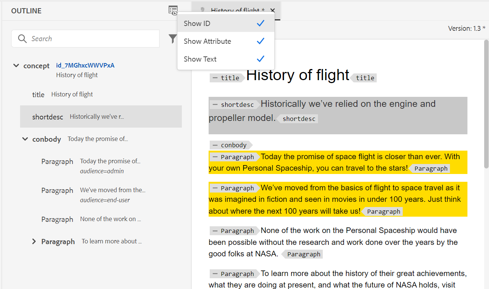

# Adobe Experience Manager Guides 4.2.1 릴리스의 새로운 기능 (2023년 5월)

이 문서에서는 Adobe Experience Manager Guides 버전 4.2.1(이후 설명됨)의 새로운 기능 및 향상된 기능을 다룹니다. *AEM 안내서*).

업그레이드 지침, 호환성 매트릭스 및 이 릴리스에서 해결된 문제에 대한 자세한 내용은 [릴리스 정보](release-notes-4.2.1.md) 기사.

## 웹 편집기에서 AEM 홈 페이지로 이동합니다.

이제 웹 편집기에서 AEM 탐색 페이지로 쉽게 이동할 수 있습니다.

{width="800" align="left"}

* 다음을 클릭합니다. **안내서** 아이콘( )를 클릭하여 AEM 탐색 페이지로 돌아갑니다.

자세한 내용은 [AEM 탐색 페이지](../user-guide/web-editor-launch-editor.md#id2056BG00RZJ).

## PDF 게시의 고급 메타데이터 지원

AEM Guides는 이제 PDF 출력의 메타데이터에 매핑되는 메타데이터에 대한 고급 지원을 제공합니다. 메타데이터 옵션에는 작성자 이름, 문서 제목, 키워드, 저작권 정보 및 기타 데이터 필드와 같은 문서 및 문서 콘텐츠에 대한 정보가 포함됩니다.

XMP 파일을 가져올 수 있으며 AEM Guides는 파일에서 정보를 선택할 수 있습니다. 드롭다운을 사용하여 메타데이터 이름 및 값을 제공하는 옵션도 있습니다. 이름 필드에 직접 입력하여 사용자 지정 메타데이터를 추가할 수도 있습니다.

자세한 내용은 **메타데이터** 의 기능 설명 [PDF 출력 사전 설정 만들기](../web-editor/native-pdf-web-editor.md).

### 향상된 개요 보기 패널

AEM Guides는 문서에 사용된 요소의 계층 구조를 확인할 수 있도록 향상된 개요 보기 패널을 제공합니다.

아웃라인 뷰에서는 다음과 같은 기능이 개선되었습니다.

* [개요 보기] 패널 위에 [보기 옵션] 드롭다운이 표시됩니다. 요소에 ID, 속성 및 텍스트가 있는 경우 드롭다운에서 해당 요소를 선택하여 요소와 함께 표시할 수 있습니다. 아웃라인 뷰 패널에 표시할 수 있는 속성은 관리자가 내에서 구성한 표시 속성 설정에 의해 결정됩니다. **편집기 설정**.

* 검색 기능을 사용하여 이름, ID, 텍스트 또는 속성 값으로 요소를 검색할 수 있습니다.

자세한 내용은 의 개요 보기 기능 설명을 참조하십시오. [왼쪽 패널](../user-guide/web-editor-features.md#id2051EA0M0HS) 섹션.

## 웹 편집기에서 멀티미디어 보고서 생성

AEM Guides에서는 기술 문서에 대한 보고서를 생성하는 기능을 제공합니다.  이 기능을 사용하여 주제 목록을 보고 문서의 메타데이터를 관리할 수 있습니다. 이제에서 현재 맵의 모든 참조에 사용되는 멀티미디어도 확인할 수 있습니다. **보고서** 웹 편집기의 탭

현재 맵 내에서 참조에 사용된 멀티미디어에 대한 자세한 정보가 포함된 멀티미디어 보고서를 생성할 수 있습니다. 보고서에 나열된 멀티미디어 파일을 필터링하고 정렬할 수 있습니다.
CSV를 생성하여 DITA 맵에 사용된 멀티미디어의 현재 스냅샷을 다운로드할 수도 있습니다.

자세한 내용은 의 멀티미디어 보고서 생성 기능 설명을 참조하십시오. [웹 편집기의 DITA 맵 보고서](../user-guide/reports-web-editor.md) 섹션.

## 기본 PDF | 목차에서 변경된 주제를 나타내도록 막대 변경

이제 AEM Guides를 사용하여 PDF 출력의 목차에서 변경된 주제를 빠르게 식별할 수 있습니다.  목차에서 변경된 주제 왼쪽에 변경 막대가 표시됩니다. 목차에서 항목을 클릭하고 자세한 변경 내용을 볼 수 있습니다.

자세한 내용은 [사용자 정의 변경 막대 스타일 작업](../native-pdf/change-bar-style.md).

## 기본 PDF | 각주 구성 요소의 페이지 마커 스타일 지정

이제 발 노트의 페이지 마커를 스타일링할 수 있습니다. 예를 들어 대괄호를 추가하거나 색상을 변경할 수 있습니다. 이러한 스타일은 사용자가 문서에서 페이지 마커를 쉽게 식별하는 데 도움이 됩니다.

자세한 내용은 [각주에서 사용자 정의 스타일 사용](../native-pdf/footnote-number-style.md).

## 웹 편집기에서 비디오 또는 오디오 파일 열기 및 재생

이제 AEM Guides에서는 웹 편집기에서 오디오 또는 비디오 파일을 열고 재생하는 기능을 제공합니다. 볼륨 또는 비디오 보기를 변경할 수 있습니다. 바로 가기 메뉴에는 다음과 같은 옵션이 있습니다. **다운로드**, 변경 **재생 속도**, 또는 보기 **화면 속 화면**.

자세한 내용은 저장소의 저장소 보기 기능 설명을 참조하십시오. [왼쪽 패널](../user-guide/web-editor-features.md#id2051EA0M0HS) 섹션.
