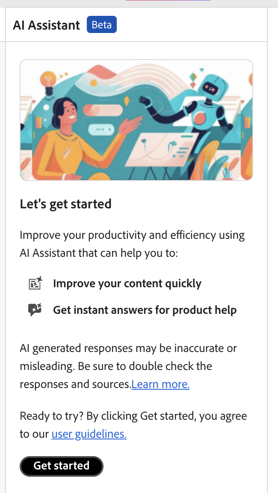

# AI Assistant(Beta)

Adobe Experience Manager Guides의 **AI Assistant**&#x200B;는 스마트 도움말 및 작성 기능을 통해 생산성을 향상시키도록 설계된 강력한 AI 기반 도구입니다. 강력한 두 가지 AI 기능(**작성** 및 **도움말**)을 Experience Manager Guides 인터페이스에 포함시켜 콘텐츠를 작성하고 Experience Manager Guides 설명서에서 정보에 보다 빠르고 효율적으로 액세스할 수 있도록 합니다.

>[!NOTE]
>
> AI Assistant 기능은 현재 Adobe Experience Manager Guides as a Cloud Service에서 사용할 수 있습니다.

AI Assistant의 **작성** 기능을 사용하면 작성 프로세스를 보다 빠르고 효율적으로 수행할 수 있습니다. 선택한 콘텐츠를 기반으로 콘텐츠 재사용을 위한 지능형 제안 생성, 콘텐츠 번역, 콘텐츠 품질 개선 등의 기능을 제공합니다. 이 기능은 전반적인 작성 환경과 작성자의 생산성을 향상시킵니다.

자세한 내용은 [작성](./ai-assistant-right-panel.md)을 참조하세요.

{align="left"}

AI Assistant의 **도움말** 기능은 Experience Manager Guides을 더 잘 이해하고, 문제를 해결하며, Adobe Experience Manager Guides 설명서에서 정보를 검색하는 데 도움이 되도록 설계된 직관적인 채팅 기반 도구입니다. 사용 안내서와 참조 문서를 검색하는 대신 **도움말** 기능을 사용하여 쿼리에 대한 적절한 답변을 빠르게 찾을 수 있습니다. 따라서 시간을 절약하고 컨텐츠 작성에 집중할 수 있으므로 생산성과 효율성이 향상됩니다.

자세한 내용은 [도움말](./ai-based-smart-help.md)을 참조하세요.

{align="left"}

## AI Assistant 시작

**AI 도우미**&#x200B;를 처음 사용하는 경우 Experience Manager Guides Generative AI 기능을 사용하기 전에 동의를 제출하라는 메시지가 표시됩니다.

AI Assistant를 시작하려면 다음 단계를 수행하십시오.

1. Experience Manager Guides에 로그인
1. 홈 페이지의 맨 위에서 **AI 길잡이**&#x200B;를 선택합니다.   관리자가 AI Assistant 기능을 활성화했는지 확인합니다.

   AI Assistant 페이지의 주요 기능, 사용자 지침 링크 및 **시작** 버튼이 강조 표시됩니다.

   {align="left"}

1. 사용자 지침을 주의 깊게 읽은 다음 **시작하기**&#x200B;를 선택하여 AI 도우미를 시작합니다.

**관련 항목**

[AI Assistant 보안 FAQ](./ai-assistant-faq.md)

[Adobe Experience Manager Guides Generative AI 공개](./adobe-generative-ai-disclosures.md)

[스마트 도움말 및 작성을 위한 AI Assistant 구성](../cs-install-guide/conf-smart-suggestions.md)
