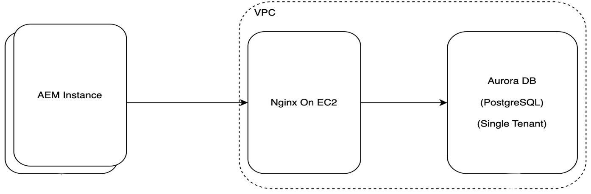
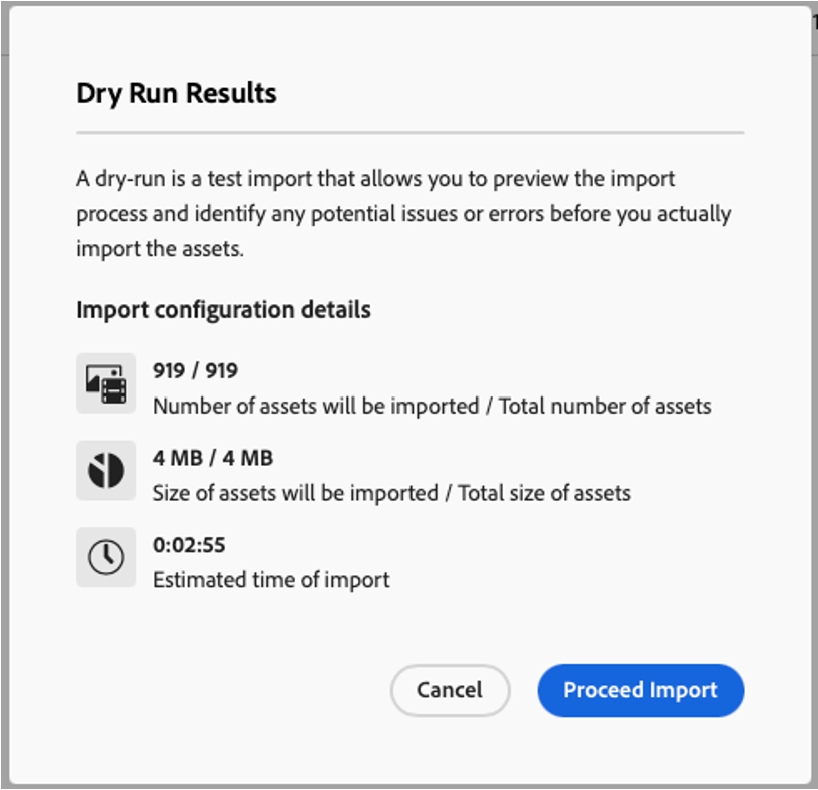

# 자산 처리

에셋 처리는 콘텐츠 에셋이 플랫폼 내에서 구조화되고, 검증되고, 색인화되고, 액세스할 수 있도록 하는 중요한 워크플로입니다. 확장성 요구 사항이 발전하고 클라우드 기반 요구 사항이 증가함에 따라 아키텍처는 단일 스레드 계층형 처리 모델에서 배포 가능한 그래프 기반의 다중 스레드 시스템으로 크게 전환되었습니다.

## 현재 에셋 처리 워크플로

### 처리 개요

에셋을 Experience Manager Guides로 가져오면 다음과 같은 순차적 처리 단계가 실행됩니다.

- 고유 키 할당: 추적 가능성 및 참조 무결성을 보장하기 위해 각 문서에 고유 식별자가 할당됩니다.
- 구문 분석: 콘텐츠(예: DITA XML)는 시스템 수준에서 이해할 수 있도록 구조화된 구성 요소로 구문 분석됩니다.
- 유효성 검사: 구조 및 스키마 유효성 검사는 문서 표준 준수를 보장합니다.
- 참조 해결: 자산 간에 상호 참조(링크, 이미지, 종속성)가 해결됩니다.
- 메타데이터 추출: 제목, 작성자 및 사용자 지정 속성과 같은 메타데이터는 색인 지정 및 검색을 위해 추출됩니다.
- 수정 시 재처리: 증분 재처리를 통해 콘텐츠 업데이트 후 일관성을 보장합니다.

### 건축적 특성

- **단일 스레드 처리**: B-트리 구현에 의존하는 JCR(Java Content Repository) 구조가 손상되지 않도록 합니다.따라서 데이터 무결성이 보장되지만 대량 수집 중에 처리 병목 현상이 발생합니다.

- **상위 맵 종속성**: 그래프 순회를 사용하여 자산 간의 계층 관계를 유지합니다. 이는 연산 오버헤드가 증가되고 대규모 처리 시 대기 시간이 길며, 트래버스 중심의 작업으로 인한 스트레인이 큰 집약적 작업이다.

## 새로운 자산 처리 흐름

핵심 처리 단계는 기능적으로 일관되게 유지되지만 이제 분산 및 병렬화된 프레임워크 내에서 실행되므로 처리량이 크게 향상됩니다.

### 아키텍처 개선 사항

- **그래프 데이터베이스 통합**:
   - 계층 JCR에서 기본 그래프 데이터베이스로 전환
   - 관계 및 상관 관계를 효율적으로 처리
   - 계층형 스토리지에서 그래프 작업 시뮬레이션의 복잡성 제거
- **다중 스레드 분산 처리**:
   - 처리는 클라우드 환경에서 여러 Pod에 걸쳐 실행됩니다
   - 단일 지시선 노드에 대한 종속성 제거
   - 수평적 확장 및 병렬 실행 가능
- **부모 맵 종속성 제거:**
   - 명시적 그래프 순회의 필요성 제거
   - I/O 작업 및 처리 지연 시간 단축
   - 파이프라인 처리 간소화
- **동기화된 고유 ID 할당**
   - 중앙 집중식 조정은 다음을 보장합니다.
   - 문서 ID 복제 없음
   - 분산된 노드 간 일관성
   - 동시 환경에서 참조 무결성 유지
- **클라우드 기반의 확장 가능한 데이터베이스(AWS 호스팅)**
   - 높은 가용성과 복원력 있는 데이터베이스 계층
   - 워크로드에 따라 탄력적인 확장 지원
   - 전반적인 시스템 안정성 및 성능 향상



## 새로운 아키텍처의 장점

- 성능 향상:
   - 병렬 실행을 통해 처리 시간 대폭 단축
   - 트래버스 중심의 작업 제거, 지연 시간 단축
   - 최적화된 그래프 처리로 종속성 해결 속도 향상
- 확장성:
   - 포드를 가로로 확장하여 대용량 수집 볼륨 처리 가능
   - 워크로드 수요에 동적으로 적응하는 클라우드 기반 인프라
- 안정성 및 가용성:
   - 분산 처리를 통해 단일 장애 지점 제거
   - AWS 호스팅 데이터베이스를 통해 고가용성 및 내결함성 보장
- 효율성 향상:
   - 상위 맵 순회 제거로 인해 입출력 오버헤드 감소
   - 컴퓨팅 노드 간 리소스 활용도 향상
- 데이터 무결성:
   - 동기화된 ID 할당은 분산 시스템 전반에서 일관성을 유지합니다.
   - 동시성을 활성화하는 동안 견고성 유지

## 데이터베이스 구성

Experience Manager Guides을 사용하면 AEM 클라우드 환경에 대한 간소화된 데이터베이스 구성이 가능합니다. AEM Cloud 인스턴스에 대한 데이터베이스를 설정하려면 다음 단계를 수행하십시오.

1. AEM Cloud Manager 액세스: 아래 URL을 사용하여 Adobe Experience Cloud Manager로 이동하여 자리 표시자를 조직, 프로그램 및 환경 세부 정보로 바꿉니다. `https://experience.adobe.com/#/${orgName}/cloud-manager/environments.html/program/${programId}/environment/${envId}`

1. 환경 구성: Cloud Manager을 통해 환경 구성 페이지를 연 후 필요한 데이터베이스 구성 설정을 포함하여 인스턴스별 설정을 조정할 수 있습니다.

이렇게 간소화된 접근 방식을 통해 Adobe 클라우드 인프라 내에서 AEM 환경에 쉽게 액세스하고 구성할 수 있습니다.

1. 아래 속성을 구성합니다.


| 속성 이름 | 값 | 적용된 서비스 | 유형 |
|----------------------------------|--------------------------------|-----------------|----------|
| DATABASE_URL | `<host>:<port>/<db_name>` | 작성자 | 변수 |
| GUIDES_ENABLE_DATABASE | `true` | 작성자 | 변수 |
| DATABASE_PASSWORD | `password` | 작성자 | 시크릿 |
| 데이터베이스 사용자 이름 | `username` | 작성자 | 변수 |
| RUN_POSTPROCESS_IN_PHASE | `true` | 작성자 | 변수 |
| DATABASE_CONNECTION_POOL_SIZE | `10` | 작성자 | 변수 |


{width="350"}

1. 변경 내용 저장: 구성을 변경한 후 Cloud Manager 인터페이스 내에서 **저장**&#x200B;해야 합니다.

1. 시스템 가용성: 구성이 완전히 적용되면 GET `http://host/bin/guides/v1/system/status`을(를) 열고 아래 속성을 확인하십시오.
   - `<isDatabase>`: true여야 합니다.
   - `<databaseConnectionCheck>`: 전달해야 합니다.

   응답에서 위의 값이 올바른 경우 시스템을 새로 구성된 데이터베이스와 함께 사용할 수 있습니다.

이 프로세스를 수행하면 AEM 클라우드 환경이 제대로 설정되고 바로 사용할 수 있습니다.

>[!NOTE]
>
> 기존 컨텐츠가 있는 기존 환경으로 마이그레이션하는 경우 새 컨텐츠를 수집하기 전에 먼저 2단계(기존 컨텐츠 마이그레이션)를 실행해야 합니다. 임시 GUID가 새 콘텐츠에 대해 올바르게 할당되도록 하기 위한 것입니다.

## AEM DAM(클라우드 환경)에서 데이터 수집(1단계)

AEM DAM(Digital Asset Manager)에서 새 폴더를 설정하고 데이터를 수집하며 JCR 기반 환경과 비교하는 경우 아래 단계를 따르십시오.

1. DAM에 새 폴더를 만듭니다.

2. 데이터 업로드 도구를 사용하여 데이터 수집: 자세한 내용은 **AEM Cloud에 Assets 업로드**&#x200B;를 참조하십시오.

3. 시스템 확인
   - 업로드가 완료되면 자산이 DAM에 있는지 확인합니다.
   - 메타데이터(예: 파일 유형, 설명 및 태그)가 추출되고 에셋과 연결되어 있는지 확인합니다.
   - Experience Manager Guides 처리(다중 스레드)를 검사하여 모든 참조, 메타데이터 추출 및 유효성 검사가 성공했는지 확인합니다.
   - 문서 액세스 및 편집을 테스트하여 시스템 무결성을 확인합니다.

4. JCR 기반 환경과의 비교
   - 다양한 테스트 사례에서 결과를 비교합니다.
   - 수집 속도를 평가합니다.


Experience Manager Guides을 데이터베이스 기반 설정으로 전환하기 전에 업로드되고 처리된 콘텐츠를 마이그레이션하기 위해 마이그레이션 스크립트를 사용할 수 있습니다. 스크립트는 일련의 API를 활용하여 마이그레이션 프로세스를 시작하고 모니터링합니다. 다음 단계에서는 권장 접근 방식에 대해 간략히 설명합니다.

## JCR에서 데이터베이스로 콘텐츠 마이그레이션(2단계)

Experience Manager Guides을 데이터베이스 기반 설정으로 전환하기 전에 업로드 및 처리된 콘텐츠를 마이그레이션하려면 마이그레이션 스크립트를 사용해야 합니다. 스크립트는 일련의 API를 활용하여 마이그레이션 프로세스를 시작하고 모니터링합니다. 다음 단계에서는 권장 접근 방식에 대해 간략히 설명합니다.

1. REST 클라이언트를 사용하여 마이그레이션 API를 트리거합니다.
2. 마이그레이션 진행 상황을 확인합니다.
3. 완료될 때까지 마이그레이션 모니터링: 진행 API가 100% 완료를 보고할 때까지 모니터링을 계속합니다. 완료되면 JCR 저장소에서 이전에 업로드하고 처리한 모든 콘텐츠가 데이터베이스로 마이그레이션됩니다.

   >[!NOTE]
   >
   > - AEM을 사용하여 요청을 인증하는 데 필요한 인증 헤더(예: OAuth 토큰, API 키 또는 개발자 콘솔의 액세스 토큰)가 포함되어 있는지 확인하십시오.
   > - 마이그레이션 기간은 콘텐츠 저장소의 크기에 따라 다릅니다. 오류 또는 중단에 대한 모니터링과 함께 주기적 진행 검사를 사용하는 것이 좋습니다.
   > - 사용 가능한 경우 마이그레이션 로그를 검토하여 마이그레이션 성능을 평가하고 문제를 파악합니다.

4. 대용량 저장소 마이그레이션을 지원하려면 아래 구성을 따르십시오

   >[!NOTE]
   >
   > 마이그레이션 중에 저장소 통과 오류가 발생한 경우에만 이 구성을 적용합니다.

   `file name: `org.apache.jackrabbit.oak.query.QueryEngineSettingsService.xml&quot;

   ```xml
   <?xml version="1.0" encoding="UTF-8"?>
   <jcr:root xmlns:jcr="http://www.jcp.org/jcr/1.0"
         xmlns:sling="http://sling.apache.org/jcr/sling/1.0"
         jcr:primaryType="sling:OsgiConfig"
         queryLimitInMemory="5000000"
         queryLimitReads="1000000"
   />
   ```


## 마이그레이션 API

### 마이그레이션 시작

- 끝점: `POST /bin/guides/v1/assets/process`
- 요청 본문: (`application/json`):

```json
  {
    "path": "/content/dam/dita-templates",
    "excludedPaths": [
      "/content/dam/demo",
      "/content/dam/demo1"
    ],
    "type": "ASSET_PROCESSING"
  }
```

- 마이그레이션에 대한 processingId를 반환합니다.
- 제품에 내장된 에셋 처리 워크플로우를 트리거합니다.

### 마이그레이션 상태 확인

끝점: `GET /bin/guides/v1/assets/process/status?processingId=<processingId>`

### 실행 중인 마이그레이션 취소

- 끝점: `POST /bin/guides/v1/assets/process/cancel`
- 요청 본문(application/json):

  ```
  {
   "processingId": "processingId"
  }
  ```

### 실패하거나 취소된 마이그레이션 다시 시작

- 끝점: `POST /bin/guides/v1/assets/process/resume`
- 요청 본문(application/json):

  ```
  {
   "processingId": "processingId"
  }
  ```

## AEM 클라우드에 자산 업로드

Adobe Experience Manager(AEM) as a Cloud Service은 일괄 컨텐츠 수집을 위한 여러 가지 접근 방식을 제공합니다. 특히 Experience Manager Guides 후처리에 대해 최적의 성능을 보장하려면 지원되고 확장 가능한 수집 전략을 채택하는 것이 중요합니다.

### 클라우드 스토리지 통합을 사용한 대량 수집

AEM은 지원되는 클라우드 스토리지 공급자를 통해 일괄 컨텐츠 수집을 지원하므로 조직에서 선호하는 스토리지 솔루션을 연결하고 컨텐츠를 AEM으로 직접 가져올 수 있습니다. 이 방법은 다음과 같은 이점 때문에 대규모의 성능에 민감한 수집에 권장됩니다.

- 확장 가능한 인프라: 수집 프로세스는 Adobe이 관리하는 클라우드 인프라에서 실행되므로 로드 및 컨텐츠 볼륨에 따라 자동 확장이 가능합니다. 이를 통해 대용량 데이터 세트의 경우에도 일관된 수집 성능을 유지할 수 있습니다.

- 예측 가능한 수집 계획: 사용자는 수집 기간을 미리 예측할 수 있으므로 릴리스 계획, 예약 및 종속 팀과의 조정에 도움이 됩니다.

  {width="350"}

- 포괄적인 로깅 및 추적: 수집 워크플로우에는 세부 로깅 및 추적 기능이 포함되어 있어 가져오기 프로세스 전체에서 진행 상황, 성공 상태 및 잠재적 문제에 대한 가시성을 제공합니다.

  {width="350"}

- 예약된 수집: 사전 정의된 기간 동안 컨텐츠 수집이 발생하도록 예약할 수 있으므로 최종 사용자 및 진행 중인 작업에 영향을 최소화하거나 전혀 미치지 않습니다.

자세한 내용은 [일괄 가져오기 사용](https://experienceleague.adobe.com/en/docs/experience-manager-learn/cloud-service/migration/bulk-import)을 참조하십시오.

## AEM 업로드를 사용한 일괄 수집

AEM은 사용자가 로컬 파일 시스템에서 직접 컨텐츠를 수집할 수 있는 라이브러리 및 CLI(명령줄 인터페이스)인 [AEM 업로드](https://github.com/adobe/aem-uploa)도 제공합니다. 이 옵션은 사용자 정의 솔루션에 통합하거나 독립형 CLI 도구로 사용하여 컨텐츠를 업로드할 수 있습니다.

이 접근 방식은 사용자 로컬 시스템에서 실행되므로 안정적이고 원활한 수집 경험을 보장하기 위해 중단되지 않는 안정적인 네트워크 연결이 필요합니다.


## Experience Manager Guides 데이터베이스 연결 상태 확인

데이터베이스를 사용하도록 구성된 Experience Manager Guides 배포는 안정적으로 작동하기 위해 안정적이고 일관된 데이터베이스 연결이 필요합니다. 데이터베이스 연결 상태를 확인하는 것은 시스템 기능에 영향을 줄 수 있는 연결 관련 문제를 배제하기 위한 주요 상태 확인 단계입니다.

이 상태 검사를 통해 데이터베이스가 구성되어 있고 접근 가능하며 예상대로 작동하는지 확인할 수 있습니다. DB 연결 상태를 확인하려면 아래 단계를 수행하십시오.

1. 브라우저 또는 REST 클라이언트 열기
2. 이 [URL](https://host:port/bin/guides/v1/system/status)을(를) 사용하여 GET 호출 트리거
3. 아래 필드를 사용하여 시스템 구성 및 상태를 확인할 수 있습니다
   1. isDatabase:
      - true: 환경이 데이터베이스로 구성되었습니다.
      - false: 환경에서 데이터베이스를 사용하고 있지 않습니다.

   2. databaseConnectionCheck
      - 통과: Experience Manager Guides에서 연결 상태를 확인하고 Guides에서 데이터베이스와 연결할 수 있는 경우 통과 상태로 반환됩니다.
      - 실패: 환경이 데이터베이스와 통신할 수 없습니다. 고객은 시스템 사용을 즉시 중단해야 하며 Adobe 지원에 문의해야 합니다.

## 로그 모니터링

Experience Manager Guides with Database는 세부 정보를 효율적으로 로그하여 insight을 시스템 상태에 지정합니다.
Splunk에서 아래 쿼리를 사용하여 다양한 시나리오에 대한 로그를 가져옵니다.

1. 마이그레이션 로그:
   - `index IN ("dx_aem_engineering") aem_service=cm-${programid}-${environmentId} sourcetype=aemerror "AssetProcessingJob" OR "AssetJobProducerDb" NOT "ServiceEvent"`
2. 후 처리 로그:
   - `index IN ("dx_aem_engineering") aem_service= cm-${programid}-${environmentId} sourcetype=aemerror com.adobe.fmdita.uuid.concrete.Cor*`


>[!NOTE]
>
> 기간, 로그 수준에 따라 이러한 로그를 필터링하거나 일부 특정 패턴을 검색하려면 [Splunk 쿼리 기능](https://www.splunk.com/en_us/blog/learn/splunk-cheat-sheet-query-spl-regex-commands.html)에 대해 자세히 알아보십시오.


