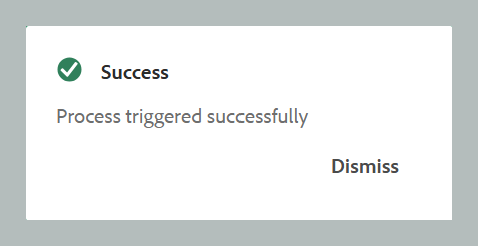

# 자산 처리

게시와 같이 데이터가 많은 워크플로우에서는 효율적인 에셋 관리가 성능과 안정성을 유지하는 데 중요합니다. 에셋 처리 워크플로우는 집중적인 데이터 작업이 필요한 사용자별 에셋을 관리하도록 설계되었습니다. 주로 두 가지 경우를 다룹니다. 오류로 인해 초기 처리가 실패하거나 자산 처리 트리거가 시작되지 않아 파일이 처리되지 않은 상태입니다. 타깃팅된 폴더 수준 처리를 가능하게 함으로써 사용자는 필요한 자산만 분리하여 처리할 수 있으므로 불필요한 계산의 오버헤드를 방지할 수 있습니다. 이러한 선택적 접근 방식은 성능을 크게 향상시켜 게시 및 보고서 생성과 같은 중요한 작업에 필요한 시간을 단축합니다. 전반적으로 복잡한 데이터 작업을 처리하는 데 효율성과 속도를 높이는 데 기여합니다.

>[!NOTE]
>
> - 대규모 데이터 세트의 경우 시스템 성능에 영향을 주지 않도록 사용량이 적은 시간 동안 처리를 실행하는 것이 가장 좋습니다. 처리 작업이 완료되면 세부 정보를 검토하여 결과를 분석할 수 있습니다. 
>- 시스템이 15분마다 `/content/dam` 폴더에 대한 자산 처리를 트리거합니다. 각 주기 동안 가장 최근 15분 간격 내에 새로 추가되거나 처리되지 않은 상태로 남아 있는 에셋이 선택되어 다시 처리됩니다. 자동 에셋 처리 기능 보기를 구성하려면 [에셋 처리 기능 구성](../cs-install-guide/configure-asset-processing-cs.md)을(를) 참조하십시오.

## 자산 처리 중

에셋을 처리하려면 아래에 언급 된 단계를 따르십시오.

1. 맨 위에 있는 Adobe Experience Manager 로고를 선택하고 **도구**&#x200B;를 선택합니다.
1. **도구** 패널에서 **안내서**&#x200B;를 선택합니다.
1. **일괄 프로세서** 타일을 선택하십시오.

   {align="left"}

1. 아래 표시된 세부 정보가 표시된 Guides Bulk Processor 창이 열립니다. 또한 최근 5개의 마이그레이션과 관련된 정보만 이 창에 표시됩니다.

   - **기능 유형**: 실행 중인 프로세스의 기능을 표시합니다.

   - **실행 ID**: 사용자가 수행하는 각 처리 작업의 고유 ID입니다.

   - **폴더**: 처리를 위해 선택한 폴더를 표시합니다.

   - **제외된 폴더**: 처리에서 제외된 폴더를 표시합니다.

   - **만든 사람**: 작업 또는 프로세스를 만든 사람을 표시합니다. 시스템뿐만 아니라 여러분도 될 수 있습니다.

   - **시작 시간:** 처리 프로세스가 시작된 날짜와 시간을 표시합니다.

   - **종료 시간**: 처리 프로세스가 종료되는 날짜와 시간을 표시합니다.

   - **상태**: 처리 상태를 진행 중, 완료됨 또는 취소됨으로 표시합니다.

   {align="left"}

1. 창 오른쪽 상단의 **새 프로세스** 탭을 선택하여 새 처리 작업을 시작합니다.

   **새 프로세스** 대화 상자가 열립니다.

   {width="350" align="left"}

1. 대화 상자에서 다음 세부 사항을 입력합니다.

   1. **기능 유형**: 드롭다운에서 **자산 처리**&#x200B;를 선택합니다.
   1. **폴더 및 파일 선택**: 처리할 하나 이상의 폴더 및 파일을 탐색하고 선택합니다.
   1. **무시할 폴더 선택**: 선택적으로 선택한 상위 폴더 내에서 처리에서 제외할 하위 폴더를 선택합니다.
   1. **자산 유형**: 드롭다운에서 처리할 특정 자산 유형(예: DITA 주제, DITA 맵, Markdown, HTML/CSS, DITAVAL 또는 기타 파일)을 선택합니다. 선택한 자산 유형만 이전에 지정한 폴더에서 처리됩니다.
예: DITA 주제를 선택하면 선택한 폴더 내의 DITA 주제만 처리되므로 타깃팅된 필터링을 사용할 수 있습니다.
   1. **다음 시간 이후에 생성됨/다음 시간 이전에 생성됨**: 지정된 일정 내에 생성된 에셋을 처리하는 데 날짜 필터를 적용합니다.

   >[!NOTE]
   >
   > 폴더에 대해 프로세스가 이미 실행 중인 경우 현재 작업이 완료될 때까지 동일한 폴더에 대해 새 프로세스를 시작할 수 없습니다.

1. **만들기**&#x200B;를 선택합니다. **성공 및 프로세스가 성공적으로 트리거됨**&#x200B;을 보여주는 팝업이 나타납니다. 창에서 처리 작업의 상태를 볼 수 있습니다.

   {width="350" align="left"}

## 에셋 처리 작업을 위한 추가 옵션

작업이 시작되면 처리 작업에 추가 옵션을 사용할 수 있습니다. 작업의 실행 ID 위로 마우스를 가져가면 이러한 옵션에 액세스할 수 있습니다. 이러한 옵션에 대한 자세한 내용은 아래에 나와 있습니다.

- **다시 시작** : 이전에 성공한 에셋 처리 작업을 다시 시작합니다.

  {width="650" align="left"}

- **다시 시작** : 이전에 취소되었거나 실패한 자산 처리 작업을 다시 시작합니다.

  {width="650" align="left"}

- **취소** : 현재 진행 중인 자산 처리 작업을 취소합니다.

  {width="650" align="left"}

- **로그 보기**: 에셋 처리 작업에 대한 로그를 표시합니다. 진행 중인 작업의 경우 로그에 예상 남은 시간 및 에셋 상태를 포함한 자세한 처리 정보가 표시됩니다. 이 로그 목록에는 최대 500개의 항목이 표시됩니다. 전체 로그를 다운로드할 수 있습니다.

  {width="650" align="left"}
