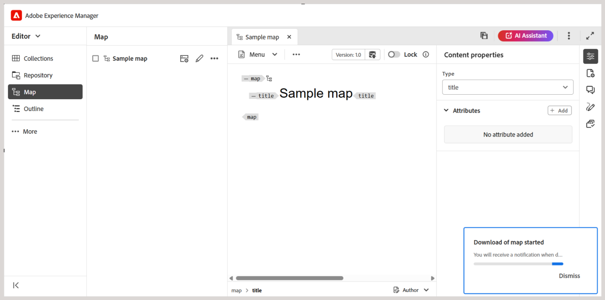

# 파일 다운로드 {#id216MC0H0BE8}

DITA 및 비 DITA 파일을 포함하는 에셋을 다운로드할 수 있습니다. 에셋을 다운로드할 수 있는 방법에는 여러 가지가 있으며, 일부 메서드는 Adobe Experience Manager에 고유하고 다른 메서드는 Adobe Experience Manager Guides에서 지원합니다. 기본 Adobe Experience Manager 에셋 다운로드 정보는 Adobe Experience Manager 설명서에서 [Adobe Experience Manager에서 에셋 다운로드](https://experienceleague.adobe.com/docs/experience-manager-cloud-service/assets/manage/download-assets-from-aem.html)를 참조하십시오. 다음 섹션에서는 Experience Manager Guides에서 파일을 다운로드하는 메커니즘에 대해 설명합니다.

## 편집기에서 DITA 맵 파일 다운로드

편집기에서 DITA 맵 파일을 다운로드하려면 다음 단계를 수행하십시오.

1. 다운로드할 DITA 맵으로 이동합니다.
1. DITA 맵을 선택하여 편집기에서 엽니다.

1. 맵 보기에서 **옵션** 아이콘을 선택하고 목록에서 **맵 다운로드**&#x200B;를 선택합니다.

   

   **맵 다운로드** 대화 상자가 표시됩니다.

   {width="300" align="left"}

1. 맵 다운로드 대화 상자에서 다음 옵션을 선택할 수 있습니다.

   - **기준선 사용**: DITA 맵에 대해 만든 기준선 목록을 가져오려면 이 옵션을 선택하십시오. 특정 기준선을 기준으로 맵 파일과 해당 내용을 다운로드하려면 드롭다운 목록에서 기준선을 선택합니다. 기준선을 사용한 작업에 대한 자세한 내용은 [기준선을 사용한 작업](generate-output-use-baseline-for-publishing.md#)을 참조하세요.

   - **파일 계층 옵션**: 파일 계층 드롭다운을 사용하여 다운로드한 맵 파일에 대해 폴더 구조를 처리하는 방법을 선택할 수도 있습니다. 사용 가능한 옵션은 다음과 같습니다.

      - **파일 계층 구조 유지**: 다운로드한 파일의 기존 폴더 구조를 유지하려면 드롭다운에서 이 옵션을 선택하십시오.

        이 방법에서 사용할 수 있는 옵션은 다음과 같습니다.

         - **GUID 파일 이름 사용** - GUID가 있는 맵 파일을 파일 이름으로 다운로드합니다.

         - **실제 파일 이름 사용** - 맵 파일을 원래 파일 이름으로 다운로드합니다.

      - **파일 계층 구조 병합**: 드롭다운에서 이 옵션을 선택하여 참조된 모든 주제와 미디어 파일을 단일 폴더로 다운로드합니다. 이 메서드를 사용하는 경우 맵 파일에는 **GUID 파일 이름 사용** 옵션만 사용할 수 있습니다.

   >[!NOTE]
   >
   > 옵션을 선택하지 않고 맵 파일을 다운로드할 수도 있습니다. 이 경우 참조된 주제 및 미디어 파일의 마지막 지속 버전이 다운로드됩니다.

1. **다운로드**&#x200B;를 선택합니다.

   맵 다운로드 요청은 큐에 있습니다.

   

   맵을 다운로드할 준비가 되면 다음 알림을 받게 됩니다.

   {width="550" align="left"}

1. 맵 파일을 `.zip` 형식으로 다운로드하려면 **다운로드**&#x200B;를 선택하십시오. 또는 나중에 AEM 받은 편지함에서 다운로드합니다.

   >[!NOTE]
   >
   > 기본적으로 다운로드한 맵은 Adobe Experience Manager 알림 받은 편지함에 5일 동안 유지됩니다.

## 맵 대시보드에서 DITA 맵 파일 다운로드

Adobe Experience Manager 저장소에 DITA 맵 파일이 있으면 해당 종속 항목과 함께 맵 파일을 다운로드할 수 있습니다. 이렇게 하면 오프라인 편집, 유효성 검사, 검토 또는 간단히 백업을 만들 수 있도록 전체 맵 파일을 유연하게 공유할 수 있습니다.

종속 파일과 함께 DITA 맵 파일을 다운로드하려면 다음 단계를 수행하십시오.

1. Assets UI에서 다운로드할 DITA 맵으로 이동합니다.

1. DITA 맵을 선택하여 DITA 맵 콘솔에서 엽니다.

1. DITA 맵에서 사용할 수 있는 주제 목록을 보려면 **주제** 탭을 선택하십시오.

1. 기본 도구 모음에서 **맵 다운로드**&#x200B;를 선택합니다.

   맵 다운로드 대화 상자가 나타납니다.

   {width="300" align="left"}

1. **다운로드**&#x200B;를 선택합니다. 맵 다운로드 대화 상자에서 다음 옵션을 선택할 수 있습니다.

   - **기준선 사용**: DITA 맵에 대해 만든 기준선 목록을 가져오려면 이 옵션을 선택하십시오. 특정 기준선을 기준으로 맵 파일과 해당 내용을 다운로드하려면 드롭다운 목록에서 기준선을 선택합니다. 기준선을 사용한 작업에 대한 자세한 내용은 [기준선을 사용한 작업](generate-output-use-baseline-for-publishing.md#)을 참조하세요.

   - **파일 계층 구조 병합**: 참조된 모든 항목 및 미디어 파일을 단일 폴더에 저장하려면 이 옵션을 선택합니다.

   >[!NOTE]
   >
   > 옵션을 선택하지 않고 맵 파일을 다운로드할 수도 있습니다. 이 경우 참조된 주제 및 미디어 파일의 마지막 지속 버전이 다운로드됩니다.

1. **다운로드** 단추를 선택하면 맵 다운로드 요청이 큐에 대기됩니다. 맵을 다운로드할 준비가 되면 다음 알림을 받게 됩니다.

   {width="550" align="left"}

   - 맵 파일을 .zip 형식으로 다운로드하려면 **다운로드**&#x200B;를 선택하십시오.

   - 나중에 맵 파일을 다운로드하려면 **나중에 다운로드**&#x200B;를 선택하십시오. Adobe Experience Manager 알림 받은 편지함에서 다운로드 링크에 액세스할 수 있습니다. 받은 편지함에서 생성된 맵 알림을 선택하여 .zip 형식으로 맵을 다운로드합니다.

   >[!NOTE]
   >
   > 기본적으로 다운로드한 맵은 Adobe Experience Manager 알림 받은 편지함에 5일 동안 유지됩니다.

{width="300" align="left"}

맵이 다운로드되면 맵을 선택하고 맨 위의 열기 아이콘을 사용하여 선택한 보고서를 열 수 있습니다.

**상위 항목:**[&#x200B;콘텐츠 관리](authoring.md)
