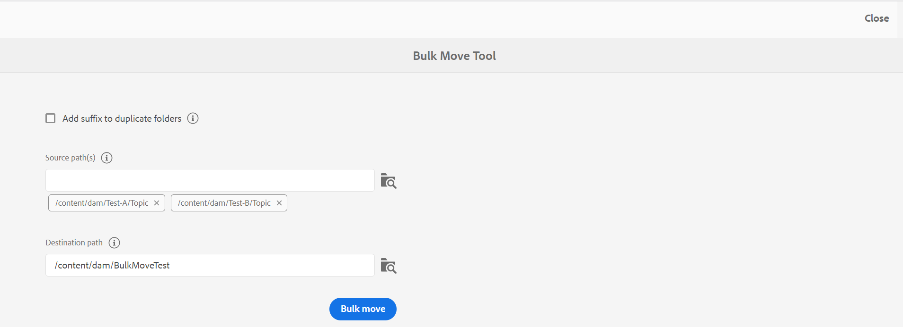
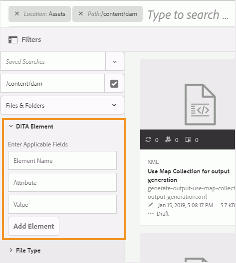

# 파일 및 폴더 관리 {#id2116G0L08XA}

이 섹션에서는 AEM Guides이 파일 복사, 붙여넣기, 드래그 앤 드롭 및 삭제와 같은 기본 파일 작업을 처리하는 방법에 대해 설명합니다. 다음과 같은 시나리오가 가능합니다.

## 파일 복사 및 붙여넣기

**사람이 읽을 수 있는 파일 이름이 있는 경우**

- *같은 이름의 파일이 대상 폴더에 없는 경우*: 파일의 새 복사본이 만들어지고 UUID도 이 폴더에 할당됩니다. 여기서 파일 이름은 원래 파일 이름과 같습니다.
- *이름이 같은 파일이 대상 폴더에 이미 있는 경우*: 파일의 새 복사본이 접미사 \(filename0.extension\)와 함께 만들어집니다. 새로 생성된 파일에도 UUID가 지정됩니다.

**파일 이름이 UUID 패턴을 기반으로 하는 경우**

- *같은 이름의 파일이 대상 폴더에 없는 경우*: 파일의 새 복사본이 만들어지고 새 위치에서 새 UUID도 이 폴더에 할당됩니다. 여기에서 파일 이름은 UUID와 같습니다.
- *같은 이름의 파일이 대상 폴더에 이미 있는 경우*: 파일의 새 복사본이 만들어지고 새 UUID도 이 폴더에 할당됩니다. 파일 이름은 UUID와 같습니다.

## 폴더 복사 및 붙여넣기

**같은 위치에 폴더 복사 및 붙여넣기**

- *폴더에 사람이 읽을 수 있는 파일 이름이 있는 파일이 있습니다*: 폴더의 새 복사본이 접미사 \(예: foldername0\)로 만들어집니다. 새 UUID도 폴더 내의 파일에 할당됩니다. 그러나 파일 이름에는 변경 사항이 없습니다.

- *폴더에 UUID 패턴을 기반으로 하는 파일 이름이 있는 파일이 있습니다*: 폴더의 새 복사본이 접미사 \(예: foldername0\)로 만들어집니다. 새 UUID도 새 폴더 내의 모든 파일에 할당됩니다. 파일 이름도 변경됩니다. 파일 이름은 새 UUID와 동일합니다.

**다른 위치에 폴더 복사 및 붙여넣기**

- *폴더에 사람이 읽을 수 있는 파일 이름이 있는 파일이 있습니다*: 폴더의 새 복사본이 만들어지고 새 UUID도 새 위치의 폴더 내 모든 파일에 할당됩니다. 여기에서 폴더 또는 파일 이름은 변경되지 않습니다.

- *폴더에 UUID 패턴을 기반으로 하는 파일 이름이 있는 파일이 있습니다*: 폴더의 새 복사본이 원래 폴더와 같은 이름으로 만들어집니다. 새 UUID도 새 폴더 내의 모든 파일에 할당됩니다. 파일 이름도 변경됩니다. 파일 이름은 새 UUID와 동일합니다.

## 파일 드래그 앤 드롭

**사람이 읽을 수 있는 파일 이름을 사용한 드래그 앤 드롭**

- *같은 위치에서 드래그 앤 드롭*: **기존 파일 덮어쓰기\**, **두 파일 모두 보관\** 및 기존 작업 복사본 버전을 만드는 옵션이 제공됩니다.

  {width="650" align="center"}

  **기존 파일 덮어쓰기\** 옵션을 선택하면 업로드되는 파일이 원래 위치의 기존 파일의 현재 작업 버전을 대체합니다. UUID가 생성되거나 변경되지 않습니다.

  **두 파일 모두 보관\** 옵션을 선택하면 파일의 새 복사본이 접미사 \(filename0.extension\)와 함께 만들어집니다. 새 UUID도 새로 복사된 파일에 할당됩니다.

  기존 파일 덮어쓰기 옵션을 사용하여 기존 작업 복사본에서 버전을 만드는 옵션을 선택하면 문서의 작업 복사본에서 새 버전도 만들어집니다.

  >[!NOTE]
  >
  > 관리자가 **업로드된 파일에 대한 새 버전 만들기** 기능을 사용하도록 설정해야 합니다. 이 기능을 활성화하면 업로드된 파일에 대한 새 버전이 만들어집니다. 옵션을 선택 해제하면 업로드된 파일의 버전이 만들어지지 않습니다. 자세한 내용은 Adobe Experience Manager Guides as a Cloud Service 설치 및 구성 섹션의 *업로드된 파일에 대한 새 버전 만들기* 섹션을 참조하십시오.

  다른 사용자가 이미 편집을 위해 파일을 체크 아웃한 경우 기존 파일을 업로드하고 덮어쓰려고 하면 파일이 실패하고 오류가 표시됩니다.

  >[!NOTE]
  >
  >관리자가 **업로드 시 체크 아웃된 파일 덮어쓰기** 기능을 사용하지 않도록 설정해야 합니다. 이 기능이 활성화되어 있으면 체크 아웃된 파일을 덮어쓸 수 있습니다. 이 기능이 활성화되어 있지 않으면 체크 아웃된 파일을 덮어쓸 수 없습니다. 자세한 내용은 *업로드 시 체크 아웃된 파일 덮어쓰기* 섹션의 Adobe Experience Manager Guides as a Cloud Service 설치 및 구성 섹션을 참조하십시오.

- *다른 위치에서 파일을 드래그 앤 드롭하십시오*: 파일의 새 복사본이 만들어지고 새 위치에서 새 UUID도 할당됩니다. 여기서 파일 이름은 원래 파일 이름과 같습니다.

**UUID 패턴을 기반으로 파일 이름을 사용하여 끌어서 놓기**

*같은 위치에 파일을 드래그 앤 드롭하십시오*: **기존 파일을 덮어쓰기\**&#x200B;할 수 있는 옵션과 함께 기존 작업 복사본의 버전을 만들 수 있는 옵션이 제공됩니다.

{width="650" align="center"}

파일을 덮어쓸 때 파일 이름이나 해당 UUID는 변경되지 않습니다.

**기존 작업 복사본에 대한 버전 만들기** 옵션을 선택하면 문서의 작업 복사본에서 새 버전이 만들어집니다. 새 파일이 업로드되고 파일의 새 버전도 만들어지며 문서의 작업 복사본으로 만들어집니다.

관리자가 **업로드된 파일에 대한 새 버전 만들기** 기능을 사용하도록 설정해야 합니다. 이 기능을 활성화하면 업로드된 파일에 대한 새 버전이 만들어집니다. 옵션을 선택 해제하면 업로드된 파일의 버전이 만들어지지 않습니다. 자세한 내용은 Adobe Experience Manager Guides as a Cloud Service 설치 및 구성 섹션의 *업로드된 파일에 대한 새 버전 만들기* 섹션을 참조하십시오.

*다른 위치에 파일을 드래그 앤 드롭하십시오*: **기존 파일을 덮어씁니다\**, **파일을 새 위치로 이동**&#x200B;할 수 있는 옵션과 기존 작업 복사본의 버전을 만들 수 있는 옵션이 제공됩니다.

{width="650" align="center"}

**기존 파일 덮어쓰기\** 옵션을 선택하면 업로드되는 파일이 원래 위치의 기존 파일을 대체합니다. UUID가 생성되거나 변경되지 않습니다.

**새 위치로 파일 이동** 옵션을 선택하면 기존 파일이 현재 위치로 이동되고 업로드 중인 파일로 덮어쓰기됩니다. 파일을 새 위치로 이동해도 파일에 대한 기존 참조는 손상되지 않습니다.

파일을 바꾸거나 이동할 때 기존 복사본에서 버전을 만드는 옵션을 선택하면 문서의 작업 복사본에서 새 버전이 만들어집니다. 새 파일은 기존 위치에서 바꾸거나 새 위치로 이동합니다.

## 파일을 일괄적으로 이동 {#move-files-bulk}

AEM Guides에는 관리자가 여러 파일이 있는 폴더를 한 위치에서 다른 위치로 이동하는 데 도움이 되는 일괄 이동 도구가 포함되어 있습니다. 이 도구는 하나 이상의 폴더 내에 있는 파일을 AEM 저장소의 다른 폴더로 쉽게 이동할 수 있습니다. 이 도구의 주요 기능 중 하나는 많은 수의 파일을 이동할 뿐만 아니라 이동 중인 파일에 대한 참조와 파일에 대한 참조를 유지한다는 것입니다. 작성 및 게시 작업을 방해하지 않고 일괄로 이동할 수 있는 파일 수를 조정할 수 있습니다.

>[!NOTE]
>
> 벌크 이동 도구는 폴더 수준에서만 작동합니다. 개별 주제 또는 맵 파일을 이동하려면 AEM의 Assets UI에서 일반 이동 도구를 사용합니다.

벌크 이동 도구에서 제공하는 기능은 다음과 같습니다.

- 각 배치에서 처리할 파일 수를 조정할 수 있습니다. 이 경우 시스템에서 쉽게 처리할 수 있는 최적 수에 도달하기 전에 몇 가지 테스트를 실행해야 할 수 있습니다.
- 작성 및 게시 서비스는 이동 작업의 중단 없이 원활하게 실행됩니다.
- 후속 \(실행\) 일괄 처리 프로세스 사이의 시간 간격을 완벽하게 제어할 수 있습니다. 이 시간 간격은 다음 파일 배치를 시작하기 전에 후처리 작업이 완료되도록 합니다.

- 이름이 같은 폴더의 자동 처리. 이 기능을 사용하면 동일한 이름의 폴더가 이동 중인 경우에도 덮어쓰이지 않습니다.

- 이동 중인 파일에 대한 참조와 파일의 참조를 자동으로 처리합니다.

배치 프로세스를 실행하기 전에 다음 사항을 고려해야 합니다.

- 현재 검토 중인 주제를 이동하려는 경우 이동하기 전에 이러한 모든 주제에 대한 검토 프로세스를 닫아야 합니다. 검토 작업을 닫지 않으면 검토 프로세스가 중단됩니다.
- 언제든지 시스템에서 일괄 이동 작업을 한 번만 실행해야 합니다. 이렇게 하면 이동되는 주제에 대한 참조를 적절하게 처리할 수 있습니다.

파일을 일괄적으로 이동하려면 다음 단계를 수행합니다.

1. 맨 위에 있는 Adobe Experience Manager 링크를 클릭하고 **도구**&#x200B;를 선택합니다.
1. 도구 목록에서 **안내서**&#x200B;를 선택합니다.
1. **일괄 이동 도구** 타일을 클릭합니다.
1. 설정에 따라 벌크 이동 도구 페이지가 표시됩니다. **일괄 이동 도구** 페이지에 다음 세부 정보를 제공합니다.

   

   
 Cloud Service 및 On-Premise UUID 기반 파일 시스템 

   {width="650" align="center"}

   >[!TIP]
   >
   > 선택    에 대한 자세한 내용을 보려면 필드 근처에서 확인하십시오.

   - **중복된 폴더에 접미사 추가**: 같은 이름의 폴더를 이동하는 경우 이 옵션을 선택해야 합니다. 예를 들어 이전 스크린샷에서 **Source 경로**&#x200B;에 이동할 폴더 이름이 포함되어 있습니다. topic이라는 폴더는 test-A와 test-B라는 두 개의 다른 위치에 있습니다. 이 옵션을 선택하면 폴더가 성공적으로 이동합니다. 첫 번째 이동한 폴더는 topic으로 지정되고 두 번째 폴더는 topic0으로 지정됩니다. 이동 작업을 수행하면 같은 이름의 폴더에 순차적 계열 \(0, 1, 2 등\)의 접미사가 추가됩니다.

     이 옵션을 선택하지 않고 이름이 같은 폴더를 이동하는 경우 작업이 중단되고 메시지가 표시됩니다.

   - **Source 경로\**: 이동할 폴더의 위치를 지정합니다.

      - **폴더 찾아보기** 선택      파일 찾아보기 대화 상자를 엽니다. 이동할 폴더를 선택하고 **선택**&#x200B;을 클릭하여 프로세스를 완료합니다.

      - 소스 위치를 입력하거나 복사하여 붙여넣을 수도 있습니다. Enter 키를 눌러 폴더를 목록에 추가합니다.

        선택한 폴더가 해당 경로와 함께 나열됩니다. 전체 경로를 보려면 폴더 태그 위로 마우스를 가져갑니다.
      - **제거**&#x200B;를 클릭하여 폴더를 제거할 수도 있습니다. 폴더 근처에 이(가) 있습니다.

   - **대상 경로**: 원본 폴더를 이동할 위치를 지정하십시오.

      - **폴더 찾아보기** 선택 : 파일 찾아보기 대화 상자를 엽니다. 소스 폴더를 이동할 위치를 선택합니다. 선택 을 클릭하여 프로세스를 완료합니다.
      - 대상 경로를 입력하거나 복사하여 붙여넣을 수도 있습니다.

     선택한 폴더가 텍스트 상자에 해당 경로와 함께 표시됩니다.

   - **일괄 이동**&#x200B;을 클릭합니다.

     시스템이 소스에서 대상 위치로 파일을 이동하기 시작합니다. 프로세스가 완료되면 이동 프로세스의 요약이 페이지 오른쪽에 표시됩니다.

     {width="650" align="center"}

   

   

   
 On-Premise 비 UUID 기반 파일 시스템 

   {width="650" align="center"}

   >[!TIP]
   >
   > 선택    에 대한 자세한 내용을 보려면 필드 근처에서 확인하십시오.

   - **일괄 처리 크기**: 단일 일괄 처리로 이동할 파일 수를 지정하십시오. 기본값은 50개 파일입니다.
   - **절전 모드 간격(초)**: 다음 일괄 처리를 시작하기 전에 프로세스가 대기할 시간(초)을 지정합니다. 이 휴지 시간 간격 동안 시스템은 이동된 파일에 대한 참조와 이동된 파일의 참조를 수정합니다. 기본 휴면 간격은 60초입니다.

   - **중복된 폴더에 접미사 추가**: 같은 이름의 폴더를 이동하는 경우 이 옵션을 선택해야 합니다. 예를 들어 이전 스크린샷에서 **Source 경로**&#x200B;에 이동할 폴더 이름이 포함되어 있습니다. topic이라는 폴더는 test-A와 test-B라는 두 개의 다른 위치에 있습니다. 이 옵션을 선택하면 폴더가 성공적으로 이동합니다. 첫 번째 이동한 폴더는 topic으로 지정되고 두 번째 폴더는 topic0으로 지정됩니다. 이동 작업을 수행하면 같은 이름의 폴더에 순차적 계열 \(0, 1, 2 등\)의 접미사가 추가됩니다.

     이 옵션을 선택하지 않고 이름이 같은 폴더를 이동하는 경우 작업이 중단되고 메시지가 표시됩니다.

   - **체크 아웃된 파일의 참조 업데이트**: 체크 아웃된 파일이 들어 있는 폴더를 이동하는 경우 이 옵션을 선택하는 것이 좋습니다. 이 옵션을 선택하면 체크 아웃된 모든 파일이 저장되고 새 수정 버전으로 체크 인됩니다. 그런 다음 이 새 수정 버전이 대상 위치로 이동됩니다.

     이 옵션을 선택하지 않으면 체크 아웃된 파일이 동일한 체크 아웃 상태의 대상 폴더로 이동됩니다. 그러나 이 이동 과정에서 데이터가 일부 손실될 수 있습니다.

   - **Source 경로\**: 이동할 폴더의 위치를 지정합니다.

      - **폴더 찾아보기** 선택      파일 찾아보기 대화 상자를 엽니다. 이동할 폴더를 선택하고 **선택**&#x200B;을 클릭하여 프로세스를 완료합니다.

      - 소스 위치를 입력하거나 복사하여 붙여넣을 수도 있습니다. Enter 키를 눌러 폴더를 목록에 추가합니다.

        선택한 폴더가 해당 경로와 함께 나열됩니다. 전체 경로를 보려면 폴더 태그 위로 마우스를 가져갑니다.
      - **제거**&#x200B;를 클릭하여 폴더를 제거할 수도 있습니다. 폴더 근처에 이(가) 있습니다.

   - **대상 경로**: 원본 폴더를 이동할 위치를 지정하십시오.

      - **폴더 찾아보기** 선택 : 파일 찾아보기 대화 상자를 엽니다. 소스 폴더를 이동할 위치를 선택합니다. 선택 을 클릭하여 프로세스를 완료합니다.
      - 대상 경로를 입력하거나 복사하여 붙여넣을 수도 있습니다.

        선택한 폴더가 텍스트 상자에 해당 경로와 함께 표시됩니다.

   - **일괄 이동**&#x200B;을 클릭합니다.

     시스템이 소스에서 대상 위치로 파일을 이동하기 시작합니다. 프로세스가 완료되면 이동 프로세스의 요약이 페이지 오른쪽에 표시됩니다.
     {width="650" align="center"}

## DITA 콘텐츠 검색

기본적으로 AEM은 DITA 콘텐츠를 인식하지 않으므로 저장소 내에서 DITA 콘텐츠를 검색하는 메커니즘을 제공하지 않습니다. AEM Guides은 AEM 위에 레이어를 추가하여 AEM이 DITA 콘텐츠를 이해하고 처리할 수 있도록 합니다. AEM Guides의 DITA 콘텐츠 검색 기능을 사용하면 AEM 저장소 내에서 DITA 콘텐츠를 검색할 수 있습니다.

>[!NOTE]
>
>시스템 관리자가 **DITA 요소** 검색 구성 요소를 구성한 다음 AEM Assets UI에서 해당 기능을 사용할 수 있습니다. 자세한 내용은 Adobe Experience Manager Guides as a Cloud Service 설치 및 구성 의 *Assets UI에 DITA 요소 검색 구성 요소 추가* 섹션을 참조하십시오.

검색 기능을 사용하여 다음과 같은 작업을 수행할 수 있습니다.

- 요소 값을 기반으로 DITA 콘텐츠 검색(예: `author`= xml)
- 특성 값을 기반으로 DITA 컨텐츠를 검색합니다. 예: `@platform`= 창
- DITA 요소와 속성 값의 조합을 사용합니다. 예: `author`= xml `AND` `@platform`= windows

AEM 저장소 내에서 DITA 콘텐츠를 검색하려면 다음 단계를 수행하십시오.

1. Assets UI를 엽니다.

1. 왼쪽 레일에서 **필터**&#x200B;를 선택합니다.

   {width="450" align="center"}

   콘텐츠 필터링 옵션이 왼쪽 레일에 표시됩니다. 또한 DITA 내용을 필터링하는 데 사용되는 필터링 옵션인 DITA 요소를 찾을 수 있습니다.

   {width="450" align="center"}

1. *\(선택 사항\)* **검색 디렉터리 선택** 필드에서 검색할 위치를 찾습니다.

1. **DITA 요소** 필터에서 검색할 **요소 이름**, **특성** 및 값을 입력하십시오. 예를 들어, 작성자 `@type`인 요소 `author`이(가) 있는 문서를 검색하려면 다음 스크린샷과 같이 정보를 제공해야 합니다.

   {width="650" align="center"}

   **DITA 요소** 필터에 입력한 검색 조건이 검색 창 맨 위에 표시됩니다. 검색 조건과 일치하는 파일은 **검색 결과** 영역에 표시됩니다.

   검색 조건을 지정할 때 다음 사항을 고려하십시오.

   - 정확한 구를 검색하려면 따옴표 `"`구 검색`"` 내의 값 필드에 구를 입력하십시오.
   - 최대 3개의 DITA 요소 검색 기준을 추가할 수 있습니다.
   - 여러 검색 기준을 지정하는 경우 AND 논리를 사용하여 모든 검색 기준을 결합합니다.
   - 검색 기준에 와일드카드 문자를 사용할 수 없습니다. 예를 들어, 값이 Windows인 플랫폼 \(attribute\)을 검색하려면 \*form 또는 Windo?s를 지정할 수 없습니다.

**검색의 체크아웃 상태 필터**

AEM Guides에서는 DITA 요소 필터 외에도 체크아웃 상태에 따라 컨텐츠를 검색할 수 있습니다. 이 기능은 현재 체크 아웃한 파일을 빠르게 필터링하고 다시 체크 인하려는 경우에 유용합니다.

체크 아웃 상태에 따라 파일을 검색하려면 다음 단계를 수행하십시오.

1. Assets UI를 엽니다.

1. 왼쪽 레일에서 **필터**&#x200B;를 클릭합니다.
1. 검색 창에서 검색 키워드를 입력합니다.
1. 왼쪽 레일에서 필요한 필터를 적용합니다.

   예를 들어 **체크 아웃 상태** 필터를 적용하여 체크 아웃된 항목 또는 체크 인된 항목을 표시할 수 있습니다. 체크 아웃한 사람 목록에서 사용자나 그룹을 선택하여 이 목록을 추가로 세분화할 수 있습니다.

   검색 결과가 표시됩니다.

## 파일 삭제

AEM 저장소에서 파일을 삭제하는 것은 시스템 관리자가 제어하는 제한된 기능입니다. 구성에 따라 다음과 같은 경우 파일 삭제가 제한될 수 있습니다.

- 체크아웃
- 수신 또는 발신 참조 있음

파일을 삭제할 권한이 있는 특정 사용자 그룹에 속해 있는 경우에만 파일을 삭제할 수도 있습니다.

>[!NOTE]
>
> 파일 관리 구성에 대한 자세한 내용은 Adobe Experience Manager Guides as a Cloud Service 설치 및 구성 의 *체크 아웃된 파일 삭제 방지* 및 *참조된 파일 삭제 방지* 섹션을 참조하십시오.

관리자가 모든 사용자에게 파일 삭제 권한을 부여한 경우 참조가 포함된 파일을 삭제할 때 다음 메시지가 표시됩니다.

{width="650" align="center"}

이 시나리오에서는 파일에서 들어오거나 나가는 참조를 제거하지 않고 파일을 강제로 삭제할 수 있습니다.

삭제 권한이 특정 사용자 그룹에 부여되면 해당 그룹에 속한 사용자에 대해서도 위의 메시지가 표시됩니다. 그러나 다른 사용자의 경우 다음 메시지가 표시됩니다.

{width="650" align="center"}

이 시나리오에서는 모든 수신 및 발신 참조가 제거될 때까지 사용자가 파일을 삭제할 수 없습니다.

## 미디어 파일 작업

이미지 및 비디오와 같은 미디어 파일은 콘텐츠의 필수 부분입니다. 컨텐츠를 업로드하고 관리하는 동안 미디어 파일로도 작업할 수 있습니다.

미디어 파일이 변경된 경우 **버전 기록**&#x200B;에서 해당 파일을 찾아 미리 볼 수 있습니다.미디어 파일의 다른 버전에서 변경 내용을 확인하려면 다음을 수행하십시오.

1. **Assets UI**&#x200B;에서 파일에 액세스합니다.
1. 버전 기록을 보려는 파일을 선택합니다.
1. 왼쪽 레일에서 **버전 기록**&#x200B;을 클릭하고 버전을 선택합니다.
1. 버전 기록 아래에서 다양한 버전의 축소판을 볼 수도 있습니다.

   {width="800" align="center"}

1. 나열된 버전에서 기본 버전으로 사용할 버전을 선택하고 **버전 미리 보기**&#x200B;를 클릭합니다. 선택한 버전의 미리보기가 버전 미리보기 창에 표시됩니다.

   {width="650" align="center"}

**상위 항목:**[&#x200B;콘텐츠 관리](authoring.md)
