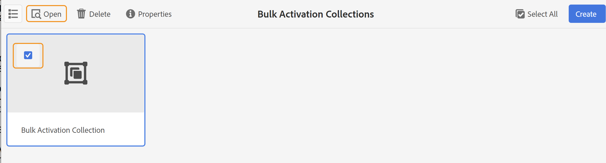

# 출력 활성화 {#id214GGF00V5U}

일괄 활성화를 위한 맵 컬렉션을 만들었으면 다음 단계는 게시 인스턴스에서 콘텐츠를 활성화하는 것입니다. 콘텐츠를 활성화하려면 다음 단계를 수행하십시오.

1. 맨 위에 있는 Adobe Experience Manager 로고를 선택하고 **도구**&#x200B;를 선택합니다.

1. **도구** 패널에서 **안내서**&#x200B;를 선택합니다.

1. **일괄 게시 대시보드** 타일을 선택합니다.

   벌크 게시 대시보드 에는 벌크 활성화 맵 컬렉션 목록이 표시됩니다. [Adobe Experience Manager Guides 홈 페이지](intro-home-page.md)의 왼쪽 패널에서 이 대시보드에 액세스할 수도 있습니다.

1. 게시할 컬렉션을 선택하고 **열기**&#x200B;를 선택합니다.

   {align="left"}

1. \(*선택 사항*\) 왼쪽 레일에서 필요한 필터를 적용하여 수정된 \(status\), 출력 사전 설정 또는 언어를 기반으로 필터 맵을 필터링합니다.

   >[!NOTE]
   >
   >맵 컬렉션에서 활성화하기 전에 출력 사전 설정을 사용하여 맵에 대한 출력을 생성합니다.

설정에 따라 컬렉션을 활성화하는 다양한 방법을 살펴보십시오.

 클라우드 서비스 

클라우드 서비스에 {width="650" align="left"}

**미리 보기** 또는 **게시** 인스턴스에 대한 출력을 활성화할 수 있습니다.

**미리보기**

* 선택한 맵의 출력을 활성화하려면 미리 생성된 맵 출력을 선택하고 **게시 대상** > **미리 보기**&#x200B;를 선택합니다.
* 구성된 사전 설정으로 모든 DITA 맵의 출력을 활성화하려면 **맵** 열 옆의 확인란을 선택한 다음 **게시 대상** > **게시**&#x200B;를 선택합니다.

**게시**

* 선택한 맵의 출력을 활성화하려면 미리 생성된 맵 출력을 선택하고 **게시 대상** > **게시**&#x200B;를 선택합니다.

* 구성된 사전 설정으로 모든 DITA 맵의 출력을 활성화하려면 맵(열) 옆에 있는 확인란을 선택한 다음 **게시 대상** > **게시**&#x200B;를 선택합니다.

>[!NOTE]
> 
> 맵 출력 확인란은 맵에 대한 출력을 생성한 경우에만 활성화됩니다.

맵 출력이 게시 큐에 있으면 성공 메시지가 표시됩니다.

선택한 맵 파일에 대해 출력이 활성화되면 감사 기록 탭이 업데이트되고 가장 최근에 활성화된 출력이 맨 위에 표시됩니다. **게시됨** 열이 게시 날짜 및 시간으로 업데이트되었습니다.

    

  On-premise Software 

다음 중 하나를 수행하십시오.

* 선택한 맵의 출력을 활성화하려면 미리 생성된 맵 출력을 선택하고 **빠른 게시**&#x200B;를 선택합니다.
* 구성된 사전 설정으로 모든 DITA 맵의 출력을 활성화하려면 맵(열) 옆에 있는 확인란을 선택한 다음 **빠른 게시**&#x200B;를 선택합니다.
  {width="650" align="left"}

  >[!NOTE]
  > 
  >맵 출력 확인란은 맵에 대한 출력을 생성한 경우에만 활성화됩니다.

맵 출력이 게시 큐에 있으면 성공 메시지가 표시됩니다.

선택한 맵 파일에 대해 출력이 활성화되면 감사 기록 탭이 업데이트되고 가장 최근에 활성화된 출력이 맨 위에 표시됩니다. **게시됨** 열이 게시 날짜 및 시간으로 업데이트되었습니다.

**상위 항목: &#x200B;** [게시된 콘텐츠의 일괄 활성화](conf-bulk-activation.md)
