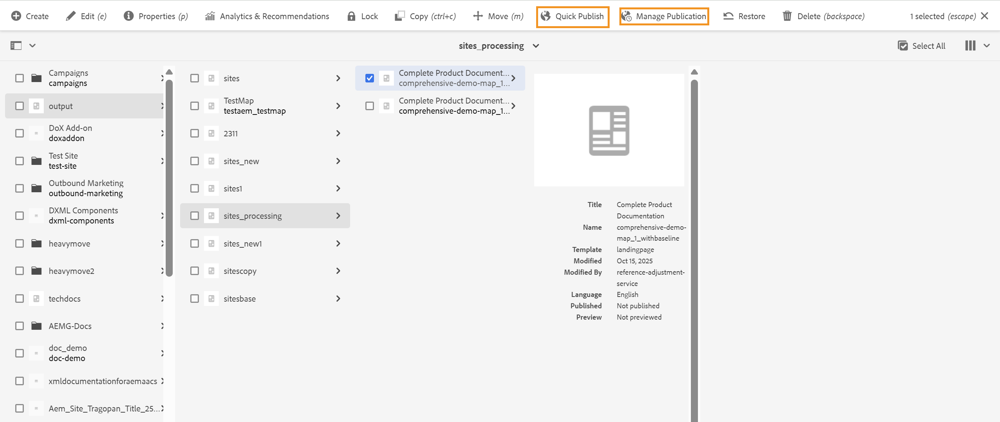

# DITA 소스 자산의 복제 관리

DITA 콘텐츠에서 생성된 출력이 일부 게시 환경에서 **빠른 게시** 또는 **게시 관리**&#x200B;를 사용하여 게시되면 AEM도 DITA 맵 및 경우에 따라 DITA 주제와 같은 관련 DITA 소스 자산을 게시하려고 합니다. 이 문제는 AEM이 DITA 자산을 생성된 Sites 페이지의 종속성으로 취급하기 때문에 발생합니다.

{width="350"}

의도하지 않은 DITA 콘텐츠 복제를 게시 환경에 방지하고 성능 문제를 방지하려면 관리자가 구성 관리자를 통해 DITA 에셋 복제를 명시적으로 관리해야 합니다. 이 구성을 통해 관리자는 DITA 맵, DITA 주제, XML 파일 및 Markdown(.md) 파일을 포함하여 지원되는 DITA 자산 유형의 복제를 제어할 수 있습니다.

DITA 에셋 복제 기능을 구성하려면 사용 중인 설정에 따라 [Cloud Service에 대한 DITA 에셋 복제 구성](../cs-install-guide/configure-dita-assets-replication.md) 또는 [On-Premise에 대한 DITA 에셋 복제 구성](../install-guide/configure-dita-asset-replication.md)을 봅니다
